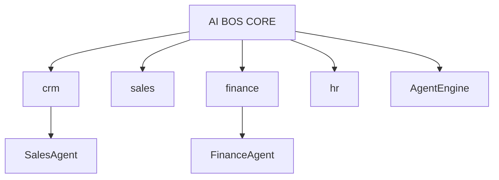

# APPENDIX — Catalogue des modules métier AI BOS

> **Version:** 0.1.0 | **Statut:** `DESIGN`  
> **Documents liés:** [README_06_ModularArchitecture](README_06_ModularArchitecture.md) · [README_36_FutureApplications](README_36_FutureApplications.md) · [README_05_Core](README_05_Core.md)

---

## Principe

Les **modules métier** sont des bounded contexts installables sur AI BOS CORE. Chaque module :
- Dépend uniquement du CORE (jamais d'une autre app verticale)
- Expose des APIs REST + événements domaine
- Enrichit les agents IA avec des tools spécifiques
- Peut être activé par organisation via subscription/feature flags



---

## Catalogue complet

| Module | Code | Description | Agents IA associés | Priorité |
|--------|------|-------------|-------------------|----------|
| **CRM** | `crm` | Contacts, comptes, leads, pipeline, activités | Sales Agent, Marketing Agent | P0 |
| **Sales** | `sales` | Devis, commandes, objectifs commerciaux | Sales Agent, CEO Agent | P0 |
| **Finance** | `finance` | Trésorerie, budgets, prévisions CA | Finance Agent, CEO Agent | P0 |
| **Accounting** | `accounting` | Comptabilité, écritures, bilan | Finance Agent, Compliance Agent | P1 |
| **Inventory** | `inventory` | Stocks, entrepôts, mouvements | Operations Agent | P1 |
| **Procurement** | `procurement` | Achats, fournisseurs, bons de commande | Finance Agent | P2 |
| **HR** | `hr` | Employés, organigramme, congés | HR Agent | P1 |
| **Payroll** | `payroll` | Paie, bulletins, charges | HR Agent, Finance Agent | P2 |
| **Recruitment** | `recruitment` | Offres, candidats, entretiens | Recruitment Agent, HR Agent | P2 |
| **Projects** | `projects` | Projets, jalons, ressources | Project Manager Agent | P1 |
| **Tasks** | `tasks` | Tâches, assignations, Kanban | Project Manager Agent | P0 |
| **Documents** | `documents` | GED (→ CORE `documents`) | Document Agent, Legal Agent | P0 |
| **Meetings** | `meetings` | Réunions, comptes-rendus, transcription | Meeting Agent | P1 |
| **Knowledge** | `knowledge` | Base de connaissances (→ CORE `knowledge`) | Knowledge Agent | P0 |
| **Calendar** | `calendar` | Agenda unifié, disponibilités | Meeting Agent | P0 |
| **Marketing** | `marketing` | Campagnes, segments, automation | Marketing Agent | P1 |
| **Customer Support** | `support` | Tickets, SLA, satisfaction | Support Agent | P1 |
| **Help Desk** | `helpdesk` | Support interne IT | Support Agent | P2 |
| **Contracts** | `contracts` | Contrats, renouvellements, échéances | Legal Agent | P1 |
| **Legal** | `legal` | Dossiers juridiques, conformité | Legal Agent, Compliance Agent | P2 |
| **Manufacturing** | `manufacturing` | Production, OF, nomenclatures | Operations Agent | P3 |
| **Assets** | `assets` | Actifs, amortissement, maintenance | Finance Agent | P2 |
| **Quality** | `quality` | Contrôle qualité, non-conformités | Compliance Agent | P3 |
| **Operations** | `operations` | Processus opérationnels | Operations Agent | P2 |
| **Supply Chain** | `supply_chain` | Logistique, livraisons | Operations Agent | P2 |
| **Business Intelligence** | `bi` | Rapports, cubes (→ CORE `bi`) | Data Analyst Agent | P0 |
| **Executive Dashboard** | `executive` | Vue direction, OKRs | CEO Agent | P0 |
| **Administration** | `admin` | Config org, utilisateurs (→ CORE) | — | P0 |

---

## Modules santé (app verticale SIH IA — pas CORE)

| Module SIH IA | Équivalent AI BOS | Statut |
|---------------|-------------------|--------|
| Patients | `sihia/patients` | ✅ Existant |
| Médecins | `sihia/practitioners` | ✅ Existant |
| Rendez-vous | `sihia/appointments` | ✅ Existant |
| Historique médical | `sihia/clinical-records` | ✅ Existant |
| Prédiction flux | `sihia/forecast` (via CORE `ml`) | ✅ Existant |
| Chatbot médical | `sihia/assistant` (via CORE `ai`) | ✅ Existant |

---

## Pattern d'implémentation d'un module métier

```
apps/modules/crm/
├── domain/           # Entités, value objects, events
├── application/      # Use cases, services
├── infrastructure/   # Repositories SQL
├── presentation/     # Routes FastAPI
├── agents/           # Tools pour Sales Agent
├── workflows/        # Templates automation
├── frontend/         # Routes React lazy-loaded
├── manifest.yaml     # Métadonnées plugin
└── tests/
```

### manifest.yaml (exemple CRM)

```yaml
id: crm
version: 1.0.0
name: Customer Relationship Management
dependencies:
  core: ">=0.1.0"
permissions:
  - crm.contact.read
  - crm.contact.write
  - crm.lead.manage
events:
  publishes:
    - crm.lead.created
    - crm.deal.won
  subscribes:
    - sales.order.created
agents:
  tools:
    - crm_search_contacts
    - crm_create_lead
```

---

## Capacités IA par module (exemples)

| Question utilisateur | Module | Agent |
|---------------------|--------|-------|
| Quels clients n'ont pas payé ? | Finance + CRM | Finance Agent |
| Quels commerciaux performent ? | Sales + CRM | Sales Agent |
| Prévois les ventes Q4 | Sales + ML | Data Analyst Agent |
| Résume la réunion d'hier | Meetings | Meeting Agent |
| Analyse ce contrat | Contracts + Legal | Legal Agent |
| Détecte les anomalies de stock | Inventory | Operations Agent |
| Génère une campagne email | Marketing | Marketing Agent |

---

## Roadmap modules métier

| Phase | Modules | Horizon |
|-------|---------|---------|
| **M1–M6** | CRM, Sales, Tasks, Calendar, Executive Dashboard | Plateforme MVP |
| **M7–M12** | Finance, HR, Projects, Marketing, Support | Croissance PME |
| **M13–M18** | Accounting, Inventory, Contracts, Meetings | Scale |
| **M19–M24** | Payroll, Recruitment, Legal, Supply Chain | Enterprise |
| **M25+** | Manufacturing, Quality, Assets | Industrie |

---

## Réutilisation SIH IA → modules génériques

| Pattern SIH IA | Module AI BOS généralisé |
|--------------|--------------------------|
| `patients` CRUD + historique | `crm` contacts + timeline |
| `appointments` + conflits | `calendar` + scheduling engine |
| `doctors` annuaire + planning | `hr` employees + availability |
| `reminder_service` | CORE `notifications` + `workflows` |
| `analytics_service` KPIs | CORE `analytics` + module `bi` |
| `ml_service` forecast | CORE `ml` + module métier config |

Voir [README_35_MigrationFromSIHIA](README_35_MigrationFromSIHIA.md) pour le mapping fichier par fichier.
