# README_02 — Architecture système AI BOS

---

## Métadonnées du document

| Champ | Valeur |
|-------|--------|
| **Document** | README_02_Architecture.md |
| **Projet** | AI BOS — AI Business Operating System |
| **Version** | 0.1.0 |
| **Statut** | `DRAFT` — revue Architecture Review Board requise |
| **Niveau de maturité** | `DESIGN` |
| **Audience** | Engineering, Architecture, DevOps, Security |
| **Auteur** | AI BOS Platform Architecture Team |
| **Dernière mise à jour** | Juillet 2026 |
| **Documents liés** | [README_00_Vision](README_00_Vision.md) · [README_03_Frontend](README_03_Frontend.md) · [README_04_Backend](README_04_Backend.md) · [README_05_Core](README_05_Core.md) · [README_12_EventDriven](README_12_EventDriven.md) · [README_28_Cloud](README_28_Cloud.md) · [README_35_MigrationFromSIHIA](README_35_MigrationFromSIHIA.md) |
| **Référence héritage** | [SIH IA Architecture](../../Document/README_02_Architecture.md) · [SIH IA État implémentation](../../Document/README_ETAT_IMPLEMENTATION.md) |

---

## Table des matières

1. [Synthèse exécutive](#1-synthèse-exécutive)
2. [Principes architecturaux](#2-principes-architecturaux)
3. [Diagrammes C4](#3-diagrammes-c4)
4. [Architecture en couches](#4-architecture-en-couches)
5. [Monolithe modulaire → microservices](#5-monolithe-modulaire--microservices)
6. [Stack technologique](#6-stack-technologique)
7. [Architecture Decision Records (ADR)](#7-architecture-decision-records-adr)
8. [Topologie de déploiement AWS](#8-topologie-de-déploiement-aws)
9. [Flux de données](#9-flux-de-données)
10. [Table de mapping réutilisation SIH IA](#10-table-de-mapping-réutilisation-sih-ia)
11. [Multi-tenant et isolation](#11-multi-tenant-et-isolation)
12. [Event Bus et communication inter-modules](#12-event-bus-et-communication-inter-modules)
13. [Couche IA et ML](#13-couche-ia-et-ml)
14. [Observabilité et health](#14-observabilité-et-health)
15. [Objectifs de scalabilité](#15-objectifs-de-scalabilité)
16. [Sécurité architecturale](#16-sécurité-architecturale)
17. [Évolution et migration](#17-évolution-et-migration)
18. [Annexes et références croisées](#18-annexes-et-références-croisées)

---

## 1. Synthèse exécutive

L'architecture AI BOS suit une approche **pragmatique et évolutive** : démarrer avec un **monolithe modulaire** (pattern validé par SIH IA) hébergeant le CORE et les applications verticales, puis extraire des microservices uniquement sous contrainte de scale ou d'isolation réglementaire.

Les choix structurants :

- **Clean Architecture** en 5 couches : `presentation / application / domain / infrastructure / core`
- **PostgreSQL** comme source de vérité relationnelle + **pgvector** pour le RAG
- **Event Bus** (Redis Streams → Kafka) pour le découplage inter-modules
- **API-first** : toute fonctionnalité UI est exposée via API REST (OpenAPI) puis GraphQL (phase 2)
- **Multi-tenant** par `organization_id` avec row-level security PostgreSQL

SIH IA fournit ~40 % du socle technique déjà implémenté et testé (68 tests pytest, 8 tests E2E Playwright). L'extraction vers AI BOS CORE est le premier chantier architectural.

Objectifs de scalabilité cible : **10 000 organisations**, **1 million d'utilisateurs actifs**, **99.9 % SLA**.

---

## 2. Principes architecturaux

### 2.1 Les dix principes

| # | Principe | Implication |
|---|----------|-------------|
| 1 | **Monolithe modulaire d'abord** | Boundaries strictes, extraction différée |
| 2 | **Clean Architecture** | Dépendances vers l'intérieur, domain pur |
| 3 | **API-first** | OpenAPI avant UI, agents consomment les APIs |
| 4 | **Multi-tenant natif** | `organization_id` sur chaque table métier |
| 5 | **Event-driven** | Modules communiquent par événements, pas par appels directs |
| 6 | **IA comme couche transversale** | RAG, agents, ML accessibles à tous les modules |
| 7 | **Observable by default** | Logs JSON, metrics, traces, correlation ID |
| 8 | **Security by default** | RBAC chaque route, audit systématique |
| 9 | **Infrastructure as Code** | Terraform/CDK, pas de config manuelle |
| 10 | **Zero duplication** | CORE partagé, apps = plugins verticaux |

### 2.2 Contraintes non fonctionnelles

| Contrainte | Cible v1 | Cible scale (10K orgs) |
|------------|----------|------------------------|
| Disponibilité | 99.5 % | 99.9 % |
| Latence API P95 | < 500 ms | < 300 ms |
| Latence chatbot premier token | < 3 s | < 2 s |
| RPO (perte données max) | 1 h | 15 min |
| RTO (temps restauration) | 4 h | 1 h |
| Throughput API | 500 req/s | 10 000 req/s |

---

## 3. Diagrammes C4

### 3.1 Niveau 1 — Contexte système

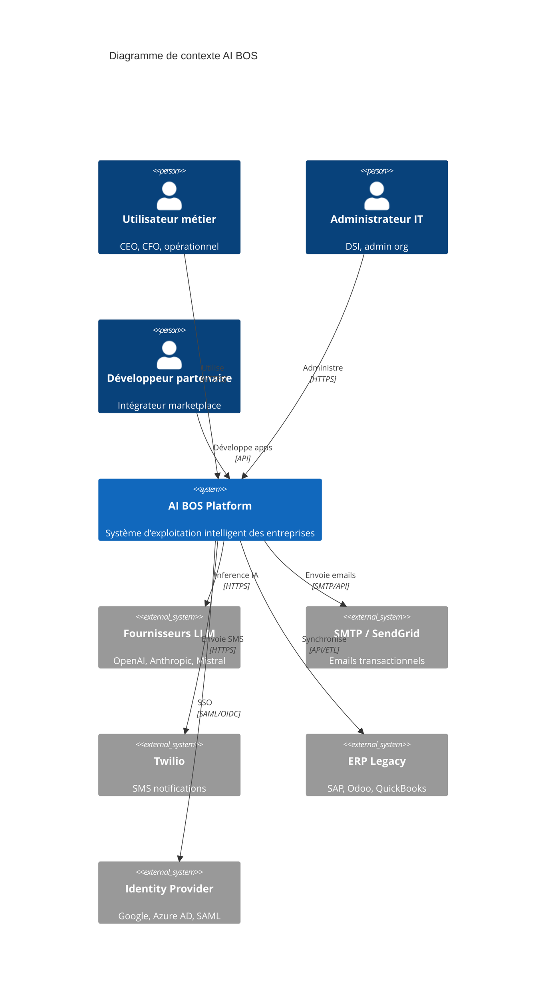

### 3.2 Niveau 2 — Conteneurs

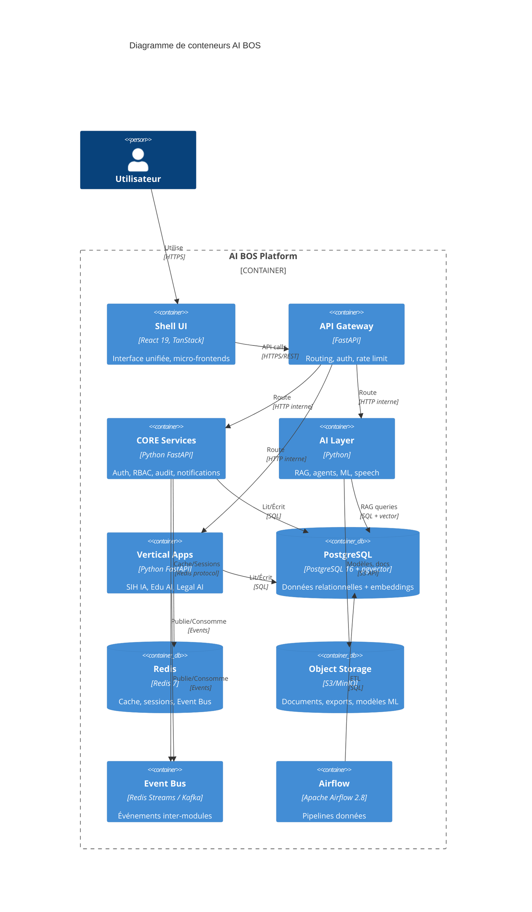

### 3.3 Niveau 3 — Composants CORE (zoom)

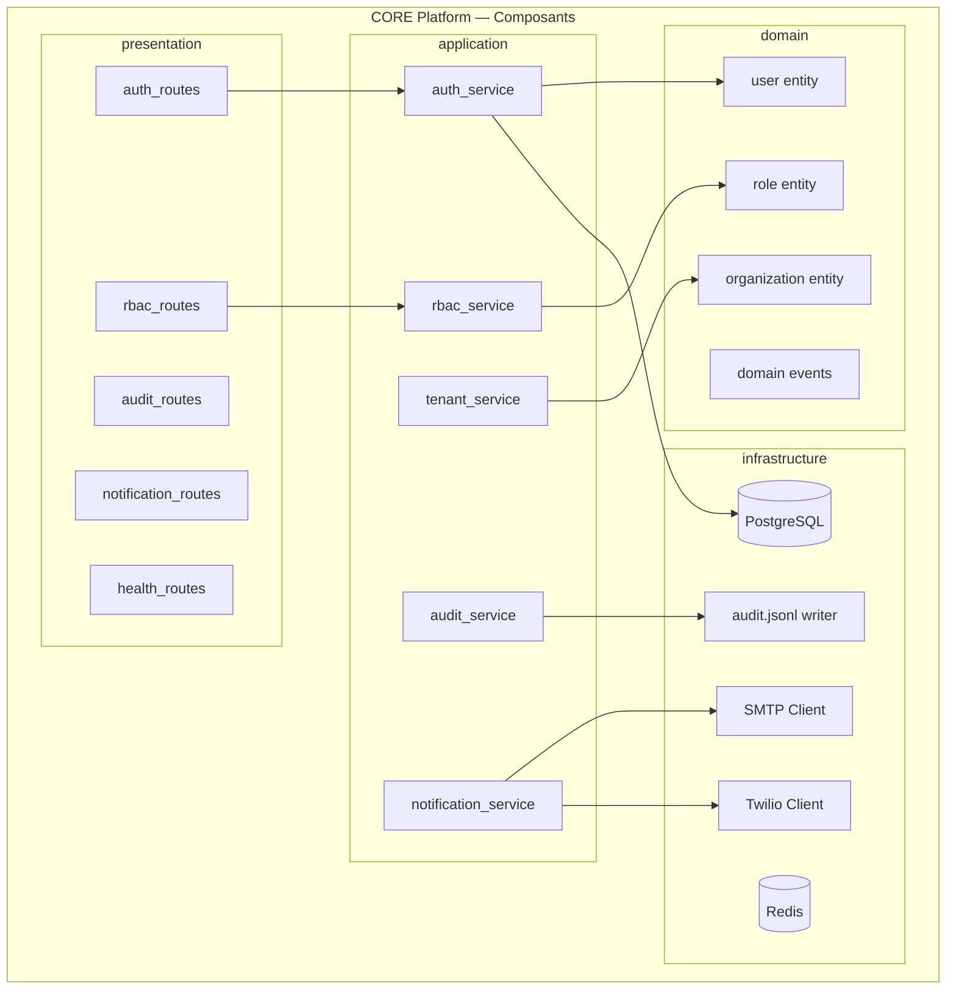

### 3.4 Niveau 4 — Code (exemple module Auth)

Structure héritée de SIH IA (`backend/app/`) :

```
core/
├── identity/
│   ├── presentation/
│   │   └── auth_routes.py          # POST /api/auth/login, refresh, logout
│   ├── application/
│   │   └── auth_service.py         # Logique login, rotation refresh
│   ├── domain/
│   │   ├── user.py                 # Entité User
│   │   └── session.py              # Entité RefreshSession
│   └── infrastructure/
│       ├── user_repository.py      # SQLAlchemy
│       └── jwt_provider.py         # Encode/decode JWT
```

---

## 4. Architecture en couches

### 4.1 Vue des couches

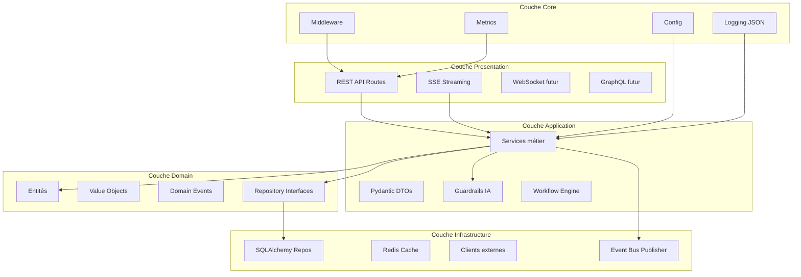

### 4.2 Règles de dépendance

| Couche | Peut dépendre de | Ne peut PAS dépendre de |
|--------|------------------|-------------------------|
| Presentation | Application, Core | Infrastructure, Domain (direct) |
| Application | Domain, Core | Presentation, Infrastructure (direct) |
| Domain | Rien (pur) | Toutes les autres |
| Infrastructure | Domain (interfaces) | Application, Presentation |
| Core | — | Transverse, aucune dépendance métier |

### 4.3 Pattern par module

Chaque module (CORE ou vertical) suit la même structure :

```
module/
├── presentation/     # Routes FastAPI, dépendances auth
├── application/      # Services, orchestration, DTOs
├── domain/           # Entités, events, interfaces repository
├── infrastructure/   # Implémentations SQL, clients externes
└── tests/            # Unit + integration
```

---

## 5. Monolithe modulaire → microservices

### 5.1 Stratégie d'évolution

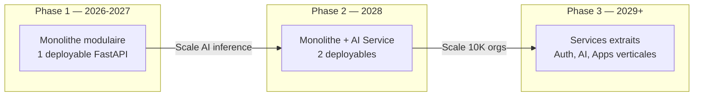

### 5.2 Critères d'extraction microservice

Un module est extrait en microservice **uniquement** si au moins 2 critères sont remplis :

| Critère | Seuil |
|---------|-------|
| Charge CPU/mémoire isolée | > 40 % ressources monolithe |
| Cycle de déploiement différent | > 2x/semaine vs reste |
| Équipe dédiée | ≥ 3 engineers full-time |
| Isolation réglementaire | Données PCI, HIPAA compute séparé |
| Latence critique | P95 > 1s impacte autres modules |

### 5.3 Boundaries modules (contrats)

| Module | API prefix | Events publiés | Events consommés |
|--------|------------|----------------|------------------|
| `core/identity` | `/api/auth` | `user.created`, `user.login` | — |
| `core/authorization` | `/api/rbac` | `role.assigned` | `user.created` |
| `core/audit` | `/api/admin/audit` | — | `*` (tous) |
| `core/notifications` | `/api/notifications` | `notification.sent` | `appointment.created`, `workflow.trigger` |
| `core/ai/conversation` | `/api/chatbot` | `ai.query.completed` | — |
| `core/ml` | `/api/ml` | `ml.forecast.generated` | `pipeline.data.refreshed` |
| `apps/sihia` | `/api/patients`, `/api/doctors`, etc. | `patient.created`, `appointment.created` | `notification.sent` |

### 5.4 Communication inter-modules

| Mode | Usage | Phase |
|------|-------|-------|
| **Appel direct in-process** | MVP, même monolithe | Phase 1 |
| **Event Bus async** | Découplage, workflows | Phase 1 (Redis Streams) |
| **HTTP interne** | Extraction microservice | Phase 2+ |
| **gRPC** | Latence critique inter-services | Phase 3 |

---

## 6. Stack technologique

### 6.1 Tableau stack complet

| Couche | Technologie | Version cible | Justification | Source SIH IA |
|--------|-------------|---------------|---------------|---------------|
| **Frontend framework** | React | 19.x | Concurrent features, Suspense | React 18+ (upgrade) |
| **Frontend meta-framework** | TanStack Start | 1.16+ | SSR, routing intégré | ✅ TanStack Start |
| **Build** | Vite | 6.x | HMR rapide, ESM | ✅ Vite |
| **Routing** | TanStack Router | 1.16+ | Type-safe routes | ✅ |
| **Data fetching** | TanStack Query | 5.x | Cache, invalidation | ✅ |
| **State local** | Zustand | 5.x | Léger, i18n store | ✅ |
| **UI Components** | shadcn/ui + Radix | Latest | Accessibilité, customizable | ✅ Calm Care |
| **Styling** | Tailwind CSS | 4.x | Utility-first | ✅ |
| **Charts** | Recharts | 2.x | Dashboards | ✅ |
| **i18n** | Custom Zustand + JSON | — | FR/EN/AR + RTL | ✅ |
| **Backend framework** | FastAPI | 0.110+ | Async, OpenAPI auto | ✅ |
| **Runtime Python** | Python | 3.11+ | Performance, typing | ✅ |
| **ORM** | SQLAlchemy | 2.0 | Async, migrations | ✅ |
| **Migrations** | Alembic | 1.13+ | Versioning schéma | ✅ |
| **Validation** | Pydantic | v2 | DTOs stricts | ✅ |
| **Base de données** | PostgreSQL | 16 | Relationnel + pgvector | ✅ (pilote) |
| **Vector search** | pgvector | 0.7+ | Embeddings RAG | Planifié |
| **Cache / Sessions** | Redis | 7.x | Cache ML, sessions | Planifié |
| **Event Bus** | Redis Streams → Kafka | — | Événements | Planifié |
| **Object storage** | S3 / MinIO | — | Documents, modèles | Planifié |
| **ML forecasting** | Prophet + scikit-learn | — | Séries temporelles | ✅ |
| **ML tracking** | MLflow | 2.x | Versioning modèles | Planifié |
| **Pipeline données** | Apache Airflow | 2.8 | DAGs ETL | ✅ |
| **LLM orchestration** | LangChain / custom | — | RAG, agents | ✅ (custom) |
| **Speech STT** | Whisper (OpenAI) | — | Transcription | 🟡 Partiel |
| **Speech TTS** | Edge TTS / OpenAI | — | Synthèse vocale | 🟡 Partiel |
| **Email** | SMTP / SendGrid | — | Transactionnel | ✅ SMTP |
| **SMS** | Twilio | — | Notifications | ✅ |
| **Conteneurisation** | Docker | 24+ | Dev + prod | ✅ |
| **Orchestration** | ECS Fargate → EKS | — | AWS managed | Planifié |
| **IaC** | Terraform / AWS CDK | — | Reproductibilité | Planifié |
| **CI/CD** | GitHub Actions | — | Tests, build, deploy | ✅ |
| **Monitoring** | CloudWatch + Prometheus | — | Métriques | Partiel |
| **Logs** | JSON structuré → CloudWatch | — | Observabilité | ✅ |
| **Tests backend** | pytest | 8.x | Unit + integration | ✅ 68/68 |
| **Tests E2E** | Playwright | 1.40+ | UI flows | ✅ 8/8 |
| **Tests frontend** | Vitest | 2.x | Unit | ✅ |

### 6.2 Versions héritées SIH IA (référence juillet 2026)

```json
{
  "@tanstack/react-query": "^5.83.0",
  "@tanstack/react-router": "^1.168.0",
  "@tanstack/react-start": "^1.167.14",
  "fastapi": "0.110+",
  "sqlalchemy": "2.0",
  "python": "3.11"
}
```

---

## 7. Architecture Decision Records (ADR)

### ADR-001 : Monolithe modulaire en premier

| Champ | Valeur |
|-------|--------|
| **Statut** | `APPROVED` |
| **Date** | Juillet 2026 |
| **Contexte** | Équipe < 10 engineers, time-to-market critique, SIH IA déjà monolithe modulaire |
| **Décision** | Démarrer avec un monolithe FastAPI modulaire. Boundaries strictes par package. Extraction microservices uniquement sous contrainte mesurée. |
| **Conséquences** | ✅ Déploiement simple, debugging facile, refactoring in-process. ⚠️ Discipline boundaries requise. ⚠️ Scale vertical d'abord. |
| **Alternatives rejetées** | Microservices dès v1 (trop de overhead), serverless (cold start IA incompatible) |

### ADR-002 : PostgreSQL comme source de vérité unique

| Champ | Valeur |
|-------|--------|
| **Statut** | `APPROVED` |
| **Date** | Juillet 2026 |
| **Contexte** | Besoin relationnel + vector (RAG) + JSON + full-text. SIH IA migré SQLite → PostgreSQL. |
| **Décision** | PostgreSQL 16 avec extensions pgvector (embeddings) et pg_trgm (recherche fuzzy). Pas de MongoDB ni base séparée pour vectors en v1. |
| **Conséquences** | ✅ Une seule base à opérer, transactions ACID, RLS multi-tenant. ⚠️ Scale lecture via read replicas. |
| **Alternatives rejetées** | Pinecone/Weaviate séparé (coût, complexité), SQLite (non scalable multi-tenant) |

### ADR-003 : Event Bus pour découplage inter-modules

| Champ | Valeur |
|-------|--------|
| **Statut** | `APPROVED` |
| **Date** | Juillet 2026 |
| **Contexte** | Modules CORE et verticaux doivent communiquer sans couplage fort. Workflows automation futurs. |
| **Décision** | Redis Streams en v1 (déjà dans stack SIH IA pour cache). Migration Kafka quand > 1000 events/s. Pattern outbox pour garantie livraison. |
| **Conséquences** | ✅ Découplage, audit trail events, base pour Agent Engine. ⚠️ Complexité debug async. ⚠️ Idempotence consommateurs requise. |
| **Alternatives rejetées** | Appels HTTP synchrones only (couplage), RabbitMQ (ops overhead vs Redis existant) |

### ADR-004 : Vector DB intégré PostgreSQL (pgvector)

| Champ | Valeur |
|-------|--------|
| **Statut** | `APPROVED` |
| **Date** | Juillet 2026 |
| **Contexte** | RAG chatbot central à la proposition de valeur. SIH IA chatbot opérationnel. |
| **Décision** | pgvector dans PostgreSQL pour embeddings. Chunking + metadata `organization_id` + `vertical_id`. Re-ranking optionnel. |
| **Conséquences** | ✅ Co-localisation données + vectors, une backup. ⚠️ Performance search à benchmarker > 1M chunks. |
| **Alternatives rejetées** | Pinecone (coût récurrent), Chroma (pas production-ready) |

### ADR-005 : Abstraction fournisseur LLM

| Champ | Valeur |
|-------|--------|
| **Statut** | `APPROVED` |
| **Date** | Juillet 2026 |
| **Contexte** | Éviter lock-in OpenAI, conformité données EU, coûts variables |
| **Décision** | Interface `LLMProvider` avec implémentations OpenAI, Anthropic, Mistral, Ollama (self-hosted). Routage par config `organization_id`. |
| **Conséquences** | ✅ Flexibilité, souveraineté. ⚠️ Normalisation prompts/outputs requise. |

### ADR-006 : Multi-tenant row-level (organization_id)

| Champ | Valeur |
|-------|--------|
| **Statut** | `APPROVED` |
| **Date** | Juillet 2026 |
| **Contexte** | SIH IA single-tenant. AI BOS multi-tenant dès conception. |
| **Décision** | Colonne `organization_id` sur chaque table. PostgreSQL RLS (Row Level Security). Middleware injecte tenant depuis JWT. |
| **Conséquences** | ✅ Isolation données, un schéma simple. ⚠️ Tests multi-tenant obligatoires. ⚠️ Migrations Alembic sensibles. |
| **Alternatives rejetées** | Schema-per-tenant (complexité migrations), DB-per-tenant (coût ops) |

---

## 8. Topologie de déploiement AWS

### 8.1 Architecture production cible

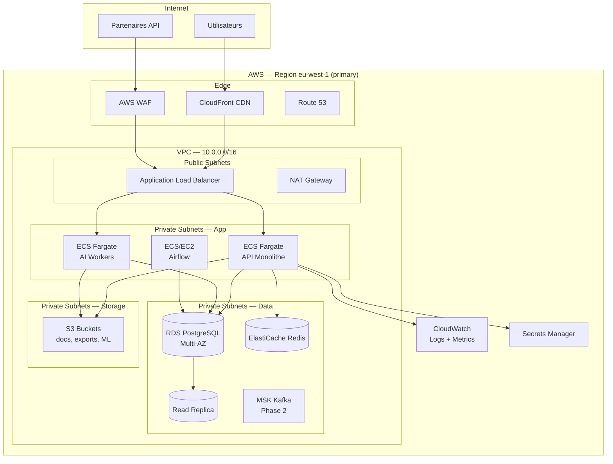

### 8.2 Environnements

| Environnement | Infrastructure | Données | Accès |
|---------------|----------------|---------|-------|
| **local** | Docker Compose | SQLite/PostgreSQL local | Développeurs |
| **dev** | ECS minimal | RDS dev (single AZ) | Équipe |
| **staging** | ECS prod-like | RDS staging (Multi-AZ) | Équipe + QA |
| **production** | ECS Multi-AZ | RDS Multi-AZ + replica | Clients |

### 8.3 Estimation coûts AWS (production initiale, 50 orgs)

| Service | Configuration | Coût mensuel estimé |
|---------|---------------|---------------------|
| ECS Fargate | 2 tasks API (2 vCPU, 4 GB) | ~$150 |
| RDS PostgreSQL | db.r6g.large Multi-AZ | ~$350 |
| ElastiCache Redis | cache.r6g.large | ~$120 |
| S3 | 500 GB | ~$12 |
| CloudFront | 1 TB transfer | ~$85 |
| ALB | 1 ALB | ~$25 |
| CloudWatch | Logs + metrics | ~$50 |
| **Total** | | **~$800/mois** |

### 8.4 CI/CD Pipeline

```mermaid
flowchart LR
    PUSH[Git Push] --> GHA[GitHub Actions]
    GHA --> LINT[Lint + Type check]
    LINT --> TEST[pytest + Playwright]
    TEST --> BUILD[Docker Build]
    BUILD --> ECR[Push ECR]
    ECR --> DEPLOY_STG[Deploy Staging]
    DEPLOY_STG --> E2E_STG[E2E Staging]
    E2E_STG --> APPROVE[Approval Gate]
    APPROVE --> DEPLOY_PROD[Deploy Production]
```

Héritage SIH IA : GitHub Actions existant, `docker-compose.yml`, profils `airflow` et `mailhog`.

---

## 9. Flux de données

### 9.1 Flux authentification

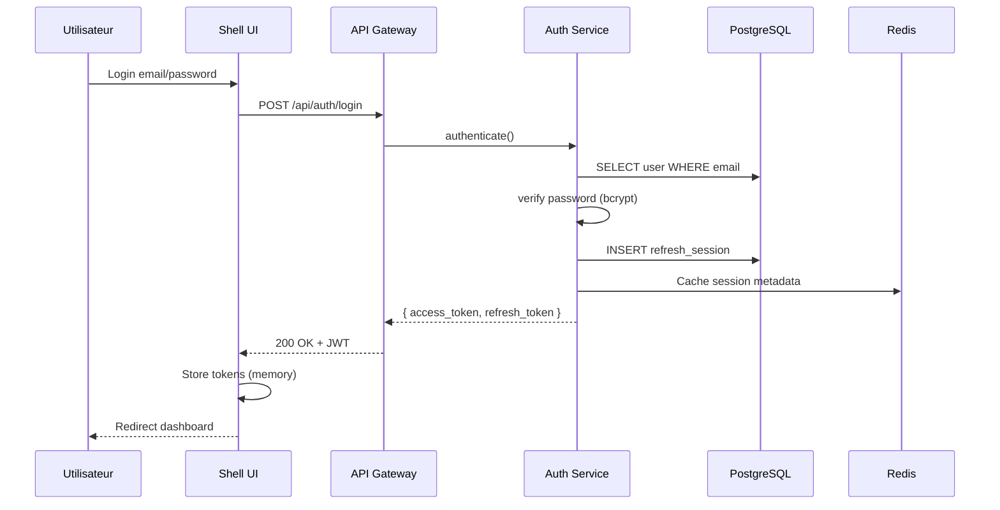

### 9.2 Flux chatbot RAG (SSE)

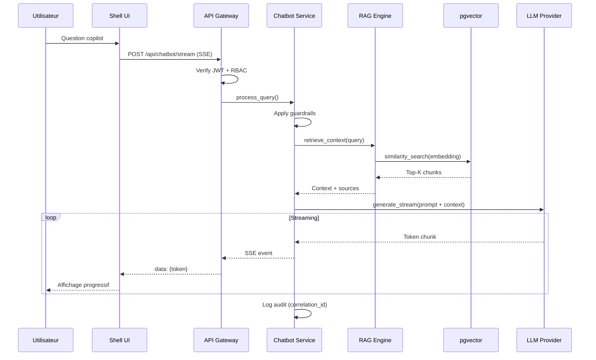

### 9.3 Flux pipeline données (Airflow)

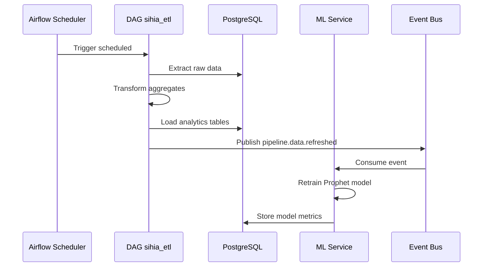

### 9.4 Flux notification (rappel RDV)

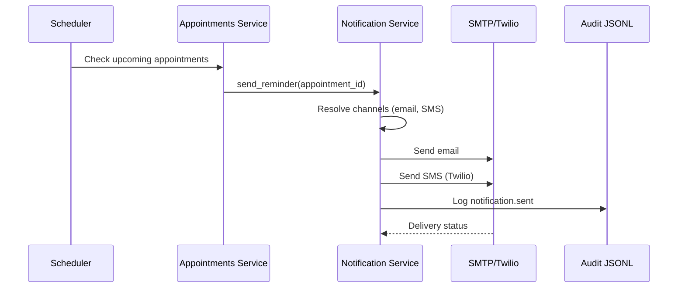

---

## 10. Table de mapping réutilisation SIH IA

### 10.1 Mapping complet composants → CORE

| # | Composant SIH IA | Chemin source | Module AI BOS | Effort extraction | Tests SIH IA |
|---|------------------|---------------|---------------|-------------------|--------------|
| 1 | Auth JWT login/refresh/logout | `presentation/auth_routes.py` | `core/identity` | 2 sem | ✅ |
| 2 | Rotation refresh token | `application/auth_service.py` | `core/identity` | 1 sem | ✅ |
| 3 | Rate limit login | `core/rate_limit.py` | `core/identity` | 0.5 sem | ✅ |
| 4 | RBAC permissions JWT | `application/rbac_service.py` | `core/authorization` | 2 sem | ✅ |
| 5 | CRUD users admin | `presentation/rbac_routes.py` | `core/authorization` | 1 sem | ✅ |
| 6 | `require_permission` decorator | `core/deps.py` | `core/authorization` | 0.5 sem | ✅ |
| 7 | Audit JSONL writer | `application/audit_service.py` | `core/audit` | 1 sem | ✅ |
| 8 | Export audit logs API | `presentation/admin_routes.py` | `core/audit` | 0.5 sem | ✅ |
| 9 | SMTP email sender | `infrastructure/email_client.py` | `core/notifications` | 1 sem | ✅ |
| 10 | Twilio SMS sender | `infrastructure/sms_client.py` | `core/notifications` | 1 sem | ✅ |
| 11 | Reminder service | `application/reminder_service.py` | `core/notifications` | 1 sem | ✅ |
| 12 | Chatbot SSE streaming | `presentation/chatbot_routes.py` | `core/ai/conversation` | 2 sem | ✅ |
| 13 | Chatbot RAG retrieval | `application/chatbot_service.py` | `core/ai/conversation` | 2 sem | ✅ |
| 14 | Guardrails IA | `application/chatbot_guardrails.py` | `core/ai/conversation` | 1 sem | ✅ |
| 15 | Whisper STT | `application/speech_service.py` | `core/ai/speech` | 1 sem | 🟡 |
| 16 | TTS synthesis | `application/speech_service.py` | `core/ai/speech` | 1 sem | 🟡 |
| 17 | Analytics KPIs | `presentation/analytics_routes.py` | `core/analytics` | 1 sem | ✅ |
| 18 | Export PDF/Excel | `application/export_service.py` | `core/analytics` | 1 sem | ✅ |
| 19 | ML Prophet forecast | `application/ml_service.py` | `core/ml` | 2 sem | ✅ |
| 20 | ML metrics endpoint | `presentation/ml_routes.py` | `core/ml` | 0.5 sem | ✅ |
| 21 | Airflow DAGs | `airflow/dags/` | `core/data-pipeline` | 2 sem | ✅ |
| 22 | Pipeline admin API | `presentation/pipeline_routes.py` | `core/data-pipeline` | 1 sem | ✅ |
| 23 | Health endpoints | `presentation/health_routes.py` | `core/observability` | 0.5 sem | ✅ |
| 24 | Metrics counters | `core/metrics.py` | `core/observability` | 0.5 sem | ✅ |
| 25 | Correlation ID middleware | `core/middleware.py` | `core/observability` | 0.5 sem | ✅ |
| 26 | Structured JSON logging | `core/logging_config.py` | `core/observability` | 0.5 sem | ✅ |
| 27 | i18n store + hydrator | `src/lib/i18n/` | `core/i18n` (frontend) | 1 sem | ✅ |
| 28 | HTTP errors handler | `src/lib/httpErrors.ts` | `core/i18n` (frontend) | 0.5 sem | ✅ |
| 29 | Docker Compose | `docker-compose.yml` | `core/devops` | 1 sem | ✅ |
| 30 | Config Pydantic | `core/config.py` | `core/config` | 0.5 sem | ✅ |

**Total effort estimé extraction : ~30 semaines-personne** (parallélisable à ~8 semaines calendrier avec 4 engineers).

### 10.2 Composants SIH IA restant spécifiques verticale

| Composant | Reste dans `apps/sihia` |
|-----------|-------------------------|
| Patients CRUD | ✅ |
| Médecins / planning | ✅ |
| Rendez-vous / conflits | ✅ |
| Historique médical | ✅ |
| Dashboard KPIs santé | ✅ |
| Knowledge base RAG médicale | ✅ |
| Guardrails médicaux spécifiques | ✅ |

---

## 11. Multi-tenant et isolation

### 11.1 Modèle de données multi-tenant

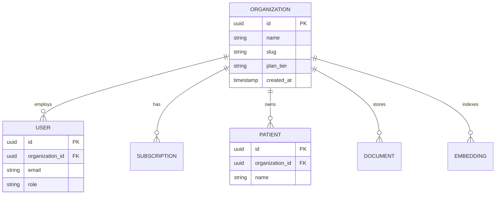

### 11.2 Row Level Security PostgreSQL

```sql
-- Exemple politique RLS
ALTER TABLE patients ENABLE ROW LEVEL SECURITY;

CREATE POLICY tenant_isolation ON patients
    USING (organization_id = current_setting('app.current_org_id')::uuid);

-- Middleware FastAPI injecte avant chaque requête :
-- SET LOCAL app.current_org_id = '<org_id from JWT>';
```

### 11.3 JWT claims multi-tenant

```json
{
  "sub": "user-uuid",
  "email": "admin@clinique.ma",
  "organization_id": "org-uuid",
  "organization_slug": "clinique-alami",
  "permissions": ["patients:read", "patients:write", "analytics:read"],
  "vertical_apps": ["sihia"],
  "exp": 1720000000
}
```

---

## 12. Event Bus et communication inter-modules

### 12.1 Schéma événements CORE

| Event | Publisher | Consumers | Payload |
|-------|-----------|-----------|---------|
| `user.created` | identity | audit, notifications | `{user_id, org_id, email}` |
| `user.login` | identity | audit, analytics | `{user_id, ip, user_agent}` |
| `appointment.created` | apps/sihia | notifications, analytics | `{appointment_id, patient_id, datetime}` |
| `notification.sent` | notifications | audit | `{channel, recipient, status}` |
| `ai.query.completed` | ai/conversation | analytics, audit | `{query_id, tokens, sources}` |
| `ml.forecast.generated` | ml | analytics | `{model, horizon, mape}` |
| `pipeline.data.refreshed` | data-pipeline | ml, analytics | `{dag_id, rows_processed}` |

### 12.2 Pattern Outbox

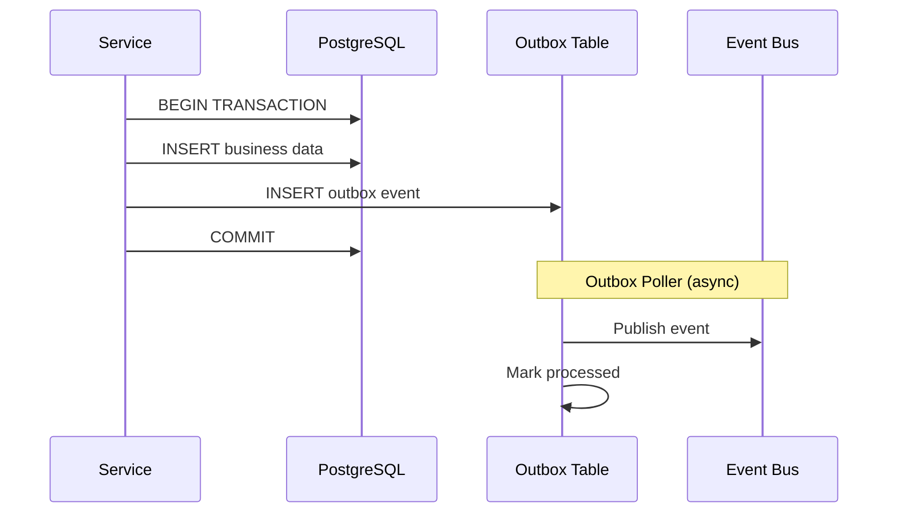

---

## 13. Couche IA et ML

### 13.1 Architecture AI Layer

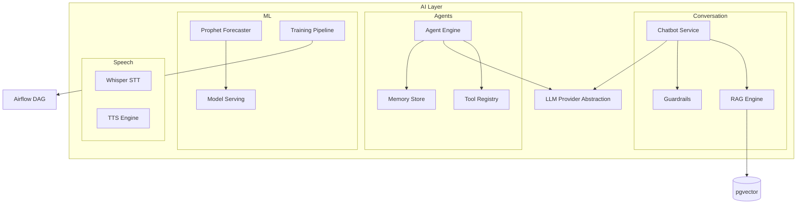

### 13.2 RAG Pipeline

| Étape | Technologie | Config |
|-------|-------------|--------|
| Ingestion documents | Airflow DAG | PDF, DOCX, HTML |
| Chunking | LangChain RecursiveCharacterTextSplitter | 512 tokens, overlap 50 |
| Embedding | OpenAI text-embedding-3-small | 1536 dimensions |
| Stockage | pgvector | Index IVFFlat |
| Retrieval | Cosine similarity Top-K | K=5, seuil 0.7 |
| Re-ranking | Cross-encoder (optionnel) | Phase 2 |
| Generation | LLM streaming | Temperature 0.3 |

---

## 14. Observabilité et health

### 14.1 Endpoints health (hérités SIH IA)

| Endpoint | Contenu | Usage |
|----------|---------|-------|
| `GET /health` | `{ status: "ok" }` | Liveness probe |
| `GET /health/details` | DB, pipeline, metrics, version | Readiness + monitoring |

### 14.2 Métriques exposées (`metrics.py`)

| Métrique | Type | Description |
|----------|------|-------------|
| `http_requests_total` | Counter | Par method, path, status |
| `http_request_duration_seconds` | Histogram | Latence |
| `auth_failures_total` | Counter | 401 par route |
| `rbac_denials_total` | Counter | 403 par permission |
| `ai_queries_total` | Counter | Requêtes IA |
| `ml_forecast_mape` | Gauge | MAPE modèle actuel |
| `pipeline_freshness_hours` | Gauge | Âge dernière exécution DAG |

### 14.3 Logs structurés

```json
{
  "timestamp": "2026-07-06T08:30:00Z",
  "level": "INFO",
  "correlation_id": "abc-123-def",
  "organization_id": "org-uuid",
  "user_id": "user-uuid",
  "service": "chatbot",
  "message": "Query completed",
  "duration_ms": 1250,
  "tokens_used": 450
}
```

---

## 15. Objectifs de scalabilité

### 15.1 Cibles par dimension

| Dimension | v1 (2026) | Growth (2028) | Scale (2031) |
|-----------|-----------|---------------|--------------|
| **Organisations** | 50 | 1 000 | 10 000 |
| **Utilisateurs actifs** | 500 | 50 000 | 1 000 000 |
| **Requêtes API/s** | 100 | 2 000 | 10 000 |
| **Requêtes IA/jour** | 5 000 | 500 000 | 10 000 000 |
| **Stockage PostgreSQL** | 50 GB | 2 TB | 50 TB |
| **Embeddings pgvector** | 100K chunks | 10M chunks | 500M chunks |

### 15.2 Stratégies de scale

| Composant | Stratégie v1 → Scale |
|-----------|---------------------|
| API | Vertical scaling → ECS auto-scaling → sharding par région |
| PostgreSQL | Single RDS → Multi-AZ → Read replicas → Citus (si > 5 TB) |
| Redis | Single node → Cluster mode |
| AI inference | In-process → Dedicated ECS AI workers → GPU instances |
| Event Bus | Redis Streams → MSK Kafka |
| CDN | CloudFront static assets + API cache (GET idempotent) |

### 15.3 Load testing cibles

| Scénario | Cible P95 | Outil |
|----------|-----------|-------|
| Login burst 100 users | < 500 ms | k6 |
| Dashboard KPI 500 concurrent | < 300 ms | k6 |
| Chatbot SSE 50 concurrent streams | Premier token < 2s | k6 + custom |
| CRUD patients 200 req/s | < 200 ms | k6 |

---

## 16. Sécurité architecturale

### 16.1 Couches de sécurité

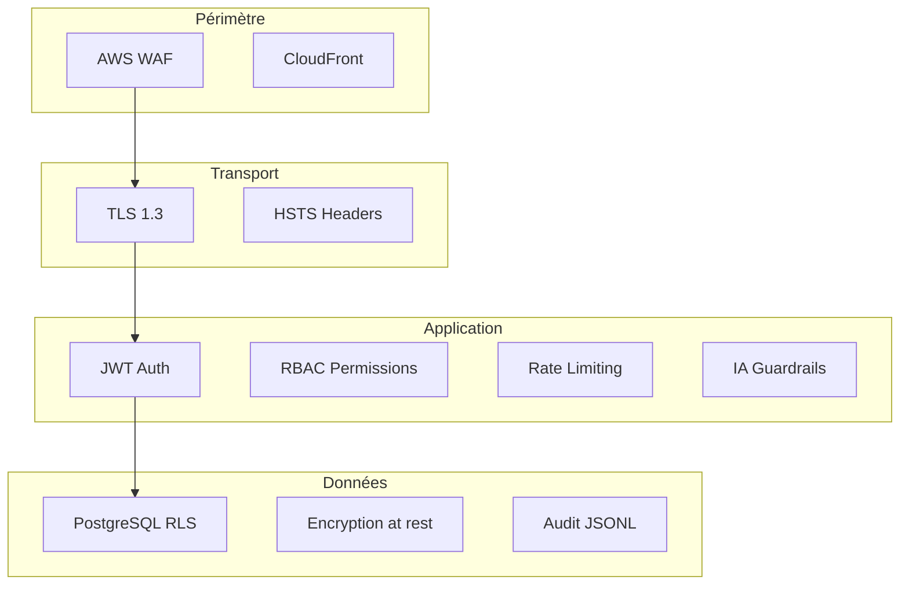

### 16.2 Headers sécurité (hérités SIH IA)

- `X-Content-Type-Options: nosniff`
- `X-Frame-Options: DENY`
- `Strict-Transport-Security` (production)
- `X-Correlation-ID` (tracing)

---

## 17. Évolution et migration

### 17.1 Roadmap architecture

| Phase | Période | Jalons |
|-------|---------|--------|
| **Foundation** | 2026 Q3-Q4 | Extraction CORE, multi-tenant, Shell UI |
| **Platform** | 2027 | Event Bus, Agent Engine v0, SSO |
| **Scale** | 2028 | AI service extraction, Kafka, read replicas |
| **Enterprise** | 2029+ | Multi-region, ABAC, marketplace |

### 17.2 Migration SIH IA → AI BOS

Voir [README_35_MigrationFromSIHIA](README_35_MigrationFromSIHIA.md) pour le plan détaillé en 6 phases :

1. Extraction packages CORE (auth, rbac, audit)
2. Introduction `organization_id`
3. Shell UI avec module federation
4. Migration données pilotes
5. Décommission routes SIH IA dupliquées
6. SIH IA = app verticale pure

---

## 18. Annexes et références croisées

### 18.1 Documents AI BOS

| Document | Contenu |
|----------|---------|
| [README_00_Vision](README_00_Vision.md) | Vision et positionnement |
| [README_01_ProductStrategy](README_01_ProductStrategy.md) | ICP, GTM, RICE |
| [README_03_Frontend](README_03_Frontend.md) | Shell React, micro-frontends |
| [README_04_Backend](README_04_Backend.md) | Patterns backend détaillés |
| [README_05_Core](README_05_Core.md) | Spécification CORE |
| [README_12_EventDriven](README_12_EventDriven.md) | Event Bus détaillé |
| [README_28_Cloud](README_28_Cloud.md) | AWS détaillé |
| [README_35_MigrationFromSIHIA](README_35_MigrationFromSIHIA.md) | Plan migration |
| [INDEX](INDEX.md) | Index complet |

### 18.2 Documents SIH IA

| Document | Lien |
|----------|------|
| Architecture | [README_02_Architecture.md](../../Document/README_02_Architecture.md) |
| État implémentation | [README_ETAT_IMPLEMENTATION.md](../../Document/README_ETAT_IMPLEMENTATION.md) |
| Backend FastAPI | [README_03_Backend_FastAPI.md](../../Document/README_03_Backend_FastAPI.md) |
| Airflow | [README_AIRFLOW_UTILISATION.md](../../Document/README_AIRFLOW_UTILISATION.md) |

### 18.3 Historique des révisions

| Version | Date | Auteur | Changements |
|---------|------|--------|-------------|
| 0.1.0 | Juillet 2026 | Architecture Team | Création initiale — architecture système |

---

*© 2026 AI BOS Platform Architecture Team — Documentation propriétaire.*
