# README_03 — Architecture Frontend AI BOS

---

## Métadonnées du document

| Champ | Valeur |
|-------|--------|
| **Document** | README_03_Frontend.md |
| **Projet** | AI BOS — AI Business Operating System |
| **Version** | 0.1.0 |
| **Statut** | `DRAFT` |
| **Niveau de maturité** | `DESIGN` |
| **Audience** | Frontend Engineers, UX, Product, Architecture |
| **Auteur** | AI BOS Frontend Team |
| **Dernière mise à jour** | Juillet 2026 |
| **Documents liés** | [README_00_Vision](README_00_Vision.md) · [README_02_Architecture](README_02_Architecture.md) · [README_04_Backend](README_04_Backend.md) · [README_06_ModularArchitecture](README_06_ModularArchitecture.md) · [README_08_AIArchitecture](README_08_AIArchitecture.md) · [README_39_ProjectStructure](README_39_ProjectStructure.md) |
| **Référence héritage** | [SIH IA Frontend](../../src/) · [SIH IA État implémentation](../../Document/README_ETAT_IMPLEMENTATION.md) |

---

## Table des matières

1. [Synthèse exécutive](#1-synthèse-exécutive)
2. [Principes frontend](#2-principes-frontend)
3. [Architecture Shell UI](#3-architecture-shell-ui)
4. [Stack technologique frontend](#4-stack-technologique-frontend)
5. [Stratégie micro-frontends](#5-stratégie-micro-frontends)
6. [TanStack Router — routing type-safe](#6-tanstack-router--routing-type-safe)
7. [TanStack Query — data fetching](#7-tanstack-query--data-fetching)
8. [Zustand — state management](#8-zustand--state-management)
9. [Design System — extension Calm Care](#9-design-system--extension-calm-care)
10. [Module Federation](#10-module-federation)
11. [Copilot UI omniprésent](#11-copilot-ui-omniprésent)
12. [Internationalisation (i18n)](#12-internationalisation-i18n)
13. [Bibliothèque de composants](#13-bibliothèque-de-composants)
14. [Patterns de gestion d'état](#14-patterns-de-gestion-détat)
15. [Authentification et guards](#15-authentification-et-guards)
16. [Gestion erreurs HTTP](#16-gestion-erreurs-http)
17. [Performance et accessibilité](#17-performance-et-accessibilité)
18. [Tests frontend](#18-tests-frontend)
19. [Réutilisation SIH IA — mapping détaillé](#19-réutilisation-sih-ia--mapping-détaillé)
20. [Roadmap frontend](#20-roadmap-frontend)
21. [Annexes et références croisées](#21-annexes-et-références-croisées)

---

## 1. Synthèse exécutive

Le frontend AI BOS est conçu comme un **Shell UI** unifié — une coquille React 19 qui héberge les micro-frontends des applications verticales (SIH IA, Edu AI, Legal AI) tout en fournissant les services transverses : navigation, authentification, copilot IA, notifications, paramètres et design system.

L'architecture hérite directement du socle SIH IA validé en production pilote :

- **TanStack Start + Router + Query** pour le routing type-safe et le cache API
- **Zustand** pour l'état global léger (i18n, auth, UI preferences)
- **shadcn/ui + Calm Care Design System** pour l'UI accessible et cohérente
- **i18n FR/EN/AR + RTL** avec hydratation SSR sans mismatch

Les évolutions majeures par rapport à SIH IA :

1. **Shell modulaire** avec Module Federation pour charger les apps verticales dynamiquement
2. **Copilot omniprésent** — widget IA sur chaque écran, pas seulement le chatbot santé
3. **Multi-tenant** — sélecteur organisation, branding par tenant
4. **React 19** — Concurrent features, `use()` hook, Suspense amélioré

Objectif : une UX où l'utilisateur perçoit **une seule application** alors que plusieurs équipes déploient des modules indépendamment.

---

## 2. Principes frontend

### 2.1 Les dix principes

| # | Principe | Implication |
|---|----------|-------------|
| 1 | **Shell-first** | Le shell fournit layout, auth, nav, copilot — les apps verticales ne dupliquent pas |
| 2 | **Type-safe everywhere** | TypeScript strict, routes typées, API contracts |
| 3 | **Server state ≠ Client state** | TanStack Query pour API, Zustand pour UI locale |
| 4 | **Progressive enhancement** | Fonctionne sans JS pour pages publiques, enrichi avec JS |
| 5 | **IA accessible partout** | Copilot widget sur chaque route authentifiée |
| 6 | **i18n by default** | Toute string UI passe par le système i18n |
| 7 | **Accessible by default** | WCAG 2.1 AA, focus management, ARIA |
| 8 | **Performance budget** | LCP < 2.5s, FID < 100ms, bundle shell < 200KB gzip |
| 9 | **Testable** | Playwright E2E, Vitest unit, MSW pour mocks |
| 10 | **Design tokens** | Pas de valeurs hardcodées, tokens Calm Care uniquement |

### 2.2 Contraintes techniques

| Contrainte | Cible |
|------------|-------|
| Navigateurs supportés | Chrome 100+, Firefox 100+, Safari 16+, Edge 100+ |
| Responsive breakpoints | Mobile 320px, Tablet 768px, Desktop 1024px+ |
| Langues v1 | FR, EN, AR (RTL) |
| Mode offline | PWA partiel (shell + cache Query) — phase 2 |
| Bundle initial shell | < 200 KB gzip |
| Time to Interactive | < 3s (3G) |

---

## 3. Architecture Shell UI

### 3.1 Vue d'ensemble

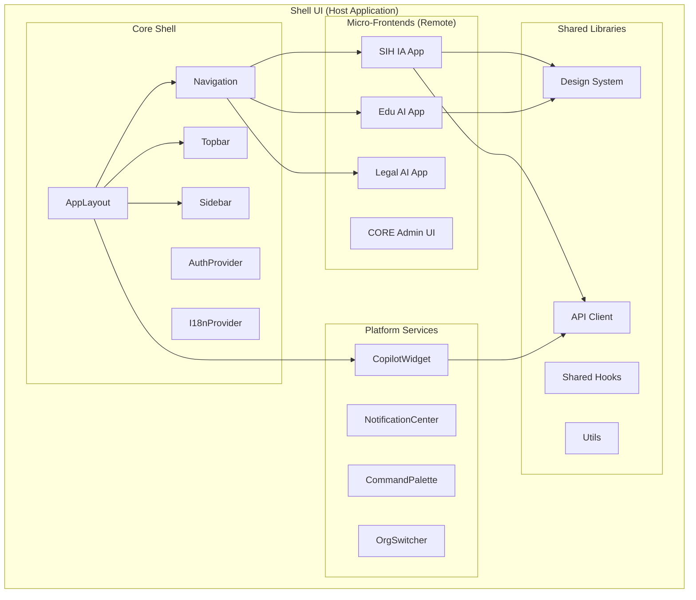

### 3.2 Structure des dossiers (mono-repo)

```
packages/
├── shell/                      # Host application
│   ├── src/
│   │   ├── routes/             # Routes shell (login, settings, 403)
│   │   ├── components/
│   │   │   ├── layout/         # AppLayout, Sidebar, Topbar
│   │   │   ├── copilot/        # CopilotWidget global
│   │   │   └── command/        # Command palette
│   │   ├── providers/          # Auth, I18n, Query, Theme
│   │   └── lib/
│   └── vite.config.ts          # Module Federation host config
│
├── design-system/              # @ai-bos/ui
│   ├── src/
│   │   ├── components/ui/      # shadcn components
│   │   ├── tokens/             # Colors, spacing, typography
│   │   └── patterns/           # Composed patterns
│   └── package.json
│
├── core-i18n/                  # @ai-bos/i18n
│   ├── src/
│   │   ├── store.ts            # Zustand i18n store
│   │   ├── locales/            # fr.json, en.json, ar.json
│   │   └── I18nHydrator.tsx
│   └── package.json
│
├── api-client/                 # @ai-bos/api
│   ├── src/
│   │   ├── client.ts           # Axios instance + interceptors
│   │   ├── services/           # Typed API services
│   │   └── types/              # Generated from OpenAPI
│   └── package.json
│
└── apps/
    ├── sihia/                  # SIH IA micro-frontend
    │   ├── src/routes/         # /sihia/patients, /sihia/doctors...
    │   └── vite.config.ts      # Module Federation remote
    ├── edu/
    └── legal/
```

### 3.3 Layout principal

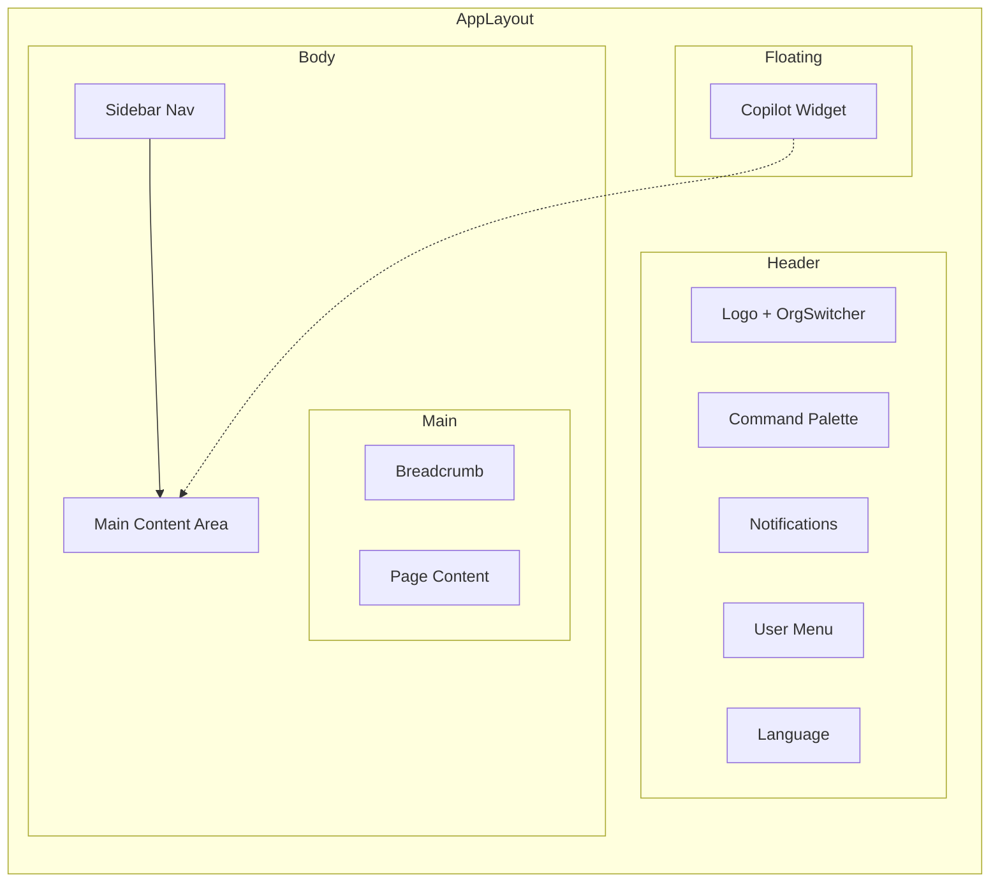

---

## 4. Stack technologique frontend

### 4.1 Tableau des technologies

| Catégorie | Technologie | Version | Rôle | Héritage SIH IA |
|-----------|-------------|---------|------|-----------------|
| **Framework** | React | 19.x | UI library | Upgrade depuis 18 |
| **Meta-framework** | TanStack Start | 1.16+ | SSR, file routing | ✅ |
| **Build** | Vite | 6.x | Bundler, HMR | ✅ |
| **Language** | TypeScript | 5.5+ | Type safety | ✅ |
| **Routing** | TanStack Router | 1.16+ | Type-safe routes | ✅ |
| **Server state** | TanStack Query | 5.x | Cache, mutations | ✅ |
| **Client state** | Zustand | 5.x | Global UI state | ✅ |
| **Forms** | React Hook Form | 7.x | Form management | ✅ |
| **Validation** | Zod | 3.x | Schema validation | ✅ |
| **UI primitives** | Radix UI | Latest | Accessible components | ✅ |
| **UI components** | shadcn/ui | Latest | Styled components | ✅ Calm Care |
| **Styling** | Tailwind CSS | 4.x | Utility CSS | ✅ |
| **Icons** | Lucide React | Latest | Icon library | ✅ |
| **Charts** | Recharts | 2.x | Dashboards | ✅ |
| **HTTP** | Axios | 1.x | API client | ✅ |
| **i18n** | Custom Zustand | — | FR/EN/AR + RTL | ✅ |
| **Module Federation** | @module-federation/vite | 1.x | Micro-frontends | Nouveau |
| **Testing unit** | Vitest | 2.x | Unit tests | ✅ |
| **Testing E2E** | Playwright | 1.40+ | E2E flows | ✅ 8/8 |
| **Mocking** | MSW | 2.x | API mocks dev | Opt-in SIH IA |

### 4.2 Migration React 18 → 19

| Feature React 19 | Usage AI BOS |
|------------------|--------------|
| `use()` hook | Consommer promises dans composants (SSR data) |
| Actions | Form submissions avec pending states |
| `useOptimistic` | UI optimiste mutations Query |
| Document metadata | SEO pages publiques |
| Suspense amélioré | Chargement micro-frontends |
| Ref as prop | Simplification forwardRef |

---

## 5. Stratégie micro-frontends

### 5.1 Pourquoi micro-frontends ?

| Besoin | Solution MFE |
|--------|--------------|
| Équipes parallèles par vertical | SIH IA team, Edu AI team indépendantes |
| Déploiement indépendant | Deploy SIH IA sans redeployer shell |
| Isolation des bundles | Chaque app charge son code à la demande |
| Réutilisation shell | Auth, nav, copilot partagés |

### 5.2 Architecture Module Federation

```mermaid
graph TB
    subgraph "Host — shell"
        HOST[Vite Host Config]
        SHARED[Shared Dependencies]
    end
    
    subgraph "Remotes"
        R_SIH[sihia@/remoteEntry.js]
        R_EDU[edu@/remoteEntry.js]
        R_LEG[legal@/remoteEntry.js]
    end
    
    subgraph "Shared Singletons"
        REACT[react]
        REACT_DOM[react-dom]
        ROUTER[@tanstack/react-router]
        QUERY[@tanstack/react-query]
        UI[@ai-bos/ui]
    end
    
    HOST --> R_SIH
    HOST --> R_EDU
    HOST --> R_LEG
    SHARED --> REACT
    SHARED --> REACT_DOM
    SHARED --> ROUTER
    SHARED --> QUERY
    SHARED --> UI
    R_SIH --> SHARED
    R_EDU --> SHARED
```

### 5.3 Configuration Module Federation (host)

```typescript
// packages/shell/vite.config.ts
import { federation } from '@module-federation/vite';

export default defineConfig({
  plugins: [
    federation({
      name: 'shell',
      remotes: {
        sihia: {
          type: 'module',
          name: 'sihia',
          entry: 'http://localhost:3001/remoteEntry.js',
        },
        edu: {
          type: 'module',
          name: 'edu',
          entry: 'http://localhost:3002/remoteEntry.js',
        },
      },
      shared: {
        react: { singleton: true, requiredVersion: '^19.0.0' },
        'react-dom': { singleton: true, requiredVersion: '^19.0.0' },
        '@tanstack/react-router': { singleton: true },
        '@tanstack/react-query': { singleton: true },
        '@ai-bos/ui': { singleton: true },
        '@ai-bos/i18n': { singleton: true },
      },
    }),
  ],
});
```

### 5.4 Chargement dynamique des routes

```typescript
// packages/shell/src/routes/_app/sihia/$.tsx
import { createFileRoute } from '@tanstack/react-router';
import { lazy, Suspense } from 'react';
import { PageLoader } from '@ai-bos/ui';

const SihiaApp = lazy(() => import('sihia/App'));

export const Route = createFileRoute('/_app/sihia/$')({
  component: () => (
    <Suspense fallback={<PageLoader />}>
      <SihiaApp />
    </Suspense>
  ),
});
```

### 5.5 Contrat entre Shell et Remote

| Responsabilité | Shell (Host) | Remote (App verticale) |
|----------------|--------------|------------------------|
| Layout global | ✅ | ❌ |
| Authentification | ✅ | Consomme context |
| Navigation principale | ✅ | Enregistre ses routes |
| Copilot widget | ✅ | Fournit contexte métier |
| i18n framework | ✅ | Fournit traductions |
| Design system | ✅ | Utilise composants |
| Routes métier | ❌ | ✅ |
| API calls métier | ❌ | ✅ |
| Permissions route guards | Framework ✅ | Définit permissions |

### 5.6 Communication Shell ↔ Remote

```typescript
// Shell expose via context
interface ShellContext {
  user: User;
  organization: Organization;
  permissions: string[];
  locale: 'fr' | 'en' | 'ar';
  copilot: {
    setContext: (ctx: CopilotContext) => void;
    open: () => void;
  };
  navigate: (to: string) => void;
}

// Remote consomme
const { copilot, permissions } = useShellContext();

useEffect(() => {
  copilot.setContext({
    vertical: 'sihia',
    entity: 'patient',
    entityId: patientId,
    suggestedPrompts: ['Résumer le dossier', 'Prochains RDV'],
  });
}, [patientId]);
```

---

## 6. TanStack Router — routing type-safe

### 6.1 Structure des routes

```mermaid
graph TD
    ROOT[__root.tsx]
    LOGIN[/login]
    APP[_app.tsx — layout authentifié]
    
    APP --> DASH[/dashboard]
    APP --> SETTINGS[/settings]
    APP --> RBAC[/rbac]
    APP --> SIH[/sihia/*]
    APP --> EDU[/edu/*]
    APP --> LEG[/legal/*]
    
    SIH --> SIH_PAT[/sihia/patients]
    SIH --> SIH_DOC[/sihia/doctors]
    SIH --> SIH_RDV[/sihia/appointments]
    SIH --> SIH_ANA[/sihia/analytics]
    
    ROOT --> E403[/403]
```

### 6.2 Route tree (hérité SIH IA, étendu)

```typescript
// packages/shell/src/routeTree.gen.ts (auto-generated)
// Pattern hérité de SIH IA src/routeTree.gen.ts

// Layout route avec auth guard
export const Route = createFileRoute('/_app')({
  beforeLoad: async ({ context }) => {
    if (!context.auth.isAuthenticated) {
      throw redirect({ to: '/login' });
    }
  },
  component: AppLayout,
});
```

### 6.3 Permission guards (hérité SIH IA)

```typescript
// Hérité de SIH IA : requireRoutePermission
// packages/shell/src/lib/auth/guards.ts

export function requireRoutePermission(permission: string) {
  return ({ context }: BeforeLoadContext) => {
    if (!context.auth.permissions.includes(permission)) {
      throw redirect({ to: '/403' });
    }
  };
}

// Usage dans route SIH IA
export const Route = createFileRoute('/_app/sihia/patients')({
  beforeLoad: requireRoutePermission('patients:read'),
  component: PatientsPage,
});
```

### 6.4 Search params typés

```typescript
const patientsSearchSchema = z.object({
  page: z.number().default(1),
  search: z.string().optional(),
  status: z.enum(['active', 'archived']).optional(),
});

export const Route = createFileRoute('/_app/sihia/patients')({
  validateSearch: patientsSearchSchema,
  component: PatientsPage,
});

// Dans le composant
const { page, search } = Route.useSearch(); // Typé !
```

---

## 7. TanStack Query — data fetching

### 7.1 Architecture Query

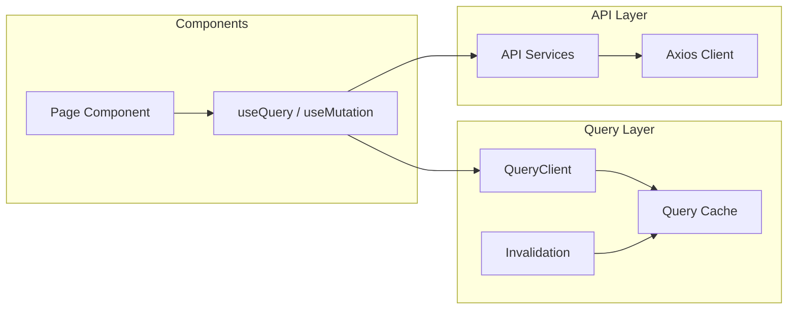

### 7.2 Configuration QueryClient

```typescript
// packages/shell/src/providers/QueryProvider.tsx
const queryClient = new QueryClient({
  defaultOptions: {
    queries: {
      staleTime: 30_000,        // 30s avant refetch
      gcTime: 5 * 60_000,       // 5min cache retention
      retry: (failureCount, error) => {
        if (error.status === 401 || error.status === 403) return false;
        return failureCount < 2;
      },
      refetchOnWindowFocus: true,
    },
    mutations: {
      onError: (error) => handleHttpError(error), // Hérité SIH IA
    },
  },
});
```

### 7.3 Pattern API services (hérité SIH IA)

```typescript
// packages/api-client/src/services/patients.ts
// Hérité de SIH IA src/lib/api/services.ts

export const patientsService = {
  list: (params: PatientsListParams) =>
    api.get<PatientsListResponse>('/api/patients', { params }),
  
  get: (id: string) =>
    api.get<Patient>(`/api/patients/${id}`),
  
  create: (data: CreatePatientDto) =>
    api.post<Patient>('/api/patients', data),
  
  update: (id: string, data: UpdatePatientDto) =>
    api.patch<Patient>(`/api/patients/${id}`, data),
  
  delete: (id: string) =>
    api.delete(`/api/patients/${id}`),
};

// Hook
export function usePatients(params: PatientsListParams) {
  return useQuery({
    queryKey: ['patients', params],
    queryFn: () => patientsService.list(params),
  });
}

export function useCreatePatient() {
  const queryClient = useQueryClient();
  return useMutation({
    mutationFn: patientsService.create,
    onSuccess: () => {
      queryClient.invalidateQueries({ queryKey: ['patients'] });
    },
  });
}
```

### 7.4 Conventions query keys

| Pattern | Exemple | Usage |
|---------|---------|-------|
| `['entity']` | `['patients']` | Liste |
| `['entity', params]` | `['patients', { page: 1 }]` | Liste filtrée |
| `['entity', id]` | `['patients', '123']` | Détail |
| `['entity', id, 'sub']` | `['patients', '123', 'history']` | Sous-ressource |
| `['ml', 'forecast']` | `['ml', 'forecast', { horizon: 7 }]` | ML predictions |

### 7.5 Optimistic updates

```typescript
export function useUpdatePatient() {
  const queryClient = useQueryClient();
  
  return useMutation({
    mutationFn: ({ id, data }) => patientsService.update(id, data),
    onMutate: async ({ id, data }) => {
      await queryClient.cancelQueries({ queryKey: ['patients', id] });
      const previous = queryClient.getQueryData(['patients', id]);
      queryClient.setQueryData(['patients', id], (old) => ({ ...old, ...data }));
      return { previous };
    },
    onError: (err, vars, context) => {
      queryClient.setQueryData(['patients', vars.id], context?.previous);
    },
    onSettled: (data, err, { id }) => {
      queryClient.invalidateQueries({ queryKey: ['patients', id] });
    },
  });
}
```

---

## 8. Zustand — state management

### 8.1 Quand utiliser Zustand vs TanStack Query

| Type d'état | Outil | Exemples |
|-------------|-------|----------|
| **Server state** (API data) | TanStack Query | Patients, KPIs, forecasts |
| **Client state** (UI local) | Zustand | Sidebar collapsed, theme |
| **Session state** | Zustand + persist | Auth tokens, locale |
| **Form state** | React Hook Form | Création patient |
| **URL state** | TanStack Router search | Filtres, pagination |

### 8.2 Stores Zustand

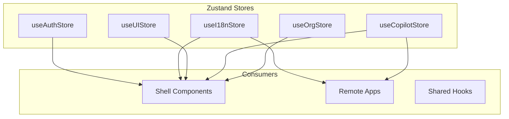

### 8.3 Auth store

```typescript
// packages/shell/src/stores/authStore.ts
interface AuthState {
  accessToken: string | null;
  refreshToken: string | null;
  user: User | null;
  permissions: string[];
  isAuthenticated: boolean;
  
  setTokens: (access: string, refresh: string) => void;
  setUser: (user: User) => void;
  logout: () => void;
  hasPermission: (permission: string) => boolean;
}

export const useAuthStore = create<AuthState>()(
  persist(
    (set, get) => ({
      accessToken: null,
      refreshToken: null,
      user: null,
      permissions: [],
      isAuthenticated: false,
      
      setTokens: (access, refresh) => set({ 
        accessToken: access, 
        refreshToken: refresh,
        isAuthenticated: true,
      }),
      
      hasPermission: (permission) => 
        get().permissions.includes(permission),
      
      logout: () => set({
        accessToken: null,
        refreshToken: null,
        user: null,
        permissions: [],
        isAuthenticated: false,
      }),
    }),
    { name: 'ai-bos-auth', partialize: (s) => ({ refreshToken: s.refreshToken }) }
  )
);
```

### 8.4 i18n store (hérité SIH IA)

```typescript
// packages/core-i18n/src/store.ts
// Hérité de SIH IA src/lib/i18n/store.ts

interface I18nState {
  locale: 'fr' | 'en' | 'ar';
  direction: 'ltr' | 'rtl';
  translations: Record<string, string>;
  
  setLocale: (locale: 'fr' | 'en' | 'ar') => void;
  t: (key: string, params?: Record<string, string>) => string;
}

export const useI18nStore = create<I18nState>()(
  persist(
    (set, get) => ({
      locale: 'fr',
      direction: 'ltr',
      translations: frTranslations,
      
      setLocale: (locale) => set({
        locale,
        direction: locale === 'ar' ? 'rtl' : 'ltr',
        translations: translationsMap[locale],
      }),
      
      t: (key, params) => {
        let text = get().translations[key] ?? key;
        if (params) {
          Object.entries(params).forEach(([k, v]) => {
            text = text.replace(`{{${k}}}`, v);
          });
        }
        return text;
      },
    }),
    { 
      name: 'ai-bos-i18n',
      skipHydration: true, // Hérité SIH IA — évite mismatch SSR
    }
  )
);
```

### 8.5 UI store

```typescript
interface UIState {
  sidebarCollapsed: boolean;
  copilotOpen: boolean;
  copilotPosition: 'right' | 'bottom';
  theme: 'light' | 'dark' | 'system';
  
  toggleSidebar: () => void;
  setCopilotOpen: (open: boolean) => void;
  setTheme: (theme: 'light' | 'dark' | 'system') => void;
}
```

---

## 9. Design System — extension Calm Care

### 9.1 Héritage SIH IA Calm Care

Le design system **Calm Care** de SIH IA devient **`@ai-bos/ui`** — le design system plateforme.

| Élément SIH IA | Extension AI BOS |
|----------------|----------------|
| Tokens oklch | + tokens multi-tenant (branding) |
| shadcn/ui components | + composants plateforme (OrgSwitcher, Copilot) |
| Calm Care palette | + thèmes par vertical (santé, éducation) |
| Typography Inter | + support AR (Noto Sans Arabic) |

### 9.2 Tokens de design

```css
/* packages/design-system/src/tokens/colors.css */
:root {
  /* Calm Care — hérité SIH IA */
  --background: oklch(0.99 0.01 240);
  --foreground: oklch(0.20 0.02 240);
  --primary: oklch(0.55 0.15 200);
  --primary-foreground: oklch(0.99 0 0);
  --secondary: oklch(0.95 0.02 200);
  --muted: oklch(0.96 0.01 240);
  --accent: oklch(0.92 0.03 180);
  --destructive: oklch(0.55 0.20 25);
  --border: oklch(0.90 0.01 240);
  --ring: oklch(0.55 0.15 200);
  
  /* AI BOS extensions */
  --copilot: oklch(0.60 0.18 280);
  --copilot-foreground: oklch(0.99 0 0);
  --success: oklch(0.60 0.15 145);
  --warning: oklch(0.75 0.15 85);
  
  /* Semantic */
  --radius: 0.5rem;
  --font-sans: 'Inter', 'Noto Sans Arabic', system-ui;
}
```

### 9.3 Composants shadcn étendus

| Composant shadcn | Package | Usage |
|------------------|---------|-------|
| Button | `@ai-bos/ui` | Actions |
| Dialog | `@ai-bos/ui` | Modales (ConfirmDialog hérité) |
| DataTable | `@ai-bos/ui` | Listes paginées |
| Form | `@ai-bos/ui` | Formulaires |
| Toast | `@ai-bos/ui` | Notifications UI |
| Card | `@ai-bos/ui` | KPI cards dashboard |
| **CopilotPanel** | `@ai-bos/ui` | Nouveau — panneau IA |
| **OrgSwitcher** | `@ai-bos/ui` | Nouveau — multi-tenant |
| **PageLoader** | `@ai-bos/ui` | Nouveau — Suspense fallback |
| **MlForecastMeta** | `@ai-bos/ui` | Hérité SIH IA — métadonnées ML |

### 9.4 Patterns composés

```typescript
// packages/design-system/src/patterns/KpiCard.tsx
// Hérité pattern SIH IA dashboard

interface KpiCardProps {
  title: string;
  value: string | number;
  trend?: { value: number; direction: 'up' | 'down' };
  icon?: LucideIcon;
  loading?: boolean;
}

export function KpiCard({ title, value, trend, icon: Icon, loading }: KpiCardProps) {
  return (
    <Card>
      <CardHeader className="flex flex-row items-center justify-between pb-2">
        <CardTitle className="text-sm font-medium text-muted-foreground">
          {title}
        </CardTitle>
        {Icon && <Icon className="h-4 w-4 text-muted-foreground" />}
      </CardHeader>
      <CardContent>
        {loading ? (
          <Skeleton className="h-8 w-24" />
        ) : (
          <>
            <div className="text-2xl font-bold">{value}</div>
            {trend && <TrendBadge {...trend} />}
          </>
        )}
      </CardContent>
    </Card>
  );
}
```

---

## 10. Module Federation

### 10.1 Build et déploiement

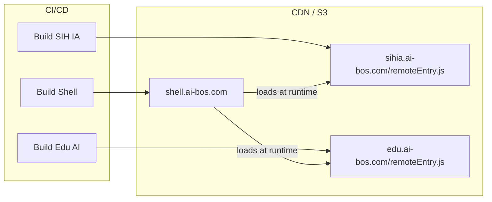

### 10.2 Versioning et compatibilité

| Stratégie | Implémentation |
|-----------|----------------|
| Shared deps singleton | react, react-dom, router, query, ui |
| Version mismatch | Warning console, pas de crash |
| Remote version check | `remoteEntry.js` expose `version` |
| Rollback | CDN versioning, shell pointe version précédente |
| Feature flags | Shell décide quels remotes charger |

### 10.3 Développement local

```bash
# Terminal 1 — Shell host
cd packages/shell && npm run dev  # :3000

# Terminal 2 — SIH IA remote
cd packages/apps/sihia && npm run dev  # :3001

# Terminal 3 — Backend
cd backend && uvicorn app.main:app --reload  # :8000
```

---

## 11. Copilot UI omniprésent

### 11.1 Architecture copilot

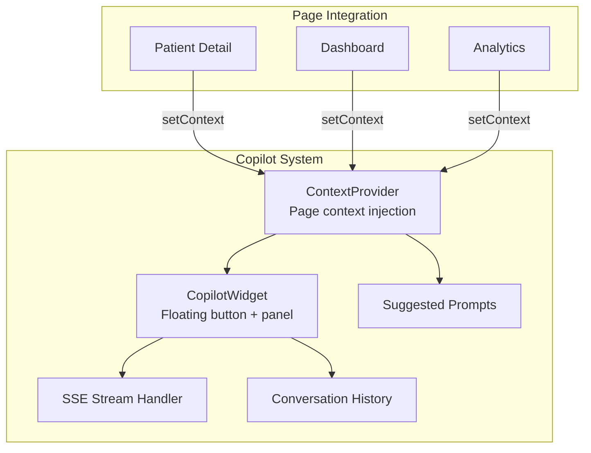

### 11.2 Composant CopilotWidget (extension SihiaChatbot)

```typescript
// packages/shell/src/components/copilot/CopilotWidget.tsx
// Extension de SIH IA src/components/chatbot/SihiaChatbot

interface CopilotWidgetProps {
  position?: 'bottom-right' | 'bottom-left';
  defaultOpen?: boolean;
}

export function CopilotWidget({ position = 'bottom-right' }: CopilotWidgetProps) {
  const { isOpen, setOpen } = useUIStore();
  const { context, messages, sendMessage } = useCopilotStore();
  const { t, locale } = useI18nStore();
  
  return (
    <>
      <CopilotTrigger 
        onClick={() => setOpen(true)} 
        className={positionClasses[position]}
      />
      
      <CopilotPanel open={isOpen} onClose={() => setOpen(false)}>
        <CopilotHeader title={t('copilot.title')} />
        
        {context.suggestedPrompts && (
          <SuggestedPrompts 
            prompts={context.suggestedPrompts}
            onSelect={sendMessage}
          />
        )}
        
        <MessageList messages={messages} />
        
        <Composer 
          onSend={sendMessage}
          streaming={true}
          placeholder={t('copilot.placeholder')}
        />
      </CopilotPanel>
    </>
  );
}
```

### 11.3 Streaming SSE (hérité SIH IA)

```typescript
// packages/shell/src/lib/copilot/stream.ts
// Hérité de SIH IA chatbot SSE pattern

export async function* streamCopilotResponse(
  message: string,
  context: CopilotContext
): AsyncGenerator<string> {
  const response = await fetch('/api/chatbot/stream', {
    method: 'POST',
    headers: {
      'Content-Type': 'application/json',
      Authorization: `Bearer ${getAccessToken()}`,
    },
    body: JSON.stringify({ message, context }),
  });

  const reader = response.body?.getReader();
  const decoder = new TextDecoder();

  while (reader) {
    const { done, value } = await reader.read();
    if (done) break;
    
    const chunk = decoder.decode(value);
    const lines = chunk.split('\n');
    
    for (const line of lines) {
      if (line.startsWith('data: ')) {
        const data = JSON.parse(line.slice(6));
        if (data.token) yield data.token;
        if (data.done) return;
      }
    }
  }
}
```

### 11.4 Context injection par page

| Page | Contexte injecté | Prompts suggérés |
|------|------------------|------------------|
| Dashboard | `vertical, period, kpis` | « Résumer les alertes », « Expliquer la tendance » |
| Patient detail | `vertical, entity: patient, id` | « Résumer le dossier », « Prochains RDV » |
| Analytics | `vertical, filters, chartType` | « Expliquer ce graphique », « Exporter en PDF » |
| Prédiction ML | `model, horizon, mape` | « Fiabilité du modèle », « Recommandations » |
| RBAC | `vertical, admin` | « Qui a accès à quoi ? », « Créer un rôle » |

---

## 12. Internationalisation (i18n)

### 12.1 Architecture i18n (héritée SIH IA)

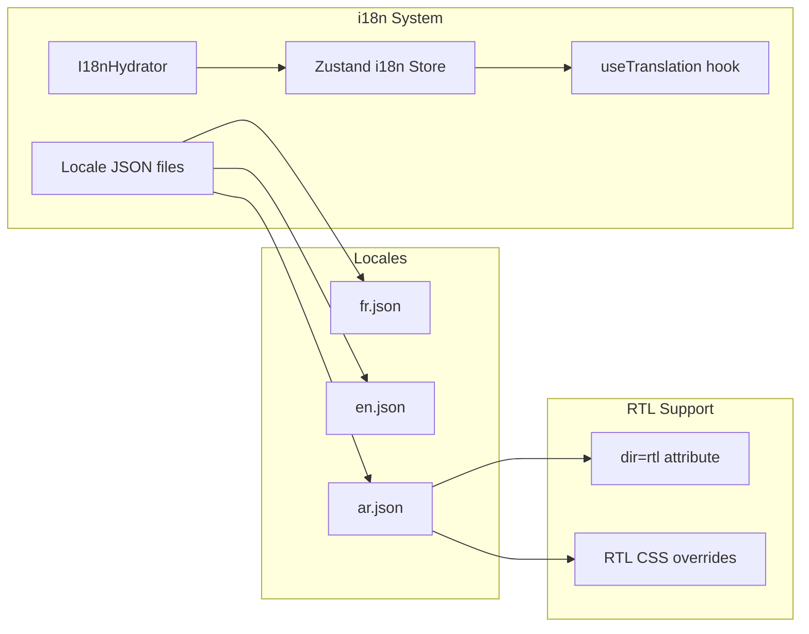

### 12.2 Structure des fichiers de traduction

```
packages/core-i18n/src/locales/
├── fr.json          # Français (défaut)
├── en.json          # Anglais
├── ar.json          # Arabe (RTL)
├── sihia/
│   ├── fr.json      # Traductions métier santé
│   ├── en.json
│   └── ar.json
├── edu/
│   └── ...
└── shell/
    ├── fr.json      # Traductions shell
    ├── en.json
    └── ar.json
```

### 12.3 I18nHydrator (hérité SIH IA)

```typescript
// packages/core-i18n/src/I18nHydrator.tsx
// Hérité de SIH IA src/components/I18nHydrator.tsx
// Résout le mismatch SSR/client avec skipHydration

export function I18nHydrator({ children }: { children: React.ReactNode }) {
  const [hydrated, setHydrated] = useState(false);
  
  useEffect(() => {
    useI18nStore.persist.rehydrate();
    setHydrated(true);
  }, []);
  
  if (!hydrated) {
    return <PageLoader />;
  }
  
  return (
    <div dir={useI18nStore.getState().direction}>
      {children}
    </div>
  );
}
```

### 12.4 Hook useTranslation

```typescript
// packages/core-i18n/src/useTranslation.ts
export function useTranslation(namespace?: string) {
  const { t, locale, setLocale, direction } = useI18nStore();
  
  const tn = (key: string, params?: Record<string, string>) => {
    const fullKey = namespace ? `${namespace}.${key}` : key;
    return t(fullKey, params);
  };
  
  return { t: tn, locale, setLocale, direction, isRtl: direction === 'rtl' };
}

// Usage
const { t } = useTranslation('sihia.patients');
return <h1>{t('title')}</h1>; // "Patients" / "Patients" / "المرضى"
```

### 12.5 RTL support

```css
/* packages/design-system/src/styles/rtl.css */
[dir="rtl"] {
  .sidebar { right: 0; left: auto; }
  .copilot-widget { left: 1rem; right: auto; }
  .breadcrumb-separator { transform: scaleX(-1); }
}
```

---

## 13. Bibliothèque de composants

### 13.1 Hiérarchie des composants

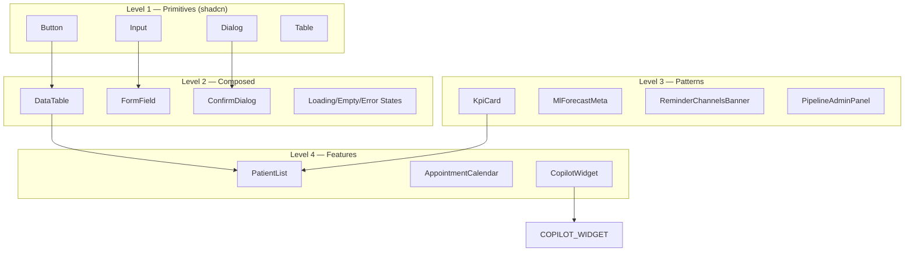

### 13.2 Composants hérités SIH IA → @ai-bos/ui

| Composant SIH IA | Chemin source | Package cible |
|------------------|---------------|---------------|
| `ConfirmDialog` | `src/components/shared/ConfirmDialog.tsx` | `@ai-bos/ui` |
| `States` (Loading/Empty/Error) | `src/components/shared/States.tsx` | `@ai-bos/ui` |
| `MlForecastMeta` | `src/components/shared/MlForecastMeta.tsx` | `@ai-bos/ui` |
| `ReminderChannelsBanner` | `src/components/shared/ReminderChannelsBanner.tsx` | `@ai-bos/ui` |
| `PipelineAdminPanel` | `src/components/shared/PipelineAdminPanel.tsx` | `@ai-bos/ui` |
| `Sidebar` | `src/components/layout/Sidebar.tsx` | `shell` (adapté) |
| `Topbar` | `src/components/layout/Topbar.tsx` | `shell` (adapté) |
| `SihiaChatbot` | `src/components/chatbot/` | `shell/copilot` (généralisé) |
| `Composer` | `src/components/chatbot/components/Composer.tsx` | `shell/copilot` |

### 13.3 Convention de nommage

| Type | Convention | Exemple |
|------|------------|---------|
| Composant | PascalCase | `PatientCard` |
| Hook | camelCase, préfixe `use` | `usePatients` |
| Store | camelCase, suffixe `Store` | `useAuthStore` |
| Service | camelCase, suffixe `Service` | `patientsService` |
| Type | PascalCase | `Patient`, `CreatePatientDto` |
| Constante | SCREAMING_SNAKE | `MAX_PAGE_SIZE` |
| Fichier composant | PascalCase.tsx | `PatientCard.tsx` |
| Fichier util | camelCase.ts | `formatDate.ts` |

---

## 14. Patterns de gestion d'état

### 14.1 Matrice décisionnelle

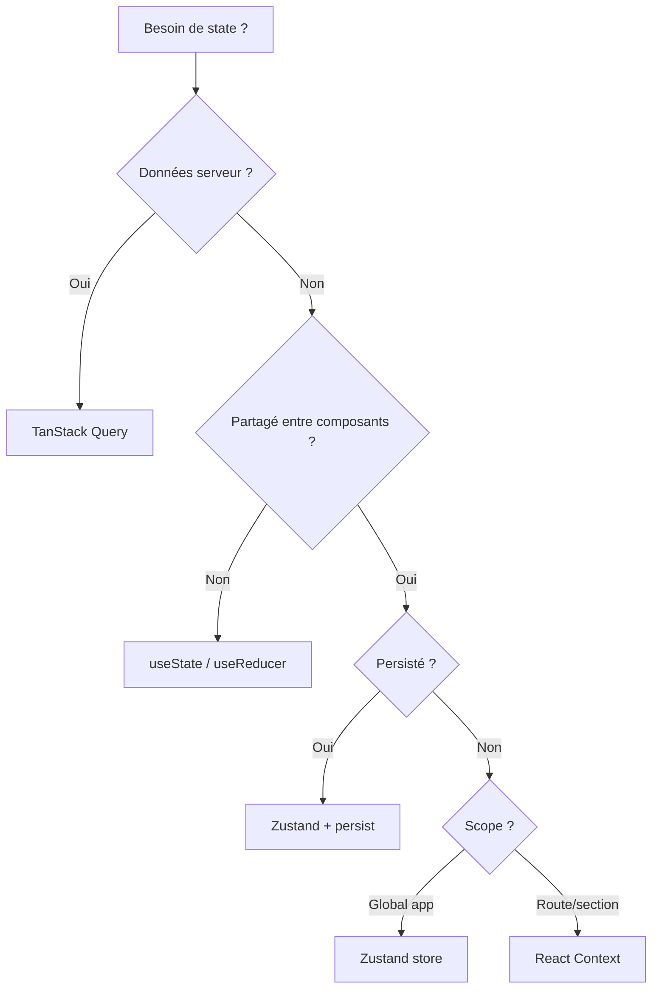

### 14.2 Pattern Container/Presenter

```typescript
// Container — logique data
function PatientsPageContainer() {
  const { page, search } = Route.useSearch();
  const { data, isLoading, error } = usePatients({ page, search });
  const createMutation = useCreatePatient();
  
  return (
    <PatientsPage
      patients={data?.items ?? []}
      total={data?.total ?? 0}
      loading={isLoading}
      error={error}
      onCreate={createMutation.mutate}
    />
  );
}

// Presenter — UI pure
function PatientsPage({ patients, total, loading, error, onCreate }: Props) {
  const { t } = useTranslation('sihia.patients');
  
  if (loading) return <PageLoader />;
  if (error) return <ErrorState error={error} />;
  if (patients.length === 0) return <EmptyState title={t('empty')} />;
  
  return (
    <div>
      <PageHeader title={t('title')} action={<CreateButton onClick={onCreate} />} />
      <PatientsTable data={patients} />
      <Pagination total={total} />
    </div>
  );
}
```

### 14.3 Pattern Compound Components

```typescript
// packages/design-system/src/patterns/DataTable/
export function DataTable({ children }: { children: React.ReactNode }) {
  return <Table>{children}</Table>;
}

DataTable.Header = DataTableHeader;
DataTable.Body = DataTableBody;
DataTable.Row = DataTableRow;
DataTable.Cell = DataTableCell;
DataTable.Pagination = DataTablePagination;

// Usage
<DataTable>
  <DataTable.Header columns={columns} />
  <DataTable.Body>
    {patients.map(p => (
      <DataTable.Row key={p.id}>
        <DataTable.Cell>{p.name}</DataTable.Cell>
      </DataTable.Row>
    ))}
  </DataTable.Body>
  <DataTable.Pagination total={100} page={1} />
</DataTable>
```

---

## 15. Authentification et guards

### 15.1 Flux auth (hérité SIH IA)

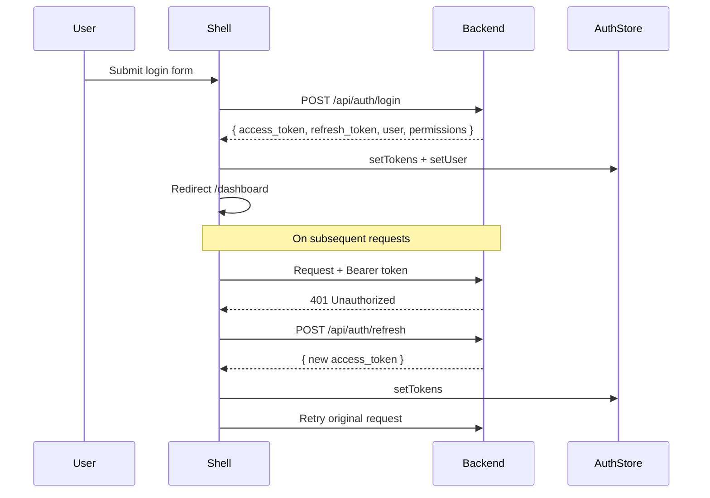

### 15.2 Axios interceptors

```typescript
// packages/api-client/src/client.ts
// Hérité pattern SIH IA

api.interceptors.request.use((config) => {
  const token = useAuthStore.getState().accessToken;
  if (token) {
    config.headers.Authorization = `Bearer ${token}`;
  }
  return config;
});

api.interceptors.response.use(
  (response) => response,
  async (error) => {
    if (error.response?.status === 401 && !error.config._retry) {
      error.config._retry = true;
      const refreshed = await refreshAccessToken();
      if (refreshed) {
        return api(error.config);
      }
      useAuthStore.getState().logout();
      window.location.href = '/login';
    }
    return Promise.reject(error);
  }
);
```

---

## 16. Gestion erreurs HTTP

### 16.1 Handler centralisé (hérité SIH IA)

```typescript
// packages/api-client/src/httpErrors.ts
// Hérité de SIH IA src/lib/httpErrors.ts

export function handleHttpError(error: AxiosError<ApiError>) {
  const { t } = useI18nStore.getState();
  const status = error.response?.status;
  const code = error.response?.data?.code;

  switch (status) {
    case 401:
      toast.error(t('errors.unauthorized'));
      break;
    case 403:
      toast.error(t('errors.forbidden'));
      break;
    case 404:
      toast.error(t('errors.notFound'));
      break;
    case 422:
      toast.error(error.response?.data?.message ?? t('errors.validation'));
      break;
    default:
      toast.error(t('errors.generic'));
  }
}
```

### 16.2 Page 403 (héritée SIH IA)

```typescript
// packages/shell/src/routes/403.tsx
// Hérité de SIH IA src/routes/403.tsx

export function ForbiddenPage() {
  const { t } = useTranslation();
  const navigate = useNavigate();
  
  return (
    <div className="flex flex-col items-center justify-center min-h-[60vh]">
      <h1 className="text-4xl font-bold">403</h1>
      <p className="text-muted-foreground mt-2">{t('errors.forbidden')}</p>
      <Button onClick={() => navigate({ to: '/dashboard' })} className="mt-4">
        {t('common.backToDashboard')}
      </Button>
    </div>
  );
}
```

---

## 17. Performance et accessibilité

### 17.1 Budget performance

| Métrique | Cible | Mesure |
|----------|-------|--------|
| LCP (Largest Contentful Paint) | < 2.5s | Lighthouse |
| FID (First Input Delay) | < 100ms | Lighthouse |
| CLS (Cumulative Layout Shift) | < 0.1 | Lighthouse |
| Bundle shell (gzip) | < 200 KB | Vite analyze |
| Bundle remote SIH IA (gzip) | < 150 KB | Vite analyze |
| Time to Interactive | < 3s | Lighthouse |

### 17.2 Stratégies d'optimisation

| Stratégie | Implémentation |
|-----------|----------------|
| Code splitting | Module Federation + lazy routes |
| Tree shaking | ESM imports, pas de barrel files |
| Image optimization | WebP, lazy loading, srcset |
| Query cache | staleTime 30s, prefetch on hover |
| Suspense boundaries | Par route et par remote |
| Memoization | `React.memo` sur listes, `useMemo` calculs |

### 17.3 Accessibilité WCAG 2.1 AA

| Critère | Implémentation |
|---------|----------------|
| Contraste | Tokens Calm Care validés 4.5:1 |
| Focus visible | Ring tokens, focus trap modales |
| Labels | `aria-label`, `htmlFor` sur tous inputs |
| Navigation clavier | Tab order, Escape ferme modales |
| Screen readers | ARIA roles Radix UI |
| RTL | `dir` attribute, CSS logical properties |

---

## 18. Tests frontend

### 18.1 Stratégie de tests

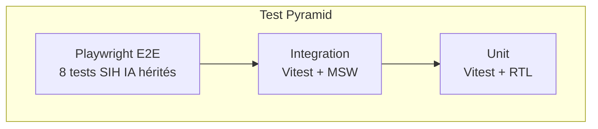

### 18.2 Tests hérités SIH IA

| Test | Fichier | Statut |
|------|---------|--------|
| RBAC permissions | `tests/rbac-permissions.test.ts` | ✅ Vitest |
| E2E login + navigation | `tests/e2e/auth.spec.ts` | ✅ Playwright |
| E2E RBAC par rôle | `tests/e2e/rbac.spec.ts` | ✅ Playwright |
| E2E patients CRUD | `tests/e2e/patients.spec.ts` | ✅ Playwright |

### 18.3 Conventions tests

```typescript
// tests/e2e/patients.spec.ts
import { test, expect } from '@playwright/test';

test.describe('Patients', () => {
  test.beforeEach(async ({ page }) => {
    await page.goto('/login');
    await page.fill('[name=email]', 'admin@sihia.health');
    await page.fill('[name=password]', 'admin123');
    await page.click('button[type=submit]');
    await page.waitForURL('/dashboard');
  });

  test('should list patients', async ({ page }) => {
    await page.goto('/sihia/patients');
    await expect(page.locator('h1')).toContainText('Patients');
    await expect(page.locator('table tbody tr')).toHaveCount.greaterThan(0);
  });
});
```

---

## 19. Réutilisation SIH IA — mapping détaillé

### 19.1 Mapping fichiers source → packages AI BOS

| Fichier SIH IA | Package AI BOS | Action |
|----------------|----------------|--------|
| `src/lib/i18n/store.ts` | `@ai-bos/i18n` | Extract + extend |
| `src/components/I18nHydrator.tsx` | `@ai-bos/i18n` | Extract |
| `src/lib/httpErrors.ts` | `@ai-bos/api` | Extract |
| `src/lib/api/services.ts` | `@ai-bos/api` + `apps/sihia` | Split |
| `src/components/ui/*` | `@ai-bos/ui` | Extract |
| `src/components/shared/*` | `@ai-bos/ui/patterns` | Extract |
| `src/components/layout/*` | `shell` | Adapt |
| `src/components/chatbot/*` | `shell/copilot` | Generalize |
| `src/routes/_app/*` | `apps/sihia/routes` | Move |
| `src/routes/login.tsx` | `shell/routes` | Adapt |
| `src/routes/403.tsx` | `shell/routes` | Extract |

### 19.2 Composants à généraliser

| Composant SIH IA | Généralisation AI BOS |
|------------------|----------------------|
| `SihiaChatbot` | `CopilotWidget` — vertical-agnostic |
| `Sidebar` nav items | Dynamique depuis config vertical |
| `MlForecastMeta` | `ForecastMeta` — tout type de prédiction |
| `PipelineAdminPanel` | `PipelinePanel` — CORE admin |
| `ReminderChannelsBanner` | `NotificationChannelsBanner` |

### 19.3 Effort estimation

| Package | Effort | Priorité |
|---------|--------|----------|
| `@ai-bos/ui` (design system) | 3 semaines | P0 |
| `@ai-bos/i18n` | 1 semaine | P0 |
| `@ai-bos/api` | 2 semaines | P0 |
| `shell` (host) | 4 semaines | P0 |
| `apps/sihia` (remote) | 2 semaines | P0 |
| Module Federation setup | 1 semaine | P0 |
| Copilot généralisation | 2 semaines | P1 |
| **Total** | **~15 semaines** | |

---

## 20. Roadmap frontend

### 20.1 Phases

| Phase | Période | Jalons |
|-------|---------|--------|
| **Foundation** | 2026 Q3 | Extract `@ai-bos/ui`, `@ai-bos/i18n`, `@ai-bos/api` |
| **Shell** | 2026 Q3-Q4 | Shell host, auth, layout, copilot v1 |
| **MFE** | 2026 Q4 | Module Federation, SIH IA remote |
| **Platform** | 2027 Q1 | OrgSwitcher, multi-tenant UI, command palette |
| **Scale** | 2027 Q2+ | Edu AI remote, performance, PWA |

### 20.2 Jalons techniques

| Jalon | Critère done |
|-------|--------------|
| Design system extrait | Tous composants shadcn dans `@ai-bos/ui`, Storybook |
| Shell fonctionnel | Login, nav, settings, 403, copilot widget |
| SIH IA remote | Module Federation, routes `/sihia/*` |
| Tests E2E passent | 8/8 Playwright sur nouveau structure |
| React 19 upgrade | Tous composants compatibles |
| i18n 3 langues | FR/EN/AR sans regression |

---

## 21. Annexes et références croisées

### 21.1 Documents AI BOS

| Document | Contenu |
|----------|---------|
| [README_00_Vision](README_00_Vision.md) | Vision produit |
| [README_01_ProductStrategy](README_01_ProductStrategy.md) | ICP, personas |
| [README_02_Architecture](README_02_Architecture.md) | Architecture système |
| [README_06_ModularArchitecture](README_06_ModularArchitecture.md) | Boundaries modules |
| [README_08_AIArchitecture](README_08_AIArchitecture.md) | Stack IA |
| [README_39_ProjectStructure](README_39_ProjectStructure.md) | Arborescence mono-repo |
| [INDEX](INDEX.md) | Index complet |

### 21.2 Code SIH IA de référence

| Élément | Chemin |
|---------|--------|
| Routes | `sihia-platform/src/routes/` |
| Composants | `sihia-platform/src/components/` |
| i18n | `sihia-platform/src/lib/i18n/` |
| API services | `sihia-platform/src/lib/api/` |
| Chatbot | `sihia-platform/src/components/chatbot/` |
| Tests E2E | `sihia-platform/tests/e2e/` |

### 21.3 Historique des révisions

| Version | Date | Auteur | Changements |
|---------|------|--------|-------------|
| 0.1.0 | Juillet 2026 | Frontend Team | Création initiale — architecture frontend |

---

*© 2026 AI BOS Frontend Team — Documentation propriétaire.*
