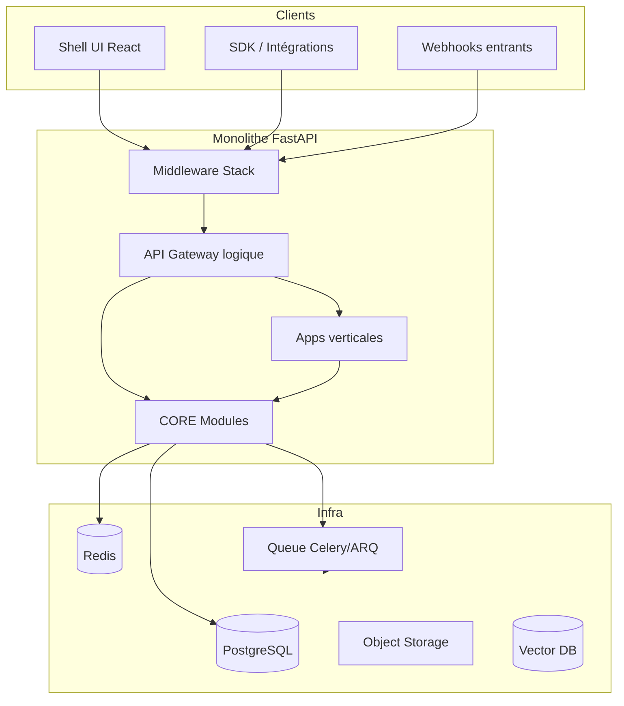
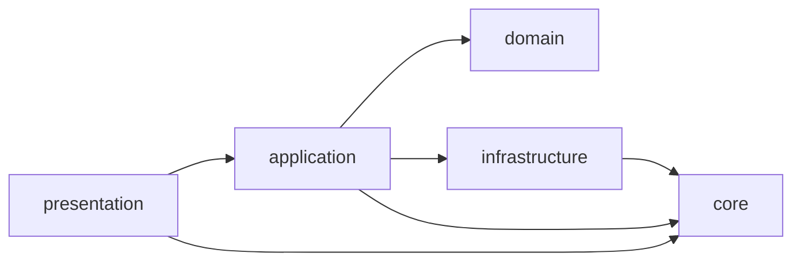
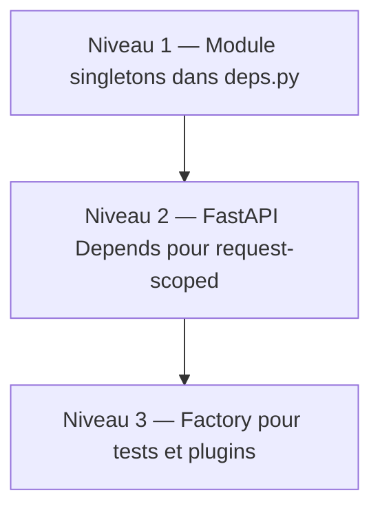
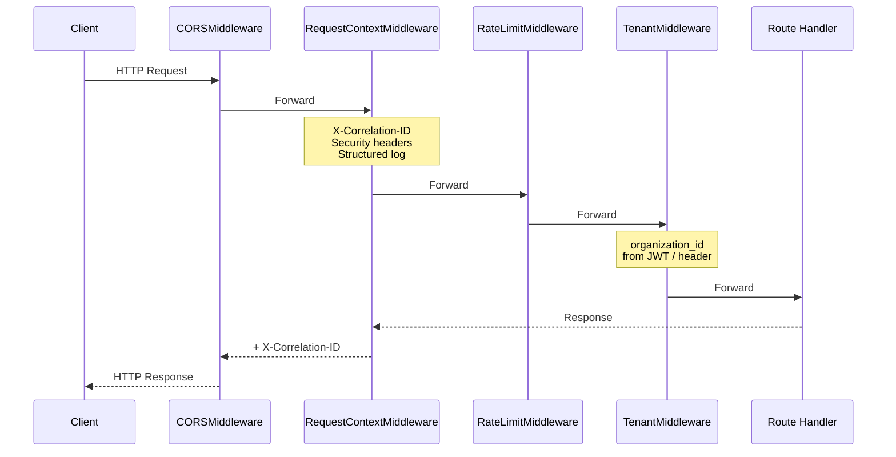
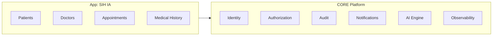
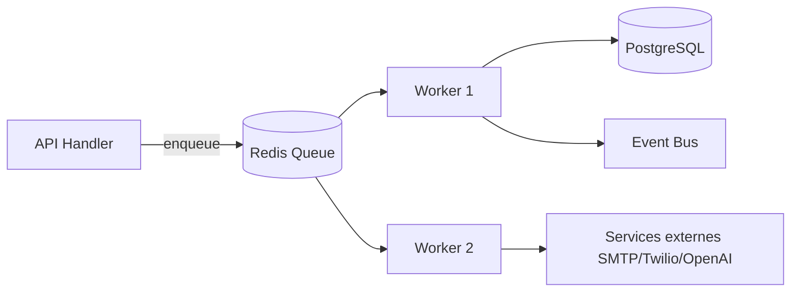

# AI BOS — Backend FastAPI (Monolithe Modulaire)

> **Version:** 0.1.0 | **Statut:** `REVIEW` | **Audience:** Backend Engineers, SRE, Security  
> **Dernière mise à jour:** Juillet 2026  
> **Référence héritage:** [SIH IA Backend](../sihia-platform/Document/README_ETAT_IMPLEMENTATION.md)

---

## Table des matières

1. [Vue d'ensemble](#1-vue-densemble)
2. [Principes architecturaux](#2-principes-architecturaux)
3. [Structure des packages](#3-structure-des-packages)
4. [Injection de dépendances](#4-injection-de-dépendances)
5. [Stack middleware](#5-stack-middleware)
6. [Frontières de services](#6-frontières-de-services)
7. [Jobs asynchrones et files](#7-jobs-asynchrones-et-files)
8. [Versionnement API](#8-versionnement-api)
9. [Gestion des erreurs](#9-gestion-des-erreurs)
10. [Pyramide de tests](#10-pyramide-de-tests)
11. [Configuration et secrets](#11-configuration-et-secrets)
12. [Observabilité](#12-observabilité)
13. [ADRs](#13-adrs)
14. [Checklist de livraison](#14-checklist-de-livraison)

---

## 1. Vue d'ensemble

Le backend AI BOS est un **monolithe modulaire FastAPI** organisé selon la Clean Architecture. Il héberge le **CORE platform** (modules transverses) et les **applications verticales** (SIH IA en première app) dans un même dépôt et un même processus de déploiement initial.



### Positionnement stratégique

| Approche | Choix AI BOS | Justification |
|----------|--------------|---------------|
| Monolithe vs microservices | Monolithe modulaire | Time-to-market, cohérence transactionnelle, ops simplifiées |
| Sync vs async | Hybride | API REST sync ; side-effects via Event Bus + workers |
| ORM | SQLAlchemy 2.x | Maturité, migrations Alembic, portabilité SQLite→Postgres |
| Validation | Pydantic v2 | Contrats API stricts, OpenAPI auto-généré |
| Auth | JWT + refresh rotatif | Réutilisation directe SIH IA, stateless horizontal scaling |

---

## 2. Principes architecturaux

### 2.1 Clean Architecture — couches

Chaque module (CORE ou app) respecte la séparation en cinq couches :



| Couche | Responsabilité | Dépendances autorisées |
|--------|----------------|------------------------|
| `presentation` | Routes HTTP, WebSocket, SSE, schémas request/response | `application`, `core` |
| `application` | Use cases, orchestration, transactions | `domain`, `core` (interfaces) |
| `domain` | Entités, value objects, règles métier pures | Aucune (Python stdlib uniquement) |
| `infrastructure` | Repositories, adaptateurs externes, ORM | `domain`, `core` |
| `core` | Config, sécurité, logging, métriques, utilitaires transverses | Aucune couche métier |

### 2.2 Règles de dépendance (non négociables)

1. **Le domaine ne connaît pas FastAPI, SQLAlchemy, Redis, ni OpenAI.**
2. **Les use cases dépendent d'interfaces (ports), pas d'implémentations.**
3. **Les routes ne contiennent pas de logique métier** — délégation immédiate aux services.
4. **Le CORE ne dépend jamais des apps verticales** (voir [README_06_ModularArchitecture](README_06_ModularArchitecture.md)).
5. **Les apps verticales consomment le CORE via contrats publics** (`core.identity`, `core.audit`, etc.).

### 2.3 ADR-001 : Monolithe modulaire avant microservices

| Champ | Valeur |
|-------|--------|
| **Statut** | `APPROVED` |
| **Contexte** | Plateforme pré-GA, équipe réduite, besoin de vélocité |
| **Décision** | Un processus FastAPI unique avec modules isolés par packages |
| **Conséquences** | Extraction microservice possible par module si SLO non atteint (ex. AI Engine GPU) |

---

## 3. Structure des packages

### 3.1 Arborescence cible du mono-repo backend

```
backend/
├── app/
│   ├── main.py                    # Bootstrap FastAPI, middleware, exception handlers
│   ├── core/                      # Transverse bas niveau (config, security, logging)
│   │   ├── config.py
│   │   ├── security.py
│   │   ├── logging_config.py
│   │   ├── metrics.py
│   │   └── errors.py              # Codes erreur normalisés
│   │
│   ├── platform/                  # CORE modules (voir README_05_Core.md)
│   │   ├── identity/
│   │   │   ├── domain/
│   │   │   ├── application/
│   │   │   ├── infrastructure/
│   │   │   └── presentation/
│   │   ├── authorization/       # RBAC + ABAC
│   │   ├── audit/
│   │   ├── notifications/
│   │   ├── ai/                    # conversation, rag, embeddings, agents
│   │   ├── observability/
│   │   └── ...
│   │
│   ├── apps/                      # Applications verticales
│   │   ├── sihia/                 # SIH IA — santé
│   │   │   ├── domain/
│   │   │   ├── application/
│   │   │   ├── infrastructure/
│   │   │   └── presentation/
│   │   ├── eduai/                 # Futur
│   │   └── registry.py            # App registry & feature flags par app
│   │
│   ├── workers/                   # Celery/ARQ task definitions
│   │   ├── celery_app.py
│   │   └── tasks/
│   │
│   └── presentation/              # Agrégation routers globaux
│       ├── deps.py                # DI container module-level
│       ├── middleware/
│       └── api_v1.py
│
├── alembic/
│   └── versions/
├── tests/
│   ├── unit/
│   ├── integration/
│   └── e2e/
├── requirements.txt
├── requirements-workers.txt
└── Dockerfile
```

### 3.2 Mapping depuis SIH IA (état juillet 2026)

| Package SIH IA actuel | Package AI BOS cible | Action |
|-----------------------|----------------------|--------|
| `app/core/` | `app/core/` + `app/platform/observability/` | Extraction + enrichissement |
| `app/application/use_cases.py` (Auth) | `app/platform/identity/application/` | Refactor + multi-tenant |
| `app/application/rbac_service.py` | `app/platform/authorization/application/` | Généralisation |
| `app/infrastructure/audit_log.py` | `app/platform/audit/infrastructure/` | Persistance Postgres |
| `app/application/chatbot_*` | `app/platform/ai/conversation/` | Extraction CORE |
| `app/application/*_service.py` (patients, RDV) | `app/apps/sihia/application/` | Reste app verticale |
| `app/presentation/routes.py` | `app/apps/sihia/presentation/` + `api_v1.py` | Découpage par domaine |

### 3.3 Conventions de nommage

| Élément | Convention | Exemple |
|---------|------------|---------|
| Module CORE | `platform.<module>` | `platform.identity` |
| App verticale | `apps.<slug>` | `apps.sihia` |
| Route prefix | `/api/v1/<scope>` | `/api/v1/sihia/patients` |
| Service class | `<Entity>Service` | `PatientService` |
| Repository port | `<Entity>Repository` (Protocol) | `PatientRepository` |
| Repository impl | `Postgres<Entity>Repository` | `PostgresPatientRepository` |
| Schéma Pydantic | `<Action><Entity>Request/Response` | `CreatePatientRequest` |

---

## 4. Injection de dépendances

### 4.1 Stratégie en trois niveaux

AI BOS adopte une DI pragmatique FastAPI, sans framework IoC lourd :



**Niveau 1 — Composition root (`presentation/deps.py`)**

Les singletons de services sont instanciés au chargement du module, comme dans SIH IA :

```python
# Pattern hérité SIH IA — à généraliser AI BOS
users_repo = PostgresUserRepository()
auth_service = AuthService(users_repo, refresh_sessions_repo)
```

**Niveau 2 — `Depends()` pour le scope requête**

```python
async def get_current_user(
    credentials: HTTPAuthorizationCredentials = Depends(bearer_scheme),
    auth: AuthService = Depends(get_auth_service),
) -> User:
    return auth.verify_access_token(credentials.credentials)
```

**Niveau 3 — Override en tests**

```python
app.dependency_overrides[get_auth_service] = lambda: FakeAuthService()
```

### 4.2 ADR-002 : DI module-level vs conteneur DI

| Champ | Valeur |
|-------|--------|
| **Statut** | `APPROVED` |
| **Décision** | Pas de `dependency-injector` ni `wired` — FastAPI `Depends` + composition root explicite |
| **Raison** | Lisibilité, alignement SIH IA, courbe d'apprentissage minimale |
| **Exception** | Plugins marketplace : factory registry dynamique |

### 4.3 Contrats entre modules

Les modules CORE exposent des **factories** et des **protocols** :

```python
# platform/identity/__init__.py — API publique du module
from .application.auth_service import AuthService
from .presentation.deps import get_auth_service, require_user

__all__ = ["AuthService", "get_auth_service", "require_user"]
```

Les apps verticales importent uniquement depuis `__init__.py` public — jamais depuis `infrastructure/` interne.

---

## 5. Stack middleware

L'ordre d'exécution middleware est **critique**. AI BOS réutilise et étend la stack validée sur SIH IA.

### 5.1 Ordre d'empilement (outer → inner)



| # | Middleware | Source SIH IA | Responsabilité |
|---|------------|---------------|----------------|
| 1 | `CORSMiddleware` | ✅ `main.py` | Origines whitelist prod ; regex dev |
| 2 | `RequestContextMiddleware` | ✅ `main.py` | Correlation ID, timing, logs JSON, security headers |
| 3 | `RateLimitMiddleware` | 🟡 Partiel (`rate_limit.py`, chatbot) | Limitation globale + par route sensible |
| 4 | `TenantMiddleware` | ❌ Nouveau | Injection `organization_id` dans `request.state` |
| 5 | `AuditMiddleware` | 🟡 Partiel (`audit.py`) | Log mutations sensibles (POST/PATCH/DELETE) |

### 5.2 Correlation ID (réutilisation SIH IA)

Comportement hérité et normatif pour toute la plateforme :

| Aspect | Spécification |
|--------|---------------|
| Header entrant | `X-Correlation-ID` (optionnel, UUID v4 si absent) |
| Header sortant | Toujours renvoyé |
| Propagation | Logs JSON, audit, workers, appels LLM |
| Stockage | `request.state.correlation_id` |

```python
# Pattern SIH IA — référence normative AI BOS
correlation_id = request.headers.get("X-Correlation-ID") or str(uuid.uuid4())
request.state.correlation_id = correlation_id
# ... après handler ...
response.headers["X-Correlation-ID"] = correlation_id
```

### 5.3 En-têtes de sécurité HTTP

| Header | Valeur | Environnement |
|--------|--------|---------------|
| `X-Content-Type-Options` | `nosniff` | Tous |
| `X-Frame-Options` | `DENY` | Tous |
| `Referrer-Policy` | `strict-origin-when-cross-origin` | Tous |
| `Permissions-Policy` | `camera=(), microphone=(), geolocation=()` | Tous |
| `Strict-Transport-Security` | `max-age=31536000; includeSubDomains` | Production uniquement |

### 5.4 CORS

| Mode | Configuration |
|------|---------------|
| **Production** | Liste explicite `CORS_ORIGINS` (pas de wildcard avec credentials) |
| **Développement** | Regex `https?://[\w.\-]+(:\d+)?$` pour localhost multi-ports |
| **Credentials** | `allow_credentials=True` (cookies refresh futurs) |

### 5.5 Logs structurés JSON

Réutilisation de `logging_config.py` SIH IA :

```json
{
  "timestamp": "2026-07-06T08:30:00.123Z",
  "level": "INFO",
  "logger": "aibos.http",
  "event": "http_request",
  "method": "GET",
  "path": "/api/v1/sihia/patients",
  "statusCode": 200,
  "durationMs": 42.3,
  "correlationId": "a1b2c3d4-e5f6-7890-abcd-ef1234567890",
  "organizationId": "org_abc123"
}
```

| Logger dédié | Usage |
|--------------|-------|
| `aibos` | Requêtes HTTP générales |
| `aibos.security` | 401, 403, rate limit, login failures |
| `aibos.audit` | Actions admin et mutations sensibles |
| `aibos.ai` | Appels LLM, tokens, latence modèle |

---

## 6. Frontières de services

### 6.1 Délimitation CORE vs Apps



| Type | Exemples | Règle d'appel |
|------|----------|---------------|
| **CORE → CORE** | Identity → Audit | Via interfaces application, jamais import infrastructure croisé |
| **App → CORE** | Patients → Identity | API publique module uniquement |
| **App → App** | ❌ Interdit direct | Via Event Bus ou API CORE orchestrateur |
| **CORE → App** | ❌ Interdit | Inversion de dépendance via hooks/plugins |

### 6.2 Contrats de service (Service Boundaries)

Chaque service applicatif expose :

1. **Commandes** — mutations avec effet de bord
2. **Queries** — lectures sans effet de bord (CQRS léger)
3. **Events** — notifications asynchrones post-commit

| Service CORE | Commandes | Queries | Events émis |
|--------------|-----------|---------|-------------|
| Identity | `register`, `login`, `logout`, `refresh` | `get_user`, `list_sessions` | `user.created`, `user.suspended` |
| Authorization | `assign_role`, `grant_permission` | `check_permission`, `list_roles` | `permission.changed` |
| Notifications | `send_email`, `send_sms`, `send_push` | `get_delivery_status` | `notification.sent`, `notification.failed` |
| Audit | `record_event` | `query_logs`, `export` | — (sink terminal) |

### 6.3 Transactions et cohérence

| Pattern | Usage |
|---------|-------|
| **Transaction locale** | Un use case = une transaction DB (unit of work) |
| **Outbox pattern** | Events publiés via table outbox + worker (phase 2) |
| **Saga choreography** | Workflows multi-module via Event Bus |
| **Idempotency-Key** | Header sur POST sensibles (billing, webhooks) |

---

## 7. Jobs asynchrones et files

### 7.1 Choix technologique

| Outil | Rôle | Phase |
|-------|------|-------|
| **ARQ** | Jobs légers, async natif, Redis | Phase 1 — rappels, embeddings, exports |
| **Celery** | Jobs lourds, scheduling, retry avancé | Phase 2 — ML training, OCR batch, pipelines |
| **APScheduler** | Cron in-process (dev/small deploy) | Dev uniquement |

### 7.2 ADR-003 : ARQ en phase 1, Celery en phase 2

| Champ | Valeur |
|-------|--------|
| **Statut** | `APPROVED` |
| **Contexte** | SIH IA utilise des jobs synchrones + admin trigger ; besoin async pour scale |
| **Décision** | ARQ pour latence faible ; Celery quand parallélisme > 10 workers ou tâches > 5 min |
| **Broker** | Redis partagé (cache + queue + rate limit) |

### 7.3 Catalogue de jobs planifiés

| Job | Module | Déclencheur | Réutilisation SIH IA |
|-----|--------|-------------|----------------------|
| `reminders.dispatch` | Notifications | Cron J-1 / 24h | ✅ `reminder_service.py` |
| `pipeline.run_dag` | Data Pipeline | Admin / Cron | ✅ `pipeline_service.py` |
| `embeddings.index_document` | AI/RAG | Event `document.uploaded` | 🟡 Partiel chatbot knowledge |
| `ml.retrain_forecast` | ML | Cron hebdomadaire | ✅ `ml_service.py` |
| `audit.compact_logs` | Audit | Cron quotidien | ❌ Nouveau |
| `billing.aggregate_usage` | Billing | Cron horaire | ❌ Nouveau |
| `webhooks.deliver` | Webhooks | Event-driven | ❌ Nouveau |

### 7.4 Patterns de file d'attente



| Pattern | Description | Exemple |
|---------|-------------|---------|
| **Fire-and-forget** | Pas de résultat attendu par l'appelant | Envoi email rappel RDV |
| **Job avec statut** | Table `background_jobs` + polling API | Export PDF analytics |
| **Delayed job** | `enqueue_in(timedelta)` | Retry webhook exponentiel |
| **Priority queue** | Queues séparées `high`, `default`, `low` | Notifications urgentes vs indexation RAG |
| **Dead letter** | Queue `failed` + alerte ops | Webhook delivery 5 échecs |

### 7.5 Contrat worker standard

```python
@arq_cron(hour=6, minute=0)
async def dispatch_appointment_reminders(ctx: dict) -> None:
    correlation_id = ctx.get("correlation_id", str(uuid.uuid4()))
    org_ids = await list_active_organizations()
    for org_id in org_ids:
        await reminder_service.run_batch(org_id, correlation_id=correlation_id)
```

Chaque job **doit** :
- Accepter et propager `correlation_id`
- Scoper par `organization_id`
- Logger début/fin/erreur en JSON structuré
- Être idempotent (safe retry)

---

## 8. Versionnement API

### 8.1 Stratégie URL-based

```
/api/v1/...    # Version courante stable
/api/v2/...    # Breaking changes (coexistence 12 mois min)
```

| Scope | Prefix exemple | Propriétaire |
|-------|----------------|--------------|
| CORE Identity | `/api/v1/auth/*` | platform.identity |
| CORE RBAC | `/api/v1/rbac/*` | platform.authorization |
| CORE AI | `/api/v1/ai/*` | platform.ai |
| App SIH IA | `/api/v1/sihia/*` | apps.sihia |
| Admin plateforme | `/api/v1/admin/*` | platform (super_admin) |
| Health (non versionné) | `/health`, `/health/details` | core.observability |

### 8.2 Règles de évolution

| Type de changement | Version bump ? | Exemple |
|--------------------|----------------|---------|
| Ajout champ optionnel response | Non | `+ "metadata": {}` |
| Ajout endpoint | Non | `GET /patients/{id}/timeline` |
| Renommage champ | **Oui v2** | `patientId` → `patient_id` |
| Changement sémantique | **Oui v2** | Statut RDV enum modifié |
| Suppression endpoint | **Oui v2** + deprecation header | — |

### 8.3 Headers de deprecation

```
Deprecation: true
Sunset: Sat, 01 Jan 2028 00:00:00 GMT
Link: </api/v2/sihia/patients>; rel="successor-version"
```

### 8.4 OpenAPI

- Un schéma OpenAPI par version : `/api/v1/openapi.json`
- Tags par module : `identity`, `sihia-patients`, `ai-conversation`
- Génération SDK automatique (voir module SDK)

---

## 9. Gestion des erreurs

### 9.1 Format normalisé (héritage SIH IA)

**Toutes** les réponses d'erreur API suivent le contrat validé sur SIH IA et consommé par le frontend via `parseApiError` :

```json
{
  "code": "FORBIDDEN",
  "message": "Permission requise : sihia.patients.write",
  "details": null
}
```

```json
{
  "code": "VALIDATION_ERROR",
  "message": "Payload invalide",
  "details": [
    {"loc": ["body", "email"], "msg": "value is not a valid email address", "type": "value_error.email"}
  ]
}
```

### 9.2 Catalogue des codes erreur

| Code HTTP | Code métier | Usage |
|-----------|-------------|-------|
| 400 | `BAD_REQUEST` | Paramètres invalides |
| 401 | `UNAUTHORIZED` | Token absent/expiré |
| 403 | `FORBIDDEN` | Permission insuffisante |
| 404 | `NOT_FOUND` | Ressource inexistante |
| 409 | `CONFLICT` | Conflit RDV, email dupliqué |
| 422 | `VALIDATION_ERROR` | Pydantic validation |
| 429 | `RATE_LIMITED` | Trop de requêtes |
| 500 | `INTERNAL_SERVER_ERROR` | Erreur non gérée (pas de stack trace exposée) |
| 503 | `SERVICE_UNAVAILABLE` | Dépendance down (DB, LLM) |

### 9.3 Codes métier AI BOS (extensions)

| Code | Module | Description |
|------|--------|-------------|
| `TENANT_NOT_FOUND` | Multi-Tenant | `organization_id` invalide |
| `TENANT_SUSPENDED` | Multi-Tenant | Compte organisation suspendu |
| `QUOTA_EXCEEDED` | Billing | Limite plan dépassée |
| `AI_GUARDRAIL_BLOCKED` | AI Engine | Contenu bloqué par guardrails |
| `AI_MODEL_UNAVAILABLE` | AI Engine | Provider LLM indisponible |
| `DOCUMENT_TOO_LARGE` | Documents | Taille fichier > quota |
| `WEBHOOK_SIGNATURE_INVALID` | Webhooks | HMAC invalide |

### 9.4 Implémentation — exception handlers

Pattern hérité de `main.py` SIH IA — à centraliser dans `core/errors.py` :

```python
# Lever une erreur métier depuis un use case
raise HTTPException(
    status_code=status.HTTP_403_FORBIDDEN,
    detail={
        "code": "FORBIDDEN",
        "message": f"Permission requise : {permission}",
        "details": None,
    },
)
```

Handlers globaux enregistrés dans `main.py` :
1. `HTTPException` → format normalisé
2. `RequestValidationError` → `VALIDATION_ERROR` + `details`
3. `Exception` → `INTERNAL_SERVER_ERROR` (log stack côté serveur uniquement)

### 9.5 Erreurs domaine vs HTTP

| Couche | Type exception | Conversion |
|--------|----------------|------------|
| Domain | `DomainError`, `EntityNotFound` | → HTTPException dans presentation |
| Application | `PermissionDenied`, `QuotaExceeded` | → HTTPException avec code métier |
| Infrastructure | `DatabaseError`, `ExternalAPIError` | → 503 ou 500 selon retry |

---

## 10. Pyramide de tests

### 10.1 Répartition cible

```mermaid
pyramid
    title Pyramide de tests AI BOS Backend
    "E2E API (5%)" : 5
    "Integration (25%)" : 25
    "Unit (70%)" : 70
```

| Niveau | Outil | Scope | CI |
|--------|-------|-------|-----|
| **Unit** | `pytest` | Domain, application (mocks ports) | Chaque PR |
| **Integration** | `pytest` + Testcontainers Postgres/Redis | Repositories, middleware, handlers | Chaque PR |
| **Contract** | `schemathesis` / OpenAPI diff | Non-régression API | Nightly |
| **E2E API** | `pytest` + `httpx.AsyncClient` | Flux complets auth → CRUD | Nightly |
| **Load** | `locust` | SLO validation | Pre-release |

### 10.2 État SIH IA (baseline)

| Suite | Résultat | Réutilisable AI BOS |
|-------|----------|---------------------|
| `pytest tests/` | 68/68 ✅ | Patterns + fixtures à migrer |
| Tests auth/RBAC | ✅ | Direct |
| Tests chatbot/guardrails | ✅ | → `platform.ai` |
| Tests rate limit | ✅ | → `platform.rate_limiting` |

### 10.3 Conventions de test

```
tests/
├── unit/
│   ├── platform/
│   │   ├── identity/test_auth_service.py
│   │   └── authorization/test_rbac.py
│   └── apps/
│       └── sihia/test_appointment_conflicts.py
├── integration/
│   ├── test_middleware_stack.py
│   ├── test_error_format.py
│   └── test_tenant_isolation.py
├── e2e/
│   └── test_patient_journey.py
├── conftest.py          # Fixtures DB, client, fake repos
└── factories.py         # Factory Boy / custom builders
```

### 10.4 Tests obligatoires par endpoint

| Cas | Assertion |
|-----|-----------|
| Happy path | 200/201 + schema response |
| Sans auth | 401 `UNAUTHORIZED` |
| Mauvais rôle | 403 `FORBIDDEN` |
| Validation | 422 `VALIDATION_ERROR` + details |
| Tenant isolation | Données org A invisibles pour org B |
| Idempotency | Double POST même clé → même résultat |

### 10.5 Test du format erreur (contrat frontend)

Réutiliser le pattern `http-errors.test.ts` SIH IA côté backend :

```python
def test_forbidden_error_format(client, user_token_staff):
    response = client.get("/api/v1/rbac/users", headers=auth(user_token_staff))
    assert response.status_code == 403
    body = response.json()
    assert body["code"] == "FORBIDDEN"
    assert "message" in body
    assert "details" in body
```

---

## 11. Configuration et secrets

### 11.1 Hiérarchie de configuration

| Source | Priorité | Exemple |
|--------|----------|---------|
| Variables d'environnement | 1 (plus haute) | `DATABASE_URL` |
| Fichier `.env` (dev only) | 2 | `JWT_SECRET` |
| `Settings` Pydantic defaults | 3 | `access_token_exp_minutes=60` |
| Settings organisation (DB) | 4 | Feature flags par tenant |

### 11.2 Settings transverses (héritage SIH IA étendu)

| Variable | Module | Default dev |
|----------|--------|-------------|
| `DATABASE_URL` | Infra | `sqlite:///app.db` |
| `REDIS_URL` | Cache/Queue | `redis://localhost:6379/0` |
| `JWT_SECRET` | Identity | ⚠️ Override obligatoire prod |
| `CORS_ORIGINS` | Presentation | `localhost:5173,...` |
| `ENVIRONMENT` | Core | `development` |
| `OPENAI_API_KEY` | AI Engine | — |
| `LOG_LEVEL` | Observability | `INFO` |
| `SENTRY_DSN` | Observability | — |

### 11.3 Secrets

- **Jamais** en code source ni dans les images Docker
- Injection via AWS Secrets Manager / Vault en production
- Rotation `JWT_SECRET` avec support multi-clés (kid header)

---

## 12. Observabilité

### 12.1 Endpoints santé

| Endpoint | Auth | Contenu |
|----------|------|---------|
| `GET /health` | Non | `{"status": "ok"}` — liveness K8s |
| `GET /health/details` | Admin | DB, Redis, queue, pipeline, métriques |
| `GET /metrics` | Interne | Prometheus format (phase 2) |

### 12.2 Métriques (héritage `metrics.py` SIH IA)

| Compteur | Incrémenté quand |
|----------|------------------|
| `http_requests` | Chaque requête HTTP |
| `http_errors_5xx` | Response ≥ 500 |
| `auth_unauthorized` | 401 |
| `auth_forbidden` | 403 |
| `ai_tokens_used` | Post-appel LLM |
| `queue_jobs_failed` | Job en dead letter |

---

## 13. ADRs

| ID | Titre | Statut |
|----|-------|--------|
| ADR-001 | Monolithe modulaire avant microservices | `APPROVED` |
| ADR-002 | DI module-level vs conteneur IoC | `APPROVED` |
| ADR-003 | ARQ phase 1, Celery phase 2 | `APPROVED` |
| ADR-004 | Format erreur `{code, message, details}` hérité SIH IA | `APPROVED` |
| ADR-005 | URL-based API versioning `/api/vN` | `APPROVED` |
| ADR-006 | PostgreSQL obligatoire prod (SQLite dev only) | `APPROVED` |
| ADR-007 | Logs JSON stdout (12-factor) | `APPROVED` |

---

## 14. Checklist de livraison

### Par module backend

- [ ] Couches domain/application/infrastructure/presentation respectées
- [ ] Tests unitaires ≥ 80 % sur application + domain
- [ ] Tests integration sur repositories Postgres
- [ ] OpenAPI taggé et documenté
- [ ] Permissions RBAC sur chaque endpoint mutation
- [ ] Audit log sur actions sensibles
- [ ] `organization_id` scoping sur toutes les queries
- [ ] Erreurs au format normalisé
- [ ] Correlation ID propagé

### Par release plateforme

- [ ] Migrations Alembic forward-only testées
- [ ] `/health/details` vert sur staging
- [ ] Scan dépendances (`pip-audit`, `bandit`)
- [ ] Load test SLO : p95 < 200ms endpoints CRUD
- [ ] Runbook incidents mis à jour

---

## Références

- [README_05_Core.md](README_05_Core.md) — Spécification modules CORE
- [README_06_ModularArchitecture.md](README_06_ModularArchitecture.md) — Boundaries et DDD
- [SIH IA — État implémentation](../sihia-platform/Document/README_ETAT_IMPLEMENTATION.md)
- [SIH IA — Tests QA](../sihia-platform/Document/README_11_Tests_QA.md)

---

*Document maintenu par AI BOS Platform Team — révision trimestrielle ou à chaque ADR majeur.*
