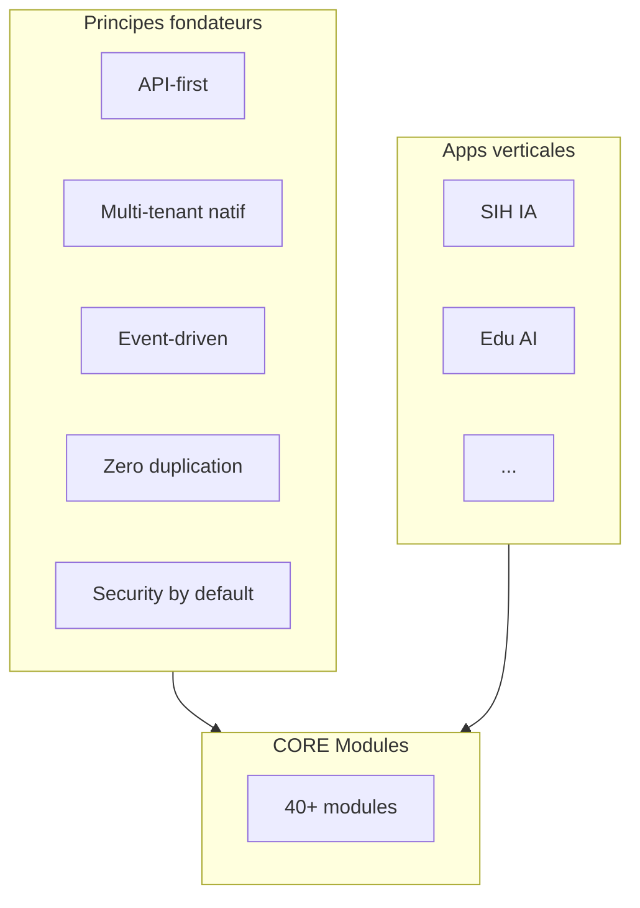
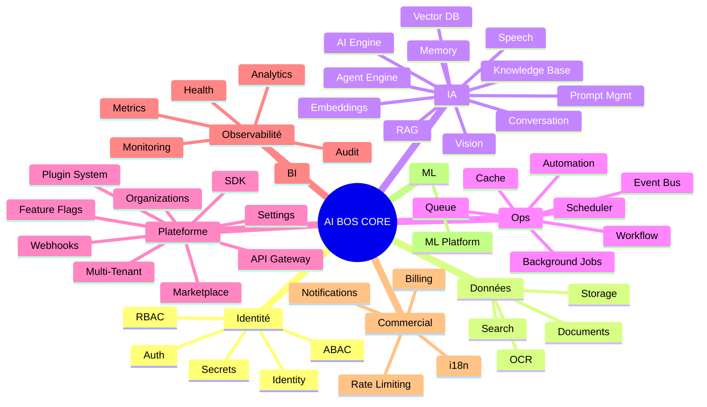
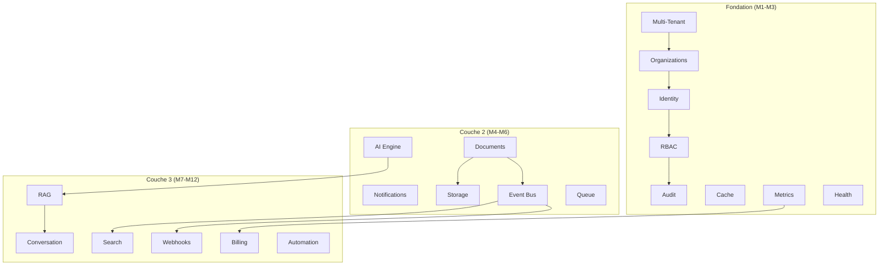

# AI BOS — Spécification CORE Platform

> **Version:** 0.1.0 | **Statut:** `REVIEW` | **Audience:** Architecture Board, Tech Leads, Product  
> **Dernière mise à jour:** Juillet 2026  
> **Document prioritaire** — référence normative pour toute implémentation plateforme

---

## Table des matières

1. [Introduction](#1-introduction)
2. [Principes du CORE](#2-principes-du-core)
3. [Cartographie globale](#3-cartographie-globale)
4. [Modules Identité & Sécurité](#4-modules-identité--sécurité)
5. [Modules Données & Contenu](#5-modules-données--contenu)
6. [Modules IA & Cognitifs](#6-modules-ia--cognitifs)
7. [Modules Orchestration & Automatisation](#7-modules-orchestration--automatisation)
8. [Modules Plateforme & Opérations](#8-modules-plateforme--opérations)
9. [Modules Commercial & Écosystème](#9-modules-commercial--écosystème)
10. [Matrice de dépendances](#10-matrice-de-dépendances)
11. [Roadmap de maturité](#11-roadmap-de-maturité)
12. [ADRs](#12-adrs)

---

## 1. Introduction

Le **CORE** d'AI BOS est l'ensemble des modules transverses partagés par toutes les applications verticales (SIH IA, Edu AI, Legal AI, etc.). Il constitue le « système d'exploitation » sur lequel les apps métier s'appuient sans dupliquer l'infrastructure.

### 1.1 Périmètre

| Inclus dans CORE | Exclu du CORE (apps verticales) |
|------------------|--------------------------------|
| Auth, RBAC, audit, notifications | Patients, RDV, notes scolaires |
| AI Engine, RAG, agents | Workflows métier santé |
| Billing, multi-tenant, orgs | Règles cliniques spécifiques |
| Documents, storage, search | UI métier spécialisée |

### 1.2 Légende maturité

| Niveau | Signification |
|--------|---------------|
| `GA` | Production-ready, SLA, documentation complète |
| `BETA` | Fonctionnel, API stable, tests > 70 % |
| `ALPHA` | Implémenté partiellement, API sujette à changement |
| `DESIGN` | Spécifié, non implémenté |
| `CONCEPT` | Vision, exploration |

### 1.3 Légende réutilisation SIH IA

| Symbole | Signification |
|---------|---------------|
| ✅ | Existe et extractible tel quel ou avec refactor mineur |
| 🟡 | Partiel — fondation présente, extension requise |
| ❌ | Nouveau — aucun équivalent SIH IA |

---

## 2. Principes du CORE

1. **Chaque module CORE est autonome** — package Python isolé avec API publique (`__init__.py`).
2. **Pas de couplage app → app** — communication via CORE ou Event Bus.
3. **Tout module scopé par `organization_id`** — sauf endpoints super-admin plateforme.
4. **Tout module émet des events** — pour audit, analytics, webhooks.
5. **Tout module expose REST** — GraphQL en couche agrégation (phase 3).

---

## 3. Cartographie globale

### 3.1 Index rapide des modules

| # | Module | Domaine | Maturité cible M12 | SIH IA |
|---|--------|---------|-------------------|--------|
| 1 | Identity | Sécurité | BETA | ✅ |
| 2 | Auth | Sécurité | BETA | ✅ |
| 3 | RBAC | Sécurité | BETA | ✅ |
| 4 | ABAC | Sécurité | ALPHA | ❌ |
| 5 | Audit | Sécurité | BETA | ✅ |
| 6 | Secrets | Sécurité | ALPHA | 🟡 |
| 7 | Rate Limiting | Sécurité | BETA | 🟡 |
| 8 | Documents | Données | ALPHA | ❌ |
| 9 | Storage | Données | ALPHA | 🟡 |
| 10 | Search | Données | DESIGN | ❌ |
| 11 | OCR | Données | DESIGN | ❌ |
| 12 | AI Engine | IA | BETA | 🟡 |
| 13 | Agent Engine | IA | ALPHA | ❌ |
| 14 | RAG | IA | BETA | 🟡 |
| 15 | Embeddings | IA | ALPHA | 🟡 |
| 16 | Vector DB | IA | ALPHA | 🟡 |
| 17 | Knowledge Base | IA | BETA | 🟡 |
| 18 | Memory | IA | ALPHA | 🟡 |
| 19 | Conversation | IA | BETA | ✅ |
| 20 | Prompt Management | IA | ALPHA | 🟡 |
| 21 | Speech | IA | BETA | ✅ |
| 22 | Vision | IA | DESIGN | ❌ |
| 23 | Workflow Engine | Ops | DESIGN | ❌ |
| 24 | Automation Engine | Ops | DESIGN | ❌ |
| 25 | Scheduler | Ops | ALPHA | 🟡 |
| 26 | Background Jobs | Ops | ALPHA | 🟡 |
| 27 | Queue | Ops | ALPHA | ❌ |
| 28 | Cache | Ops | ALPHA | ❌ |
| 29 | Event Bus | Ops | ALPHA | ❌ |
| 30 | Multi-Tenant | Plateforme | ALPHA | ❌ |
| 31 | Organizations | Plateforme | ALPHA | ❌ |
| 32 | Settings | Plateforme | BETA | 🟡 |
| 33 | Feature Flags | Plateforme | DESIGN | ❌ |
| 34 | API Gateway | Plateforme | BETA | 🟡 |
| 35 | Webhooks | Plateforme | ALPHA | ❌ |
| 36 | SDK | Plateforme | DESIGN | ❌ |
| 37 | Plugin System | Plateforme | DESIGN | ❌ |
| 38 | Marketplace | Plateforme | CONCEPT | ❌ |
| 39 | Monitoring | Observabilité | ALPHA | 🟡 |
| 40 | Metrics | Observabilité | BETA | ✅ |
| 41 | Health | Observabilité | BETA | ✅ |
| 42 | Analytics | Observabilité | BETA | ✅ |
| 43 | BI | Observabilité | DESIGN | ❌ |
| 44 | ML | ML | BETA | ✅ |
| 45 | Billing | Commercial | DESIGN | ❌ |
| 46 | Notifications | Commercial | BETA | ✅ |
| 47 | i18n | Commercial | BETA | ✅ |

---

## 4. Modules Identité & Sécurité

### 4.1 Identity

| Attribut | Valeur |
|----------|--------|
| **Package** | `platform.identity` |
| **Maturité** | `BETA` (SIH IA) → `GA` (multi-tenant) |
| **SIH IA** | ✅ `use_cases.AuthService`, `SQLiteUserRepository` |

**Purpose** — Gestion du cycle de vie des utilisateurs plateforme : création, profil, statut, sessions.

**Responsabilités**
- CRUD utilisateurs avec statut `active` / `suspended`
- Gestion sessions refresh (rotation, révocation, `logout-all`)
- Profil utilisateur (nom, email, préférences)
- Liaison utilisateur ↔ organisation(s)

**APIs principales**

| Méthode | Endpoint | Description |
|---------|----------|-------------|
| POST | `/api/v1/auth/login` | Authentification |
| POST | `/api/v1/auth/refresh` | Renouvellement token |
| POST | `/api/v1/auth/logout` | Révocation session courante |
| POST | `/api/v1/auth/logout-all` | Révocation toutes sessions |
| GET | `/api/v1/users/me` | Profil courant |
| PATCH | `/api/v1/users/me` | Mise à jour profil |

**Dépendances** — Storage (DB), Secrets (hash passwords), Audit, Notifications (welcome email)

**SIH IA mapping** — Extraire `AuthService`, `User` domain model, refresh sessions. Ajouter `organization_id` sur `users`.

---

### 4.2 Auth

| Attribut | Valeur |
|----------|--------|
| **Package** | `platform.identity.auth` |
| **Maturité** | `BETA` |
| **SIH IA** | ✅ `core/security.py`, JWT HS256 |

**Purpose** — Mécanismes d'authentification : JWT, refresh, API keys, futures intégrations SSO.

**Responsabilités**
- Émission/validation access token (courte durée)
- Refresh token rotatif avec détection réutilisation
- Rate limiting login (5 échecs / 5 min / IP+email)
- Support futur : OIDC, SAML, API keys service accounts

**APIs** — Sous-ensemble de Identity + middleware `require_user`, `optional_user`

**Dépendances** — Secrets, Rate Limiting, Audit

**SIH IA mapping** — `decode_access_token`, `create_access_token`, permissions dans JWT payload.

---

### 4.3 RBAC (Role-Based Access Control)

| Attribut | Valeur |
|----------|--------|
| **Package** | `platform.authorization.rbac` |
| **Maturité** | `BETA` |
| **SIH IA** | ✅ `rbac_service.py`, permissions JWT, CRUD users admin |

**Purpose** — Contrôle d'accès basé sur rôles et permissions granulaires.

**Responsabilités**
- Définition rôles système et custom par organisation
- Permissions format `module.action` (ex. `sihia.patients.write`)
- Injection permissions dans JWT à l'auth
- Middleware `require_permission("sihia.patients.read")`
- CRUD utilisateurs admin avec audit

**APIs principales**

| Méthode | Endpoint | Permission |
|---------|----------|------------|
| GET | `/api/v1/rbac/roles` | `rbac.read` |
| GET | `/api/v1/rbac/users` | `rbac.read` |
| POST | `/api/v1/rbac/users` | `rbac.write` |
| PATCH | `/api/v1/rbac/users/{id}` | `rbac.write` |
| DELETE | `/api/v1/rbac/users/{id}` | `rbac.write` |

**Dépendances** — Identity, Audit, Multi-Tenant

**SIH IA mapping** — Rôles `super_admin`, `admin_hopital`, `medecin`, `staff`, `patient` → généraliser en rôles configurables par app.

---

### 4.4 ABAC (Attribute-Based Access Control)

| Attribut | Valeur |
|----------|--------|
| **Package** | `platform.authorization.abac` |
| **Maturité** | `DESIGN` → `ALPHA` M18 |
| **SIH IA** | ❌ |

**Purpose** — Politiques d'accès contextuelles basées sur attributs (ressource, environnement, relation).

**Responsabilités**
- Policy engine (JSON/CEL/Rego)
- Évaluation : « médecin peut lire dossier SI patient assigné »
- Héritage RBAC : ABAC affine, ne remplace pas RBAC de base
- Audit des décisions deny

**APIs principales**

| Méthode | Endpoint | Description |
|---------|----------|-------------|
| POST | `/api/v1/abac/evaluate` | Évaluation policy (interne) |
| GET | `/api/v1/abac/policies` | Liste policies org |
| POST | `/api/v1/abac/policies` | Création policy |

**Dépendances** — RBAC, Audit, Organizations

**SIH IA mapping** — Nouveau. Cas d'usage SIH IA : accès dossier patient limité au médecin traitant.

---

### 4.5 Audit

| Attribut | Valeur |
|----------|--------|
| **Package** | `platform.audit` |
| **Maturité** | `BETA` |
| **SIH IA** | ✅ `audit_log.py`, `presentation/audit.py`, export JSONL |

**Purpose** — Traçabilité immuable de toutes les actions sensibles plateforme.

**Responsabilités**
- Enregistrement events structurés (`actor`, `action`, `resource`, `metadata`)
- Stockage append-only (JSONL dev → Postgres prod)
- Export admin (`GET /api/v1/admin/audit-logs/export`)
- Rétention configurable par organisation
- Corrélation via `correlationId`

**APIs principales**

| Méthode | Endpoint | Description |
|---------|----------|-------------|
| GET | `/api/v1/admin/audit-logs` | Recherche paginée |
| GET | `/api/v1/admin/audit-logs/export` | Export JSONL/CSV |

**Events types** — `rbac.user.create`, `auth.logout_all`, `document.delete`, `ai.query`, `billing.plan.change`

**Dépendances** — Identity, Storage

**SIH IA mapping** — Migrer de fichier JSONL vers table `audit_events` partitionnée par `organization_id`.

---

### 4.6 Secrets

| Attribut | Valeur |
|----------|--------|
| **Package** | `platform.secrets` |
| **Maturité** | `ALPHA` |
| **SIH IA** | 🟡 Variables `.env`, pas de vault |

**Purpose** — Gestion centralisée des secrets : API keys org, credentials intégrations, rotation.

**Responsabilités**
- Stockage chiffré (AES-256 envelope encryption)
- Référence par alias (`openai_key`, `smtp_password`)
- Rotation programmée avec grace period
- Jamais de secret en clair dans logs ou API response

**APIs** — Admin only, jamais de GET valeur ; SET/ROTATE/DELETE par alias

**Dépendances** — Organizations, Audit, KMS externe (AWS Secrets Manager)

---

### 4.7 Rate Limiting

| Attribut | Valeur |
|----------|--------|
| **Package** | `platform.rate_limiting` |
| **Maturité** | `BETA` |
| **SIH IA** | 🟡 `rate_limit.py` (login), `chatbot_rate_limit.py` (20/min) |

**Purpose** — Protection contre abus : brute force, DDoS applicatif, quota API.

**Responsabilités**
- Sliding window Redis par IP, user, org, endpoint
- Headers `X-RateLimit-Remaining`, `Retry-After`
- Policies configurables par plan billing
- Intégration middleware global

**APIs** — Interne (middleware) + admin config policies

**Dépendances** — Cache (Redis), Billing (quotas), Metrics

---

## 5. Modules Données & Contenu

### 5.1 Documents

| Attribut | Valeur |
|----------|--------|
| **Package** | `platform.documents` |
| **Maturité** | `DESIGN` → `ALPHA` M12 |
| **SIH IA** | ❌ (chatbot knowledge = JSON statique) |

**Purpose** — GED enterprise : upload, versioning, métadonnées, permissions, cycle de vie.

**Responsabilités**
- Upload multipart avec validation MIME/taille
- Versioning immuable (v1, v2, ...)
- Métadonnées custom par organisation
- Permissions document-level (RBAC/ABAC)
- Déclenchement OCR et indexation RAG à l'upload

**APIs principales**

| Méthode | Endpoint | Description |
|---------|----------|-------------|
| POST | `/api/v1/documents` | Upload |
| GET | `/api/v1/documents/{id}` | Métadonnées + URL signée |
| GET | `/api/v1/documents/{id}/versions` | Historique versions |
| DELETE | `/api/v1/documents/{id}` | Soft delete |

**Dépendances** — Storage, RBAC, Audit, OCR, RAG, Event Bus

---

### 5.2 Storage

| Attribut | Valeur |
|----------|--------|
| **Package** | `platform.storage` |
| **Maturité** | `ALPHA` |
| **SIH IA** | 🟡 Fichiers locaux `static/`, `data/imports`, logs |

**Purpose** — Abstraction object storage multi-provider (S3, MinIO, local dev).

**Responsabilités**
- Upload/download avec URLs pré-signées
- Buckets par organisation (`org_{id}/`)
- Lifecycle rules (archivage, expiration)
- Chiffrement at-rest

**APIs** — Interne (utilisé par Documents, ML artifacts). Admin : quota usage.

**Dépendances** — Multi-Tenant, Secrets (credentials S3)

---

### 5.3 Search

| Attribut | Valeur |
|----------|--------|
| **Package** | `platform.search` |
| **Maturité** | `DESIGN` |
| **SIH IA** | ❌ (recherche SQL basique patients) |

**Purpose** — Moteur de recherche unifié full-text cross-entités (documents, users, records apps).

**Responsabilités**
- Indexation async via Event Bus
- Recherche full-text + filtres facettes
- Highlighting, suggestions, typo tolerance
- Scope strict par `organization_id`

**APIs** — `GET /api/v1/search?q=...&types=documents,patients`

**Dépendances** — Event Bus, Documents, apps (indexers), Cache

---

### 5.4 OCR

| Attribut | Valeur |
|----------|--------|
| **Package** | `platform.ocr` |
| **Maturité** | `DESIGN` |
| **SIH IA** | ❌ |

**Purpose** — Extraction texte depuis images et PDF scannés.

**Responsabilités**
- Pipeline async post-upload document
- Support PDF, PNG, JPEG, TIFF
- Providers : Tesseract (self-hosted), AWS Textract, Azure DI
- Output → Documents metadata + RAG indexation

**Dépendances** — Documents, Storage, Background Jobs, AI Engine

---

## 6. Modules IA & Cognitifs

### 6.1 AI Engine

| Attribut | Valeur |
|----------|--------|
| **Package** | `platform.ai.engine` |
| **Maturité** | `BETA` |
| **SIH IA** | 🟡 `chatbot_service.py` (OpenAI direct) |

**Purpose** — Orchestrateur central des appels LLM : routing, fallback, cost tracking, guardrails.

**Responsabilités**
- Abstraction multi-provider (OpenAI, Anthropic, Azure, local)
- Routing par tâche/modèle/coût
- Guardrails input/output (hérité `chatbot_guardrails.py`)
- Token counting et billing metering
- Retry, timeout, circuit breaker

**APIs** — Interne. Exposé via Conversation et Agent Engine.

**Dépendances** — Secrets, Rate Limiting, Metrics, Billing, Prompt Management

**SIH IA mapping** — Extraire logique OpenAI de `chatbot_service.py` vers provider adapter pattern.

---

### 6.2 Agent Engine

| Attribut | Valeur |
|----------|--------|
| **Package** | `platform.ai.agents` |
| **Maturité** | `DESIGN` → `ALPHA` M18 |
| **SIH IA** | ❌ |

**Purpose** — Exécution d'agents autonomes multi-étapes avec outils (function calling).

**Responsabilités**
- Définition agents (persona, tools, memory policy)
- Boucle plan → act → observe
- Tool registry (API CORE, app hooks, web search)
- Sandbox et limites (max steps, max tokens)
- Traçabilité complète (audit + debug UI)

**APIs**

| Méthode | Endpoint | Description |
|---------|----------|-------------|
| POST | `/api/v1/ai/agents/{id}/run` | Exécution agent |
| GET | `/api/v1/ai/agents/{id}/runs/{runId}` | Statut et trace |

**Dépendances** — AI Engine, Memory, RAG, Workflow, Audit

---

### 6.3 RAG (Retrieval-Augmented Generation)

| Attribut | Valeur |
|----------|--------|
| **Package** | `platform.ai.rag` |
| **Maturité** | `BETA` |
| **SIH IA** | 🟡 `chatbot_knowledge.json`, retrieval basique dans `chatbot_service.py` |

**Purpose** — Enrichissement des réponses LLM par contexte documentaire pertinent.

**Responsabilités**
- Pipeline : chunk → embed → store → retrieve → rerank
- Collections par organisation / app
- Hybrid search (vector + keyword)
- Citation des sources dans les réponses

**APIs** — Interne. Admin : `POST /api/v1/ai/rag/collections`, `POST .../index`

**Dépendances** — Embeddings, Vector DB, Knowledge Base, Documents

---

### 6.4 Embeddings

| Attribut | Valeur |
|----------|--------|
| **Package** | `platform.ai.embeddings` |
| **Maturité** | `ALPHA` |
| **SIH IA** | 🟡 Implicite via OpenAI embeddings API |

**Purpose** — Génération et gestion des vecteurs sémantiques.

**Responsabilités**
- Modèles : `text-embedding-3-small/large`, futurs modèles locaux
- Batch processing via Queue
- Cache embeddings par hash contenu
- Normalisation dimensions cross-modèles

**Dépendances** — AI Engine, Cache, Vector DB, Background Jobs

---

### 6.5 Vector DB

| Attribut | Valeur |
|----------|--------|
| **Package** | `platform.ai.vectordb` |
| **Maturité** | `ALPHA` |
| **SIH IA** | ❌ (JSON file knowledge) |

**Purpose** — Stockage et recherche par similarité vectorielle.

**Responsabilités**
- Abstraction pgvector / Qdrant / Pinecone
- Collections namespacées par `organization_id`
- CRUD vecteurs + metadata filtering
- Maintenance : compaction, reindex

**Dépendances** — Multi-Tenant, Storage, Embeddings

---

### 6.6 Knowledge Base

| Attribut | Valeur |
|----------|--------|
| **Package** | `platform.ai.knowledge` |
| **Maturité** | `BETA` |
| **SIH IA** | 🟡 `chatbot_knowledge.json` statique |

**Purpose** — Référentiel de connaissances structuré alimentant RAG et agents.

**Responsabilités**
- Articles, FAQ, procédures avec catégories
- Sync depuis Documents (auto-index)
- Versioning et publication (draft → published)
- Permissions lecture par rôle

**APIs** — CRUD `/api/v1/ai/knowledge/articles`

**Dépendances** — RAG, Documents, RBAC

---

### 6.7 Memory

| Attribut | Valeur |
|----------|--------|
| **Package** | `platform.ai.memory` |
| **Maturité** | `ALPHA` |
| **SIH IA** | 🟡 `chatbot_session_store.py` (session courte) |

**Purpose** — Mémoire conversationnelle et contextuelle long terme pour agents et chatbots.

**Responsabilités**
- Short-term : buffer conversation courante
- Long-term : faits extraits, préférences utilisateur
- Politiques rétention GDPR (droit à l'oubli)
- Scope : user, session, organization

**Dépendances** — Conversation, Vector DB, Audit

**SIH IA mapping** — Évoluer `ChatbotSessionStore` vers persistance Redis/Postgres multi-tenant.

---

### 6.8 Conversation

| Attribut | Valeur |
|----------|--------|
| **Package** | `platform.ai.conversation` |
| **Maturité** | `BETA` |
| **SIH IA** | ✅ Chatbot SSE complet (`chatbot_routes.py`, widget H4H) |

**Purpose** — Interface conversationnelle streaming pour apps et widgets embarqués.

**Responsabilités**
- SSE streaming (`POST /query-stream`)
- Historique session (`GET /history`)
- UI config branding (`GET /ui-config`)
- Guardrails médicaux / domaine
- Rate limit et audit dédiés

**APIs** — Voir SIH IA : `/query-stream`, `/history`, `/ui-config`

**Dépendances** — AI Engine, RAG, Memory, Rate Limiting, Audit

---

### 6.9 Prompt Management

| Attribut | Valeur |
|----------|--------|
| **Package** | `platform.ai.prompts` |
| **Maturité** | `ALPHA` |
| **SIH IA** | 🟡 Prompts inline dans `chatbot_service.py` |

**Purpose** — Gestion versionnée des prompts système, templates et variables.

**Responsabilités**
- Registry prompts par app/use-case
- Versioning (v1, v2) avec A/B testing
- Variables `{{user_name}}`, `{{org_context}}`
- Évaluation qualité (benchmarks)

**APIs** — Admin : CRUD `/api/v1/ai/prompts`

**Dépendances** — AI Engine, Organizations, Audit

---

### 6.10 Speech

| Attribut | Valeur |
|----------|--------|
| **Package** | `platform.ai.speech` |
| **Maturité** | `BETA` |
| **SIH IA** | ✅ Whisper STT + OpenAI TTS (`config.py` models) |

**Purpose** — Speech-to-Text et Text-to-Speech pour accessibilité et agents vocaux.

**Responsabilités**
- STT : Whisper API + futur local
- TTS : voix configurables (`nova`, etc.)
- Streaming audio bidirectionnel (phase 3)
- Langues : FR, EN, AR (aligné i18n)

**APIs** — `POST /api/v1/ai/speech/transcribe`, `POST .../synthesize`

**Dépendances** — AI Engine, Storage (audio temp), Billing

---

### 6.11 Vision

| Attribut | Valeur |
|----------|--------|
| **Package** | `platform.ai.vision` |
| **Maturité** | `CONCEPT` |
| **SIH IA** | ❌ |

**Purpose** — Analyse d'images : classification, détection, description multimodale.

**Responsabilités**
- Intégration GPT-4V / Claude Vision
- Cas : analyse radiographies (SIH IA futur), OCR enrichi
- Guardrails données sensibles (PII, PHI)

**Dépendances** — AI Engine, Documents, Audit, ABAC

---

## 7. Modules Orchestration & Automatisation

### 7.1 Workflow Engine

| Attribut | Valeur |
|----------|--------|
| **Package** | `platform.workflow` |
| **Maturité** | `DESIGN` |
| **SIH IA** | ❌ |

**Purpose** — Orchestration de processus métier long-running avec états, approbations, timers.

**Responsabilités**
- Modèle BPMN-lite : états, transitions, conditions
- Human tasks (approbation manager)
- Compensation et rollback
- Instance tracking et historique

**APIs** — `POST /api/v1/workflows/{id}/start`, `GET .../instances/{id}`

**Dépendances** — Event Bus, Notifications, RBAC, Scheduler

---

### 7.2 Automation Engine

| Attribut | Valeur |
|----------|--------|
| **Package** | `platform.automation` |
| **Maturité** | `DESIGN` |
| **SIH IA** | ❌ (inspiré n8n/Zapier) |

**Purpose** — Automatisations no-code : triggers → actions cross-modules.

**Responsabilités**
- Triggers : event, schedule, webhook, manual
- Actions : send notification, call API, run agent, update record
- Builder visuel (frontend)
- Templates par vertical (SIH IA : rappel RDV → SMS)

**Dépendances** — Event Bus, Webhooks, Notifications, Workflow

---

### 7.3 Scheduler

| Attribut | Valeur |
|----------|--------|
| **Package** | `platform.scheduler` |
| **Maturité** | `ALPHA` |
| **SIH IA** | 🟡 Cron admin reminders, pipeline triggers |

**Purpose** — Planification centralisée des tâches récurrentes.

**Responsabilités**
- Cron expressions par organisation
- Timezone-aware (Settings org)
- UI admin : liste jobs planifiés
- Délégation vers ARQ/Celery

**Dépendances** — Background Jobs, Queue, Organizations

---

### 7.4 Background Jobs

| Attribut | Valeur |
|----------|--------|
| **Package** | `platform.jobs` |
| **Maturité** | `ALPHA` |
| **SIH IA** | 🟡 Jobs synchrones admin (`reminder_service`, `pipeline_service`) |

**Purpose** — Exécution asynchrone de tâches avec suivi de statut.

**APIs** — `POST /api/v1/jobs`, `GET /api/v1/jobs/{id}`

**Dépendances** — Queue, Audit, Metrics

---

### 7.5 Queue

| Attribut | Valeur |
|----------|--------|
| **Package** | `platform.queue` |
| **Maturité** | `ALPHA` |
| **SIH IA** | ❌ |

**Purpose** — Abstraction broker de messages (Redis ARQ/Celery).

**Responsabilités**
- Enqueue/dequeue avec priorités
- Dead letter queue
- Monitoring profondeur files
- Idempotency keys

**Dépendances** — Cache (Redis), Metrics, Health

---

### 7.6 Cache

| Attribut | Valeur |
|----------|--------|
| **Package** | `platform.cache` |
| **Maturité** | `ALPHA` |
| **SIH IA** | ❌ (prévu Redis, non implémenté) |

**Purpose** — Cache distribué pour sessions, rate limits, embeddings, queries.

**Responsabilités**
- Interface `get/set/delete` avec TTL
- Namespacing `org:{id}:...`
- Invalidation par event
- Cache-aside pattern pour repositories

**Dépendances** — Redis

---

### 7.7 Event Bus

| Attribut | Valeur |
|----------|--------|
| **Package** | `platform.events` |
| **Maturité** | `ALPHA` |
| **SIH IA** | ❌ |

**Purpose** — Bus d'événements domaine pour découplage modules.

**Responsabilités**
- Publish/subscribe in-process (phase 1) → Redis Streams (phase 2)
- Schema registry events versionnés
- Outbox pattern pour cohérence transactionnelle
- Consumers : webhooks, analytics, search index, audit

**Events exemples** — `document.uploaded`, `user.created`, `appointment.cancelled`, `ai.query.completed`

**Dépendances** — Queue, Audit

---

## 8. Modules Plateforme & Opérations

### 8.1 Multi-Tenant

| Attribut | Valeur |
|----------|--------|
| **Package** | `platform.tenant` |
| **Maturité** | `ALPHA` |
| **SIH IA** | ❌ (single-tenant implicite) |

**Purpose** — Isolation logique des données et configurations par organisation.

**Responsabilités**
- `organization_id` sur toutes les tables CORE et apps
- Row-Level Security PostgreSQL (phase 2)
- Middleware injection tenant context
- Validation cross-tenant (jamais de fuite)

**Dépendances** — Organizations, RBAC, Audit

---

### 8.2 Organizations

| Attribut | Valeur |
|----------|--------|
| **Package** | `platform.organizations` |
| **Maturité** | `ALPHA` |
| **SIH IA** | ❌ |

**Purpose** — Gestion des organisations (tenants) : création, plans, branding, membres.

**APIs** — `POST /api/v1/organizations`, `GET /api/v1/organizations/{id}`, gestion membres

**Dépendances** — Identity, Billing, Settings, Multi-Tenant

---

### 8.3 Settings

| Attribut | Valeur |
|----------|--------|
| **Package** | `platform.settings` |
| **Maturité** | `BETA` |
| **SIH IA** | 🟡 Config env + page paramètres user (langue, profil) |

**Purpose** — Configuration hiérarchique : plateforme → organisation → utilisateur.

**Responsabilités**
- Settings org : timezone, locale, branding, intégrations
- Settings user : préférences UI, notifications
- Schema typé par clé (JSON Schema validation)

**Dépendances** — Organizations, i18n

---

### 8.4 Feature Flags

| Attribut | Valeur |
|----------|--------|
| **Package** | `platform.feature_flags` |
| **Maturité** | `DESIGN` |
| **SIH IA** | ❌ |

**Purpose** — Activation progressive de fonctionnalités par org, plan, ou pourcentage users.

**Dépendances** — Organizations, Billing, SDK (client flags)

---

### 8.5 API Gateway

| Attribut | Valeur |
|----------|--------|
| **Package** | `platform.gateway` |
| **Maturité** | `BETA` |
| **SIH IA** | 🟡 FastAPI monolithique = gateway logique |

**Purpose** — Point d'entrée unifié : routing, auth, rate limit, versioning.

**Responsabilités**
- Agrégation routers CORE + apps
- Terminaison TLS (reverse proxy)
- Future : GraphQL federation layer

**Dépendances** — Auth, Rate Limiting, Metrics

---

### 8.6 Webhooks

| Attribut | Valeur |
|----------|--------|
| **Package** | `platform.webhooks` |
| **Maturité** | `ALPHA` |
| **SIH IA** | ❌ |

**Purpose** — Notifications HTTP sortantes vers systèmes tiers sur events.

**Responsabilités**
- Subscription par event type
- Signature HMAC-SHA256
- Retry exponentiel + dead letter
- Logs delivery

**APIs** — `POST /api/v1/webhooks/subscriptions`

**Dépendances** — Event Bus, Secrets, Background Jobs

---

### 8.7 SDK

| Attribut | Valeur |
|----------|--------|
| **Package** | `platform.sdk` (repo `sdk/`) |
| **Maturité** | `DESIGN` |
| **SIH IA** | ❌ |

**Purpose** — Client libraries TypeScript, Python pour intégrateurs et apps tierces.

**Dépendances** — API Gateway, Auth (API keys), OpenAPI spec

---

### 8.8 Plugin System

| Attribut | Valeur |
|----------|--------|
| **Package** | `platform.plugins` |
| **Maturité** | `DESIGN` |
| **SIH IA** | ❌ |

**Purpose** — Extension plateforme par modules tiers : nouveaux tools agents, connecteurs, UI widgets.

**Responsabilités**
- Manifest plugin (permissions requises)
- Sandbox exécution
- Lifecycle : install → enable → disable → uninstall
- App Registry integration

**Dépendances** — Marketplace, RBAC, Audit

---

### 8.9 Marketplace

| Attribut | Valeur |
|----------|--------|
| **Package** | `platform.marketplace` |
| **Maturité** | `CONCEPT` |
| **SIH IA** | ❌ |

**Purpose** — Catalogue apps verticales, plugins, templates automation.

**Dépendances** — Plugin System, Billing, Organizations

---

### 8.10 Monitoring

| Attribut | Valeur |
|----------|--------|
| **Package** | `platform.monitoring` |
| **Maturité** | `ALPHA` |
| **SIH IA** | 🟡 Logs JSON, pas de stack APM |

**Purpose** — Surveillance proactive : alertes, dashboards ops, SLO tracking.

**Dépendances** — Metrics, Health, Event Bus

---

### 8.11 Metrics

| Attribut | Valeur |
|----------|--------|
| **Package** | `platform.observability.metrics` |
| **Maturité** | `BETA` |
| **SIH IA** | ✅ `metrics.py`, compteurs HTTP/auth |

**Purpose** — Collecte compteurs et histogrammes applicatifs.

**SIH IA mapping** — Étendre vers Prometheus exporter, labels `org_id`, `module`.

---

### 8.12 Health

| Attribut | Valeur |
|----------|--------|
| **Package** | `platform.observability.health` |
| **Maturité** | `BETA` |
| **SIH IA** | ✅ `/health`, `/health/details` |

**Purpose** — Probes liveness/readiness et diagnostic dépendances.

**SIH IA mapping** — Ajouter checks Redis, queue, vector DB, LLM provider.

---

## 9. Modules Commercial & Écosystème

### 9.1 Billing

| Attribut | Valeur |
|----------|--------|
| **Package** | `platform.billing` |
| **Maturité** | `DESIGN` |
| **SIH IA** | ❌ |

**Purpose** — Facturation usage (tokens AI, storage) et sièges (per-seat).

**Dépendances** — Organizations, Metrics, Stripe integration, Feature Flags

---

### 9.2 Notifications

| Attribut | Valeur |
|----------|--------|
| **Package** | `platform.notifications` |
| **Maturité** | `BETA` |
| **SIH IA** | ✅ SMTP + Twilio (`notification_channels.py`, `reminder_service.py`) |

**Purpose** — Hub omnicanal : email, SMS, push, in-app.

**APIs** — `POST /api/v1/notifications/send` (interne), templates, préférences user

**SIH IA mapping** — Généraliser canaux rappels RDV vers service notifications CORE.

---

### 9.3 i18n

| Attribut | Valeur |
|----------|--------|
| **Package** | `platform.i18n` |
| **Maturité** | `BETA` |
| **SIH IA** | ✅ FR/EN/AR + RTL (`I18nHydrator`, Zustand) |

**Purpose** — Internationalisation backend (messages erreur, emails, prompts) et contrat frontend.

**Responsabilités**
- Catalogues messages par locale
- Détection locale (header `Accept-Language`, user settings)
- Support RTL pour AR
- Format dates/nombres par org timezone

---

### 9.4 Analytics

| Attribut | Valeur |
|----------|--------|
| **Package** | `platform.analytics` |
| **Maturité** | `BETA` |
| **SIH IA** | ✅ `analytics_service.py`, KPIs SQL, exports PDF/Excel |

**Purpose** — Métriques opérationnelles temps réel par organisation.

**APIs** — `GET /api/v1/analytics/kpis`, exports, filtres période

**SIH IA mapping** — KPIs santé restent app ; framework analytics → CORE.

---

### 9.5 BI (Business Intelligence)

| Attribut | Valeur |
|----------|--------|
| **Package** | `platform.bi` |
| **Maturité** | `DESIGN` |
| **SIH IA** | ❌ |

**Purpose** — Tableaux de bord avancés, requêtes ad-hoc, data warehouse.

**Dépendances** — Analytics, ML, Data Pipeline, Documents

---

### 9.6 ML (Machine Learning Platform)

| Attribut | Valeur |
|----------|--------|
| **Package** | `platform.ml` |
| **Maturité** | `BETA` |
| **SIH IA** | ✅ Prophet/linéaire (`ml_service.py`, `ml_engine.py`), métriques MAE/MAPE |

**Purpose** — Training, déploiement et monitoring modèles ML.

**Responsabilités**
- Forecasting time-series (Prophet)
- Feature store (`ml_features_daily` pipeline)
- Model registry et versioning
- Endpoints prédiction par app

**APIs** — `GET /api/v1/ml/predict-7d`, `GET /api/v1/ml/metrics`

**Dépendances** — Analytics, Data Pipeline, Background Jobs, Storage

---

## 10. Matrice de dépendances

| Module | Dépend de | Requis par |
|--------|-----------|------------|
| Identity | Secrets, Audit | Tous |
| RBAC | Identity | Tous endpoints |
| Conversation | AI Engine, RAG, Memory | Apps, Agents |
| Documents | Storage, RBAC | RAG, OCR, Search |
| Event Bus | Queue | Webhooks, Analytics, Search |
| Billing | Metrics, Organizations | Feature Flags, Rate Limiting |

---

## 11. Roadmap de maturité

### Phase 1 — M1-M6 (Fondation + SIH IA migration)

| Module | Objectif | Critère done |
|--------|----------|--------------|
| Identity, Auth, RBAC | GA | Multi-tenant, 95 % tests |
| Audit, Metrics, Health | GA | Postgres, Prometheus |
| Notifications | GA | Templates, préférences |
| Conversation, AI Engine, RAG | BETA | Extraction chatbot SIH IA |
| Multi-Tenant, Organizations | ALPHA | RLS, middleware |
| Queue, Background Jobs | ALPHA | ARQ reminders migrés |

### Phase 2 — M7-M12 (Enrichissement)

| Module | Objectif |
|--------|----------|
| Documents, Storage | ALPHA |
| Event Bus, Webhooks | BETA |
| Agent Engine, Memory | ALPHA |
| ABAC, Feature Flags | ALPHA |
| Billing | ALPHA |
| Search | ALPHA |

### Phase 3 — M13-M24 (Plateforme complète)

| Module | Objectif |
|--------|----------|
| Workflow, Automation | BETA |
| Plugin System, SDK | BETA |
| BI, Vision, OCR | ALPHA |
| Marketplace | CONCEPT → ALPHA |

---

## 12. ADRs

| ID | Titre | Statut |
|----|-------|--------|
| ADR-CORE-001 | CORE = packages Python isolés, pas de microservice par module au départ | `APPROVED` |
| ADR-CORE-002 | `organization_id` obligatoire sur toute entité persistée | `APPROVED` |
| ADR-CORE-003 | Permissions format `{app}.{resource}.{action}` | `APPROVED` |
| ADR-CORE-004 | SIH IA = première app, extraction progressive vers CORE | `APPROVED` |
| ADR-CORE-005 | OpenAI provider par défaut, abstraction multi-provider | `APPROVED` |
| ADR-CORE-006 | pgvector comme Vector DB par défaut (simplicité ops) | `REVIEW` |
| ADR-CORE-007 | Event Bus in-process phase 1, Redis Streams phase 2 | `APPROVED` |

---

## Annexe — Tableau synthétique complet

| Module | Maturité | SIH IA | APIs clés | Priorité M6 |
|--------|----------|--------|-----------|-------------|
| Identity | BETA | ✅ | `/auth/*`, `/users/me` | P0 |
| Auth | BETA | ✅ | JWT middleware | P0 |
| RBAC | BETA | ✅ | `/rbac/*` | P0 |
| ABAC | DESIGN | ❌ | `/abac/*` | P2 |
| Audit | BETA | ✅ | `/admin/audit-logs` | P0 |
| Notifications | BETA | ✅ | interne + status | P0 |
| Documents | DESIGN | ❌ | `/documents` | P1 |
| Storage | ALPHA | 🟡 | interne | P1 |
| AI Engine | BETA | 🟡 | interne | P0 |
| RAG | BETA | 🟡 | interne | P0 |
| Conversation | BETA | ✅ | `/query-stream` | P0 |
| Embeddings | ALPHA | 🟡 | interne | P1 |
| Vector DB | ALPHA | ❌ | interne | P1 |
| Knowledge Base | BETA | 🟡 | `/ai/knowledge` | P1 |
| Memory | ALPHA | 🟡 | interne | P1 |
| Agent Engine | DESIGN | ❌ | `/ai/agents` | P2 |
| Prompt Mgmt | ALPHA | 🟡 | `/ai/prompts` | P1 |
| Speech | BETA | ✅ | `/ai/speech` | P1 |
| Vision | CONCEPT | ❌ | — | P3 |
| Workflow | DESIGN | ❌ | `/workflows` | P2 |
| Automation | DESIGN | ❌ | `/automations` | P2 |
| Scheduler | ALPHA | 🟡 | interne | P1 |
| Background Jobs | ALPHA | 🟡 | `/jobs` | P1 |
| Queue | ALPHA | ❌ | interne | P0 |
| Cache | ALPHA | ❌ | interne | P0 |
| Event Bus | ALPHA | ❌ | interne | P1 |
| Multi-Tenant | ALPHA | ❌ | middleware | P0 |
| Organizations | ALPHA | ❌ | `/organizations` | P0 |
| Settings | BETA | 🟡 | `/settings` | P1 |
| Feature Flags | DESIGN | ❌ | interne | P2 |
| API Gateway | BETA | 🟡 | `/api/v1/*` | P0 |
| Webhooks | ALPHA | ❌ | `/webhooks` | P2 |
| SDK | DESIGN | ❌ | — | P2 |
| Plugin System | DESIGN | ❌ | — | P3 |
| Marketplace | CONCEPT | ❌ | — | P3 |
| Monitoring | ALPHA | 🟡 | dashboards | P1 |
| Metrics | BETA | ✅ | `/health/details` | P0 |
| Health | BETA | ✅ | `/health` | P0 |
| Analytics | BETA | ✅ | `/analytics/*` | P1 |
| BI | DESIGN | ❌ | — | P3 |
| ML | BETA | ✅ | `/ml/*` | P1 |
| Billing | DESIGN | ❌ | `/billing` | P2 |
| i18n | BETA | ✅ | locales | P1 |
| Search | DESIGN | ❌ | `/search` | P2 |
| OCR | DESIGN | ❌ | interne | P3 |
| Secrets | ALPHA | 🟡 | admin | P1 |
| Rate Limiting | BETA | 🟡 | middleware | P0 |

---

## Références

- [README_04_Backend.md](README_04_Backend.md) — Implémentation FastAPI
- [README_06_ModularArchitecture.md](README_06_ModularArchitecture.md) — Boundaries DDD
- [README_35_MigrationFromSIHIA](README_35_MigrationFromSIHIA.md) — Plan extraction
- [SIH IA — État implémentation](../sihia-platform/Document/README_ETAT_IMPLEMENTATION.md)

---

*Document normatif CORE — toute divergence en implémentation requiert un ADR.*
