# AI BOS — Architecture Modulaire

> **Version:** 0.1.0 | **Statut:** `REVIEW` | **Audience:** Architects, Tech Leads, Senior Engineers  
> **Dernière mise à jour:** Juillet 2026  
> **Documents liés:** [README_05_Core](README_05_Core.md) | [README_04_Backend](README_04_Backend.md)

---

## Table des matières

1. [Introduction](#1-introduction)
2. [Vision modulaire](#2-vision-modulaire)
3. [Bounded Contexts (DDD)](#3-bounded-contexts-ddd)
4. [Frontières de modules](#4-frontières-de-modules)
5. [Architecture plugins](#5-architecture-plugins)
6. [App Registry](#6-app-registry)
7. [Applications verticales](#7-applications-verticales)
8. [Patterns de communication](#8-patterns-de-communication)
9. [Cycle de vie des modules](#9-cycle-de-vie-des-modules)
10. [Règles de dépendance](#10-règles-de-dépendance)
11. [Conventions de nommage](#11-conventions-de-nommage)
12. [Structure mono-repo](#12-structure-mono-repo)
13. [ADRs](#13-adrs)
14. [Anti-patterns](#14-anti-patterns)

---

## 1. Introduction

AI BOS est conçu comme une **plateforme modulaire** où le CORE fournit des capacités transverses et les **applications verticales** apportent la logique métier sectorielle. Cette séparation garantit zéro duplication, évolutivité produit et time-to-market pour de nouveaux marchés.

### 1.1 Objectifs architecturaux

| Objectif | Mécanisme |
|----------|-----------|
| Isolation | Packages Python / npm isolés, API publiques strictes |
| Réutilisabilité | CORE partagé à 100 % entre apps |
| Extensibilité | Plugin System + App Registry |
| Testabilité | Modules testables en isolation avec fakes |
| Évolutivité | Extraction microservice par bounded context si SLO non atteint |
| Gouvernance | Dependency rules automatisées (import-linter, ESLint boundaries) |

### 1.2 Glossaire

| Terme | Définition |
|-------|------------|
| **CORE** | Modules plateforme transverses (`platform.*`) |
| **App verticale** | Application métier sectorielle (`apps.sihia`, `apps.eduai`) |
| **Bounded Context** | Périmètre DDD avec modèle domaine cohérent et autonome |
| **Module** | Unité de déploiement logique = 1 bounded context |
| **Plugin** | Extension tierce ou interne enregistrée via App Registry |
| **Shell UI** | Frontend hôte chargeant les micro-frontends par app |

---

## 2. Vision modulaire

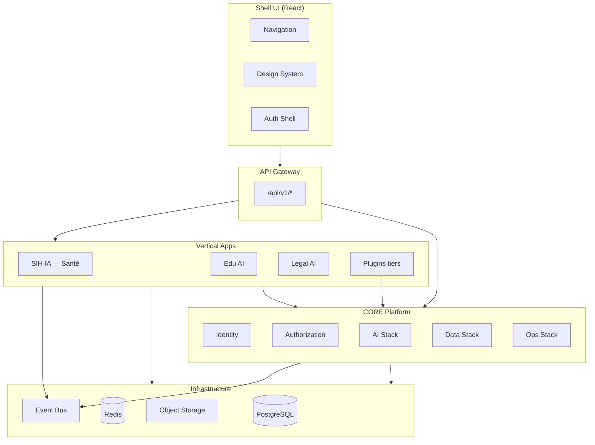

### 2.1 Principes directeurs

1. **Le CORE ne connaît pas les apps** — inversion de dépendance stricte.
2. **Les apps ne se connaissent pas** — communication via CORE ou events.
3. **Un module = un bounded context** — pas de « module fourre-tout ».
4. **API publique minimale** — exposer le strict nécessaire via `__init__.py` / `index.ts`.
5. **Contrats versionnés** — breaking changes = nouvelle version API/module.

---

## 3. Bounded Contexts (DDD)

### 3.1 Cartographie des contextes

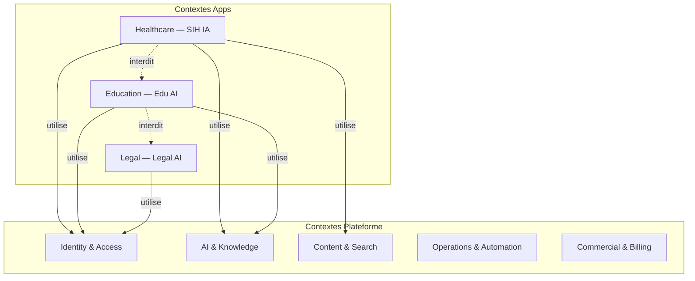

### 3.2 Context Map — relations DDD

| Contexte amont | Contexte aval | Relation DDD | Mécanisme |
|----------------|---------------|--------------|-----------|
| Identity | Toutes apps | **Conformist** | Apps adoptent modèle User CORE |
| RBAC | Apps | **Shared Kernel** | Permissions `{app}.{resource}.{action}` |
| SIH IA Patients | Identity | **Customer/Supplier** | App consomme, CORE fournit |
| SIH IA ↔ Edu AI | — | **Separate Ways** | Aucune relation directe |
| Documents | RAG | **Partnership** | Events `document.indexed` |
| Event Bus | Webhooks | **Published Language** | Schema events versionnés |
| Billing | Feature Flags | **Anti-Corruption Layer** | ACL traduit quotas → flags |

### 3.3 Ubiquitous Language par contexte

Chaque bounded context possède son vocabulaire métier. **Jamais** réutiliser un terme d'un autre contexte avec un sens différent.

| Contexte | Termes clés | Anti-exemple |
|----------|-------------|--------------|
| Identity | User, Session, Credential | ❌ « Patient » n'existe pas ici |
| SIH IA | Patient, Appointment, Doctor | ❌ « Student » (Edu AI) |
| Edu AI | Student, Course, Enrollment | ❌ « Patient » |
| AI/RAG | Chunk, Embedding, Collection | ❌ « Document » (= module Documents) |
| Billing | Subscription, Invoice, Usage | ❌ « Plan » ambigu avec Workflow |

### 3.4 Agrégats et invariants

| Contexte | Agrégat racine | Invariants |
|----------|----------------|------------|
| Identity | `User` | Email unique par org ; statut suspended → pas de login |
| SIH IA | `Patient` | Un patient appartient à une org ; dossier médical lié |
| SIH IA | `Appointment` | Pas de chevauchement créneau médecin |
| Documents | `Document` | Versioning immuable ; soft delete only |
| Organizations | `Organization` | Slug unique plateforme |

---

## 4. Frontières de modules

### 4.1 Anatomie d'un module

```
platform/identity/
├── __init__.py              # API PUBLIQUE — seul point d'import externe
├── domain/
│   ├── entities.py          # User, Session — pur Python
│   ├── value_objects.py     # Email, Password
│   ├── events.py            # UserCreated, UserSuspended
│   └── ports.py             # UserRepository (Protocol)
├── application/
│   ├── auth_service.py      # Use cases
│   └── dto.py               # Commandes/Queries internes
├── infrastructure/
│   ├── postgres_user_repo.py
│   └── password_hasher.py
├── presentation/
│   ├── routes.py              # FastAPI router
│   ├── schemas.py             # Pydantic request/response
│   └── deps.py                # DI module
└── tests/
    ├── unit/
    └── integration/
```

### 4.2 Contrat de frontière

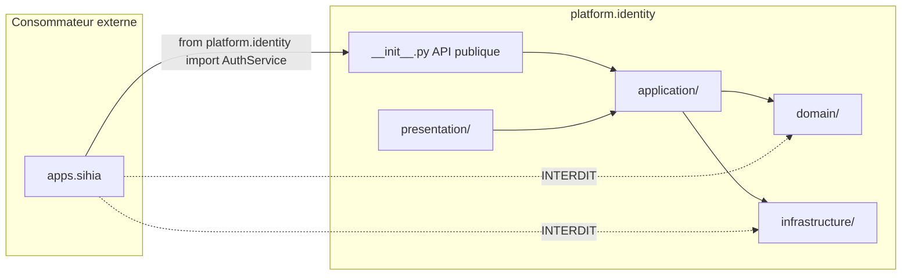

| Règle | Description |
|-------|-------------|
| **R1** | Import externe uniquement depuis `__init__.py` |
| **R2** | `domain/` n'importe aucun autre module AI BOS |
| **R3** | `infrastructure/` n'est importé que par `application/` du même module |
| **R4** | Cross-module : uniquement via interfaces `application/` exposées dans `__init__.py` |
| **R5** | Events cross-module : types définis dans `domain/events.py`, schema dans Event Bus registry |

### 4.3 Matrice frontières CORE ↔ Apps

| Direction | Autorisé | Exemple |
|-----------|----------|---------|
| App → CORE public API | ✅ | `from platform.identity import require_user` |
| App → CORE infrastructure | ❌ | `from platform.identity.infrastructure.postgres_user_repo` |
| CORE → App | ❌ | Identity ne importe jamais `apps.sihia` |
| App → App | ❌ | SIH IA ne importe jamais `apps.eduai` |
| App → App via event | ✅ | `appointment.cancelled` consommé par automation |
| Plugin → CORE | ✅ | Via SDK + permissions déclarées |
| Plugin → App | 🟡 | Uniquement via hooks documentés de l'app |

---

## 5. Architecture plugins

### 5.1 Modèle d'extension

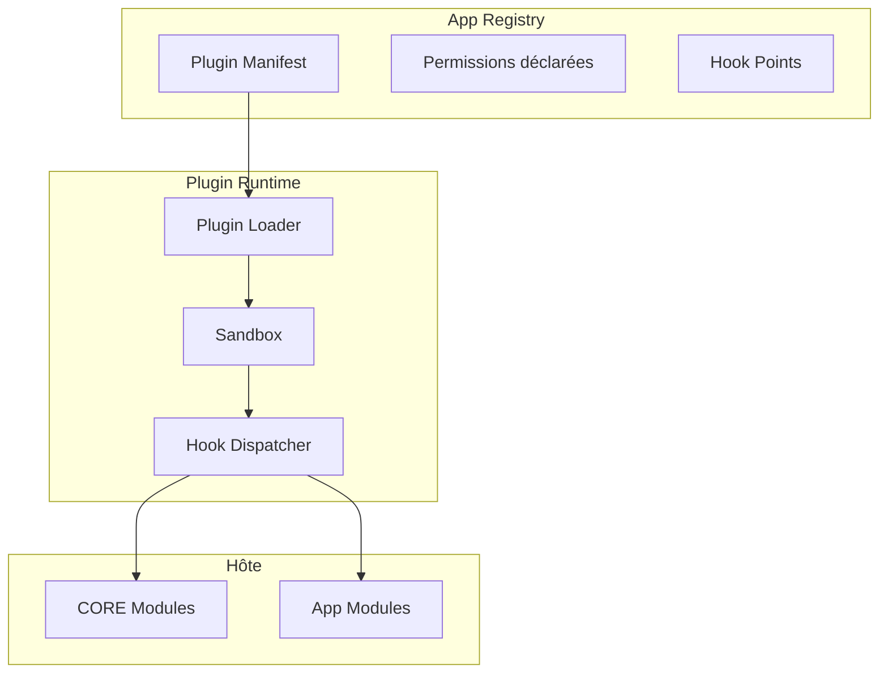

### 5.2 Manifest plugin (spec)

```yaml
# plugin.manifest.yaml
id: "com.partner.fhir-connector"
name: "FHIR Connector"
version: "1.2.0"
type: "connector"                    # connector | agent-tool | ui-widget | automation-action
target_apps: ["sihia"]               # apps compatibles
permissions:
  - "sihia.patients.read"
  - "platform.webhooks.write"
hooks:
  - point: "sihia.patient.created"
    handler: "handlers.on_patient_created"
  - point: "platform.ai.agent.tools"
    handler: "tools.fhir_lookup"
entrypoint: "partner_fhir.main:Plugin"
```

### 5.3 Types de plugins

| Type | Description | Exemple |
|------|-------------|---------|
| **Connector** | Intégration système externe | FHIR, HL7, Stripe, Salesforce |
| **Agent Tool** | Outil callable par Agent Engine | Recherche pubmed, calcul BMI |
| **UI Widget** | Composant React embarqué dans Shell | Widget chatbot custom |
| **Automation Action** | Action dans Automation Engine | Envoyer fax, imprimer badge |
| **Vertical App** | App complète (SIH IA niveau) | Edu AI |

### 5.4 Sandbox et sécurité

| Contrôle | Implémentation |
|----------|----------------|
| Permissions | Déclarées dans manifest, validées à l'install |
| Isolation | Pas d'accès filesystem/DB hors API CORE |
| Audit | Chaque hook call loggé |
| Rate limit | Quotas par plugin et par org |
| Révocation | Disable instantané sans redéploiement |

### 5.5 ADR-MOD-001 : Plugins Python in-process phase 1

| Champ | Valeur |
|-------|--------|
| **Statut** | `APPROVED` |
| **Décision** | Plugins = packages Python installés via registry, exécutés in-process |
| **Alternative rejetée** | WASM sandbox (complexité), microservices par plugin (ops) |
| **Évolution** | Phase 3 : plugins UI = Module Federation, agents = subprocess isolé |

---

## 6. App Registry

### 6.1 Rôle

L'**App Registry** est le catalogue central des applications et plugins installables par organisation.

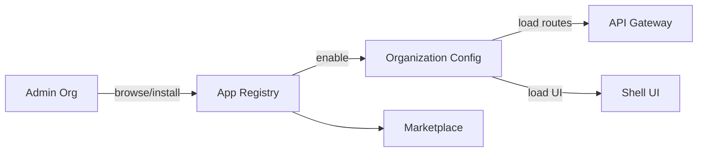

### 6.2 Modèle de données

| Entité | Champs clés | Description |
|--------|-------------|-------------|
| `AppDefinition` | `id`, `slug`, `name`, `type`, `version` | Catalogue global |
| `AppInstallation` | `org_id`, `app_id`, `status`, `config` | Instance par org |
| `AppRoute` | `prefix`, `router_factory`, `permissions` | Routes API enregistrées |
| `AppMenuItem` | `label`, `icon`, `path`, `permission` | Entrée navigation Shell |
| `AppFeature` | `flag_key`, `default` | Feature flags liés |

### 6.3 API Registry

| Méthode | Endpoint | Description |
|---------|----------|-------------|
| GET | `/api/v1/registry/apps` | Catalogue disponible |
| POST | `/api/v1/registry/apps/{slug}/install` | Installation org |
| DELETE | `/api/v1/registry/apps/{slug}/uninstall` | Désinstallation |
| GET | `/api/v1/registry/installed` | Apps actives org courante |
| PATCH | `/api/v1/registry/apps/{slug}/config` | Configuration app |

### 6.4 Enregistrement dynamique routes (backend)

```python
# apps/registry.py — pattern cible AI BOS
class AppRegistry:
    def __init__(self) -> None:
        self._apps: dict[str, AppDefinition] = {}

    def register(self, app: AppDefinition) -> None:
        self._apps[app.slug] = app

    def mount_routers(self, fastapi_app: FastAPI, org_apps: list[str]) -> None:
        for slug in org_apps:
            app = self._apps[slug]
            fastapi_app.include_router(
                app.router_factory(),
                prefix=f"/api/v1/{slug}",
                tags=[slug],
            )

# Bootstrap
registry.register(SihiaApp())
registry.register(EduAiApp())  # futur
```

### 6.5 Enregistrement dynamique UI (frontend)

```typescript
// shell/app-registry.ts
interface AppManifest {
  slug: string;
  routes: RouteConfig[];
  menuItems: MenuItem[];
  loadWidget?: () => Promise<React.ComponentType>;
}

const registry = new Map<string, AppManifest>();

export function registerApp(manifest: AppManifest): void {
  registry.set(manifest.slug, manifest);
}

export function getInstalledApps(orgId: string): AppManifest[] {
  // Fetch from API + filter by org installations
}
```

---

## 7. Applications verticales

### 7.1 Catalogue apps

| App | Slug | Domaine | Statut | Modules métier |
|-----|------|---------|--------|----------------|
| **SIH IA** | `sihia` | Santé / Hôpitaux | ✅ Existant | Patients, Doctors, Appointments, Medical History, ML forecast |
| **Edu AI** | `eduai` | Éducation | 📋 Planifié | Students, Courses, Grades, Attendance |
| **Legal AI** | `legalai` | Juridique | 📋 Planifié | Cases, Contracts, Deadlines |
| **Hotel AI** | `hotelai` | Hôtellerie | 📋 Planifié | Reservations, Rooms, Guests |
| **Retail AI** | `retailai` | Commerce | 📋 Planifié | Products, Orders, Inventory |
| **Factory AI** | `factoryai` | Industrie | 📋 Planifié | Production, Quality, Maintenance |
| **Government AI** | `govai` | Secteur public | 📋 Planifié | Citizens, Services, Permits |

### 7.2 Anatomie app verticale — SIH IA

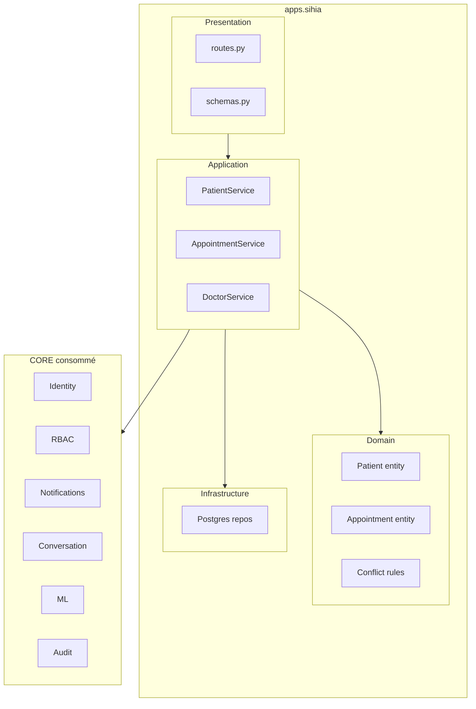

### 7.3 Structure package SIH IA (cible AI BOS)

```
apps/sihia/
├── __init__.py                 # SihiaApp(AppDefinition)
├── manifest.yaml               # App Registry manifest
├── domain/
│   ├── patient.py
│   ├── appointment.py
│   ├── doctor.py
│   └── ports.py
├── application/
│   ├── patient_service.py      # ← migré depuis SIH IA use_cases
│   ├── appointment_service.py
│   ├── doctor_service.py
│   ├── medical_history_service.py
│   └── reminder_hooks.py         # → délègue à platform.notifications
├── infrastructure/
│   └── postgres_*.py           # ← migré depuis sqlite_repositories
├── presentation/
│   ├── routes.py
│   ├── schemas.py
│   └── deps.py
└── tests/
```

### 7.4 Mapping extraction SIH IA → AI BOS

| Composant SIH IA actuel | Destination AI BOS |
|-------------------------|-------------------|
| `application/use_cases.PatientsService` | `apps/sihia/application/patient_service.py` |
| `application/reminder_service` | `apps/sihia/application/` + `platform.notifications` |
| `application/chatbot_*` | `platform.ai.conversation` |
| `application/rbac_service` | `platform.authorization.rbac` |
| `application/analytics_service` | `platform.analytics` (+ KPIs santé dans app) |
| `application/ml_service` | `platform.ml` (+ modèle RDV dans app) |
| `application/pipeline_service` | `platform.data-pipeline` |

### 7.5 Template nouvelle app verticale

Checklist création `apps/<slug>/` :

1. [ ] Créer `manifest.yaml` avec permissions requises
2. [ ] Implémenter `AppDefinition` avec `router_factory()`
3. [ ] Définir ubiquitous language et agrégats domaine
4. [ ] Préfixer permissions : `{slug}.{resource}.{action}`
5. [ ] Enregistrer dans `apps/registry.py`
6. [ ] Ajouter routes Shell UI et menu
7. [ ] Migrations Alembic : `alembic/versions/apps_<slug>/`
8. [ ] Tests isolation tenant
9. [ ] Documentation README dans `apps/<slug>/README.md`

---

## 8. Patterns de communication

### 8.1 Vue d'ensemble

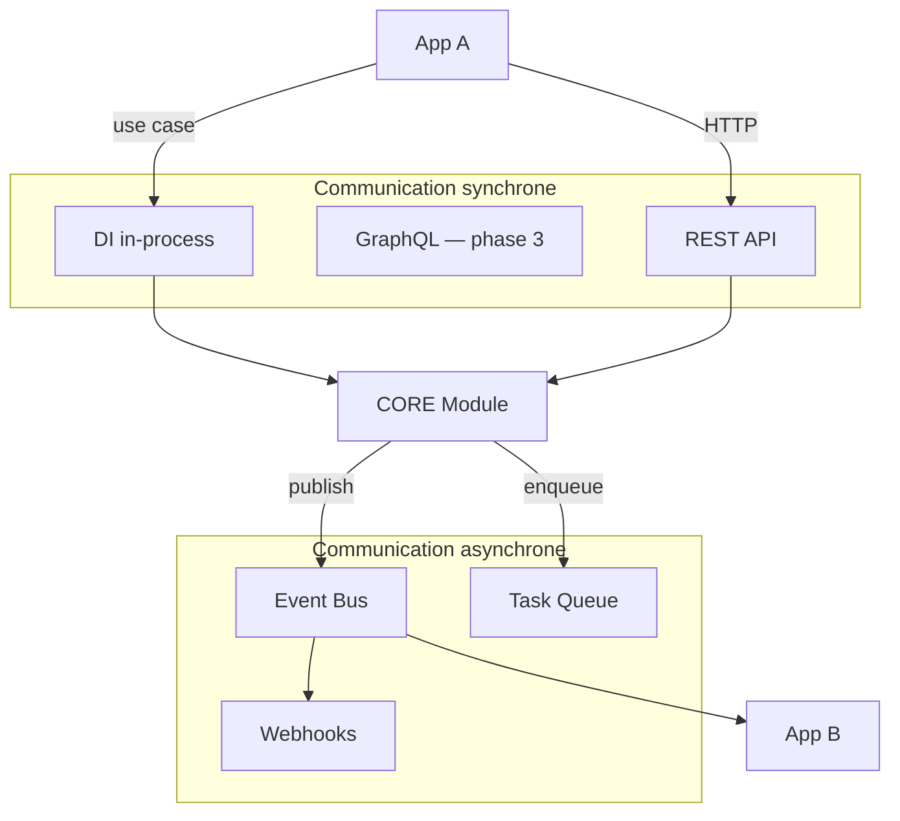

### 8.2 Quand utiliser quoi ?

| Pattern | Cas d'usage | Latence | Cohérence | Exemple SIH IA |
|---------|-------------|---------|-----------|----------------|
| **DI in-process** | App → CORE, même process | < 1 ms | Forte (même TX) | `PatientService` → `AuditService.record()` |
| **REST sync** | Frontend → Backend, SDK externe | 10-200 ms | Request-scope | `GET /api/v1/sihia/patients` |
| **Event Bus** | Découplage, side-effects | Async | Éventuelle | `patient.created` → index search |
| **Task Queue** | Travail long, retry | Async | Éventuelle | Envoi rappels RDV batch |
| **Webhooks** | Intégration tierce | Async | Éventuelle | Notifier EMR externe |

### 8.3 ADR-MOD-002 : Event-first pour side-effects

| Champ | Valeur |
|-------|--------|
| **Statut** | `APPROVED` |
| **Règle** | Tout effet de bord non critique pour la response HTTP → Event Bus ou Queue |
| **Exemple** | `POST /patients` retourne 201 immédiatement ; indexation RAG via `patient.created` |
| **Exception** | Audit synchrone sur mutations sensibles (compliance) |

### 8.4 Catalogue events plateforme

| Event | Émetteur | Consommateurs typiques |
|-------|----------|------------------------|
| `user.created` | Identity | Notifications, Audit, Analytics |
| `user.suspended` | Identity | Auth (révocation sessions), Audit |
| `document.uploaded` | Documents | OCR, RAG, Search |
| `document.indexed` | RAG | Search, Audit |
| `ai.query.completed` | Conversation | Analytics, Billing (metering) |
| `appointment.created` | SIH IA | Notifications, ML features |
| `appointment.cancelled` | SIH IA | Notifications, Analytics |
| `organization.created` | Organizations | Billing, Settings defaults |

### 8.5 Schema event standard

```json
{
  "id": "evt_01HYZ...",
  "type": "sihia.appointment.created",
  "version": "1.0",
  "timestamp": "2026-07-06T10:30:00Z",
  "organizationId": "org_abc123",
  "correlationId": "corr_xyz789",
  "actor": {
    "type": "user",
    "id": "user_456"
  },
  "data": {
    "appointmentId": "appt_789",
    "patientId": "pat_123",
    "doctorId": "doc_456",
    "scheduledAt": "2026-07-10T14:00:00Z"
  }
}
```

### 8.6 Saga choreography — exemple rappel RDV

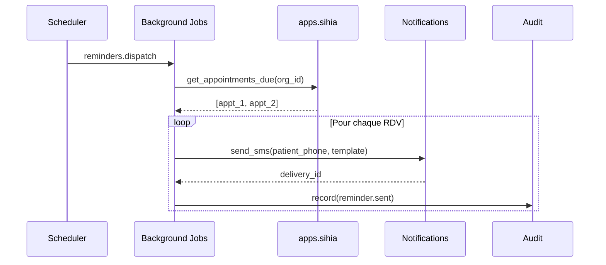

### 8.7 CQRS léger

| Côté | Responsabilité | Implémentation |
|------|----------------|----------------|
| **Command** | Mutations, validation, events | `application/*_service.py` |
| **Query** | Lectures optimisées, pas d'events | `application/*_queries.py` ou même service méthodes read-only |
| **Projection** | Vues dénormalisées pour BI/Search | Consumers Event Bus |

Pas de bus de commandes séparé en phase 1 — distinction conventionnelle dans le code.

---

## 9. Cycle de vie des modules

### 9.1 États du module

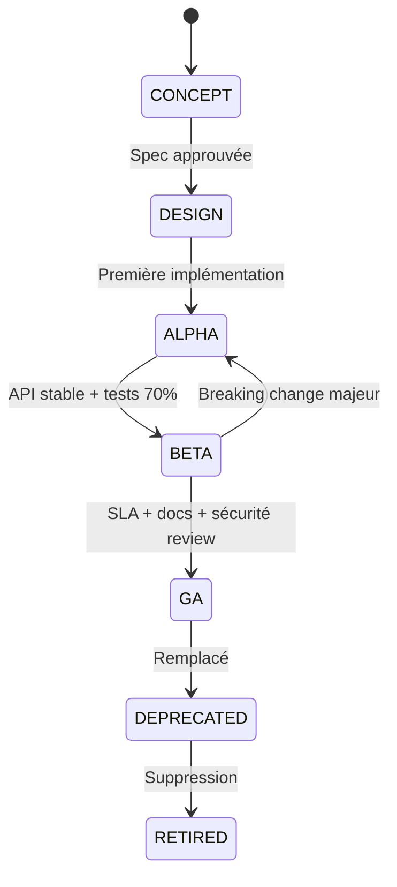

### 9.2 Critères de transition

| Transition | Critères |
|------------|----------|
| DESIGN → ALPHA | ADR approuvé, API sketch, tests unitaires domain |
| ALPHA → BETA | API stable 1 version, integration tests, doc README module |
| BETA → GA | Security review, SLO défini, runbook, ≥ 80 % tests, multi-tenant validé |
| GA → DEPRECATED | Remplaçant identifié, migration guide, sunset date |
| DEPRECATED → RETIRED | 0 consommateur, sunset date passée |

### 9.3 Versioning module

```
platform/identity/
├── CHANGELOG.md
├── version.py          # __version__ = "2.1.0"
└── ...
```

| Composant versionné | Stratégie |
|---------------------|-----------|
| API REST | URL `/api/v1`, `/api/v2` |
| Events | Champ `version` dans payload |
| Python package | Semver interne |
| Plugin manifest | `version` dans YAML |

### 9.4 Processus ajout module CORE

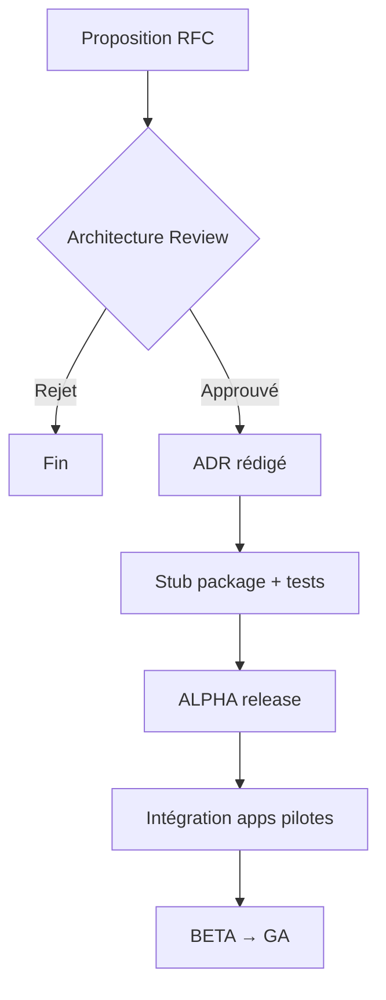

---

## 10. Règles de dépendance

### 10.1 Graphe autorisé

```mermaid
flowchart BT
    APPS["apps.*"]
    CORE["platform.*"]
    CORE_INTERNAL["core/ (config, utils)"]

    APPS --> CORE
    APPS --> CORE_INTERNAL
    CORE --> CORE
    CORE --> CORE_INTERNAL
    CORE_INTERNAL --> NONE[Rien]

    APPS -.->|INTERDIT| APPS
    CORE -.->|INTERDIT| APPS
    CORE_INTERNAL -.->|INTERDIT| APPS
    CORE_INTERNAL -.->|INTERDIT| CORE métier
```

### 10.2 Règles formelles

| # | Règle | Enforcement |
|---|-------|-------------|
| **D1** | `core/` (config, logging) ne dépend d'aucun `platform/` ni `apps/` | import-linter |
| **D2** | `platform/*` ne dépend jamais de `apps/*` | import-linter |
| **D3** | `apps/*` ne dépend jamais d'un autre `apps/*` | import-linter |
| **D4** | `domain/` ne dépend que de stdlib + autres `domain/` du même module | ruff, review |
| **D5** | `infrastructure/` jamais importé hors de son module | import-linter |
| **D6** | Dépendances circulaires CORE interdites — utiliser events | arch review |
| **D7** | Frontend : `apps/sihia/` ne importe pas `apps/eduai/` | ESLint boundaries |

### 10.3 Configuration import-linter

```ini
# .importlinter — ai-bos/backend
[importlinter]
root_packages = app

[importlinter:contract:layers]
name = Layered Architecture
type = layers
layers =
    app.apps
    app.platform
    app.core
containers = app

[importlinter:contract:apps-isolation]
name = Apps cannot import each other
type = forbidden
source_modules =
    app.apps.sihia
    app.apps.eduai
forbidden_modules =
    app.apps
ignore_imports =
    app.apps.registry -> app.apps.*
```

### 10.4 ADR-MOD-003 : CORE cannot depend on Apps

| Champ | Valeur |
|-------|--------|
| **Statut** | `APPROVED` |
| **Contexte** | Risque de couplage SIH IA dans le CORE lors de l'extraction |
| **Décision** | Règle absolue avec enforcement CI |
| **Pattern alternatif** | Apps enregistrent des hooks/callbacks via App Registry |

---

## 11. Conventions de nommage

### 11.1 Backend Python

| Élément | Convention | Exemple |
|---------|------------|---------|
| Package CORE | `app.platform.<module>` | `app.platform.identity` |
| Package App | `app.apps.<slug>` | `app.apps.sihia` |
| Config transverse | `app.core.<util>` | `app.core.config` |
| Entity | PascalCase singulier | `Patient`, `Appointment` |
| Value Object | PascalCase | `Email`, `TimeSlot` |
| Repository port | `<Entity>Repository` Protocol | `PatientRepository` |
| Repository impl | `<Backend><Entity>Repository` | `PostgresPatientRepository` |
| Service | `<Entity>Service` | `AppointmentService` |
| Event | `<Entity><PastVerb>` | `PatientCreated` |
| Permission | `<slug>.<resource>.<action>` | `sihia.patients.write` |
| Table DB | `<slug>_<entities>` | `sihia_patients` |
| Migration | `YYYYMMDD_<slug>_<description>` | `20260706_sihia_add_patient_tags` |

### 11.2 Frontend TypeScript

| Élément | Convention | Exemple |
|---------|------------|---------|
| Package app | `apps/<slug>/` | `apps/sihia/` |
| Shell | `shell/` | `shell/layout/AppShell.tsx` |
| Design System | `packages/ui/` | `packages/ui/Button.tsx` |
| Route | `/<slug>/<resource>` | `/sihia/patients` |
| API client | `apps/<slug>/api/` | `apps/sihia/api/patients.ts` |
| Hook | `use<Entity>` | `usePatients` |
| Store | `<slug>Store` | `sihiaStore` |

### 11.3 Events et topics

| Élément | Convention | Exemple |
|---------|------------|---------|
| Event type | `<scope>.<entity>.<action>` | `sihia.appointment.cancelled` |
| Queue name | `<scope>.<job>` | `platform.embeddings.index` |
| Redis key | `org:{org_id}:<module>:<key>` | `org:abc:cache:patients:list` |

### 11.4 API REST

| Élément | Convention | Exemple |
|---------|------------|---------|
| Prefix CORE | `/api/v1/<module>` | `/api/v1/auth/login` |
| Prefix App | `/api/v1/<slug>/<resource>` | `/api/v1/sihia/patients` |
| Collection | pluriel | `/patients` |
| Action | verbe en sous-resource | `/appointments/{id}/cancel` |
| Query params | camelCase | `?startDate=2026-01-01` |
| JSON body | camelCase | `{ "firstName": "Jean" }` |

---

## 12. Structure mono-repo

### 12.1 Arborescence racine

```
ai-bos/
├── README.md
├── Document/                          # Documentation entreprise
│   ├── INDEX.md
│   ├── README_04_Backend.md
│   ├── README_05_Core.md
│   ├── README_06_ModularArchitecture.md
│   └── ...
│
├── backend/                           # FastAPI monolithe modulaire
│   ├── app/
│   │   ├── main.py
│   │   ├── core/
│   │   ├── platform/                  # CORE modules
│   │   ├── apps/                      # Vertical apps
│   │   │   ├── registry.py
│   │   │   ├── sihia/
│   │   │   └── eduai/                 # futur
│   │   ├── workers/
│   │   └── presentation/
│   ├── alembic/
│   ├── tests/
│   ├── requirements.txt
│   └── Dockerfile
│
├── frontend/                          # Shell + apps UI
│   ├── shell/                         # App host, navigation, auth
│   ├── packages/
│   │   ├── ui/                        # Design system
│   │   ├── api-client/                # SDK TypeScript généré
│   │   └── i18n/                      # Catalogues partagés
│   ├── apps/
│   │   ├── sihia/                     # Micro-frontend SIH IA
│   │   └── eduai/
│   ├── package.json                   # Workspace root (pnpm)
│   └── turbo.json                     # Build orchestration
│
├── sdk/                               # SDK Python + TS (futur)
│   ├── python/
│   └── typescript/
│
├── plugins/                           # Plugins tiers (futur)
│   └── examples/
│
├── infra/                             # IaC, Docker Compose, K8s
│   ├── docker-compose.yml
│   ├── terraform/
│   └── k8s/
│
├── .github/
│   └── workflows/
│       ├── ci-backend.yml
│       ├── ci-frontend.yml
│       └── import-linter.yml
│
├── pyproject.toml                     # import-linter, ruff
└── pnpm-workspace.yaml
```

### 12.2 Workspaces et build

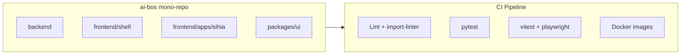

| Outil | Scope | Rôle |
|-------|-------|------|
| **pnpm workspaces** | frontend | Dépendances partagées, linking local |
| **Turborepo** | frontend | Cache build, pipeline parallèle |
| **pip + venv** | backend | Dépendances Python |
| **import-linter** | backend | Enforcement dépendances |
| **Alembic** | backend | Migrations unifiées, namespaces par app |
| **Docker Compose** | infra | Dev local : API + Postgres + Redis + MailHog |

### 12.3 Stratégie migrations DB

```
alembic/versions/
├── platform/                    # Migrations CORE
│   ├── 001_identity_schema.py
│   └── 002_audit_events.py
├── sihia/                       # Migrations app SIH IA
│   ├── 001_patients.py
│   └── 002_appointments.py
└── eduai/                       # Futur
    └── 001_students.py
```

| Règle | Description |
|-------|-------------|
| Tables CORE | Préfixe `core_` ou namespace `platform_*` |
| Tables app | Préfixe `{slug}_` : `sihia_patients` |
| FK cross-module | Uniquement vers CORE (ex. `core_users.id`) |
| FK cross-app | **Interdit** — référencer via ID opaque + event |

### 12.4 Déploiement

| Environnement | Topologie | Apps actives |
|---------------|-----------|--------------|
| **dev** | Docker Compose, SQLite ou Postgres local | Toutes |
| **staging** | K8s single cluster | Toutes |
| **prod** | K8s multi-AZ | Par org (App Registry) |

Un seul artefact Docker backend contient CORE + toutes les apps. Le feature toggling par org détermine les routes actives.

---

## 13. ADRs

| ID | Titre | Statut |
|----|-------|--------|
| ADR-MOD-001 | Plugins Python in-process phase 1 | `APPROVED` |
| ADR-MOD-002 | Event-first pour side-effects | `APPROVED` |
| ADR-MOD-003 | CORE cannot depend on Apps | `APPROVED` |
| ADR-MOD-004 | Mono-repo backend + frontend | `APPROVED` |
| ADR-MOD-005 | App Registry pour activation dynamique par org | `APPROVED` |
| ADR-MOD-006 | Permissions `{slug}.{resource}.{action}` | `APPROVED` |
| ADR-MOD-007 | Migrations Alembic namespacées par module | `APPROVED` |
| ADR-MOD-008 | Single Docker image, toggling par org | `REVIEW` |

---

## 14. Anti-patterns

| Anti-pattern | Problème | Solution |
|--------------|----------|----------|
| **God Module** | Un module CORE qui fait tout | Découper par bounded context |
| **Leaky Abstraction** | App importe repo Postgres du CORE | Exposer uniquement services application |
| **Distributed Monolith** | Events partout sans raison | DI sync pour lectures/écritures couplées |
| **Shared Database Tables** | App A écrit table App B | Events + API ou projection |
| **Copy-Paste CORE** | App réimplémente l'auth | Utiliser `platform.identity` |
| **Premature Microservices** | Un service par module dès M1 | Monolithe modulaire, extraire si SLO |
| **Circular Events** | A écoute B qui écoute A | Choreography review, saga timeout |
| **Fat Controller** | Logique métier dans routes | Services application |
| **Anemic Domain** | Entités sans comportement | Rich domain model avec invariants |

---

## Références

- [README_05_Core.md](README_05_Core.md) — Spécification modules CORE
- [README_04_Backend.md](README_04_Backend.md) — FastAPI, middleware, tests
- [README_35_MigrationFromSIHIA](README_35_MigrationFromSIHIA.md) — Plan migration
- [SIH IA — Architecture](../sihia-platform/Document/README_02_Architecture.md)
- [SIH IA — État implémentation](../sihia-platform/Document/README_ETAT_IMPLEMENTATION.md)
- *Domain-Driven Design* — Eric Evans
- *Implementing Domain-Driven Design* — Vaughn Vernon

---

*Document vivant — révision à chaque ajout d'app verticale ou modification des règles de dépendance.*
