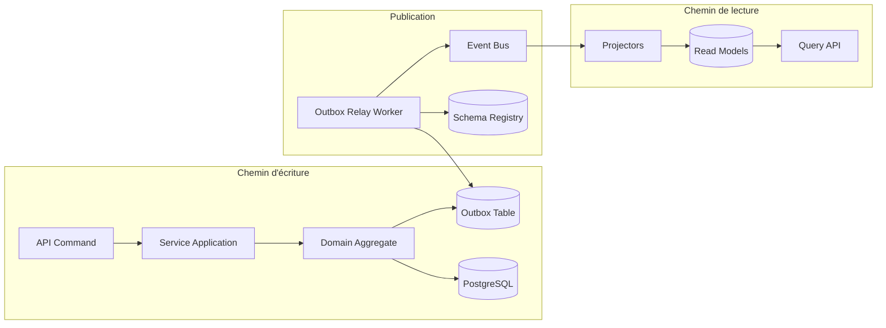
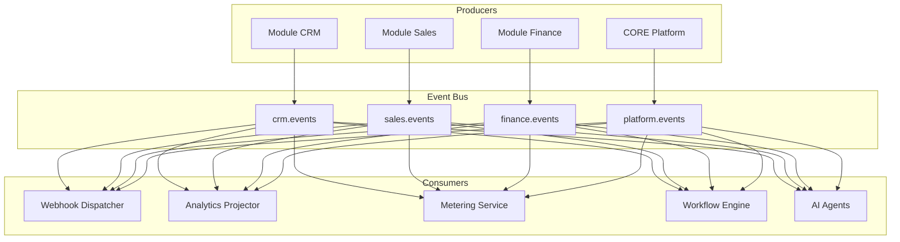
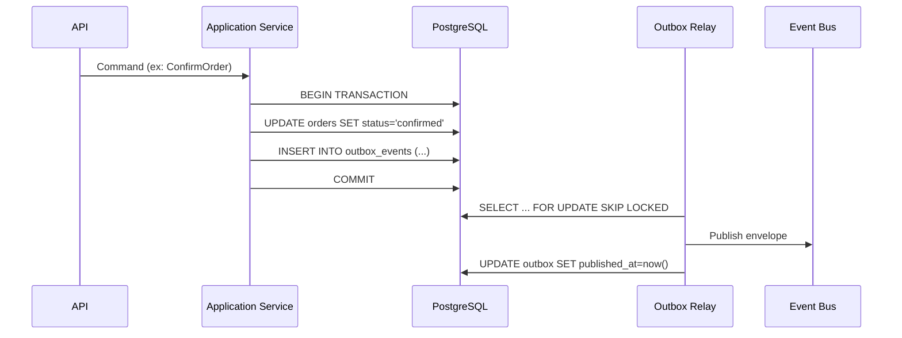
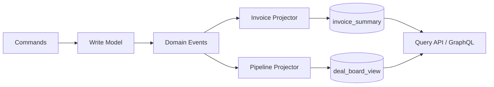
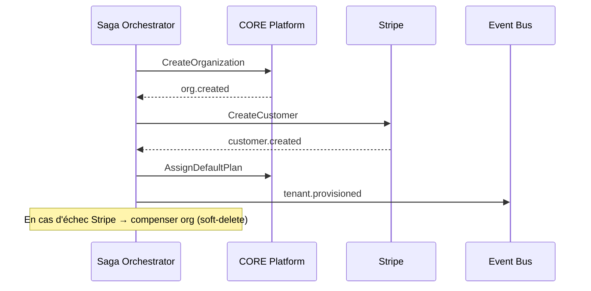

# README_12 — Architecture Event-Driven AI BOS

---

## Métadonnées du document

| Champ | Valeur |
|-------|--------|
| **Document** | README_12_EventDriven.md |
| **Projet** | AI BOS — AI Business Operating System |
| **Version** | 0.1.0 |
| **Statut** | `DRAFT` — revue Architecture Review Board requise |
| **Niveau de maturité** | `DESIGN` |
| **Audience** | Backend Engineers, Platform Architects, SRE |
| **Auteur** | AI BOS Platform Architecture Team |
| **Dernière mise à jour** | Juillet 2026 |
| **Documents liés** | [README_02_Architecture](README_02_Architecture.md) · [README_04_Backend](README_04_Backend.md) · [README_11_Workflows](README_11_Workflows.md) · [README_13_API](README_13_API.md) |
| **Référence héritage** | [SIH IA Backend](../../Document/README_04_Backend.md) · [SIH IA Pipelines](../../Document/README_AIRFLOW_UTILISATION.md) |

---

## Table des matières

1. [Synthèse exécutive](#1-synthèse-exécutive)
2. [Objectifs et principes](#2-objectifs-et-principes)
3. [Event Bus — topologie](#3-event-bus--topologie)
4. [Choix technologique Kafka vs SNS+SQS](#4-choix-technologique-kafka-vs-snssql)
5. [Schéma d'événements et registre](#5-schéma-dévénements-et-registre)
6. [Pattern Outbox](#6-pattern-outbox)
7. [CQRS — séparation lecture/écriture](#7-cqrs--séparation-lectureécriture)
8. [Sagas et orchestration](#8-sagas-et-orchestration)
9. [Catalogue des événements domaine](#9-catalogue-des-événements-domaine)
10. [Idempotence et ordre](#10-idempotence-et-ordre)
11. [Observabilité des événements](#11-observabilité-des-événements)
12. [Architecture Decision Records (ADR)](#12-architecture-decision-records-adr)
13. [Roadmap d'implémentation](#13-roadmap-dimplémentation)
14. [Checklist de livraison](#14-checklist-de-livraison)

---

## 1. Synthèse exécutive

AI BOS adopte une architecture **event-driven** pour découpler les modules métier (CRM, Sales, Finance, SIH IA) tout en garantissant la cohérence transactionnelle via le **pattern Outbox** et les **sagas**. Le bus d'événements évolue en trois phases :

| Phase | Technologie | Contexte |
|-------|-------------|----------|
| MVP / dev | Redis Streams | Monolithe modulaire, faible latence, ops simples |
| Scale intermédiaire | Amazon SNS + SQS | AWS-native, fan-out, DLQ intégrées |
| Scale enterprise | Apache Kafka (MSK) | Replay, ordering par partition, analytics stream |

Les événements sont versionnés dans un **Schema Registry** (Avro/JSON Schema) et catalogués par bounded context. CQRS est appliqué sélectivement sur les agrégats à fort volume de lecture (factures, pipeline commercial, métriques usage).

---

## 2. Objectifs et principes

### Objectifs

- Découpler les modules sans perdre la traçabilité bout-en-bout
- Permettre l'ajout de consommateurs (webhooks, agents IA, analytics) sans modifier l'émetteur
- Garantir l'atomicité « écriture DB + publication événement » via Outbox
- Supporter les workflows longs (onboarding tenant, facturation, provisioning) via sagas

### Principes non négociables

1. **Événements immuables** — correction = nouvel événement compensatoire, jamais mutation
2. **Envelope standardisée** — métadonnées communes (correlation_id, tenant_id, causation_id)
3. **At-least-once + idempotence** — chaque handler doit être idempotent
4. **Schéma backward-compatible** — évolution additive uniquement (compat Avro)
5. **Pas d'événements sans contrat** — enregistrement obligatoire au registre avant publication



---

## 3. Event Bus — topologie

### Topics / queues par bounded context

| Namespace | Pattern | Exemples |
|-----------|---------|----------|
| `aibos.crm.*` | Domain events CRM | `contact.created`, `deal.stage_changed` |
| `aibos.sales.*` | Pipeline commercial | `quote.sent`, `order.confirmed` |
| `aibos.finance.*` | Facturation | `invoice.issued`, `payment.received` |
| `aibos.platform.*` | Transverse | `tenant.provisioned`, `user.invited` |
| `aibos.sihia.*` | App verticale santé | `appointment.created`, `patient.updated` |

### Routing keys et partitions

- **Clé de partition** : `{tenant_id}` pour garantir l'ordre intra-tenant
- **Clé d'idempotence** : `{event_id}` (UUID v7, ordonné temporellement)
- **Correlation** : `X-Correlation-ID` HTTP propagé dans `envelope.correlation_id` (réutilisation SIH IA)



---

## 4. Choix technologique Kafka vs SNS+SQS

| Critère | Kafka (MSK) | SNS + SQS |
|---------|-------------|-----------|
| Ordering garanti | Oui (par partition) | Non (FIFO SQS limité) |
| Replay historique | Natif | Non (sans archivage) |
| Ops complexity | Élevée | Faible (managed) |
| Coût faible volume | Élevé | Faible |
| Fan-out multi-subscriber | Oui | Oui (SNS) |
| Intégration AWS native | Via MSK | Native |

**Recommandation AI BOS** : démarrer Redis Streams en dev ; **SNS+SQS en production AWS** pour le MVP multi-tenant ; migrer vers **MSK** lorsque le replay et l'analytics temps réel deviennent critiques (> 50M événements/mois).

---

## 5. Schéma d'événements et registre

### Envelope standard

```json
{
  "specversion": "1.0",
  "id": "01J8XK2M3N4P5Q6R7S8T9V0WX",
  "source": "aibos.sales",
  "type": "aibos.sales.order.confirmed.v1",
  "time": "2026-07-06T08:00:00Z",
  "datacontenttype": "application/json",
  "tenant_id": "org_abc123",
  "correlation_id": "corr-uuid",
  "causation_id": "01J8XK2M3N4P5Q6R7S8T9V0WV",
  "actor": {
    "type": "user",
    "id": "usr_xyz",
    "role": "sales_manager"
  },
  "data": { }
}
```

### Schema Registry

| Composant | Technologie cible | Rôle |
|-----------|-------------------|------|
| Registre | AWS Glue Schema Registry ou Confluent | Versioning, compatibilité |
| Format | JSON Schema (MVP) → Avro (scale) | Sérialisation |
| CI | `schemathesis` + tests contractuels | Validation à la PR |
| Documentation | Auto-génération depuis schémas | Portail développeur |

### Convention de nommage

```
aibos.{bounded_context}.{aggregate}.{action}.v{major}
```

Exemple : `aibos.finance.invoice.issued.v1`

---

## 6. Pattern Outbox

Le pattern Outbox résout le problème dual-write (DB + bus) en écrivant l'événement dans la même transaction que l'agrégat.



### Table `outbox_events`

| Colonne | Type | Description |
|---------|------|-------------|
| `id` | UUID | Identifiant événement |
| `tenant_id` | VARCHAR | Isolation multi-tenant |
| `aggregate_type` | VARCHAR | Ex: `Order`, `Invoice` |
| `aggregate_id` | VARCHAR | ID agrégat |
| `event_type` | VARCHAR | Type versionné |
| `payload` | JSONB | Corps événement |
| `created_at` | TIMESTAMPTZ | Horodatage |
| `published_at` | TIMESTAMPTZ | NULL tant que non publié |

**Héritage SIH IA** : le modèle d'audit JSONL (`logs/audit.jsonl`) inspire la structure de traçabilité ; l'Outbox remplace la publication synchrone pour les side-effects inter-modules.

---

## 7. CQRS — séparation lecture/écriture

CQRS est appliqué **uniquement** où le ratio lecture/écriture justifie la complexité :

| Agrégat | Command side | Query side | Justification |
|---------|--------------|------------|---------------|
| Invoice | PostgreSQL normalisé | Vue matérialisée + cache Redis | Dashboard finance |
| Deal Pipeline | Event sourcing léger | Projection Elasticsearch | Recherche full-text |
| Usage Metering | Insert append-only | Agrégats temps réel | Billing |
| Contact CRM | CRUD classique | CRUD classique | Volume modéré — pas de CQRS |



---

## 8. Sagas et orchestration

### Types de sagas

| Type | Usage | Exemple AI BOS |
|------|-------|----------------|
| **Orchestration** | Workflow centralisé, étapes séquentielles | Provisioning tenant |
| **Chorégraphie** | Réactions décentralisées | `order.confirmed` → facture + stock + notification |

### Saga : provisioning tenant



### Compensation

Chaque étape saga possède une action compensatoire :

| Étape | Compensation |
|-------|--------------|
| `CreateOrganization` | `organization.mark_deleted` |
| `CreateStripeCustomer` | `stripe.customer.delete` |
| `SeedDefaultData` | `tenant.data.purge` |

---

## 9. Catalogue des événements domaine

### Module CRM

| Type | Déclencheur | Consommateurs |
|------|-------------|---------------|
| `aibos.crm.contact.created.v1` | Création contact | Search indexer, Webhooks |
| `aibos.crm.contact.merged.v1` | Fusion doublons | Analytics, Audit |
| `aibos.crm.account.updated.v1` | MAJ compte | Sales (territoire) |
| `aibos.crm.activity.logged.v1` | Appel/email logué | Timeline, AI summarizer |

### Module Sales

| Type | Déclencheur | Consommateurs |
|------|-------------|---------------|
| `aibos.sales.lead.qualified.v1` | Lead qualifié | CRM, Notifications |
| `aibos.sales.quote.sent.v1` | Devis envoyé | Finance (pré-facture) |
| `aibos.sales.order.confirmed.v1` | Commande validée | Finance, Inventory |
| `aibos.sales.deal.won.v1` | Affaire gagnée | Billing, Analytics |

### Module Finance

| Type | Déclencheur | Consommateurs |
|------|-------------|---------------|
| `aibos.finance.invoice.issued.v1` | Facture émise | Stripe, Email, Webhooks |
| `aibos.finance.payment.received.v1` | Paiement reçu | Sales (commission), CRM |
| `aibos.finance.credit_note.issued.v1` | Avoir émis | Billing metering |
| `aibos.finance.subscription.renewed.v1` | Renouvellement | Subscriptions module |

### Module Platform (transverse)

| Type | Déclencheur | Consommateurs |
|------|-------------|---------------|
| `aibos.platform.tenant.provisioned.v1` | Onboarding terminé | Tous modules |
| `aibos.platform.user.invited.v1` | Invitation utilisateur | Auth, Email |
| `aibos.platform.usage.recorded.v1` | Métrique usage | Billing (README_19) |
| `aibos.platform.feature_flag.changed.v1` | Changement plan | Frontend config |

---

## 10. Idempotence et ordre

### Stratégie idempotence

```python
# Pattern handler idempotent (pseudo-code inspiré SIH IA deps)
async def handle_order_confirmed(envelope: EventEnvelope) -> None:
    if await processed_events.exists(envelope.id):
        return  # déjà traité
    async with db.transaction():
        await apply_business_logic(envelope.data)
        await processed_events.insert(envelope.id, envelope.tenant_id)
```

### Dead Letter Queue (DLQ)

| Paramètre | Valeur |
|-----------|--------|
| Max retries | 5 |
| Backoff | Exponentiel (1s, 2s, 4s, 8s, 16s) |
| DLQ retention | 14 jours |
| Alerting | PagerDuty si > 10 messages DLQ/heure |

---

## 11. Observabilité des événements

| Signal | Implémentation |
|--------|----------------|
| Traçabilité | `correlation_id` propagé (aligné SIH IA `X-Correlation-ID`) |
| Métriques | `events_published_total`, `events_consumed_lag_seconds` |
| Logs structurés | JSON avec `event_type`, `tenant_id`, `handler` |
| Dashboards | Grafana : lag consommateurs, taux DLQ, throughput par topic |

---

## 12. Architecture Decision Records (ADR)

### ADR-012-01 : Outbox obligatoire pour événements domaine

| Champ | Valeur |
|-------|--------|
| **Statut** | Accepté |
| **Contexte** | Risque d'incohérence dual-write |
| **Décision** | Toute publication domaine passe par table Outbox + relay |
| **Conséquences** | Latence publication ~100-500ms ; cohérence garantie |

### ADR-012-02 : Redis Streams → SNS+SQS → Kafka

| Champ | Valeur |
|-------|--------|
| **Statut** | Accepté |
| **Contexte** | Besoin d'évolution progressive sans réécriture |
| **Décision** | Abstraction `EventPublisher` port/adapter |
| **Conséquences** | Interface stable ; migration bus transparente pour modules |

### ADR-012-03 : JSON Schema au MVP, Avro en scale

| Champ | Valeur |
|-------|--------|
| **Statut** | Accepté |
| **Contexte** | Équipe Python/TS ; tooling Avro plus lourd |
| **Décision** | JSON Schema v7 + validation Pydantic (comme SIH IA) |
| **Conséquences** | Migration Avro planifiée phase 3 |

### ADR-012-04 : CQRS sélectif uniquement

| Champ | Valeur |
|-------|--------|
| **Statut** | Accepté |
| **Contexte** | Sur-ingénierie CQRS global |
| **Décision** | CQRS sur Invoice, Pipeline, Metering uniquement |
| **Conséquences** | Complexité maîtrisée ; CRUD simple ailleurs |

---

## 13. Roadmap d'implémentation

| Sprint | Livrable |
|--------|----------|
| S1 | Port `EventPublisher` + table Outbox + relay worker |
| S2 | Envelope standard + 5 événements platform |
| S3 | Consommateurs CRM/Sales (chorégraphie) |
| S4 | Saga provisioning tenant |
| S5 | Schema Registry CI + catalogue complet |
| S6 | Migration Redis → SNS+SQS (staging) |

---

## 14. Checklist de livraison

- [ ] Interface `EventPublisher` / `EventConsumer` dans `core/events/`
- [ ] Table `outbox_events` + migration Alembic
- [ ] Worker relay avec `FOR UPDATE SKIP LOCKED`
- [ ] Table `processed_events` pour idempotence
- [ ] Envelope CloudEvents 1.0 compliant
- [ ] ≥ 10 événements catalogués (CRM, Sales, Finance)
- [ ] Tests contractuels schémas
- [ ] Métriques Prometheus sur publish/consume
- [ ] DLQ configurée avec alerting
- [ ] Documentation portail développeur (README_13)

---

*Document maintenu par l'équipe Platform AI BOS. Prochaine revue : Q3 2026.*
