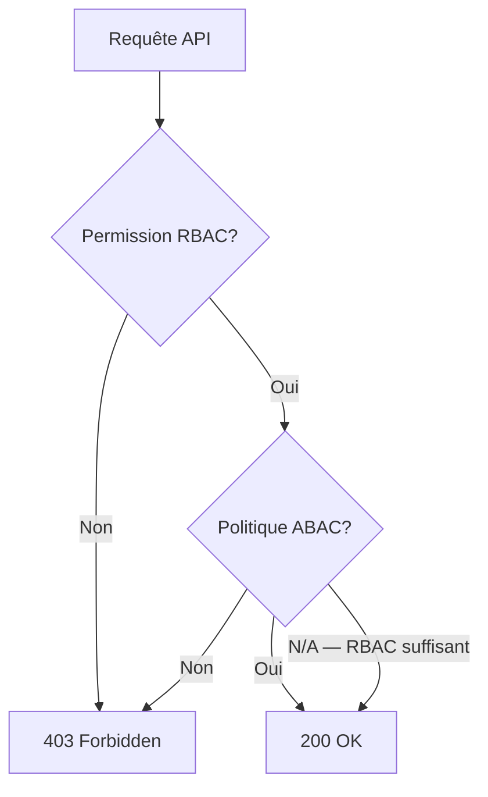
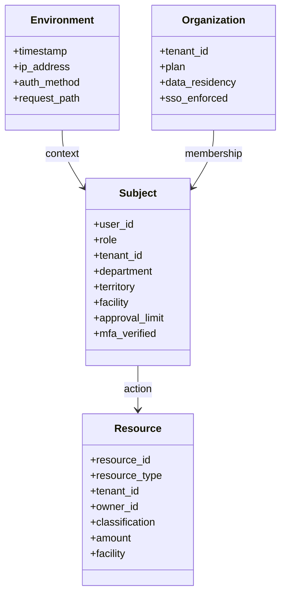
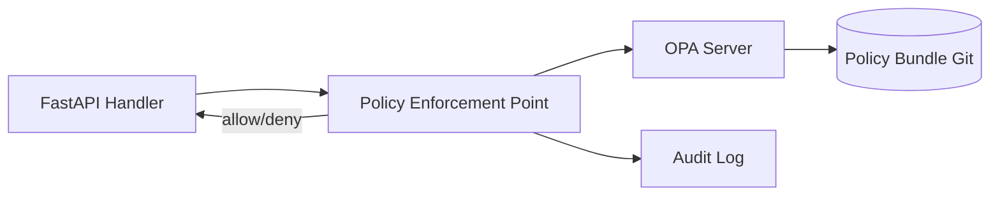
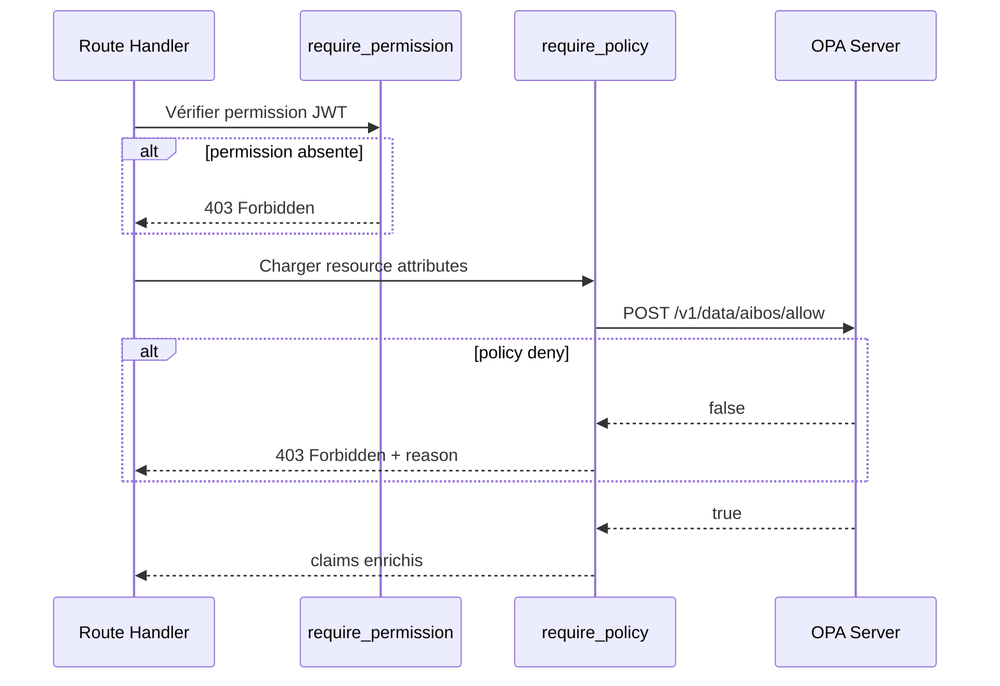

# README_17 — ABAC AI BOS

---

## Métadonnées du document

| Champ | Valeur |
|-------|--------|
| **Document** | README_17_ABAC.md |
| **Projet** | AI BOS — AI Business Operating System |
| **Version** | 0.1.0 |
| **Statut** | `DRAFT` |
| **Niveau de maturité** | `DESIGN` |
| **Audience** | Backend Engineers, Security Architects |
| **Auteur** | AI BOS Identity & Access Team |
| **Dernière mise à jour** | Juillet 2026 |
| **Documents liés** | [README_16_RBAC](README_16_RBAC.md) · [README_18_MultiTenant](README_18_MultiTenant.md) · [README_14_Security](README_14_Security.md) |
| **Référence héritage** | [SIH IA facility claim](../../backend/app/application/use_cases.py) · [SIH IA require_permission](../../backend/app/presentation/deps.py) |

---

## Table des matières

1. [Synthèse exécutive](#1-synthèse-exécutive)
2. [RBAC vs ABAC](#2-rbac-vs-abac)
3. [Modèle d'attributs](#3-modèle-dattributs)
4. [Politiques ABAC](#4-politiques-abac)
5. [Moteur de politiques OPA/Cedar](#5-moteur-de-politiques-opacedar)
6. [Modèle hybride RBAC + ABAC](#6-modèle-hybride-rbac--abac)
7. [Cas d'usage AI BOS](#7-cas-dusage-ai-bos)
8. [Intégration API](#8-intégration-api)
9. [Performance et cache](#9-performance-et-cache)
10. [Architecture Decision Records (ADR)](#10-architecture-decision-records-adr)
11. [Checklist de livraison](#11-checklist-de-livraison)

---

## 1. Synthèse exécutive

AI BOS adopte un modèle **hybride RBAC + ABAC** : le RBAC (README_16) gère 90 % des autorisations via rôles et permissions JWT ; l'ABAC intervient pour les décisions **contextuelles** nécessitant des attributs dynamiques (propriétaire de la ressource, territoire commercial, horaires, classification données, établissement santé).

Le claim `facility` de SIH IA préfigure l'ABAC : un médecin n'accède qu'aux patients de son établissement.



---

## 2. RBAC vs ABAC

| Critère | RBAC | ABAC |
|---------|------|------|
| Granularité | Rôle → permissions fixes | Attributs dynamiques |
| Performance | Excellent (JWT claims) | Évaluation runtime |
| Complexité | Faible | Modérée à élevée |
| Cas d'usage | CRUD standard | Ownership, territoire, horaires |
| Audit | Rôle dans JWT | Attributs évalués logués |

### Quand utiliser ABAC

| Scénario | RBAC seul | ABAC requis |
|----------|-----------|-------------|
| Lister tous les contacts CRM | ✅ `crm:contacts:read` | — |
| Modifier contact dont je suis owner | ⚠️ Trop permissif | ✅ `resource.owner_id == user.id` |
| Médecin SIH IA — patients établissement | ⚠️ `facility` en claim | ✅ `user.facility == patient.facility` |
| Export données hors heures bureau | ❌ | ✅ `time.hour in 9..18` |
| Facture > 10k€ — approbation manager | ❌ | ✅ `resource.amount <= user.approval_limit` |

---

## 3. Modèle d'attributs

### Catégories d'attributs



### Attributs Subject (utilisateur)

| Attribut | Source | Exemple |
|----------|--------|---------|
| `user.id` | JWT `sub` | `usr_abc` |
| `user.role` | JWT `role` | `org_manager` |
| `user.tenant_id` | JWT | `org_acme` |
| `user.department` | Profil DB | `sales-emea` |
| `user.territory` | Profil DB | `FR-IDF` |
| `user.facility` | JWT (SIH IA) | `hopital-nord` |
| `user.approval_limit` | Profil DB | `50000` |
| `user.groups` | SSO / DB | `["finance-approvers"]` |

### Attributs Resource

| Attribut | Source | Exemple |
|----------|--------|---------|
| `resource.type` | Route/handler | `contact`, `invoice` |
| `resource.tenant_id` | DB | `org_acme` |
| `resource.owner_id` | DB | `usr_xyz` |
| `resource.classification` | Metadata | `confidential`, `public` |
| `resource.amount` | DB | `15000.00` |
| `resource.facility` | DB (SIH IA) | `hopital-nord` |

### Attributs Environment

| Attribut | Source |
|----------|--------|
| `env.timestamp` | Horloge serveur UTC |
| `env.ip` | `X-Forwarded-For` |
| `env.auth_method` | JWT claim `password` / `sso` / `api_key` |
| `env.mfa_verified` | Session MFA timestamp |

### Attributs Organization

| Attribut | Source |
|----------|--------|
| `org.plan` | Subscription (README_20) |
| `org.data_residency` | Tenant config |
| `org.business_hours` | Tenant policy |
| `org.sso_enforced` | Tenant SSO config |

---

## 4. Politiques ABAC

### Format de politique (Rego — OPA)

```rego
# policies/crm_contact_update.rego
package aibos.crm

default allow = false

allow {
    input.action == "crm:contacts:update"
    input.subject.permissions[_] == "crm:contacts:update"
    input.subject.tenant_id == input.resource.tenant_id
    owner_or_manager
}

owner_or_manager {
    input.resource.owner_id == input.subject.id
}

owner_or_manager {
    input.subject.role == "org_manager"
    input.subject.department == input.resource.department
}
```

### Politique SIH IA — facility isolation

```rego
# policies/sihia_patient_read.rego
package aibos.sihia

allow {
    input.action == "sihia:patients:read"
    "sihia:patients:read" in input.subject.permissions
    input.subject.tenant_id == input.resource.tenant_id
    input.subject.facility == input.resource.facility
}
```

### Politique temporelle

```rego
# policies/business_hours.rego
package aibos.environment

deny[msg] {
    input.action == "platform:data:export"
    not business_hours
    msg := "Export autorisé uniquement en heures ouvrées"
}

business_hours {
    hour := time.clock(input.env.timestamp)[0]
    hour >= 9
    hour < 18
}
```

---

## 5. Moteur de politiques OPA/Cedar

### Comparaison

| Critère | OPA (Rego) | Cedar (AWS) |
|---------|------------|-------------|
| Maturité | Très haute | Haute (AWS ecosystem) |
| Langage | Rego (courbe apprentissage) | Cedar (plus simple) |
| Déploiement | Sidecar / service central | Verified Permissions |
| Intégration AWS | Bonne | Native |
| Open source | ✅ | ✅ (langage) |

### Architecture OPA (recommandée MVP)



| Composant | Rôle |
|-----------|------|
| **PEP** | `require_policy()` decorator FastAPI |
| **PDP** | OPA server (sidecar ou centralisé) |
| **PIP** | Policy Information Point — enrichit attributs depuis DB |
| **PAP** | Policy Administration — Git repo `policies/` |

### Évaluation

```python
async def evaluate_policy(
    subject: dict,
    action: str,
    resource: dict,
    env: dict,
) -> bool:
    input_doc = {
        "subject": subject,
        "action": action,
        "resource": resource,
        "env": env,
    }
    result = await opa_client.post("/v1/data/aibos/allow", json={"input": input_doc})
    return result.get("result", False)
```

### Cedar (phase Enterprise AWS)

Migration possible vers **Amazon Verified Permissions** pour clients 100 % AWS avec policies Cedar et intégration IAM.

---

## 6. Modèle hybride RBAC + ABAC

### Pipeline de décision



### Decorator `require_policy`

```python
def require_policy(policy_package: str) -> Callable:
    def _check(
        claims: dict = Depends(require_auth),
        request: Request = None,
        resource: dict = Depends(load_resource_attributes),
    ) -> dict:
        allowed = evaluate_policy(
            subject=claims,
            action=request.state.required_permission,
            resource=resource,
            env=build_env(request),
        )
        if not allowed:
            raise HTTPException(403, detail={"code": "POLICY_DENIED"})
        return claims
    return _check
```

### Combinaison decorators

```python
@router.patch("/crm/contacts/{id}")
def update_contact(
    id: str,
    payload: ContactUpdate,
    _claims: dict = Depends(require_permission("crm:contacts:update")),
    __claims: dict = Depends(require_policy("aibos.crm")),
):
    ...
```

---

## 7. Cas d'usage AI BOS

### CRM — ownership et territoire

| Règle | Politique |
|-------|-----------|
| Owner peut tout modifier sur ses contacts | `resource.owner_id == subject.id` |
| Manager voit son département | `subject.department == resource.department` |
| Suppression réservée admin ou owner | `action == delete → subject.role == org_admin OR owner` |

### Sales — approval workflow

| Règle | Politique |
|-------|-----------|
| Devis < 5k€ | `sales_rep` suffit (RBAC) |
| Devis 5k–50k€ | `subject.approval_limit >= amount` |
| Devis > 50k€ | `subject.groups contains "sales-directors"` |

### Finance — segregation of duties

| Règle | Politique |
|-------|-----------|
| Créateur facture ≠ approbateur | `resource.created_by != subject.id` |
| Export comptable | `business_hours AND mfa_verified` |

### SIH IA — facility (héritage)

| Règle | Politique |
|-------|-----------|
| Accès patient | `subject.facility == resource.facility` |
| Admin cross-facility | `subject.role == sihia_admin` |

### Platform — data residency

| Règle | Politique |
|-------|-----------|
| Export hors EU | `org.data_residency == EU → deny cross-region` |

---

## 8. Intégration API

### Header contexte (v2 API)

```http
PATCH /api/v2/crm/contacts/ct_123
Authorization: Bearer {jwt}
X-Policy-Context: {"intent":"update","classification":"confidential"}
```

### Réponse deny enrichie

```json
{
  "type": "https://api.aibos.io/errors/policy-denied",
  "title": "Policy Denied",
  "status": 403,
  "detail": "Export autorisé uniquement en heures ouvrées",
  "policy": "aibos.environment.business_hours",
  "correlation_id": "corr-uuid"
}
```

### Admin politiques

- `GET /api/v1/platform/policies` — liste packages (admin)
- Policies versionnées en Git, déployées via CI vers OPA bundle
- Pas d'édition runtime en production (sécurité)

---

## 9. Performance et cache

| Stratégie | Détail |
|-----------|--------|
| RBAC first | Court-circuit si permission JWT absente |
| Cache décisions | Redis 60s pour `(subject, action, resource_id)` |
| Policy bundle | Chargement au démarrage OPA ; hot-reload staging |
| Latence cible | < 5ms P99 évaluation OPA |
| Fallback | Deny si OPA indisponible (fail-closed) |

---

## 10. Architecture Decision Records (ADR)

### ADR-017-01 : Hybride RBAC + ABAC, pas ABAC pur

| Champ | Valeur |
|-------|--------|
| **Statut** | Accepté |
| **Décision** | RBAC JWT pour 90 % ; ABAC pour contexte |
| **Conséquences** | Complexité maîtrisée ; SIH IA `require_permission` conservé |

### ADR-017-02 : OPA comme moteur MVP

| Champ | Valeur |
|-------|--------|
| **Statut** | Accepté |
| **Décision** | OPA + Rego ; Cedar en option AWS Enterprise |
| **Conséquences** | Policies en Git ; sidecar ou service centralisé |

### ADR-017-03 : Fail-closed si OPA down

| Champ | Valeur |
|-------|--------|
| **Statut** | Accepté |
| **Décision** | Routes ABAC-protégées refusent si PDP indisponible |
| **Conséquences** | Disponibilité OPA critique ; HA requis prod |

### ADR-017-04 : facility SIH IA → attribut ABAC standard

| Champ | Valeur |
|-------|--------|
| **Statut** | Accepté |
| **Décision** | `user.facility` et `resource.facility` comme attributs ABAC |
| **Conséquences** | Pattern réutilisable pour territoires CRM/Sales |

---

## 11. Checklist de livraison

- [ ] Modèle d'attributs documenté (subject, resource, env, org)
- [ ] OPA déployé (dev sidecar)
- [ ] `require_policy` decorator FastAPI
- [ ] Policies CRM ownership + SIH IA facility
- [ ] Fail-closed sur indisponibilité OPA
- [ ] Cache Redis décisions ABAC
- [ ] Audit log policy denials
- [ ] Tests unitaires policies Rego
- [ ] Documentation portail dev (politiques par module)
- [ ] Runbook HA OPA production

---

*Document maintenu par l'équipe IAM AI BOS. Prochaine revue : Q3 2026.*
