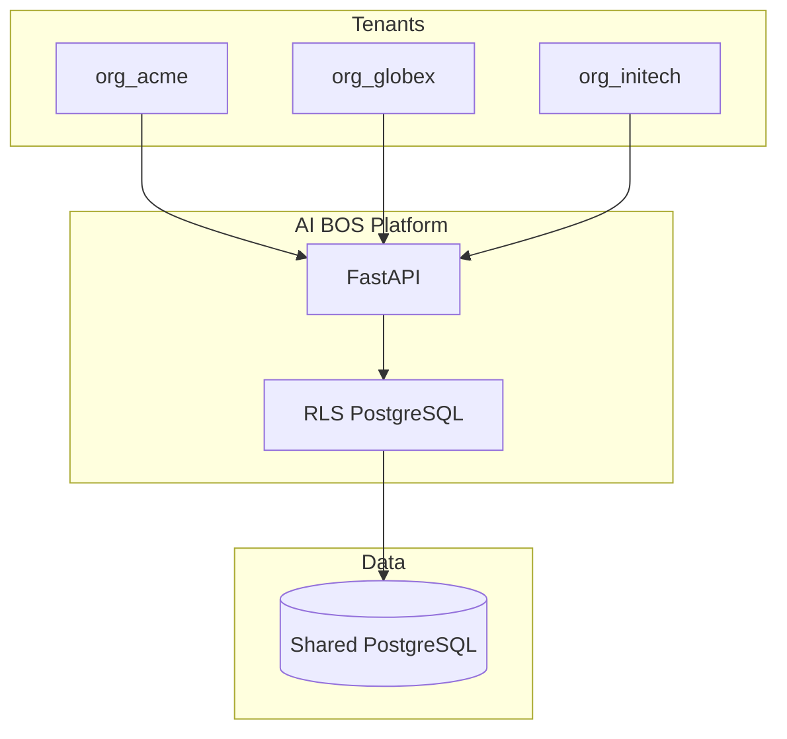
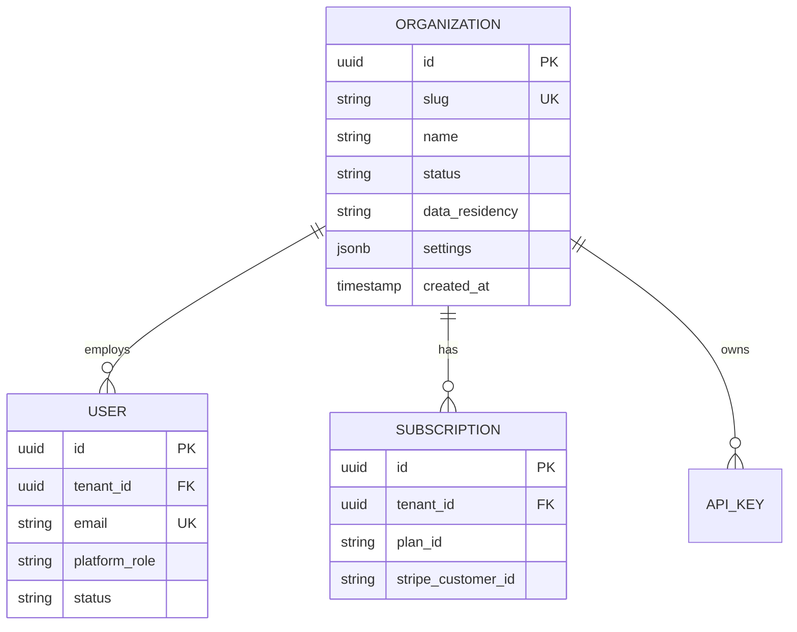
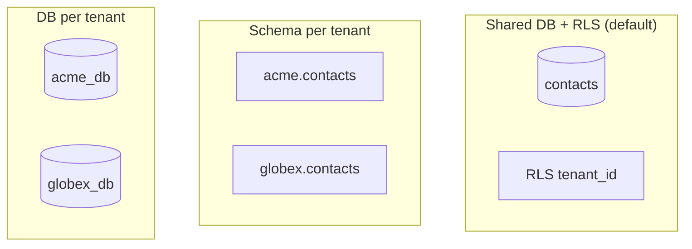
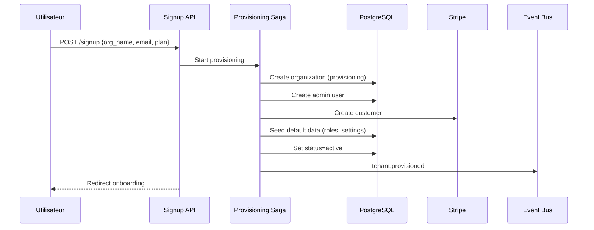
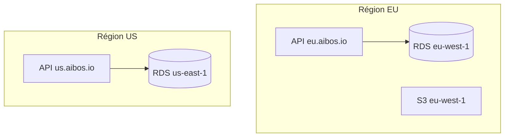

# README_18 — Multi-Tenant AI BOS

---

## Métadonnées du document

| Champ | Valeur |
|-------|--------|
| **Document** | README_18_MultiTenant.md |
| **Projet** | AI BOS — AI Business Operating System |
| **Version** | 0.1.0 |
| **Statut** | `DRAFT` |
| **Niveau de maturité** | `DESIGN` |
| **Audience** | Backend Engineers, Architects, SRE, Compliance |
| **Auteur** | AI BOS Platform Team |
| **Dernière mise à jour** | Juillet 2026 |
| **Documents liés** | [README_07_Database](README_07_Database.md) · [README_16_RBAC](README_16_RBAC.md) · [README_19_Billing](README_19_Billing.md) · [README_20_Subscriptions](README_20_Subscriptions.md) |
| **Référence héritage** | [SIH IA facility](../../backend/app/application/use_cases.py) · [SIH IA single-tenant MVP](../../Document/README_ETAT_IMPLEMENTATION.md) |

---

## Table des matières

1. [Synthèse exécutive](#1-synthèse-exécutive)
2. [Modèle organisationnel](#2-modèle-organisationnel)
3. [Stratégies d'isolation](#3-stratégies-disolation)
4. [Row-Level Security PostgreSQL](#4-row-level-security-postgresql)
5. [Schema per tenant](#5-schema-per-tenant)
6. [Provisioning tenant](#6-provisioning-tenant)
7. [Data residency](#7-data-residency)
8. [Identification tenant](#8-identification-tenant)
9. [Limites et quotas](#9-limites-et-quotas)
10. [Migration SIH IA single-tenant](#10-migration-sih-ia-single-tenant)
11. [Architecture Decision Records (ADR)](#11-architecture-decision-records-adr)
12. [Checklist de livraison](#12-checklist-de-livraison)

---

## 1. Synthèse exécutive

AI BOS est **multi-tenant by design** : chaque client est une **Organization** (tenant) isolée logiquement, avec utilisateurs, données, abonnement et configuration propres. Le modèle par défaut est **shared database + Row-Level Security (RLS)** PostgreSQL, avec option **schema per tenant** pour clients Enterprise exigeant une isolation renforcée.

SIH IA en pilote est **single-tenant** (claim `facility` pour sous-segmentation) — AI BOS généralise via `tenant_id` omniprésent.



---

## 2. Modèle organisationnel

### Entités



### Statuts organisation

| Statut | Description |
|--------|-------------|
| `provisioning` | Création en cours (saga) |
| `active` | Opérationnel |
| `suspended` | Paiement impayé / violation ToS |
| `churned` | Résilié — données en période de grâce |
| `deleted` | Soft-delete — purge programmée |

### Hiérarchie optionnelle (Enterprise)

```
Organization (tenant)
  └── Business Unit (optionnel)
        └── Team (optionnel)
              └── User
```

Le claim `facility` SIH IA mappe vers `Business Unit` ou attribut ABAC (README_17).

---

## 3. Stratégies d'isolation

### Comparaison

| Stratégie | Isolation | Coût | Complexité | Usage AI BOS |
|-----------|-----------|------|------------|--------------|
| **Shared DB + RLS** | Logique | $ | Faible | Default (Starter/Pro) |
| **Schema per tenant** | Moyenne | $$ | Modérée | Enterprise |
| **DB per tenant** | Forte | $$$$ | Élevée | Réglementé (santé dédié) |
| **Silos régionaux** | Géographique | $$$ | Élevée | Data residency EU/US |



### Matrice de décision

| Critère | Shared + RLS | Schema/tenant | DB/tenant |
|---------|--------------|---------------|-----------|
| < 1000 tenants | ✅ | Overkill | Overkill |
| 1000–10000 tenants | ✅ | Cas isolés | Non |
| Custom compliance | ⚠️ | ✅ | ✅ |
| Backup par client | ❌ | ⚠️ | ✅ |
| Coût ops | Faible | Moyen | Élevé |

---

## 4. Row-Level Security PostgreSQL

### Implémentation

```sql
-- Activation RLS sur chaque table métier
ALTER TABLE contacts ENABLE ROW LEVEL SECURITY;

CREATE POLICY tenant_isolation ON contacts
    USING (tenant_id = current_setting('app.tenant_id')::uuid);

-- Force RLS même pour le propriétaire table
ALTER TABLE contacts FORCE ROW LEVEL SECURITY;
```

### Contexte session

```python
# Middleware FastAPI — set tenant context per request
async def set_tenant_context(request: Request, call_next):
    tenant_id = resolve_tenant_id(request)  # JWT or header
    async with db.begin():
        await db.execute(text("SET LOCAL app.tenant_id = :tid"), {"tid": tenant_id})
        response = await call_next(request)
    return response
```

### Règles

1. **Toute table métier** possède `tenant_id NOT NULL`
2. Index composite `(tenant_id, id)` sur tables volumineuses
3. `platform_admin` utilise rôle DB dédié **sans bypass RLS** sauf maintenance flaggée
4. Tests automatisés : tentative cross-tenant doit échouer

### Tables exemptées RLS

| Table | Raison |
|-------|--------|
| `organizations` | Lookup tenant |
| `plans` | Catalogue global |
| `platform_config` | Config système |

---

## 5. Schema per tenant

### Cas d'usage Enterprise

- Client exigeant isolation schéma dédié
- Custom migrations par tenant (rare)
- Export/restore tenant autonome

### Implémentation

```sql
CREATE SCHEMA tenant_acme;
SET search_path TO tenant_acme, public;
-- Migrations Alembic par schéma via naming convention
```

### Connection routing

```python
def get_db_session(tenant: Organization) -> AsyncSession:
    if tenant.isolation_mode == "schema":
        schema = f"tenant_{tenant.slug}"
        return create_session(search_path=schema)
    return create_session()  # shared + RLS
```

### Limites

- Max ~500 schemas par instance PostgreSQL (monitoring requis)
- Migrations plus lentes (N schemas)
- Réservé plan **Enterprise** avec surcharge

---

## 6. Provisioning tenant

### Saga provisioning (README_12)



### Étapes détaillées

| Étape | Action | Rollback |
|-------|--------|----------|
| 1 | Créer `organizations` row | Delete org |
| 2 | Créer utilisateur admin | Delete user |
| 3 | Créer customer Stripe | Delete Stripe customer |
| 4 | Assigner plan Starter (trial) | — |
| 5 | Seed RBAC defaults | — |
| 6 | Créer schema si Enterprise | Drop schema |
| 7 | Émettre `tenant.provisioned` | — |

### API

```http
POST /api/v1/platform/organizations
{
  "name": "Acme Corp",
  "slug": "acme-corp",
  "admin_email": "admin@acme.com",
  "plan": "starter",
  "data_residency": "eu-west-1"
}
```

### Onboarding post-provisioning

1. Vérification email admin
2. Configuration SSO (optionnel Enterprise)
3. Invitation équipe
4. Activation modules (CRM, Sales, SIH IA)

---

## 7. Data residency

### Régions supportées

| Région | Code | Usage |
|--------|------|-------|
| Europe (Irlande) | `eu-west-1` | Default EU, GDPR |
| US (Virginie) | `us-east-1` | Clients US |
| Afrique (Le Cap) | `af-south-1` | Phase 3 |



### Règles residency

| Règle | Implémentation |
|-------|----------------|
| Données stockées dans région choisie | RDS + S3 même région |
| Pas de réplication cross-région par défaut | Config tenant |
| LLM calls | Route vers endpoint régional si disponible |
| Backups | Même région, chiffrés KMS régional |
| Support accès | Staff EU uniquement pour tenants EU |

### Configuration tenant

```json
{
  "tenant_id": "org_acme",
  "data_residency": "eu-west-1",
  "allow_cross_region_analytics": false
}
```

---

## 8. Identification tenant

### Sources (priorité décroissante)

| Source | Contexte |
|--------|----------|
| JWT `tenant_id` | Utilisateurs authentifiés (défaut) |
| Header `X-Tenant-Id` | API keys M2M |
| Subdomain `{slug}.aibos.io` | Shell UI (résolution → tenant_id) |
| Path `/orgs/{slug}/` | Liens partagés |

### Résolution

```python
def resolve_tenant_id(request: Request, claims: dict | None) -> str:
    if claims and claims.get("tenant_id"):
        return claims["tenant_id"]
    if api_key := request.headers.get("X-Api-Key"):
        return lookup_tenant_from_api_key(api_key)
    if slug := extract_subdomain(request):
        return lookup_tenant_from_slug(slug)
    raise HTTPException(400, "Tenant non identifié")
```

### Validation croisée

Si JWT et header présents : `jwt.tenant_id == header.tenant_id` sinon 403.

---

## 9. Limites et quotas

Quotas par plan (détail README_20) :

| Ressource | Starter | Pro | Enterprise |
|-----------|---------|-----|------------|
| Utilisateurs | 5 | 50 | Illimité |
| Stockage | 5 GB | 100 GB | Custom |
| API calls/mois | 100k | 1M | Custom |
| AI tokens/mois | 100k | 2M | Custom |

Enforcement :
- Compteurs Redis temps réel
- Hard limit → 429 / blocage action
- Soft limit → notification admin

---

## 10. Migration SIH IA single-tenant

### État actuel SIH IA

- Base SQLite single-tenant
- Claim `facility` pour établissement
- Pas de `tenant_id`

### Plan migration

| Phase | Action |
|-------|--------|
| 1 | Ajouter `tenant_id` colonnes SIH IA tables |
| 2 | Créer org default `sihia-pilot` |
| 3 | Mapper `facility` → business unit ABAC |
| 4 | Activer RLS PostgreSQL post-migration SQLite→PG |
| 5 | Namespace API `/api/v1/apps/sihia/` |

---

## 11. Architecture Decision Records (ADR)

### ADR-018-01 : Shared DB + RLS par défaut

| Champ | Valeur |
|-------|--------|
| **Statut** | Accepté |
| **Décision** | RLS PostgreSQL pour 95 % des tenants |
| **Conséquences** | Ops simples ; tests RLS obligatoires |

### ADR-018-02 : Schema per tenant option Enterprise

| Champ | Valeur |
|-------|--------|
| **Statut** | Accepté |
| **Décision** | Isolation schéma sur demande, surcoût |
| **Conséquences** | Complexité migrations ; revenue Enterprise |

### ADR-018-03 : tenant_id omniprésent

| Champ | Valeur |
|-------|--------|
| **Statut** | Accepté |
| **Décision** | UUID `tenant_id` sur toute entité métier + JWT |
| **Conséquences** | Migration SIH IA requise |

### ADR-018-04 : Data residency au provisioning

| Champ | Valeur |
|-------|--------|
| **Statut** | Accepté |
| **Décision** | Région immuable post-provisioning (sauf migration manuelle) |
| **Conséquences** | Choix irréversible client — UX claire signup |

---

## 12. Checklist de livraison

- [ ] Modèle `organizations` + statuts lifecycle
- [ ] `tenant_id` sur toutes tables métier
- [ ] RLS PostgreSQL activé et testé
- [ ] Middleware `SET LOCAL app.tenant_id`
- [ ] Saga provisioning tenant
- [ ] Résolution tenant (JWT, API key, subdomain)
- [ ] Data residency configuration
- [ ] Quotas par plan enforced
- [ ] Migration SIH IA planifiée
- [ ] Tests cross-tenant isolation (automatisés)

---

*Document maintenu par l'équipe Platform AI BOS. Prochaine revue : Q3 2026.*
