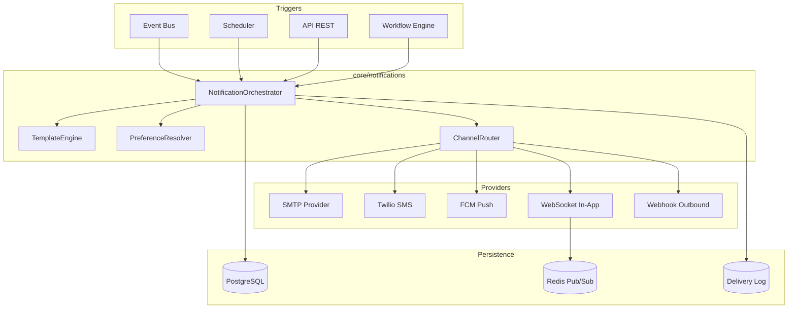

# AI BOS — Notifications multi-canal

> **Version:** 0.1.0 | **Statut:** `DESIGN` | **Maturité:** `ALPHA`  
> **Dernière mise à jour:** Juillet 2026  
> **Audience:** Backend Engineers, Product, SRE, Compliance  
> **Référence héritage:** [notification_channels.py](../../backend/app/infrastructure/notification_channels.py), [reminder_service.py](../../backend/app/application/reminder_service.py)

---

## Table des matières

1. [Objectif](#1-objectif)
2. [Évolution SIH IA → AI BOS](#2-évolution-sih-ia--ai-bos)
3. [Architecture](#3-architecture)
4. [Canaux de livraison](#4-canaux-de-livraison)
5. [Templates et personnalisation](#5-templates-et-personnalisation)
6. [Préférences utilisateur](#6-préférences-utilisateur)
7. [Suivi de livraison](#7-suivi-de-livraison)
8. [Modèle de données](#8-modèle-de-données)
9. [API](#9-api)
10. [Configuration](#10-configuration)
11. [Sécurité et conformité](#11-sécurité-et-conformité)
12. [Observabilité](#12-observabilité)
13. [ADRs](#13-adrs)
14. [Checklist de livraison](#14-checklist-de-livraison)

---

## 1. Objectif

Le module **Notifications** d'AI BOS centralise l'envoi, le suivi et la gouvernance des communications sortantes vers les utilisateurs et contacts externes. Il généralise le pattern SIH IA (rappels RDV par email/SMS) vers une plateforme **multi-tenant**, **multi-canal** et **événementielle**.

### Périmètre fonctionnel

| In scope | Out of scope (v1) |
|----------|-------------------|
| Email SMTP, SMS Twilio | WhatsApp Business API |
| Push web/mobile (FCM/APNs) | Campagnes marketing massives |
| Notifications in-app temps réel | Centre d'appels vocal |
| Templates Jinja2 + i18n | Éditeur WYSIWYG drag-and-drop |
| Préférences opt-in/opt-out | Gestion listes noires nationales (HLR lookup) |
| Journal de livraison auditable | Délivrabilité avancée (SPF/DKIM wizard) |

### Cas d'usage transverses

- Rappels et confirmations (héritage SIH IA `ReminderService`)
- Alertes opérationnelles (seuils KPI, workflows)
- Invitations utilisateur et reset mot de passe
- Notifications agent IA (réponse prête, action requise)
- Webhooks sortants vers intégrations tierces

---

## 2. Évolution SIH IA → AI BOS

| Aspect | SIH IA (actuel) | AI BOS (cible) |
|--------|-----------------|----------------|
| Canaux | Email + SMS uniquement | Email, SMS, push, in-app, webhook |
| Modes dev | `log` (fichier JSONL) | `log` + MailHog + simulateur push |
| Prod | SMTP + Twilio optionnels | Providers abstraits, failover |
| Déclenchement | Batch cron + manuel RDV | Event Bus + scheduler + API |
| Templates | Chaînes Python hardcodées | Templates versionnés par tenant |
| Préférences | Aucune | Granularité par canal et catégorie |
| Traçabilité | `reminder_log.jsonl` | Table `notification_deliveries` + métriques |
| Multi-tenant | Non | `organization_id` + quotas |

### Héritage direct

Le code SIH IA fournit des briques réutilisables :

- **`notification_channels.py`** : abstraction SMTP (TLS/SSL), Twilio, mode log, normalisation téléphone E.164 (+212 Maroc par défaut)
- **`reminder_service.py`** : orchestration batch (`run_auto_batch`), dispatch multi-canal, statuts `sent` / `skipped` / `failed`
- **`reminder_channels_status()`** : health check des providers pour `/health/details`

---

## 3. Architecture



### Composants CORE

| Module | Responsabilité |
|--------|----------------|
| `core/notifications/orchestrator` | Point d'entrée unique, idempotence |
| `core/notifications/templates` | Rendu Jinja2, variables, locales |
| `core/notifications/preferences` | Résolution opt-in, quiet hours |
| `core/notifications/channels/email` | SMTP, SendGrid adapter |
| `core/notifications/channels/sms` | Twilio, Vonage adapter |
| `core/notifications/channels/push` | FCM, APNs |
| `core/notifications/channels/in_app` | Persistance + WebSocket |
| `core/notifications/delivery` | Statuts, retries, DLQ |

### Flux type — rappel automatique (héritage SIH IA)

```
1. Scheduler déclenche run_auto_batch (fenêtre N heures avant événement)
2. Orchestrator charge entités (appointment, contact) via repositories
3. PreferenceResolver filtre canaux autorisés
4. TemplateEngine rend subject/body par canal
5. ChannelRouter dispatche en parallèle (email, sms)
6. DeliveryTracker enregistre sent | skipped | failed
7. Event Bus émet notification.delivered | notification.failed
```

---

## 4. Canaux de livraison

### 4.1 Email (SMTP)

Reprise du pattern SIH IA avec extensions :

| Paramètre | Variable env | Défaut |
|-----------|--------------|--------|
| Mode | `NOTIFICATION_EMAIL_MODE` | `log` |
| Hôte SMTP | `SMTP_HOST` | — |
| Port | `SMTP_PORT` | `587` |
| TLS | `SMTP_USE_TLS` | `true` |
| Expéditeur | `SMTP_FROM` | `noreply@aibos.io` |

**Modes supportés :**

- `log` — écriture JSONL (dev/CI), corps complet inclus
- `smtp` — envoi réel via `smtplib` (SSL port 465 ou STARTTLS)
- `sendgrid` — adapter API REST (prod recommandé)

**Bonnes pratiques prod :**

- DKIM, SPF, DMARC configurés sur le domaine d'envoi
- Sous-domaine dédié (`notifications.client.com`)
- Rate limiting par tenant (éviter blacklist)

### 4.2 SMS (Twilio)

| Paramètre | Variable env |
|-----------|--------------|
| Mode | `NOTIFICATION_SMS_MODE` (`log` \| `twilio`) |
| Account SID | `TWILIO_ACCOUNT_SID` |
| Auth Token | `TWILIO_AUTH_TOKEN` |
| Numéro émetteur | `TWILIO_FROM_NUMBER` |

Normalisation téléphone (reprise SIH IA) :

```python
# E.164 obligatoire : +[country][number]
# Conversion locale Maroc : 06xxxxxxxx → +2126xxxxxxxx
normalize_phone(value: str | None) -> str | None
```

### 4.3 Push (FCM / APNs)

| Plateforme | Provider | Token storage |
|------------|----------|---------------|
| Web | FCM | `device_tokens` table |
| Android | FCM | idem |
| iOS | APNs via FCM | idem |

Payload standard :

```json
{
  "title": "Action requise",
  "body": "Votre rapport est prêt",
  "data": {
    "notificationId": "uuid",
    "deepLink": "/reports/abc",
    "category": "workflow"
  }
}
```

### 4.4 In-app

- Persistance PostgreSQL (`in_app_notifications`)
- Diffusion temps réel via WebSocket (Redis Pub/Sub)
- Badge count sur shell UI
- Marquage lu/non lu, archivage

### 4.5 Webhook sortant (optionnel)

Pour intégrations custom : POST signé HMAC vers URL configurée par tenant.

---

## 5. Templates et personnalisation

### Structure template

```sql
CREATE TABLE notifications.templates (
    id UUID PRIMARY KEY DEFAULT gen_random_uuid(),
    organization_id UUID,              -- NULL = template système
    code TEXT NOT NULL,                -- ex: appointment.reminder
    channel TEXT NOT NULL,             -- email | sms | push | in_app
    locale TEXT NOT NULL DEFAULT 'fr',
    version INTEGER NOT NULL DEFAULT 1,
    subject_template TEXT,             -- email/push uniquement
    body_template TEXT NOT NULL,
    variables_schema JSONB NOT NULL,   -- JSON Schema des variables
    is_active BOOLEAN NOT NULL DEFAULT true,
    created_at TIMESTAMPTZ NOT NULL DEFAULT now(),
    UNIQUE (organization_id, code, channel, locale, version)
);
```

### Moteur de rendu

- **Jinja2** avec sandbox (pas d'exécution Python arbitraire)
- Variables typées validées par Pydantic avant rendu
- Fallback : template système si override tenant absent

### Exemple — rappel RDV (migration SIH IA)

```jinja2
{# appointment.reminder.email.fr #}
Bonjour {{ contact.first_name }},

Ceci est un rappel pour votre rendez-vous.
- Avec : {{ appointment.provider_name }}
- Date : {{ appointment.datetime | format_datetime('fr') }}
- Motif : {{ appointment.reason }}

Merci de vous présenter {{ appointment.arrival_offset }} minutes avant.
```

```jinja2
{# appointment.reminder.sms.fr — max 160 car. recommandé #}
{{ org.short_name }}: RDV {{ appointment.datetime | format_datetime('short') }}
avec {{ appointment.provider_name }} ({{ appointment.reason }}).
```

### Catégories de notification

| Catégorie | Exemples | Désactivable |
|-----------|----------|--------------|
| `transactional` | Reset password, facture | Non |
| `operational` | Alertes KPI, échec workflow | Partiellement |
| `reminder` | Rappels RDV, échéances | Oui |
| `marketing` | Newsletter, promos | Oui (opt-in requis) |

---

## 6. Préférences utilisateur

```sql
CREATE TABLE notifications.user_preferences (
    user_id UUID NOT NULL,
    organization_id UUID NOT NULL,
    category TEXT NOT NULL,
    channel TEXT NOT NULL,
    enabled BOOLEAN NOT NULL DEFAULT true,
    quiet_hours_start TIME,            -- ex: 22:00
    quiet_hours_end TIME,              -- ex: 07:00
    timezone TEXT NOT NULL DEFAULT 'Africa/Casablanca',
    PRIMARY KEY (user_id, organization_id, category, channel)
);
```

### Règles de résolution

1. **Transactionnel** : toujours envoyé (sauf blocage légal)
2. **Quiet hours** : mise en file d'attente jusqu'à fin de plage
3. **Opt-out marketing** : respect RGPD, preuve du consentement
4. **Hiérarchie** : user > team > organization > système

### API préférences

```
GET  /api/v1/notifications/preferences
PUT  /api/v1/notifications/preferences
POST /api/v1/notifications/preferences/bulk
```

---

## 7. Suivi de livraison

### Statuts (alignés SIH IA)

| Statut | Description |
|--------|-------------|
| `pending` | En file d'attente |
| `sent` | Remis au provider |
| `delivered` | Accusé réception (webhook provider) |
| `skipped` | Canal indisponible ou préférence désactivée |
| `failed` | Erreur provider (message dans `error`) |
| `bounced` | Email rejeté définitivement |

### Modèle delivery

```sql
CREATE TABLE notifications.deliveries (
    id UUID PRIMARY KEY DEFAULT gen_random_uuid(),
    organization_id UUID NOT NULL,
    notification_id UUID NOT NULL,
    channel TEXT NOT NULL,
    recipient TEXT NOT NULL,
    status TEXT NOT NULL,
    provider TEXT,
    provider_message_id TEXT,
    rendered_subject TEXT,
    rendered_body TEXT,
    error TEXT,
    attempt_count INTEGER NOT NULL DEFAULT 0,
    sent_at TIMESTAMPTZ,
    delivered_at TIMESTAMPTZ,
    created_at TIMESTAMPTZ NOT NULL DEFAULT now()
);

CREATE INDEX idx_deliveries_org_status ON notifications.deliveries (organization_id, status, created_at DESC);
```

### Retries et DLQ

| Tentative | Délai | Action |
|-----------|-------|--------|
| 1 | Immédiat | Envoi initial |
| 2 | 30 s | Retry exponentiel |
| 3 | 2 min | Retry |
| 4 | 10 min | Dernière tentative |
| — | — | Dead Letter Queue + alerte SRE |

### Webhooks entrants (Twilio, SendGrid)

```
POST /api/v1/notifications/webhooks/twilio/status
POST /api/v1/notifications/webhooks/sendgrid/events
```

Validation signature obligatoire ; mise à jour `deliveries.status`.

---

## 8. Modèle de données

### Entité notification (agrégat)

```sql
CREATE TABLE notifications.notifications (
    id UUID PRIMARY KEY DEFAULT gen_random_uuid(),
    organization_id UUID NOT NULL,
    template_code TEXT NOT NULL,
    category TEXT NOT NULL,
    priority TEXT NOT NULL DEFAULT 'normal',  -- low | normal | high | critical
    payload JSONB NOT NULL,
    idempotency_key TEXT,
    scheduled_at TIMESTAMPTZ,
    created_at TIMESTAMPTZ NOT NULL DEFAULT now(),
    UNIQUE (organization_id, idempotency_key)
);
```

### Idempotence

Reprise du pattern SIH IA `has_auto_reminder` :

```python
# Évite double envoi auto pour (entity_id, channel, kind)
def has_delivery(entity_type, entity_id, channel, kind) -> bool: ...
```

Clé idempotence API : header `Idempotency-Key` (UUID v4).

---

## 9. API

### Envoi unitaire

```
POST /api/v1/notifications/send
Authorization: Bearer <token>
Content-Type: application/json

{
  "templateCode": "appointment.reminder",
  "recipient": {
    "userId": "uuid",
    "email": "patient@example.com",
    "phone": "+212612345678"
  },
  "channels": ["email", "sms"],
  "variables": {
    "appointment": { "datetime": "2026-07-10T14:00:00Z", ... }
  },
  "idempotencyKey": "rem-appt-abc-email"
}
```

### Réponse

```json
{
  "notificationId": "uuid",
  "results": [
    {
      "channel": "email",
      "channelLabel": "E-mail",
      "status": "sent",
      "recipient": "patient@example.com",
      "sentAt": "2026-07-06T10:00:00Z",
      "error": null
    }
  ]
}
```

### Endpoints complémentaires

| Méthode | Route | Permission |
|---------|-------|------------|
| GET | `/api/v1/notifications` | `notifications:read` |
| GET | `/api/v1/notifications/{id}` | `notifications:read` |
| GET | `/api/v1/notifications/in-app` | `self` |
| PATCH | `/api/v1/notifications/in-app/{id}/read` | `self` |
| POST | `/api/v1/notifications/batch` | `notifications:send` |
| GET | `/api/v1/notifications/health` | `admin` |

---

## 10. Configuration

### Variables d'environnement

```bash
# Canaux
NOTIFICATION_EMAIL_MODE=log          # log | smtp | sendgrid
NOTIFICATION_SMS_MODE=log            # log | twilio
NOTIFICATION_PUSH_MODE=log           # log | fcm

# SMTP (reprise SIH IA)
SMTP_HOST=
SMTP_PORT=587
SMTP_USE_TLS=true
SMTP_USER=
SMTP_PASSWORD=
SMTP_FROM=noreply@aibos.io

# Twilio
TWILIO_ACCOUNT_SID=
TWILIO_AUTH_TOKEN=
TWILIO_FROM_NUMBER=

# FCM
FCM_PROJECT_ID=
FCM_SERVICE_ACCOUNT_JSON=

# Comportement
NOTIFICATION_DEFAULT_LOCALE=fr
NOTIFICATION_LOG_PATH=data/notification_log.jsonl
NOTIFICATION_RETRY_MAX_ATTEMPTS=4
NOTIFICATION_BATCH_SIZE=100
```

### Docker Compose (dev)

Profil `mailhog` hérité SIH IA :

```yaml
mailhog:
  profiles: [mailhog]
  image: mailhog/mailhog:v1.0.1
  ports:
    - "1025:1025"   # SMTP
    - "8025:8025"   # UI web
```

Configuration dev : `NOTIFICATION_EMAIL_MODE=smtp`, `SMTP_HOST=mailhog`, `SMTP_PORT=1025`.

---

## 11. Sécurité et conformité

| Exigence | Implémentation |
|----------|----------------|
| Chiffrement transit | TLS SMTP, HTTPS API Twilio/FCM |
| Secrets | AWS Secrets Manager / Vault |
| PII dans logs | Masquage email/téléphone en prod |
| RGPD | Opt-out, export, suppression sur demande |
| Audit | Chaque envoi tracé avec `correlation_id` |
| Rate limiting | Par tenant, par canal, par destinataire |
| Anti-spam | Quotas journaliers, validation destinataires |

### Permissions RBAC

| Permission | Description |
|------------|-------------|
| `notifications:read` | Consulter historique org |
| `notifications:send` | Envoyer manuellement |
| `notifications:admin` | Gérer templates, webhooks |
| `notifications:preferences` | Modifier ses préférences |

---

## 12. Observabilité

### Métriques Prometheus

```
notifications_sent_total{channel, status, organization}
notifications_delivery_duration_seconds{channel}
notifications_queue_depth
notifications_retry_total{channel}
```

### Health check (extension SIH IA)

```json
{
  "notifications": {
    "email": { "mode": "smtp", "ready": true, "smtpHost": "smtp.sendgrid.net" },
    "sms": { "mode": "twilio", "ready": true },
    "push": { "mode": "fcm", "ready": true }
  }
}
```

### Alertes SRE

- Taux `failed` > 5 % sur 15 min
- DLQ depth > 100
- Provider down (health `ready: false`)

---

## 13. ADRs

### ADR-021-001 : Mode log par défaut

**Décision :** En dev et CI, tous les canaux utilisent le mode `log` (fichier JSONL) sauf override explicite.  
**Contexte :** Pattern SIH IA `reminder_email_mode=log` évite envois accidentels.  
**Conséquences :** Tests déterministes ; prod exige configuration explicite.

### ADR-021-002 : Orchestrateur synchrone, envoi asynchrone

**Décision :** L'API retourne immédiatement `pending` ; l'envoi réel passe par worker Celery/ARQ.  
**Contexte :** SMTP/Twilio peuvent être lents ; éviter timeout HTTP.  
**Conséquences :** Client doit poll ou écouter WebSocket pour statut final.

### ADR-021-003 : Templates versionnés, immutables

**Décision :** Modification template = nouvelle version ; envois passés conservent le rendu original.  
**Contexte :** Audit légal, cohérence communications.  
**Conséquences :** Migration templates via script dédié.

---

## 14. Checklist de livraison

- [ ] Module `core/notifications` extrait et testé (unit + integration)
- [ ] Migration templates SIH IA `appointment.reminder` → AI BOS
- [ ] Providers SMTP/Twilio avec mode log et health check
- [ ] Table `deliveries` + API historique
- [ ] Préférences utilisateur CRUD
- [ ] In-app notifications + WebSocket
- [ ] Push FCM (web minimum)
- [ ] Retries + DLQ configurés
- [ ] Métriques et dashboards Grafana
- [ ] Documentation OpenAPI `/api/v1/notifications/*`
- [ ] Tests : `test_notification_channels.py` portés + nouveaux cas push/in-app
- [ ] Revue sécurité : masquage PII, rate limits

---

*Document maintenu par l'équipe CORE Platform — AI BOS.*
