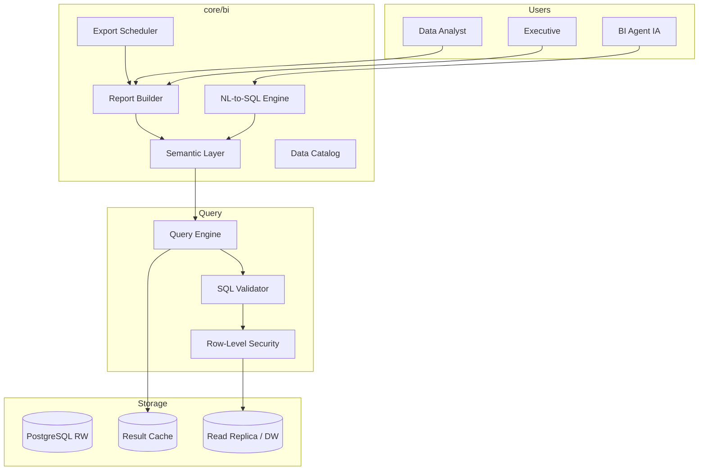

# AI BOS — Business Intelligence (BI)

> **Version:** 0.1.0 | **Statut:** `DESIGN` | **Maturité:** `CONCEPT`  
> **Dernière mise à jour:** Juillet 2026  
> **Audience:** Data Analysts, Backend Engineers, Product, Executive  
> **Référence héritage:** [analytics_service.py](../../backend/app/application/analytics_service.py), [README_24_Analytics](README_24_Analytics.md)

---

## Table des matières

1. [Objectif](#1-objectif)
2. [Positionnement Analytics vs BI](#2-positionnement-analytics-vs-bi)
3. [Architecture](#3-architecture)
4. [Couche sémantique](#4-couche-sémantique)
5. [NL-to-SQL](#5-nl-to-sql)
6. [Report Builder](#6-report-builder)
7. [Exports et distribution](#7-exports-et-distribution)
8. [Modèle de données](#8-modèle-de-données)
9. [API](#9-api)
10. [Sécurité et gouvernance](#10-sécurité-et-gouvernance)
11. [Stack technique](#11-stack-technique)
12. [ADRs](#12-adrs)
13. [Checklist de livraison](#13-checklist-de-livraison)

---

## 1. Objectif

Le module **BI** d'AI BOS permet l'**exploration analytique self-service**, la **construction de rapports** et l'interrogation en langage naturel des données métier, via une **couche sémantique** qui abstrait la complexité SQL sous-jacente.

### Capacités cibles

| Capacité | Description |
|----------|-------------|
| Semantic layer | Métriques et dimensions nommées, réutilisables |
| NL-to-SQL | Questions FR → SQL validé → résultats |
| Report builder | Rapports visuels drag-and-drop |
| Scheduled reports | Envoi PDF/Excel planifié |
| Data catalog | Découverte datasets, lineage |
| Embedded analytics | Iframe dashboards dans apps verticales |

---

## 2. Positionnement Analytics vs BI

```
┌─────────────────────────────────────────────────────────────┐
│                    PYRAMIDE ANALYTIQUE AI BOS                │
├─────────────────────────────────────────────────────────────┤
│  BI (ce module)                                              │
│  • Exploration ad-hoc, rapports exécutifs                    │
│  • Semantic layer, NL-to-SQL, cubes                          │
├─────────────────────────────────────────────────────────────┤
│  Analytics (README_24)                                       │
│  • KPIs live, alertes, dashboards opérationnels              │
├─────────────────────────────────────────────────────────────┤
│  Source de vérité : PostgreSQL + Event Store                 │
└─────────────────────────────────────────────────────────────┘
```

| Critère | Analytics | BI |
|---------|-----------|-----|
| Utilisateur | Ops, managers terrain | Analysts, direction |
| Requêtes | Pré-définies (KPI) | Ad-hoc, exploratoires |
| Latence acceptable | Secondes | Minutes |
| Modification | DevOps / YAML KPI | Analyst self-service |
| Exemple SIH IA | `GET /analytics/kpis` | « Revenus par spécialité Q2 » |

---

## 3. Architecture



### Composants CORE

| Module | Responsabilité |
|--------|----------------|
| `core/bi/semantic` | Modèles, métriques, dimensions |
| `core/bi/query` | Génération et exécution SQL |
| `core/bi/nl2sql` | LLM + validation + guardrails |
| `core/bi/reports` | Définitions rapports, rendu |
| `core/bi/exports` | Scheduling, distribution |
| `core/bi/catalog` | Metadata, lineage, glossaire |

---

## 4. Couche sémantique

### Concepts

| Concept | Définition | Exemple SIH IA |
|---------|------------|----------------|
| **Model** | Vue métier d'une entité | `Appointment`, `Patient` |
| **Dimension** | Attribut de groupement | `doctor.specialty`, `month` |
| **Metric** | Mesure agrégée | `appointment_count`, `revenue` |
| **Filter** | Prédicat réutilisable | `status != cancelled` |
| **Join** | Relation entre modèles | Patient → Appointments |

### Définition modèle (YAML)

```yaml
# semantic/models/appointment.yaml
name: appointment
label: Rendez-vous
table: appointments
organization_column: organization_id

dimensions:
  - name: status
    column: status
    type: string
  - name: appointment_date
    column: date
    type: datetime
  - name: doctor_specialty
  sql: doctors.specialty
    join: doctors ON appointments.doctor_id = doctors.id

metrics:
  - name: appointment_count
    label: Nombre de rendez-vous
    aggregation: count
    filters:
      - field: status
        operator: not_in
        values: [cancelled]
  - name: estimated_revenue
    label: Revenu estimé
    sql: "COUNT(*) * {{ config.avg_revenue_per_appointment }}"
    type: currency
    config:
      avg_revenue_per_appointment: 275    # override tenant

defaults:
  time_dimension: appointment_date
  timezone: Africa/Casablanca
```

### Métriques dérivées

```yaml
metrics:
  - name: occupancy_rate
    label: Taux d'occupation
    sql: "LEAST(100, ({{ appointment_count }} / {{ config.daily_capacity }}) * 100)"
    format: percent
```

Reprise logique `AnalyticsService.kpis()` et `monthly_revenue()`.

### Gouvernance sémantique

- **Versioning** : modèles versionnés Git + promotion staging → prod
- **Certification** : badge « certified » sur métriques validées Finance
- **Lineage** : traçabilité metric → SQL → tables sources
- **Glossaire** : définitions business en FR/EN

---

## 5. NL-to-SQL

### Pipeline

```
1. Question utilisateur (FR)
2. Context injection : schéma sémantique réduit (top-K tables pertinentes)
3. LLM génère SQL candidat
4. SQL Validator : parse, whitelist tables, pas de DDL/DML
5. Row-Level Security injection (organization_id)
6. EXPLAIN + cost estimate (reject si > seuil)
7. Exécution read-only sur replica
8. Résultat + SQL expliqué + visualisation suggérée
```

### Guardrails (inspirés chatbot SIH IA)

| Règle | Action |
|-------|--------|
| Pas de `DELETE`, `UPDATE`, `INSERT` | Rejet |
| Tables hors semantic layer | Rejet |
| Coût > 10 s estimé | Demande confirmation |
| PII columns (`email`, `phone`) | Masquage ou permission `bi:pii` |
| Requête ambiguë | Clarification interactive |

### Prompt système (extrait)

```
Tu es un assistant BI pour AI BOS. Génère uniquement du SQL SELECT PostgreSQL
en utilisant EXCLUSIVEMENT les modèles et métriques du semantic layer fourni.
Toujours filtrer par organization_id = :org_id.
Réponds en JSON : { "sql": "...", "explanation": "...", "chart_type": "bar|line|table" }
```

### Exemples requêtes

| Question naturelle | SQL généré (simplifié) |
|------------------|------------------------|
| « Revenus par mois sur 6 mois » | `SELECT month, SUM(estimated_revenue) ...` |
| « Top 5 spécialités par RDV » | `SELECT doctor_specialty, appointment_count ...` |
| « Taux annulation cette semaine » | `SELECT COUNT(*) FILTER ...` |

### Feedback loop

- Thumbs up/down sur réponses
- Correction SQL par analyst → fine-tuning examples
- Cache requêtes fréquentes (hash question normalisée)

---

## 6. Report Builder

### Structure rapport

```json
{
  "id": "uuid",
  "name": "Rapport mensuel activité",
  "layout": {
    "rows": [
      {
        "columns": [
          { "widget": "kpi", "metric": "appointment_count", "period": "this_month" },
          { "widget": "kpi", "metric": "estimated_revenue", "period": "this_month" }
        ]
      },
      {
        "columns": [
          { "widget": "chart", "type": "bar", "query": { "dimensions": ["doctor_specialty"], "metrics": ["appointment_count"] } }
        ]
      }
    ]
  },
  "filters": [
    { "dimension": "appointment_date", "operator": "last_n_months", "value": 6 }
  ]
}
```

### Widgets supportés

| Widget | Données |
|--------|---------|
| KPI card | Métrique unique + comparaison période |
| Table | Dimensions + métriques |
| Bar / Line / Pie | Chart.js / Recharts |
| Pivot | Lignes × colonnes × valeurs |
| Text | Markdown statique |
| Image | Logo, en-tête |

### Héritage exports SIH IA

Le rapport PDF analytics SIH IA devient un **template report** :

- Section « Indicateurs clés » → widgets KPI
- « Revenus mensuels » → chart line
- « Registre patients » → table paginée

---

## 7. Exports et distribution

### Modes export

| Format | Moteur | Usage |
|--------|--------|-------|
| PDF | WeasyPrint / FPDF | Rapports exécutifs |
| Excel | openpyxl | Analyse offline |
| CSV | stdlib | Intégrations |
| JSON | API | Automatisation |

### Scheduling

```sql
CREATE TABLE bi.report_schedules (
    id UUID PRIMARY KEY,
    organization_id UUID NOT NULL,
    report_id UUID NOT NULL,
    cron_expression TEXT NOT NULL,       -- "0 8 1 * *" = 1er du mois 8h
    timezone TEXT NOT NULL DEFAULT 'Africa/Casablanca',
    format TEXT NOT NULL DEFAULT 'pdf',
    recipients JSONB NOT NULL,           -- emails, roles
    is_active BOOLEAN DEFAULT true,
    last_run_at TIMESTAMPTZ,
    next_run_at TIMESTAMPTZ
);
```

### Distribution

- Email avec pièce jointe (module Notifications)
- Stockage S3 + lien presigned (module Documents)
- Webhook POST vers SI externe

---

## 8. Modèle de données

```sql
CREATE SCHEMA bi;

CREATE TABLE bi.reports (
    id UUID PRIMARY KEY,
    organization_id UUID NOT NULL,
    name TEXT NOT NULL,
    description TEXT,
    definition JSONB NOT NULL,
    created_by UUID NOT NULL,
    is_shared BOOLEAN DEFAULT false,
    created_at TIMESTAMPTZ NOT NULL DEFAULT now(),
    updated_at TIMESTAMPTZ NOT NULL DEFAULT now()
);

CREATE TABLE bi.saved_queries (
    id UUID PRIMARY KEY,
    organization_id UUID NOT NULL,
    name TEXT NOT NULL,
    natural_language_query TEXT,
    generated_sql TEXT NOT NULL,
    semantic_version TEXT NOT NULL,
    created_by UUID NOT NULL,
    created_at TIMESTAMPTZ NOT NULL DEFAULT now()
);

CREATE TABLE bi.query_executions (
    id UUID PRIMARY KEY,
    query_id UUID,
    organization_id UUID NOT NULL,
    sql_hash TEXT NOT NULL,
    duration_ms INTEGER,
    row_count INTEGER,
    status TEXT NOT NULL,
    error TEXT,
    executed_by UUID NOT NULL,
    executed_at TIMESTAMPTZ NOT NULL DEFAULT now()
);
```

---

## 9. API

### Semantic layer

```
GET  /api/v1/bi/models
GET  /api/v1/bi/models/{name}/metrics
GET  /api/v1/bi/models/{name}/dimensions
```

### Requêtes

```
POST /api/v1/bi/query
{
  "dimensions": ["doctor_specialty"],
  "metrics": ["appointment_count", "estimated_revenue"],
  "filters": [{ "field": "appointment_date", "operator": "last_n_months", "value": 6 }],
  "limit": 100
}

POST /api/v1/bi/nl-query
{ "question": "Quel est le revenu estimé par spécialité ce trimestre ?" }
```

### Rapports

```
GET    /api/v1/bi/reports
POST   /api/v1/bi/reports
GET    /api/v1/bi/reports/{id}/render?format=pdf
POST   /api/v1/bi/reports/{id}/schedule
```

### Permissions

| Permission | Accès |
|------------|-------|
| `bi:read` | Consulter rapports partagés |
| `bi:query` | Exécuter requêtes semantic |
| `bi:nl_query` | NL-to-SQL |
| `bi:write` | Créer/modifier rapports |
| `bi:admin` | Semantic layer, schedules |
| `bi:pii` | Colonnes PII non masquées |

---

## 10. Sécurité et gouvernance

### Row-Level Security

Toute requête BI injecte :

```sql
WHERE organization_id = :current_org_id
-- + ABAC policies via semantic layer
```

### Audit

- Chaque exécution SQL loggée (`query_executions`)
- Export rapports tracé
- NL-to-SQL : question + SQL stockés (rétention 90 j)

### Data masking

| Colonne | Masquage par défaut |
|---------|---------------------|
| `email` | `j***@example.com` |
| `phone` | `+212 6** *** **45` |
| `ssn` / `cin` | `***` |

---

## 11. Stack technique

| Composant | Choix | Alternative |
|-----------|-------|-------------|
| Query engine | SQLAlchemy + raw SQL | dbt metrics |
| Semantic layer | Custom YAML | Cube.js, MetricFlow |
| NL-to-SQL | LLM Gateway (GPT-4o) | Defog, Vanna |
| Report render | React + Recharts | Metabase embedded |
| DW read | PG read replica | ClickHouse (scale) |
| Cache | Redis 15 min TTL | — |

### Intégrations futures

- **dbt** : transformations warehouse
- **Apache Superset** : BI open-source embedded
- **Power BI / Tableau** : connecteurs ODBC/JDBC read replica

---

## 12. ADRs

### ADR-025-001 : Semantic layer custom vs Cube.js

**Décision :** Couche sémantique YAML native intégrée au monolithe.  
**Contexte :** Contrôle multi-tenant, NL-to-SQL tight coupling.  
**Conséquences :** Investissement initial ; pas de dépendance SaaS.

### ADR-025-002 : Read replica obligatoire prod

**Décision :** Toutes requêtes BI sur replica ; jamais le primary.  
**Contexte :** Protection OLTP, requêtes ad-hoc imprévisibles.  
**Conséquences :** Lag réplication acceptable (< 30 s).

### ADR-025-003 : NL-to-SQL avec validation stricte

**Décision :** Aucun SQL LLM exécuté sans parse + whitelist.  
**Contexte :** Risque injection, hallucinations schema.  
**Conséquences :** Latence +200 ms validation ; sécurité renforcée.

---

## 13. Checklist de livraison

- [ ] Semantic models SIH IA (appointment, patient, doctor)
- [ ] Query engine + RLS
- [ ] NL-to-SQL MVP (10 questions golden set)
- [ ] Report builder UI basique
- [ ] Export PDF/Excel (héritage SIH IA)
- [ ] Report scheduling + email
- [ ] Read replica configuré staging/prod
- [ ] Audit `query_executions`
- [ ] Permissions RBAC `bi:*`
- [ ] Documentation glossaire métriques

---

*Document maintenu par l'équipe CORE Platform — AI BOS.*
