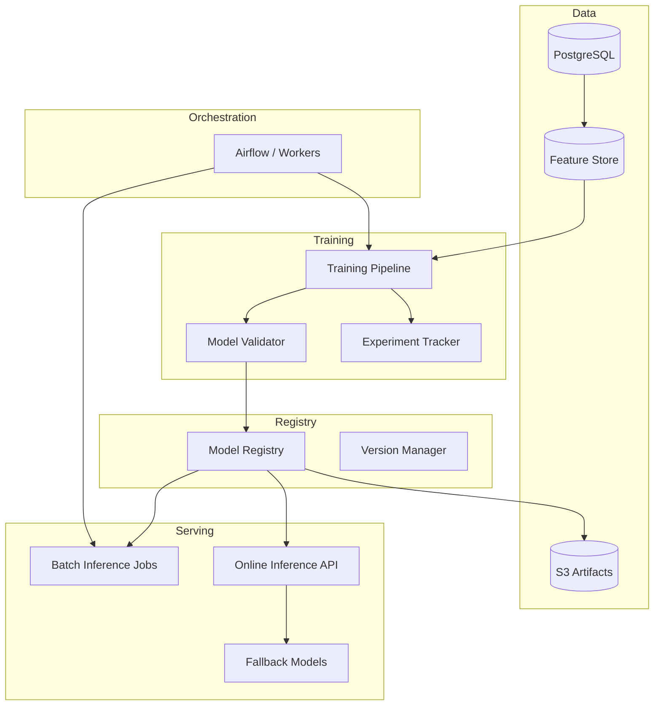

# AI BOS — Plateforme Machine Learning

> **Version:** 0.1.0 | **Statut:** `DESIGN` | **Maturité:** `ALPHA`  
> **Dernière mise à jour:** Juillet 2026  
> **Audience:** ML Engineers, Data Scientists, Backend Engineers  
> **Référence héritage:** [ml_engine.py](../../backend/app/application/ml_engine.py), [ml_service.py](../../backend/app/application/ml_service.py), [test_ml_engine.py](../../backend/tests/test_ml_engine.py)

---

## Table des matières

1. [Objectif](#1-objectif)
2. [Évolution SIH IA → AI BOS](#2-évolution-sih-ia--ai-bos)
3. [Architecture](#3-architecture)
4. [Model Registry](#4-model-registry)
5. [Feature Store](#5-feature-store)
6. [Entraînement et pipelines](#6-entraînement-et-pipelines)
7. [Inférence batch et online](#7-inférence-batch-et-online)
8. [Forecasting (héritage Prophet)](#8-forecasting-héritage-prophet)
9. [Modèle de données](#9-modèle-de-données)
10. [API](#10-api)
11. [MLOps et observabilité](#11-mlops-et-observabilité)
12. [ADRs](#12-adrs)
13. [Checklist de livraison](#13-checklist-de-livraison)

---

## 1. Objectif

La plateforme **Machine Learning** d'AI BOS centralise le cycle de vie des modèles : features, entraînement, registry, déploiement et inférence (batch + online). Elle généralise le moteur de prévision SIH IA (Prophet + régression linéaire) vers une infrastructure MLOps enterprise.

### Périmètre v1

| In scope | Phase ultérieure |
|----------|------------------|
| Forecasting séries temporelles | Computer vision |
| Model registry basique | AutoML |
| Feature store PostgreSQL | Feast + Redis online |
| Inférence sync API | Triton serving |
| Batch jobs Airflow | Spark MLlib |
| Fallback modèles simples | Deep learning custom |

---

## 2. Évolution SIH IA → AI BOS

| Aspect | SIH IA | AI BOS |
|--------|--------|--------|
| Moteur | `ml_engine.py` + `ml_service.py` | `core/ml/*` |
| Modèles | Prophet (optionnel) + linear regression | Registry multi-modèles |
| Config | `ML_USE_PROPHET`, `requirements-ml.txt` | Feature flags + plan subscription |
| Data source | `ml_data_source()` → postgresql \| sqlite | Feature store + warehouse |
| Health | `ml_engine_status()` | Model registry + drift metrics |
| Use case | Prévision affluence RDV/jour | Forecasting générique + scoring |

### Code héritage — ml_engine.py

```python
def prophet_enabled() -> bool:
    return settings.ml_use_prophet and is_prophet_installed()

def ml_engine_status() -> dict[str, str]:
    if prophet_enabled():
        return {"status": "ok", "model": "prophet", "fallback": "linear-regression", ...}
    return {"status": "ok", "model": "linear-regression", ...}
```

### Code héritage — ml_service.py

```python
# Sélection modèle avec fallback
prophet_result = _try_prophet_forecast(daily, horizon) if prophet_enabled() else None
if prophet_result:
    return forecast_values, "prophet", confidence
forecast_values = _linear_forecast(train, horizon)
return forecast_values, "linear-sqlite", confidence
```

Métriques évaluation : MAE, MAPE sur holdout.

---

## 3. Architecture



### Composants CORE

| Module | Responsabilité |
|--------|----------------|
| `core/ml/registry` | Versions modèles, stages, metadata |
| `core/ml/features` | Feature definitions, materialization |
| `core/ml/training` | Pipelines entraînement |
| `core/ml/inference` | Online + batch prediction |
| `core/ml/forecasting` | Prophet, linear, ARIMA adapters |
| `core/ml/monitoring` | Drift, performance, alerts |

---

## 4. Model Registry

### Stages de cycle de vie

```
Development → Staging → Production → Archived
```

| Stage | Usage |
|-------|-------|
| `development` | Expérimentation, non déployé |
| `staging` | Validation A/B, canary |
| `production` | Trafic live |
| `archived` | Historique, rollback possible |

### Enregistrement modèle

```python
class ModelRegistry:
    def register(
        self,
        name: str,
        version: str,
        artifact_uri: str,          # s3://bucket/models/forecast-v3.pkl
        framework: str,               # prophet | sklearn | pytorch
        metrics: dict[str, float],
        parameters: dict,
        organization_id: UUID | None = None,  # None = modèle système
    ) -> ModelVersion: ...
```

### Schéma

```sql
CREATE TABLE ml.models (
    id UUID PRIMARY KEY,
    name TEXT NOT NULL,
    organization_id UUID,              -- NULL = système
    task_type TEXT NOT NULL,           -- forecasting | classification | regression
    description TEXT,
    created_at TIMESTAMPTZ NOT NULL DEFAULT now(),
    UNIQUE (name, organization_id)
);

CREATE TABLE ml.model_versions (
    id UUID PRIMARY KEY,
    model_id UUID NOT NULL REFERENCES ml.models(id),
    version TEXT NOT NULL,
    stage TEXT NOT NULL DEFAULT 'development',
    artifact_s3_key TEXT NOT NULL,
    framework TEXT NOT NULL,
    metrics JSONB NOT NULL,
    parameters JSONB NOT NULL,
    trained_at TIMESTAMPTZ NOT NULL,
    promoted_at TIMESTAMPTZ,
    created_by UUID,
    UNIQUE (model_id, version)
);
```

### Promotion

```
POST /api/v1/ml/models/{name}/versions/{version}/promote
{ "stage": "production", "approvalNote": "MAPE < 8% sur holdout 30j" }
```

---

## 5. Feature Store

### Concepts

| Concept | Description |
|---------|-------------|
| Feature Group | Ensemble features liées (ex: `daily_appointment_counts`) |
| Feature | Colonne typée avec metadata |
| Materialization | Calcul périodique → table features |
| Point-in-time | Join correct pour training (pas de leakage) |

### Définition feature group

```yaml
# features/daily_appointment_counts.yaml
name: daily_appointment_counts
entity: organization
schedule: "0 2 * * *"              # nightly
source:
  type: sql
  query: |
    SELECT organization_id, date_trunc('day', date) AS ds, COUNT(*) AS appointment_count
    FROM appointments WHERE status != 'cancelled'
    GROUP BY 1, 2
features:
  - name: appointment_count
    type: int
    description: RDV actifs par jour
```

### Stockage

```sql
CREATE TABLE ml.feature_values (
    organization_id UUID NOT NULL,
    feature_group TEXT NOT NULL,
    entity_id TEXT NOT NULL,
    event_timestamp TIMESTAMPTZ NOT NULL,
    features JSONB NOT NULL,
    materialized_at TIMESTAMPTZ NOT NULL DEFAULT now(),
    PRIMARY KEY (organization_id, feature_group, entity_id, event_timestamp)
);
```

### Héritage SIH IA

`MlForecastService._daily_counts()` devient feature materialization :

```python
# Avant : calcul ad-hoc depuis AnalyticsService
# Après : lecture feature store + cache Redis online
features = await feature_store.get_point_in_time(
    group="daily_appointment_counts",
    organization_id=org_id,
    lookback_days=60,
)
```

---

## 6. Entraînement et pipelines

### Pipeline forecasting (Prophet)

```
1. Extract features (60-90 j historique)
2. Split train/validation (80/20 temporal)
3. Train Prophet (weekly_seasonality=True)
4. Evaluate MAE, MAPE sur validation
5. Compare vs baseline linear regression
6. Register si amélioration > seuil
7. Promote staging si tests passent
```

### Configuration Prophet (SIH IA)

```python
model = Prophet(
    daily_seasonality=False,
    weekly_seasonality=True,
    yearly_seasonality=False,
)
```

### Experiment tracking

| Champ | Stockage |
|-------|----------|
| `experiment_id` | UUID |
| `parameters` | JSONB |
| `metrics` | MAE, MAPE, confidence |
| `artifacts` | S3 plots, model pickle |
| `git_commit` | SHA code training |

### Orchestration

- **Airflow DAG** `ml_retrain_forecast` (hebdomadaire)
- **Trigger manuel** API admin
- **Event-driven** : `data.drift_detected` → retrain

---

## 7. Inférence batch et online

### Online inference

```
POST /api/v1/ml/predict/forecast
{
  "modelName": "appointment_demand",
  "horizon": 7,
  "parameters": { "lookbackDays": 60 }
}
```

Réponse (héritage SIH IA) :

```json
{
  "model": "prophet",
  "confidence": 0.9,
  "fallback": "linear-regression",
  "dataSource": "postgresql",
  "horizon": 7,
  "points": [
    { "date": "2026-07-01", "actual": 42 },
    { "date": "2026-07-08", "forecast": 45 }
  ],
  "recommendation": "Renforcer staffing mardi-jeudi"
}
```

### Batch inference

```sql
CREATE TABLE ml.batch_jobs (
    id UUID PRIMARY KEY,
    model_name TEXT NOT NULL,
    model_version TEXT NOT NULL,
    input_s3_key TEXT,
    output_s3_key TEXT,
    status TEXT NOT NULL,
    row_count INTEGER,
    started_at TIMESTAMPTZ,
    completed_at TIMESTAMPTZ
);
```

Use cases : scoring leads CRM, prévisions inventory, churn batch.

### SLA online

| Métrique | Cible p95 |
|----------|-----------|
| Latence forecast 7j | < 2 s |
| Disponibilité | 99.5 % |
| Cold start | < 5 s (model load cache) |

### Fallback chain

```
1. Production model (Prophet)
2. Staging model (si prod fail)
3. Linear regression (toujours disponible)
4. Constant baseline (dernière valeur connue)
```

---

## 8. Forecasting (héritage Prophet)

### Linear regression fallback

```python
def _linear_forecast(values: list[int], horizon: int) -> list[int]:
    # Régression OLS sur indices temporels
    slope, intercept = ...
    return [max(0, round(intercept + slope * x)) for x in range(...)]
```

### Seuils confiance

| Condition | Confidence |
|-----------|------------|
| Prophet + ≥ 14 j data | 0.90 |
| Prophet + ≥ 7 j data | 0.82 |
| Linear + ≥ 14 j | 0.78 |
| Linear + < 14 j | 0.65 |

### Recommandations métier

`MlForecastService` génère texte actionnable (staffing, capacité) — pattern conservé, templates par vertical.

### Dépendances

```
# requirements-ml.txt (SIH IA)
prophet>=1.1.5
pandas>=2.0
```

AI BOS : image Docker `backend-ml` avec deps optionnelles ; image `backend` slim sans Prophet.

---

## 9. Modèle de données

### Predictions log

```sql
CREATE TABLE ml.predictions (
    id UUID PRIMARY KEY,
    organization_id UUID NOT NULL,
    model_name TEXT NOT NULL,
    model_version TEXT NOT NULL,
    input_features JSONB NOT NULL,
    output JSONB NOT NULL,
    latency_ms INTEGER,
    requested_at TIMESTAMPTZ NOT NULL DEFAULT now()
);
```

### Drift monitoring

```sql
CREATE TABLE ml.drift_reports (
    id UUID PRIMARY KEY,
    model_name TEXT NOT NULL,
    organization_id UUID NOT NULL,
    metric_name TEXT NOT NULL,         -- feature_distribution | prediction_drift
    drift_score NUMERIC NOT NULL,
    threshold NUMERIC NOT NULL,
    is_drifted BOOLEAN NOT NULL,
    computed_at TIMESTAMPTZ NOT NULL DEFAULT now()
);
```

---

## 10. API

| Méthode | Route | Description |
|---------|-------|-------------|
| GET | `/api/v1/ml/status` | `ml_engine_status()` étendu |
| POST | `/api/v1/ml/predict/forecast` | Prévision online |
| GET | `/api/v1/ml/models` | Liste modèles |
| GET | `/api/v1/ml/models/{name}/versions` | Versions |
| POST | `/api/v1/ml/models/{name}/train` | Trigger training |
| POST | `/api/v1/ml/batch` | Job batch inference |

### Permissions

| Permission | Accès |
|------------|-------|
| `ml:predict` | Inférence online |
| `ml:read` | Consulter modèles, métriques |
| `ml:train` | Lancer entraînement |
| `ml:admin` | Promote, archive, config |

---

## 11. MLOps et observabilité

### Métriques

```
ml_predictions_total{model, status}
ml_prediction_latency_seconds{model}
ml_model_drift_score{model, metric}
ml_training_duration_seconds{model}
ml_fallback_total{model, reason}
```

### Alertes

- MAPE production > 2× validation → alerte + rollback auto staging
- Drift score > seuil → retrain recommandé
- Inference error rate > 1 %

### Health check (extension SIH IA)

```json
{
  "ml": {
    "status": "ok",
    "model": "prophet",
    "fallback": "linear-regression",
    "installed": true,
    "registryProduction": "appointment_demand@v3",
    "lastTraining": "2026-07-01T02:00:00Z"
  }
}
```

---

## 12. ADRs

### ADR-026-001 : Prophet optionnel, linear toujours présent

**Décision :** Image ML séparée ; fallback linear sans dépendance lourde.  
**Contexte :** Héritage SIH IA `ML_USE_PROPHET`.  
**Conséquences :** CI backend slim ; prod ML node dédié possible.

### ADR-026-002 : Feature store PostgreSQL v1

**Décision :** Pas de Feast v1 ; tables `ml.feature_values`.  
**Contexte :** Simplicité ops, volume modéré.  
**Conséquences :** Migration Feast si latence online < 10 ms requise.

### ADR-026-003 : Artifacts S3, pas filesystem

**Décision :** Modèles pickle/joblib sur S3 versionné.  
**Contexte :** Reproductibilité multi-instance ECS.  
**Conséquences :** Latence load ; cache local LRU.

---

## 13. Checklist de livraison

- [ ] Module `core/ml` extrait de SIH IA
- [ ] Model registry tables + API
- [ ] Feature group `daily_appointment_counts`
- [ ] Pipeline Prophet + linear portés
- [ ] API `/predict/forecast` compatible SIH IA
- [ ] Batch job skeleton Airflow
- [ ] Métriques drift + alertes
- [ ] Tests : `test_ml_engine.py` portés
- [ ] Docker image `backend-ml`
- [ ] Documentation training runbook

---

*Document maintenu par l'équipe CORE Platform — AI BOS.*
