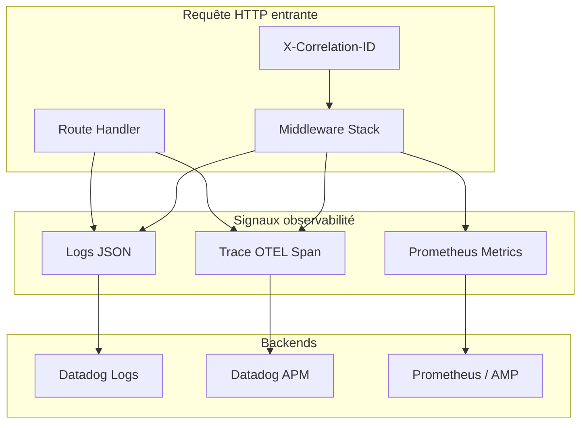
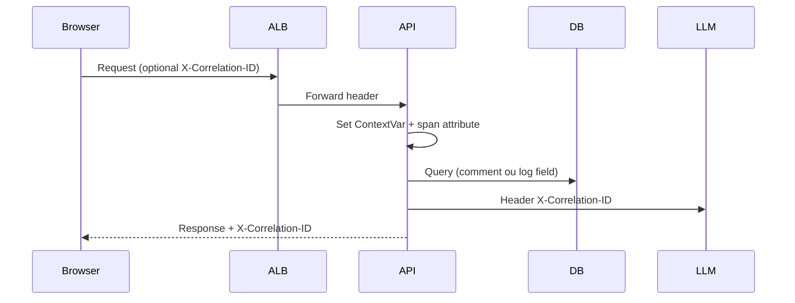
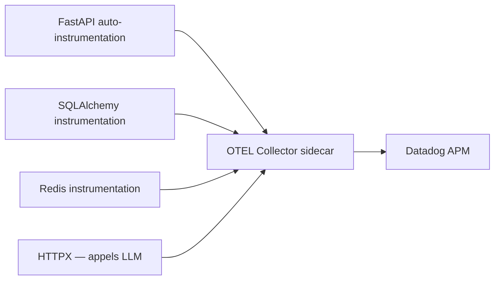

# README_32 — Observabilité AI BOS

---

## Métadonnées du document

| Champ | Valeur |
|-------|--------|
| **Document** | README_32_Observability.md |
| **Projet** | AI BOS — AI Business Operating System |
| **Version** | 0.1.0 |
| **Statut** | `REVIEW` |
| **Niveau de maturité** | `DESIGN` |
| **Audience** | Backend Engineers, SRE, Security, AI Engineers |
| **Auteur** | AI BOS Platform Engineering Team |
| **Dernière mise à jour** | Juillet 2026 |
| **Documents liés** | [README_31_Monitoring](README_31_Monitoring.md) · [README_04_Backend](README_04_Backend.md) · [README_14_Security](README_14_Security.md) |
| **Référence héritage** | `sihia-platform/backend/app/core/logging_config.py` · `metrics.py` · `health_service.py` |

---

## Table des matières

1. [Synthèse exécutive](#1-synthèse-exécutive)
2. [Les trois piliers](#2-les-trois-piliers)
3. [Logs structurés JSON](#3-logs-structurés-json)
4. [Correlation ID](#4-correlation-id)
5. [Traces OpenTelemetry](#5-traces-opentelemetry)
6. [Métriques Prometheus](#6-métriques-prometheus)
7. [Pattern /health et /health/details](#7-pattern-health-et-healthdetails)
8. [Instrumentation par module](#8-instrumentation-par-module)
9. [Sécurité et conformité des logs](#9-sécurité-et-conformité-des-logs)
10. [Développement local](#10-développement-local)
11. [Migration depuis SIH IA](#11-migration-depuis-sih-ia)
12. [ADRs](#12-adrs)
13. [Checklist](#13-checklist)

---

## 1. Synthèse exécutive

L'observabilité AI BOS repose sur trois signaux complémentaires — **logs**, **traces**, **métriques** — unifiés par un **`correlation_id`** propagé de l'ALB jusqu'aux workers et appels LLM.

**Héritage direct SIH IA** : le module `logging_config.py` (logs JSON ligne par ligne), les compteurs `metrics.py` et l'agrégateur `build_health_details()` constituent la fondation pilote déjà validée en production limitée.

| Pilier | Technologie cible | État SIH IA | État AI BOS cible |
|--------|-------------------|-------------|-------------------|
| Logs | JSON stdout → Datadog | ✅ `logging_config.py` | Réutilisation + enrichissement |
| Traces | OpenTelemetry → Datadog APM | ❌ | M4–M6 |
| Métriques | Prometheus `/metrics` | 🟡 Compteurs mémoire | M3–M5 |
| Correlation | Header `X-Correlation-ID` | ✅ Middleware | Généralisé multi-service |
| Health | `/health` + `/health/details` | ✅ Complet | Étendu par module CORE |

---

## 2. Les trois piliers



### 2.1 Quand utiliser quoi

| Besoin | Signal | Exemple |
|--------|--------|---------|
| Débugger une requête unique | Logs + Trace | « Pourquoi ce login a échoué ? » |
| Tendance latence API | Métriques | P95 dashboard sur 7 j |
| Audit conformité | Logs immuables | `event=audit.admin.user_created` |
| Capacity planning | Métriques | Requêtes/s par org |
| Debug IA | Trace + Logs | Span `rag.retrieve` + tokens |

---

## 3. Logs structurés JSON

### 3.1 Réutilisation `logging_config.py` (SIH IA)

Le module source SIH IA (`backend/app/core/logging_config.py`) fournit :

```python
def log_event(logger: logging.Logger, level: int, event: str, **fields: Any) -> None:
    payload = {
        "event": event,
        "timestamp": datetime.now(tz=timezone.utc).isoformat(),
        **fields,
    }
    logger.log(level, json.dumps(payload, ensure_ascii=False))
```

**Décision AI BOS** : extraire tel quel vers `platform/observability/logging.py` avec les adaptations suivantes :

| Changement | Raison |
|------------|--------|
| Namespace loggers `ai-bos`, `ai-bos.audit`, `ai-bos.security` | Identification plateforme |
| Champ `level` explicite dans JSON | Parsing Datadog sans inférence |
| Champ `service` obligatoire | Filtrage multi-service |
| Champ `correlation_id` injecté par middleware | Corrélation cross-signal |
| Champ `organization_id` si authentifié | Multi-tenant debugging |

### 3.2 Schéma log standard

```json
{
  "timestamp": "2026-07-06T08:30:00.123456+00:00",
  "level": "INFO",
  "event": "http.request.completed",
  "service": "ai-bos-api",
  "version": "0.1.0",
  "environment": "production",
  "correlation_id": "550e8400-e29b-41d4-a716-446655440000",
  "organization_id": "org-uuid-optional",
  "user_id": "user-uuid-optional",
  "method": "GET",
  "path": "/api/v1/patients",
  "status_code": 200,
  "duration_ms": 45.2,
  "client_ip": "203.0.113.1"
}
```

### 3.3 Catalogue d'événements (`event`)

| Catégorie | Events | Logger |
|-----------|--------|--------|
| HTTP | `http.request.started`, `http.request.completed`, `http.request.error` | `ai-bos` |
| Auth | `auth.login.success`, `auth.login.failed`, `auth.token.refreshed` | `ai-bos.security` |
| RBAC | `authz.denied` | `ai-bos.security` |
| Audit admin | `audit.admin.*` | `ai-bos.audit` |
| IA | `ai.query.started`, `ai.query.completed`, `ai.guardrail.triggered` | `ai-bos` |
| Pipeline | `pipeline.dag.completed`, `pipeline.dag.failed` | `ai-bos` |
| Worker | `worker.job.enqueued`, `worker.job.completed` | `ai-bos` |

### 3.4 Middleware logging HTTP

Inspiré de l'implémentation SIH IA dans `main.py` :

```python
@app.middleware("http")
async def logging_middleware(request: Request, call_next):
    correlation_id = request.headers.get("X-Correlation-ID") or str(uuid4())
    request.state.correlation_id = correlation_id
    started = time.perf_counter()
    log_event(logger, logging.INFO, "http.request.started",
              correlation_id=correlation_id,
              method=request.method,
              path=request.url.path)
    response = await call_next(request)
    duration_ms = round((time.perf_counter() - started) * 1000, 1)
    log_event(logger, logging.INFO, "http.request.completed",
              correlation_id=correlation_id,
              status_code=response.status_code,
              duration_ms=duration_ms)
    response.headers["X-Correlation-ID"] = correlation_id
    return response
```

### 3.5 Configuration par environnement

| Env | Format | Niveau root | Destination |
|-----|--------|-------------|-------------|
| dev | JSON (lisible) | DEBUG optionnel | stdout |
| staging | JSON | INFO | stdout → CloudWatch |
| prod | JSON | INFO | stdout → CloudWatch → Datadog |

**Règle** : jamais de secrets, tokens JWT complets, ou PHI dans les logs. Masquage PII obligatoire (voir §9).

---

## 4. Correlation ID

### 4.1 Spécification

| Attribut | Valeur |
|----------|--------|
| Header entrant | `X-Correlation-ID` |
| Header sortant | `X-Correlation-ID` (echo ou généré) |
| Format | UUID v4 recommandé ; accepter string 8–64 chars |
| Propagation | HTTP sortants (webhooks, LLM), messages queue, spans OTEL |
| Context var | `correlation_id_ctx: ContextVar[str]` |

### 4.2 Flux de propagation



### 4.3 Intégration frontend

Le client API TypeScript (`packages/api-client`) doit :

1. Générer un `correlationId` par session navigation ou par requête mutation
2. Injecter header sur chaque appel Axios/fetch
3. Afficher dans toasts d'erreur (mode support) : « Référence : abc-123 »

Héritage : pattern similaire à `httpErrors.ts` SIH IA pour UX erreurs.

### 4.4 Workers et jobs async

```python
# Enqueue avec correlation_id dans payload
await queue.enqueue("send_reminder", {
    "appointment_id": "...",
    "correlation_id": get_correlation_id(),
})
```

Le worker restaure le contexte avant exécution et log avec le même ID.

---

## 5. Traces OpenTelemetry

### 5.1 Architecture tracing



### 5.2 Spans obligatoires

| Span name | Parent | Attributs |
|-----------|--------|-----------|
| `http.request` | root | `http.method`, `http.route`, `http.status_code` |
| `db.query` | `http.request` | `db.system`, `db.statement` (sanitized) |
| `cache.get` / `cache.set` | `http.request` | `cache.key` (hashed) |
| `ai.rag.retrieve` | `http.request` | `rag.top_k`, `rag.chunks_found` |
| `ai.llm.generate` | `http.request` | `llm.model`, `llm.tokens_in`, `llm.tokens_out` |
| `worker.job` | root (async) | `job.type`, `job.id` |

### 5.3 Configuration FastAPI (cible)

```python
from opentelemetry import trace
from opentelemetry.instrumentation.fastapi import FastAPIInstrumentor
from opentelemetry.sdk.trace import TracerProvider
from opentelemetry.exporter.otlp.proto.grpc.trace_exporter import OTLPSpanExporter

def configure_tracing(app: FastAPI, service_name: str) -> None:
    provider = TracerProvider()
    provider.add_span_processor(BatchSpanProcessor(OTLPSpanExporter()))
    trace.set_tracer_provider(provider)
    FastAPIInstrumentor.instrument_app(app)
```

### 5.4 Sampling

| Env | Stratégie | Taux |
|-----|-----------|------|
| dev | AlwaysOn | 100 % |
| staging | ParentBased(TraceIdRatioBased) | 50 % |
| prod | ParentBased(TraceIdRatioBased) | 10 % default |
| prod — routes IA | Custom sampler | 25 % |
| prod — erreurs 5xx | Always sample | 100 % |

### 5.5 Corrélation logs ↔ traces

Injecter dans chaque log :

```json
{
  "trace_id": "4bf92f3577b34da6a3ce929d0e0e4736",
  "span_id": "00f067aa0ba902b7"
}
```

Datadog corrèle automatiquement si `dd.trace_id` présent (via `ddtrace` log injection).

---

## 6. Métriques Prometheus

### 6.1 Évolution depuis `metrics.py` SIH IA

SIH IA expose des compteurs en mémoire :

```python
@dataclass
class AppMetrics:
    http_requests: int = 0
    http_errors_5xx: int = 0
    auth_forbidden: int = 0
    auth_unauthorized: int = 0
```

**Migration** : remplacer par `prometheus_client` tout en gardant snapshot compatible `/health/details` pendant la transition.

### 6.2 Métriques exposées `/metrics`

| Métrique | Type | Labels | Description |
|----------|------|--------|-------------|
| `http_requests_total` | Counter | `method`, `route`, `status` | Total requêtes HTTP |
| `http_request_duration_seconds` | Histogram | `method`, `route` | Latence (buckets SLO) |
| `auth_failures_total` | Counter | `reason` | Échecs auth |
| `rbac_denials_total` | Counter | `permission` | Refus 403 |
| `ai_queries_total` | Counter | `model`, `status` | Requêtes IA |
| `ai_tokens_total` | Counter | `model`, `direction` | Tokens in/out |
| `ml_forecast_mape` | Gauge | `model_version` | MAPE courant |
| `pipeline_freshness_hours` | Gauge | `dag_id` | Âge dernière exécution |
| `db_pool_connections` | Gauge | `state` | Pool SQLAlchemy |
| `worker_jobs_total` | Counter | `job_type`, `status` | Jobs background |

### 6.3 Histogram buckets (alignés SLO P95 < 200 ms)

```python
LATENCY_BUCKETS = (
    0.005, 0.01, 0.025, 0.05, 0.1, 0.2, 0.3, 0.5, 1.0, 2.5, 5.0, 10.0
)
```

### 6.4 Endpoint `/metrics`

| Aspect | Spécification |
|--------|---------------|
| Path | `GET /metrics` |
| Format | Prometheus text exposition 0.0.4 |
| Auth | Bearer token interne ou IP allowlist (pas public Internet) |
| Cardinalité | Limiter labels `route` aux patterns template (`/api/v1/patients/{id}`) |

### 6.5 Middleware métriques

```python
http_requests_total.labels(method, route_template, status).inc()
http_request_duration_seconds.labels(method, route_template).observe(duration)
```

Synchroniser avec compteurs legacy `metrics.inc("http_requests")` jusqu'à dépréciation M6.

---

## 7. Pattern /health et /health/details

### 7.1 Héritage SIH IA

SIH IA implémente :

| Endpoint | Rôle | Réponse |
|----------|------|---------|
| `GET /health` | Liveness | `{ "status": "ok" }` |
| `GET /health/details` | Readiness enrichi | Composants + config |

Le service `build_health_details()` vérifie : database, pipeline, ml_engine, reminders, auth.

### 7.2 Spécification AI BOS

#### `GET /health` — Liveness

```json
{ "status": "ok" }
```

- **Usage** : ECS liveness probe, synthetic basique
- **Pas de dépendances externes** — répond même si DB down (pour permettre debug)

#### `GET /health/details` — Readiness

```json
{
  "status": "ok",
  "version": "0.2.0",
  "environment": "production",
  "timestamp": "2026-07-06T08:30:00+00:00",
  "correlation_id": "probe-uuid",
  "components": {
    "api": { "status": "ok" },
    "database": {
      "status": "ok",
      "type": "postgresql",
      "latency_ms": 1.8
    },
    "redis": { "status": "ok", "latency_ms": 0.5 },
    "event_bus": { "status": "ok" },
    "ai_engine": { "status": "ok", "provider": "openai" },
    "pipeline": {
      "status": "ok",
      "freshness": "ok",
      "alerts": []
    },
    "workers": { "status": "ok", "pending_jobs": 12 }
  },
  "metrics": {
    "http_requests": 154302,
    "http_errors_5xx": 3,
    "auth_unauthorized": 891,
    "auth_forbidden": 45
  },
  "config": {
    "database_url_scheme": "postgresql",
    "multi_tenant": true
  }
}
```

### 7.3 Règles agrégation status

| Condition | `status` global |
|-----------|-----------------|
| Tous composants `ok` | `ok` |
| Composant non-critique degraded (pipeline stale < 48h) | `degraded` |
| Database `error` | `degraded` |
| API process unhealthy | `error` |

### 7.4 Probes Kubernetes / ECS

| Probe | Path | Interval | Timeout | Seuil échec |
|-------|------|----------|---------|-------------|
| Liveness | `/health` | 30 s | 5 s | 3 |
| Readiness | `/health/details` | 15 s | 10 s | 2 (status != ok) |
| Startup | `/health/details` | 10 s | 30 s | 30 (cold start) |

### 7.5 Extension modulaire

Chaque module CORE enregistre un health checker :

```python
# platform/observability/health.py
class HealthRegistry:
    def register(self, name: str, checker: Callable[[], dict]) -> None: ...
    def build_details(self) -> dict: ...
```

Exemple module :

```python
health_registry.register("billing", check_stripe_connectivity)
health_registry.register("vector_db", check_pgvector_extension)
```

---

## 8. Instrumentation par module

### 8.1 Matrice instrumentation

| Module CORE | Logs | Traces | Métriques |
|-------------|------|--------|-----------|
| `identity` | `auth.*` | `auth.login` span | `auth_failures_total` |
| `authorization` | `authz.denied` | — | `rbac_denials_total` |
| `audit` | `audit.*` | — | `audit_events_total` |
| `ai.conversation` | `ai.*` | `ai.rag`, `ai.llm` | `ai_queries_total` |
| `ml` | `ml.forecast` | `ml.predict` | `ml_forecast_mape` |
| `data-pipeline` | `pipeline.*` | `pipeline.run` | `pipeline_freshness_hours` |
| `notifications` | `notification.sent` | `smtp.send` | `notifications_total` |
| `apps/sihia` | `sihia.*` | spans métier | `sihia_appointments_total` |

### 8.2 Decorator instrumentation use case

```python
def instrumented(event: str):
    def decorator(fn):
        @wraps(fn)
        async def wrapper(*args, **kwargs):
            with tracer.start_as_current_span(fn.__name__):
                log_event(logger, logging.INFO, f"{event}.started")
                try:
                    result = await fn(*args, **kwargs)
                    log_event(logger, logging.INFO, f"{event}.completed")
                    return result
                except Exception:
                    log_event(logger, logging.ERROR, f"{event}.failed", exc_info=True)
                    raise
        return wrapper
    return decorator
```

---

## 9. Sécurité et conformité des logs

### 9.1 Données interdites dans les logs

| Catégorie | Exemples | Alternative |
|-----------|----------|-------------|
| Secrets | API keys, JWT complets | `[REDACTED]` |
| PHI / données santé | Nom patient, diagnostic | `patient_id` hashé |
| PII | Email, téléphone | Masquage partiel `j***@example.com` |
| Mots de passe | Toujours | Jamais loggés |

### 9.2 Rétention

| Type | Rétention prod | Chiffrement |
|------|----------------|-------------|
| Logs applicatifs | 90 jours | At-rest AES-256 |
| Logs audit | 7 ans (archive S3 Glacier) | Immutable |
| Traces | 15 jours | At-rest |
| Métriques | 15 mois | At-rest |

### 9.3 Accès

| Rôle | Logs app | Logs audit | Traces |
|------|----------|------------|--------|
| Engineer | ✅ staging | ❌ | ✅ staging |
| SRE | ✅ prod (no PII filter) | 🟡 read-only | ✅ prod |
| Security | ✅ | ✅ | ✅ |
| Support | 🟡 filtré par org | ❌ | 🟡 par ticket |

---

## 10. Développement local

### 10.1 Stack locale

```bash
# Démarrer avec logs JSON sur stdout
LOG_FORMAT=json LOG_LEVEL=DEBUG npm run dev:all

# Vérifier health
curl http://127.0.0.1:8000/health/details | jq

# Métriques locales
curl -H "Authorization: Bearer dev-token" http://127.0.0.1:8000/metrics
```

### 10.2 Outils debug

| Outil | Usage |
|-------|-------|
| `jq` | Parser logs JSON stdout |
| Jaeger (optionnel) | Visualiser traces OTEL en dev |
| Prometheus local | Scrape `/metrics` |
| `docker compose --profile observability` | Stack complète (futur) |

### 10.3 Variables d'environnement

| Variable | Default | Description |
|----------|---------|-------------|
| `LOG_LEVEL` | `INFO` | Niveau root logger |
| `LOG_FORMAT` | `json` | `json` ou `text` (dev only) |
| `OTEL_EXPORTER_OTLP_ENDPOINT` | — | Endpoint collector |
| `OTEL_SERVICE_NAME` | `ai-bos-api` | Nom service traces |
| `OTEL_TRACES_SAMPLER` | `parentbased_traceidratio` | Stratégie sampling |
| `METRICS_ENABLED` | `true` | Expose `/metrics` |

---

## 11. Migration depuis SIH IA

### 11.1 Fichiers source → destination

| Fichier SIH IA | Module AI BOS | Action |
|----------------|---------------|--------|
| `core/logging_config.py` | `platform/observability/logging.py` | Copier + enrichir |
| `core/metrics.py` | `platform/observability/metrics.py` | Wrapper Prometheus |
| `application/health_service.py` | `platform/observability/health.py` | Registry modulaire |
| Middleware correlation | `platform/observability/middleware.py` | Extraire de `main.py` |
| `tests/test_health_details.py` | `tests/platform/test_health.py` | Adapter |

### 11.2 Plan de migration (4 semaines)

| Semaine | Livrable |
|---------|----------|
| S1 | Extraire logging + tests parité JSON |
| S2 | Correlation ID middleware + propagation frontend |
| S3 | Prometheus metrics + `/metrics` endpoint |
| S4 | OTEL tracing staging + dashboard Datadog |

### 11.3 Critères de parité

- [ ] Format log `event` + `timestamp` identique
- [ ] `/health/details` réponse backward-compatible
- [ ] Compteurs `http_requests`, `auth_*` présents dans metrics snapshot
- [ ] Tests `test_health_details.py` passent sans modification comportementale

---

## 12. ADRs

| ID | Titre | Statut |
|----|-------|--------|
| ADR-OBS-001 | Réutiliser logging_config SIH IA comme base | `APPROVED` |
| ADR-OBS-002 | OpenTelemetry comme standard tracing | `APPROVED` |
| ADR-OBS-003 | Prometheus exposition sur `/metrics` | `APPROVED` |
| ADR-OBS-004 | Conserver `/health/details` enrichi | `APPROVED` |
| ADR-OBS-005 | UUID v4 pour correlation_id | `APPROVED` |

---

## 13. Checklist

### 13.1 Nouvelle route API

- [ ] Logs `http.request.*` automatiques via middleware
- [ ] Span OTEL créé (auto-instrumentation)
- [ ] Métriques histogram + counter incrémentées
- [ ] Pas de PII dans logs manuels
- [ ] Tests vérifient presence `correlation_id` en réponse

### 13.2 Nouveau module CORE

- [ ] Health checker enregistré
- [ ] Events log catalogués dans ce document
- [ ] Métriques documentées dans README_31
- [ ] Dashboard Datadog panneau ajouté

---

*Document normatif pour toute instrumentation AI BOS. Toute déviation requiert un ADR.*
