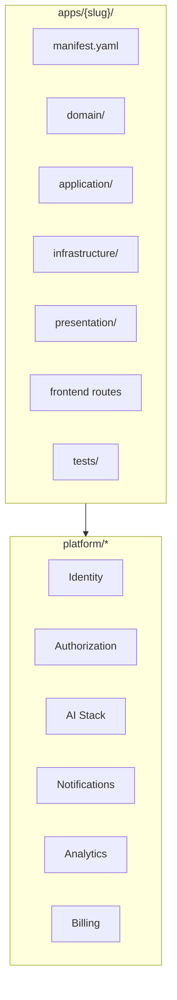

# README_36 — Applications verticales futures

---

## Métadonnées du document

| Champ | Valeur |
|-------|--------|
| **Document** | README_36_FutureApplications.md |
| **Projet** | AI BOS — AI Business Operating System |
| **Version** | 0.1.0 |
| **Statut** | `REVIEW` |
| **Niveau de maturité** | `CONCEPT` |
| **Audience** | Product, Engineering, Sales, Partners |
| **Auteur** | AI BOS Product & Platform Team |
| **Dernière mise à jour** | Juillet 2026 |
| **Documents liés** | [README_34_Roadmap](README_34_Roadmap.md) · [README_05_Core](README_05_Core.md) · [README_06_ModularArchitecture](README_06_ModularArchitecture.md) |

---

## Table des matières

1. [Synthèse exécutive](#1-synthèse-exécutive)
2. [Modèle app verticale](#2-modèle-app-verticale)
3. [Matrice réutilisation CORE](#3-matrice-réutilisation-core)
4. [SIH IA — Santé](#4-sih-ia--santé)
5. [Edu AI — Éducation](#5-edu-ai--éducation)
6. [Legal AI — Juridique](#6-legal-ai--juridique)
7. [Hotel AI — Hôtellerie](#7-hotel-ai--hôtellerie)
8. [Retail AI — Commerce](#8-retail-ai--commerce)
9. [Factory AI — Industrie](#9-factory-ai--industrie)
10. [Government AI — Secteur public](#10-government-ai--secteur-public)
11. [App Registry & activation](#11-app-registry--activation)
12. [Processus création nouvelle app](#12-processus-création-nouvelle-app)

---

## 1. Synthèse exécutive

AI BOS est une **plateforme modulaire** sur laquelle s'installent des **applications verticales** — chacune adresse un secteur métier tout en réutilisant **60 à 85 %** du CORE platform.

| Application | Slug | Priorité | Alpha | GA cible |
|-------------|------|----------|-------|----------|
| **SIH IA** | `sihia` | P0 — wedge | M4 | M12 |
| **Edu AI** | `eduai` | P1 | M19 | M21 |
| **Legal AI** | `legalai` | P1 | M22 | M24 |
| **Hotel AI** | `hotelai` | P2 | M25 | M28 |
| **Retail AI** | `retailai` | P2 | M28 | M33 |
| **Factory AI** | `factoryai` | P3 | M34 | M36+ |
| **Government AI** | `govai` | P3 | M35 | M36+ |

---

## 2. Modèle app verticale

### 2.1 Anatomie d'une app



### 2.2 `manifest.yaml` type

```yaml
slug: eduai
name: Edu AI
version: 0.1.0
description: Plateforme éducative intelligente
permissions:
  - eduai.students.read
  - eduai.students.write
  - eduai.grades.read
core_dependencies:
  - platform.identity
  - platform.authorization
  - platform.ai.conversation
  - platform.notifications
  - platform.analytics
routes_prefix: /api/v1/eduai
ui_entry: /apps/eduai
```

### 2.3 Règles d'isolation

| Règle | Description |
|-------|-------------|
| R1 | Une app ne importe jamais une autre app |
| R2 | Communication inter-apps via Event Bus uniquement |
| R3 | Tables préfixées `{slug}_*` |
| R4 | Permissions `{slug}.{resource}.{action}` |
| R5 | UI = micro-frontend chargé par Shell |

---

## 3. Matrice réutilisation CORE

| Module CORE | SIH IA | Edu | Legal | Hotel | Retail | Factory | Gov |
|-------------|--------|-----|-------|-------|--------|---------|-----|
| Identity | ✅ | ✅ | ✅ | ✅ | ✅ | ✅ | ✅ |
| RBAC | ✅ | ✅ | ✅ | ✅ | ✅ | ✅ | ✅ |
| Audit | ✅ | ✅ | ✅ | ✅ | ✅ | ✅ | ✅ |
| Notifications | ✅ | ✅ | ✅ | ✅ | ✅ | ✅ | ✅ |
| AI Conversation | ✅ | ✅ | ✅ | ✅ | ✅ | ✅ | ✅ |
| RAG / Knowledge | ✅ | ✅ | ✅ | 🟡 | 🟡 | 🟡 | ✅ |
| ML / Forecasting | ✅ | 🟡 | ❌ | ✅ | ✅ | ✅ | 🟡 |
| Analytics / BI | ✅ | ✅ | ✅ | ✅ | ✅ | ✅ | ✅ |
| Documents / OCR | 🟡 | 🟡 | ✅ | 🟡 | 🟡 | ✅ | ✅ |
| Workflow | 🟡 | ✅ | ✅ | ✅ | 🟡 | ✅ | ✅ |
| Billing | ✅ | ✅ | ✅ | ✅ | ✅ | ✅ | 🟡 |
| Data Pipeline | ✅ | 🟡 | 🟡 | 🟡 | ✅ | ✅ | 🟡 |
| i18n | ✅ | ✅ | ✅ | ✅ | ✅ | ✅ | ✅ |

**Légende** : ✅ Utilisé dès v1 · 🟡 Phase 2 · ❌ Non requis

---

## 4. SIH IA — Santé

**Slug** : `sihia` | **Statut** : En migration depuis `sihia-platform`

### 4.1 Modules métier

| Module | Description | Source SIH IA |
|--------|-------------|---------------|
| **Patients** | Dossiers patients, CRUD, historique | `use_cases.PatientsService` |
| **Médecins** | Annuaire, planning, disponibilités | `DoctorsService` |
| **Rendez-vous** | Calendrier, conflits, annulation | `AppointmentsService` |
| **Historique médical** | Visites, diagnostics | `MedicalHistoryService` |
| **Rappels** | Email/SMS RDV | `reminder_service` |
| **Dashboard santé** | KPIs clinique, alertes | Routes dashboard |
| **Prédiction affluence** | ML Prophet 7j/30j | `ml_service` |
| **Chatbot médical** | Widget H4H, guardrails | `chatbot_*` |

### 4.2 Réutilisation CORE

| Besoin app | Module CORE |
|------------|-------------|
| Login staff | `platform.identity` |
| Permissions rôles (médecin, admin) | `platform.authorization` |
| Envoi rappels | `platform.notifications` |
| Moteur chatbot | `platform.ai.conversation` |
| Guardrails médicaux | `apps/sihia/ai/medical_guardrails` (extension) |
| Knowledge RAG | `apps/sihia/data/knowledge.json` |
| Export PDF analytics | `platform.analytics` |
| Pipeline features ML | `platform.data-pipeline` |

### 4.3 Permissions

```
sihia.patients.read | write | delete
sihia.appointments.read | write | cancel
sihia.doctors.read | write
sihia.medical_history.read | write
sihia.analytics.read | export
sihia.ml.read
sihia.pipeline.admin
sihia.chatbot.use
```

### 4.4 Conformité

| Exigence | Phase |
|----------|-------|
| RGPD | M12 |
| HDS (hébergement données santé) | M30+ |
| Audit accès dossiers | M6 (hérité) |

---

## 5. Edu AI — Éducation

**Slug** : `eduai` | **Alpha** : M19 | **GA** : M21

### 5.1 Modules métier requis

| Module | Description | Priorité |
|--------|-------------|----------|
| **Students** | Élèves, inscriptions, classes | P0 |
| **Classes & cohorts** | Groupes, années scolaires | P0 |
| **Grades** | Notes, coefficients, moyennes | P0 |
| **Assessments** | Examens, devoirs, barèmes | P0 |
| **Attendance** | Présences, absences | P1 |
| **Timetable** | Emploi du temps | P1 |
| **Parent portal** | Accès parents, notifications | P1 |
| **Edu copilot** | Assistant pédagogique RAG | P0 |
| **Reports** | Bulletins, statistiques classe | P1 |
| **At-risk detection** | ML décrochage scolaire | P2 |

### 5.2 Réutilisation CORE

| Besoin | Module CORE | Adaptation |
|--------|-------------|------------|
| Auth élèves/parents/profs | `platform.identity` | Rôles `student`, `parent`, `teacher` |
| Permissions | `platform.authorization` | Namespace `eduai.*` |
| Notifications absences | `platform.notifications` | Templates éducatifs |
| Copilot devoirs | `platform.ai.conversation` | Knowledge base curricula |
| Analytics performance | `platform.analytics` | Dashboards éducation |
| RDV parents-profs | Réutiliser pattern `sihia.appointments` | Adapter domaine |
| Export bulletins PDF | `platform.analytics` | Templates Edu |
| Workflow validation notes | `platform.workflow` | M18+ |

### 5.3 Modules spécifiques (nouveaux)

```
apps/eduai/domain/
├── student.py
├── class_group.py
├── grade.py
├── assessment.py
└── attendance.py
```

### 5.4 Estimation effort

| Composant | Effort | Réutilisation |
|-----------|--------|---------------|
| CRUD students/classes | 4 sem | 70 % (pattern sihia patients) |
| Grades engine | 6 sem | 40 % |
| Edu copilot | 3 sem | 85 % (chatbot CORE) |
| Parent portal UI | 4 sem | 60 % (shell + notifications) |
| **Total** | **~17 sem** | **~65 %** |

---

## 6. Legal AI — Juridique

**Slug** : `legalai` | **Alpha** : M22 | **GA** : M24

### 6.1 Modules métier requis

| Module | Description | Priorité |
|--------|-------------|----------|
| **Cases / Matters** | Dossiers juridiques, parties | P0 |
| **Documents** | GED contrats, pièces | P0 |
| **Legal research** | RAG jurisprudence, codes | P0 |
| **Deadlines** | Échéances, alertes | P0 |
| **Time tracking** | Heures facturables | P0 |
| **Client billing** | Facturation dossiers | P1 |
| **Conflict check** | Vérification conflits intérêts | P1 |
| **E-signature** | Signature électronique | P2 |
| **Legal copilot** | Assistant rédaction | P0 |

### 6.2 Réutilisation CORE

| Besoin | Module CORE |
|--------|-------------|
| GED + versioning | `platform.documents` |
| OCR contrats | `platform.documents.ocr` |
| RAG juridique | `platform.ai.conversation` + `platform.ai.rag` |
| Deadlines / alertes | `platform.notifications` + `platform.workflow` |
| Time → billing | `platform.billing` |
| Audit accès dossiers | `platform.audit` |
| Search full-text | `platform.search` |
| Export dossier ZIP | `platform.analytics` |

### 6.3 Spécificités secteur

| Exigence | Solution |
|----------|----------|
| Secret professionnel | Chiffrement at-rest, audit strict |
| Durée conservation | Policies par type dossier |
| Multi-juridiction | Knowledge bases par pays |

### 6.4 Permissions

```
legalai.cases.read | write | archive
legalai.documents.read | write | delete
legalai.research.use
legalai.time.read | write
legalai.billing.read | write
legalai.deadlines.read | write
```

---

## 7. Hotel AI — Hôtellerie

**Slug** : `hotelai` | **Alpha** : M25 | **GA** : M28

### 7.1 Modules métier requis

| Module | Description | Priorité |
|--------|-------------|----------|
| **Reservations** | Booking, channels OTA | P0 |
| **Rooms & inventory** | Chambres, types, disponibilité | P0 |
| **Guests** | Profils clients, préférences | P0 |
| **Housekeeping** | Planning ménage, statuts chambre | P0 |
| **Front desk** | Check-in/out, clés | P0 |
| **Concierge AI** | Assistant guest multilingue | P0 |
| **Revenue management** | Pricing dynamique ML | P1 |
| **F&B integration** | Restaurant, room service | P2 |
| **Maintenance** | Tickets, équipements | P1 |

### 7.2 Réutilisation CORE

| Besoin | Module CORE | Pattern source |
|--------|-------------|----------------|
| Réservations | — | Pattern `sihia.appointments` |
| Profils guests | — | Pattern `sihia.patients` |
| Concierge chatbot | `platform.ai.conversation` | Chatbot SIH IA |
| Notifications guest | `platform.notifications` | Rappels RDV |
| Forecast occupation | `platform.ml` | Prédiction affluence |
| Dashboard GM | `platform.analytics` | Dashboard clinique |
| Workflow housekeeping | `platform.workflow` | M18+ |
| i18n | `packages/i18n` | FR/EN/AR existant |

### 7.3 Intégrations externes

| Système | Type |
|---------|------|
| Booking.com, Expedia | Channel manager API |
| Serrures connectées | IoT webhooks |
| PMS legacy | Connecteurs plugin marketplace |

---

## 8. Retail AI — Commerce

**Slug** : `retailai` | **Alpha** : M28 | **GA** : M33

### 8.1 Modules métier requis

| Module | Description | Priorité |
|--------|-------------|----------|
| **Products & catalog** | Catalogue, variantes, prix | P0 |
| **Inventory** | Stock multi-magasin | P0 |
| **POS** | Point de vente | P0 |
| **Customers** | CRM retail, fidélité | P0 |
| **Orders** | Commandes, fulfillment | P0 |
| **Clienteling AI** | Recommandations vendeur | P1 |
| **Demand forecast** | ML prévision ventes | P1 |
| **Promotions** | Campagnes, coupons | P1 |
| **E-commerce sync** | Shopify, WooCommerce | P2 |

### 8.2 Réutilisation CORE

| Besoin | Module CORE |
|--------|-------------|
| CRM clients | Pattern patients + `platform.search` |
| Forecast ventes | `platform.ml` |
| Copilot vendeur | `platform.ai.conversation` |
| Notifications promo | `platform.notifications` |
| Analytics ventes | `platform.analytics` |
| Pipeline données | `platform.data-pipeline` |
| Billing abonnements | `platform.billing` |

---

## 9. Factory AI — Industrie

**Slug** : `factoryai` | **Alpha** : M34

### 9.1 Modules métier requis

| Module | Description | Priorité |
|--------|-------------|----------|
| **Assets & equipment** | Machines, lignes production | P0 |
| **Work orders** | Ordres de fabrication | P0 |
| **Quality control** | Contrôles, non-conformités | P0 |
| **Maintenance** | Préventif, prédictif | P0 |
| **OEE dashboard** | TRS, disponibilité, performance | P0 |
| **IoT ingestion** | Capteurs, SCADA | P1 |
| **Predictive maintenance** | ML panne machine | P1 |
| **Supply chain** | Approvisionnement | P2 |

### 9.2 Réutilisation CORE

| Besoin | Module CORE |
|--------|-------------|
| ML prédictif | `platform.ml` |
| IoT events | `platform.event-bus` |
| Dashboards OEE | `platform.analytics` |
| Alertes maintenance | `platform.notifications` |
| Workflows production | `platform.workflow` |
| Documents techniques | `platform.documents` |
| Vision QC (futur) | `platform.ai.vision` |

### 9.3 Spécificités

| Exigence | Solution |
|----------|----------|
| Latence edge | Workers locaux + sync cloud |
| Offline | Queue events, réconciliation |
| Normes ISO | Audit trail complet |

---

## 10. Government AI — Secteur public

**Slug** : `govai` | **Alpha** : M35

### 10.1 Modules métier requis

| Module | Description | Priorité |
|--------|-------------|----------|
| **Citizen records** | Dossiers administratifs | P0 |
| **Case management** | Demandes, instructions | P0 |
| **Document workflow** | Circuit validation | P0 |
| **Appointments** | RDV mairie, préfecture | P0 |
| **Public chatbot** | FAQ citoyenne multilingue | P0 |
| **Transparency** | Open data, registres | P1 |
| **Inter-agency** | Échange sécurisé | P2 |

### 10.2 Réutilisation CORE

| Besoin | Module CORE |
|--------|-------------|
| Dossiers citoyens | Pattern patients (données sensibles) |
| RDV | `sihia.appointments` pattern |
| Chatbot public | `platform.ai.conversation` |
| Workflow validation | `platform.workflow` |
| Audit légal | `platform.audit` |
| RBAC granulaire | `platform.authorization` + ABAC M31 |
| Archivage | `platform.documents` |

### 10.3 Conformité

| Exigence | Phase |
|----------|-------|
| RGPD renforcé | M31 |
| RGS (référentiel général sécurité) | M36+ |
| Hébergement souverain | SecNumCloud partenaire |
| Accessibilité RGAA | M24 (transverse) |

---

## 11. App Registry & activation

### 11.1 Registre central

```python
# apps/registry.py
class AppRegistry:
  def register(self, app: AppDefinition) -> None: ...
  def get_active_apps(self, organization_id: str) -> list[AppDefinition]: ...
  def is_enabled(self, slug: str, organization_id: str) -> bool: ...
```

### 11.2 Activation par organisation

| Plan | Apps incluses | Apps add-on |
|------|---------------|-------------|
| Starter | 1 au choix | — |
| Pro | 2 | +50 €/app/mois |
| Enterprise | Illimité | Inclus |

### 11.3 Routing dynamique

```
/api/v1/{app_slug}/*  → apps.{slug}.presentation
/apps/{slug}/*        → micro-frontend
```

---

## 12. Processus création nouvelle app

### 12.1 Checklist (8 étapes)

1. [ ] Product brief + 3 design partners
2. [ ] `manifest.yaml` + permissions définies
3. [ ] `AppDefinition` + `router_factory()`
4. [ ] Domain model + migrations Alembic `apps_{slug}/`
5. [ ] Routes API + tests isolation tenant
6. [ ] Micro-frontend + menu Shell
7. [ ] Knowledge base IA (si copilot)
8. [ ] Documentation `apps/{slug}/README.md`

### 12.2 Template repository

```
apps/_template/
├── manifest.yaml
├── __init__.py          # AppDefinition stub
├── domain/
├── application/
├── infrastructure/
├── presentation/
└── tests/
```

### 12.3 Critères succès nouvelle app

| Métrique | Cible |
|----------|-------|
| Réutilisation CORE | ≥ 70 % |
| Time-to-market | < 5 mois |
| Tests couverture | ≥ 70 % |
| 3 clients pilotes | Avant GA |

---

## Annexes

### A. Comparaison effort relatif

| App | Effort relatif | Réutilisation CORE |
|-----|----------------|-------------------|
| SIH IA | 100 % (référence) | 40 % (source) |
| Edu AI | 60 % | 75 % |
| Legal AI | 70 % | 70 % |
| Hotel AI | 55 % | 80 % |
| Retail AI | 65 % | 75 % |
| Factory AI | 80 % | 65 % |
| Government AI | 85 % | 70 % |

### B. Documents liés

- [README_34_Roadmap](README_34_Roadmap.md) — timeline M1–M36
- [README_35_MigrationFromSIHIA](README_35_MigrationFromSIHIA.md) — migration SIH IA
- [README_05_Core](README_05_Core.md) — spécification CORE

---

*Catalogue vivant — nouvelles verticales soumises à framework RICE et validation Product Board.*
