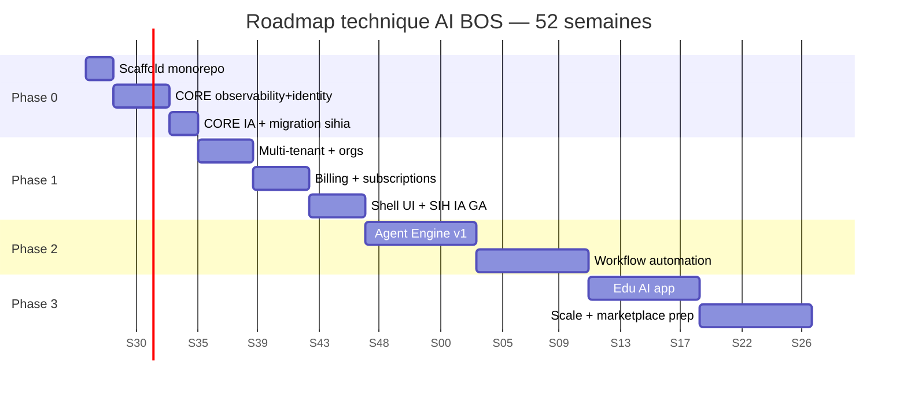

# README_40 — Roadmap d'implémentation technique (52 semaines)

---

## Métadonnées du document

| Champ | Valeur |
|-------|--------|
| **Document** | README_40_ImplementationRoadmap.md |
| **Projet** | AI BOS — AI Business Operating System |
| **Version** | 0.1.0 |
| **Statut** | `REVIEW` — plan d'exécution engineering |
| **Niveau de maturité** | `DESIGN` |
| **Audience** | Engineering, Tech Leads, Scrum Masters, Product |
| **Auteur** | AI BOS Engineering & Delivery Team |
| **Dernière mise à jour** | Juillet 2026 |
| **Documents liés** | [README_34_Roadmap](README_34_Roadmap.md) · [README_35_MigrationFromSIHIA](README_35_MigrationFromSIHIA.md) · [README_39_ProjectStructure](README_39_ProjectStructure.md) |

---

## Table des matières

1. [Synthèse exécutive](#1-synthèse-exécutive)
2. [Équipe et capacité](#2-équipe-et-capacité)
3. [Vue d'ensemble 52 semaines](#3-vue-densemble-52-semaines)
4. [Phase 0 — Scaffold & extraction CORE (S1–S8)](#4-phase-0--scaffold--extraction-core-s1s8)
5. [Phase 1 — Platform MVP (S9–S20)](#5-phase-1--platform-mvp-s9s20)
6. [Phase 2 — Agents & automation (S21–S36)](#6-phase-2--agents--automation-s21s36)
7. [Phase 3 — Verticales & scale (S37–S52)](#7-phase-3--verticales--scale-s37s52)
8. [Planning sprint par sprint](#8-planning-sprint-par-sprint)
9. [Jalons techniques](#9-jalons-techniques)
10. [Risques et buffers](#10-risques-et-buffers)
11. [Definition of Done par phase](#11-definition-of-done-par-phase)

---

## 1. Synthèse exécutive

Ce document traduit la [roadmap produit M1–M12](README_34_Roadmap.md) en **plan technique exécutable semaine par semaine** sur **52 semaines** (année 1), organisé en 4 phases :

| Phase | Semaines | Objectif | Jalon |
|-------|----------|----------|-------|
| **Phase 0** | S1–S8 | Extraire CORE depuis SIH IA | CORE Extracted (S8) |
| **Phase 1** | S9–S20 | Platform MVP multi-tenant + SIH IA GA | Platform GA (S20) |
| **Phase 2** | S21–S36 | Agent Engine + workflows | Intelligent OS (S36) |
| **Phase 3** | S37–S52 | Edu AI + scale prep | Multi-vertical (S52) |

**Source** : dépôt [`sihia-platform`](../../) — 68 tests pytest, 8 E2E Playwright, ~95 % MVP fonctionnel.

---

## 2. Équipe et capacité

### 2.1 Composition équipe cible

| Rôle | FTE | Focus phases |
|------|-----|--------------|
| Tech Lead / Architect | 1 | Architecture, revue, ADR |
| Backend Senior | 2 | CORE extraction, platform |
| Backend Mid | 1 | Apps sihia, tests |
| Frontend Senior | 1 | Shell UI, micro-frontends |
| DevOps / SRE | 0.5 | CI/CD, infra, monitoring |
| AI Engineer | 0.5 | Chatbot, RAG, agents |
| **Total** | **6 FTE** | |

### 2.2 Capacité sprint

| Paramètre | Valeur |
|-----------|--------|
| Sprint duration | 2 semaines |
| Sprints année 1 | 26 |
| Velocity cible | 40 story points / sprint |
| Buffer intégré | 15 % (sprints S8, S20, S36, S52) |

### 2.3 Répartition capacité par phase

| Phase | % capacité CORE | % apps | % infra/DevOps |
|-------|-----------------|--------|----------------|
| Phase 0 | 70 % | 25 % | 5 % |
| Phase 1 | 50 % | 35 % | 15 % |
| Phase 2 | 40 % | 30 % | 30 % |
| Phase 3 | 30 % | 50 % | 20 % |

---

## 3. Vue d'ensemble 52 semaines



---

## 4. Phase 0 — Scaffold & extraction CORE (S1–S8)

**Objectif** : Monorepo opérationnel, CORE extrait de SIH IA, app sihia fonctionnelle sur nouvelle architecture.

### S1 — Scaffold monorepo

| ID | Tâche | Owner | Livrable |
|----|-------|-------|----------|
| S1-01 | Créer repo `ai-bos`, structure racine | Tech Lead | Arborescence README_39 |
| S1-02 | Configurer `pyproject.toml`, Ruff, mypy | Backend | Lint backend |
| S1-03 | Configurer pnpm workspaces + turbo | Frontend | `frontend/package.json` |
| S1-04 | Docker Compose postgres + redis | DevOps | `infra/docker-compose.yml` |
| S1-05 | CI GitHub Actions skeleton | DevOps | `ci-backend.yml`, `ci-frontend.yml` |
| S1-06 | import-linter contracts | Tech Lead | Boundaries enforced |

**Critère fin S1** : `pnpm install` + `pip install` + CI verte (smoke).

### S2 — CORE config & observability

| ID | Tâche | Source SIH IA | Destination |
|----|-------|---------------|-------------|
| S2-01 | Extraire `config.py` | `core/config.py` | `platform/config/settings.py` |
| S2-02 | Extraire logging JSON | `logging_config.py` | `platform/observability/logging.py` |
| S2-03 | Extraire metrics | `metrics.py` | `platform/observability/metrics.py` |
| S2-04 | Extraire health | `health_service.py` | `platform/observability/health.py` |
| S2-05 | Middleware correlation ID | `main.py` | `platform/observability/middleware.py` |
| S2-06 | Routes `/health`, `/health/details` | — | `platform/observability/routes.py` |
| S2-07 | Tests health | `test_health_details.py` | `tests/platform/observability/` |

**Critère fin S2** : `/health/details` répond identique à SIH IA.

### S3 — CORE identity & security

| ID | Tâche | Source SIH IA |
|----|-------|---------------|
| S3-01 | Extraire `security.py` | JWT, bcrypt |
| S3-02 | Extraire AuthService | `use_cases.py` |
| S3-03 | Routes auth login/refresh/logout | `routes.py` |
| S3-04 | Rate limit login | `rate_limit.py` |
| S3-05 | User domain + repository | `models.py`, `repositories.py` |
| S3-06 | Tests auth | `test_auth_security.py`, `test_auth_rate_limit.py` |

### S4 — CORE authorization (RBAC)

| ID | Tâche | Source SIH IA |
|----|-------|---------------|
| S4-01 | Extraire `rbac_service.py` | Permissions JWT |
| S4-02 | Decorator `require_permission` | `deps.py` |
| S4-03 | Admin CRUD users/roles | Routes admin |
| S4-04 | Tests RBAC | `test_rbac_*.py` |

### S5 — CORE audit & notifications

| ID | Tâche | Source SIH IA |
|----|-------|---------------|
| S5-01 | Audit JSONL writer | `audit_log.py` |
| S5-02 | Export audit API | `audit.py`, admin routes |
| S5-03 | SMTP + Twilio channels | `notification_channels.py` |
| S5-04 | Tests audit + notifications | `test_admin_audit_logs.py`, `test_notification_channels.py` |

### S6 — CORE AI conversation (chatbot)

| ID | Tâche | Source SIH IA |
|----|-------|---------------|
| S6-01 | Chatbot service + RAG | `chatbot_service.py` |
| S6-02 | Guardrails base | `chatbot_guardrails.py` |
| S6-03 | SSE routes | `chatbot_routes.py` |
| S6-04 | Session store Redis | `chatbot_session_store.py` |
| S6-05 | Widget auth | `chatbot_auth.py` |
| S6-06 | Tests chatbot | `test_chatbot.py` |

### S7 — CORE ML & data pipeline

| ID | Tâche | Source SIH IA |
|----|-------|---------------|
| S7-01 | ML engine Prophet | `ml_engine.py` |
| S7-02 | ML service + routes | `ml_service.py` |
| S7-03 | Pipeline service | `pipeline_service.py` |
| S7-04 | Analytics + export | `analytics_service.py` |
| S7-05 | Tests ML + pipeline | `test_ml_*.py`, `test_pipeline.py` |

### S8 — App sihia backend + buffer

| ID | Tâche | Source SIH IA |
|----|-------|---------------|
| S8-01 | Domain patients, doctors, appointments | `models.py` split |
| S8-02 | Services métier | `use_cases.py` split |
| S8-03 | Repositories Postgres | `repositories.py` |
| S8-04 | Routes sihia | `routes.py` split |
| S8-05 | Reminder hooks | `reminder_service.py` |
| S8-06 | Medical guardrails | Extension chatbot |
| S8-07 | App Registry + manifest | Nouveau |
| S8-08 | Migrations Alembic namespacées | `alembic/versions/` |
| S8-09 | **Buffer** : fix dette, tests parité | — |
| S8-10 | Tests app sihia complets | 20 tests backend |

**🎯 Jalon S8 — CORE Extracted** :
- [ ] 68/68 tests pytest passent
- [ ] import-linter 0 violations
- [ ] `/health/details` ok
- [ ] Chatbot SSE fonctionnel staging

---

## 5. Phase 1 — Platform MVP (S9–S20)

**Objectif** : Multi-tenant, billing, Shell UI, SIH IA GA production.

### S9–S10 — Multi-tenant & organizations

| ID | Tâche | Détail |
|----|-------|--------|
| S9-01 | Table `core_organizations` | Migration platform |
| S9-02 | `organization_id` sur tables sihia | Migration additive |
| S9-03 | RLS PostgreSQL policies | Isolation tenant |
| S9-04 | Organization service + API | CRUD orgs |
| S9-05 | Invitation users par org | Email flow |
| S9-06 | Tests isolation tenant | Tenant A ≠ Tenant B |

### S11–S12 — Frontend extraction

| ID | Tâche | Source SIH IA |
|----|-------|---------------|
| S11-01 | Package `@ai-bos/ui` | `components/ui/*` |
| S11-02 | Package `@ai-bos/api-client` | `lib/api/*` |
| S11-03 | Package `@ai-bos/auth` | `lib/auth/*` |
| S11-04 | Package `@ai-bos/i18n` | `lib/i18n/*` |
| S11-05 | Shell UI layout | `components/layout/*` |
| S12-01 | Micro-frontend sihia routes | `routes/_app/*` |
| S12-02 | SihiaChatbot + branding | `components/chatbot/*` |
| S12-03 | App loader dynamique | Nouveau |
| S12-04 | Tests E2E migration | 8 Playwright |

### S13–S14 — Billing & subscriptions

| ID | Tâche | Détail |
|----|-------|--------|
| S13-01 | Stripe integration | Checkout, webhooks |
| S13-02 | Plans Starter/Pro/Enterprise | Config |
| S13-03 | Subscription service | Par org |
| S13-04 | Feature flags par plan | Quotas IA |
| S14-01 | Usage metering IA | Tokens, requêtes |
| S14-02 | Admin billing UI | Shell settings |
| S14-03 | Tests billing | Mock Stripe |

### S15–S16 — Observability production

| ID | Tâche | Référence |
|----|-------|-----------|
| S15-01 | Prometheus `/metrics` | README_32 |
| S15-02 | OpenTelemetry tracing staging | README_32 |
| S15-03 | Datadog integration | README_31 |
| S16-01 | CloudWatch alarms | README_31 |
| S16-02 | SLO monitors | 99.5 % staging |
| S16-03 | Synthetic checks | `/health/details` |

### S17–S18 — DevOps & staging

| ID | Tâche | Détail |
|----|-------|--------|
| S17-01 | Terraform staging AWS | ECS, RDS, Redis |
| S17-02 | Docker image CI build | Single image CORE+apps |
| S17-03 | Deploy staging auto | GitHub Actions |
| S18-01 | Load test k6 baseline | README_33 |
| S18-02 | Migration données pilotes | README_35 script |
| S18-03 | Zero-downtime cutover dry-run | Rollback testé |

### S19–S20 — SIH IA GA + buffer

| ID | Tâche | Détail |
|----|-------|--------|
| S19-01 | Production deploy | Blue/green |
| S19-02 | Pilotes UAT (5 cliniques) | Sign-off |
| S19-03 | Status page setup | README_31 |
| S19-04 | Documentation utilisateur | Guides |
| S20-01 | **Buffer** : fixes production | — |
| S20-02 | Post-mortem migration | Blameless |
| S20-03 | Archivage `sihia-platform` | Read-only |

**🎯 Jalon S20 — Platform GA** :
- [ ] 50+ orgs (dont payantes)
- [ ] SLO 99.5 % staging validé
- [ ] 8/8 E2E passent prod
- [ ] Monitoring Datadog opérationnel

---

## 6. Phase 2 — Agents & automation (S21–S36)

**Objectif** : Agent Engine, workflows, différenciation IA.

### S21–S24 — Agent Engine v1

| Semaine | Livrable |
|---------|----------|
| S21 | Agent domain model, registry, personas config |
| S22 | Tool calling framework (API CORE + app) |
| S23 | Memory short-term (session) + long-term (pgvector) |
| S24 | Agent orchestration simple (sequential) |

| ID | Tâche | Détail |
|----|-------|--------|
| S21-01 | `platform/ai/agents/` module scaffold | |
| S21-02 | Persona YAML schema | Config par org |
| S22-01 | Tool registry + executor | OpenAPI tools |
| S22-02 | Safety guardrails agents | Héritage chatbot |
| S23-01 | Memory store pgvector | Par user/org |
| S24-01 | Agent API routes | `/api/v1/agents/` |
| S24-02 | Tests agents | Unit + integration |

### S25–S28 — Agent UI & SIH IA integration

| Semaine | Livrable |
|---------|----------|
| S25 | Agent management UI (Shell admin) |
| S26 | SIH IA medical agent persona |
| S27 | Copilot sidebar Shell (transversal) |
| S28 | Agent analytics dashboard |

### S29–S32 — Workflow automation

| Semaine | Livrable |
|---------|----------|
| S29 | Workflow domain model (nodes, edges, triggers) |
| S30 | Workflow engine executor |
| S31 | Visual builder UI (MVP) |
| S32 | Templates SIH IA (rappels, alertes KPI) |

| ID | Tâche | Détail |
|----|-------|--------|
| S29-01 | `platform/workflow/` module | Event Bus triggers |
| S30-01 | DAG executor | Async workers |
| S31-01 | React Flow builder | Shell UI |
| S32-01 | 5 workflow templates santé | |

### S33–S36 — Event Bus & buffer

| Semaine | Livrable |
|---------|----------|
| S33 | Redis Streams event bus GA |
| S34 | Outbox pattern transactions | |
| S35 | Webhooks sortants | |
| S36 | **Buffer** + Agent Engine hardening | |

**🎯 Jalon S36 — Intelligent OS** :
- [ ] 3 agent personas production
- [ ] 500+ workflows actifs
- [ ] DAI/week médiane ≥ 20
- [ ] Event bus < 100 ms p99 latency

---

## 7. Phase 3 — Verticales & scale (S37–S52)

**Objectif** : Edu AI app, préparation scale 5K orgs, marketplace foundation.

### S37–S40 — Edu AI scaffold

| Semaine | Livrable |
|---------|----------|
| S37 | `apps/eduai/` scaffold + manifest |
| S38 | Students, classes domain + API |
| S39 | Grades engine |
| S40 | Edu copilot (RAG curricula) |

| ID | Tâche | Réutilisation |
|----|-------|---------------|
| S37-01 | App template from sihia | 70 % pattern |
| S38-01 | CRUD students | Pattern patients |
| S39-01 | Grades calculation | Nouveau |
| S40-01 | Edu knowledge base | Pattern chatbot |

### S41–S44 — Edu AI frontend & beta

| Semaine | Livrable |
|---------|----------|
| S41 | Micro-frontend eduai routes |
| S42 | Parent portal + notifications |
| S43 | 3 design partners onboarding |
| S44 | Edu AI beta release |

### S45–S48 — Scale infrastructure

| Semaine | Livrable |
|---------|----------|
| S45 | PgBouncer + read replica | README_33 |
| S46 | Redis cluster mode | |
| S47 | ECS auto-scaling policies | |
| S48 | CDN CloudFront production | |

| ID | Tâche | Cible |
|----|-------|-------|
| S45-01 | Connection pooling | 500+ connexions |
| S46-01 | Cache hit rate monitoring | > 80 % |
| S47-01 | Load test LT-005 1000 VUs | P95 < 300 ms |
| S48-01 | Performance budget CI | Gates actifs |

### S49–S52 — Marketplace foundation & buffer

| Semaine | Livrable |
|---------|----------|
| S49 | Plugin SDK specification |
| S50 | App Registry marketplace UI |
| S51 | Legal AI scaffold (alpha) |
| S52 | **Buffer** + année 1 retrospective |

| ID | Tâche | Détail |
|----|-------|--------|
| S49-01 | Plugin manifest schema | `plugins/` |
| S50-01 | Marketplace browse UI | Shell |
| S51-01 | `apps/legalai/` scaffold | Domain cases |
| S52-01 | Roadmap année 2 planning | M13–M24 détail |

**🎯 Jalon S52 — Multi-vertical foundation** :
- [ ] 2 apps GA (SIH IA, Edu beta)
- [ ] 1 500+ orgs
- [ ] P95 < 300 ms validé load test
- [ ] Marketplace SDK documented

---

## 8. Planning sprint par sprint

### 8.1 Tableau sprints (26 sprints × 2 semaines)

| Sprint | Semaines | Phase | Theme | Points |
|--------|----------|-------|-------|--------|
| SP01 | S1–S2 | 0 | Scaffold + observability | 35 |
| SP02 | S3–S4 | 0 | Identity + RBAC | 40 |
| SP03 | S5–S6 | 0 | Audit + chatbot | 42 |
| SP04 | S7–S8 | 0 | ML + sihia app + buffer | 38 |
| SP05 | S9–S10 | 1 | Multi-tenant | 40 |
| SP06 | S11–S12 | 1 | Frontend extraction | 45 |
| SP07 | S13–S14 | 1 | Billing | 38 |
| SP08 | S15–S16 | 1 | Observability prod | 35 |
| SP09 | S17–S18 | 1 | DevOps staging | 40 |
| SP10 | S19–S20 | 1 | GA + buffer | 30 |
| SP11 | S21–S22 | 2 | Agent Engine core | 42 |
| SP12 | S23–S24 | 2 | Agent memory + API | 40 |
| SP13 | S25–S26 | 2 | Agent UI + SIH IA | 38 |
| SP14 | S27–S28 | 2 | Copilot + analytics | 35 |
| SP15 | S29–S30 | 2 | Workflow engine | 42 |
| SP16 | S31–S32 | 2 | Workflow UI + templates | 40 |
| SP17 | S33–S34 | 2 | Event Bus | 38 |
| SP18 | S35–S36 | 2 | Webhooks + buffer | 32 |
| SP19 | S37–S38 | 3 | Edu AI domain | 40 |
| SP20 | S39–S40 | 3 | Edu AI grades + copilot | 42 |
| SP21 | S41–S42 | 3 | Edu frontend | 38 |
| SP22 | S43–S44 | 3 | Edu beta | 35 |
| SP23 | S45–S46 | 3 | Scale DB + Redis | 40 |
| SP24 | S47–S48 | 3 | Scale compute + CDN | 38 |
| SP25 | S49–S50 | 3 | Marketplace SDK | 35 |
| SP26 | S51–S52 | 3 | Legal scaffold + retro | 30 |

### 8.2 Cérémonies agile

| Cérémonie | Fréquence | Durée |
|-----------|-----------|-------|
| Daily standup | Quotidien | 15 min |
| Sprint planning | Bi-hebdo (Lundi S1) | 2 h |
| Backlog refinement | Mercredi | 1 h |
| Sprint review | Bi-hebdo (Vendredi S2) | 1 h |
| Retrospective | Bi-hebdo | 45 min |
| Architecture review | Mensuel | 2 h |

---

## 9. Jalons techniques


| Jalon | Semaine | Critères GO |
|-------|---------|-------------|
| J0 — CI verte | S1 | Pipeline pass |
| J1 — CORE Extracted | S8 | 68 tests, parité API |
| J2 — Frontend migré | S12 | 8 E2E pass |
| J3 — Staging ready | S18 | Load test smoke ok |
| J4 — Platform GA | S20 | 50 orgs, SLO 99.5 % |
| J5 — Agent API | S24 | 3 tools, 1 persona |
| J6 — Workflows MVP | S32 | 5 templates |
| J7 — Intelligent OS | S36 | DAI/week ≥ 20 |
| J8 — Edu beta | S44 | 3 design partners |
| J9 — Scale validated | S48 | 1000 VUs P95 < 300 ms |
| J10 — Year 1 complete | S52 | Roadmap Y2 approved |

---

## 10. Risques et buffers

### 10.1 Registre risques techniques

| Risque | S impacté | Mitigation | Buffer |
|--------|-----------|------------|--------|
| Migration tests fail | S8 | Parité suite hebdo dès S4 | S8 (+1 sem) |
| Multi-tenant data leak | S10 | RLS + tests isolation | — |
| Stripe integration delay | S14 | Mock billing temporaire | S20 buffer |
| Agent scope creep | S21–S24 | MVP personas only | S36 buffer |
| Edu AI domain complexity | S39 | Grades MVP simple | S44 buffer |
| Load test fail S48 | S48 | Scale early S45 | S52 buffer |

### 10.2 Semaines buffer intégrées

| Semaine | Usage prévu |
|---------|-------------|
| S8 | Dette technique Phase 0 |
| S20 | Fixes pre-GA production |
| S36 | Agent + workflow hardening |
| S52 | Retrospective + planning Y2 |

---

## 11. Definition of Done par phase

### Phase 0 (S8)

- [ ] Monorepo structure conforme README_39
- [ ] CORE modules : identity, authz, audit, observability, ai, ml, pipeline
- [ ] App sihia backend complet
- [ ] 68/68 pytest passent
- [ ] import-linter 0 violations
- [ ] README_35 migration phases P0–P3 complètes

### Phase 1 (S20)

- [ ] Multi-tenant avec RLS
- [ ] Billing Stripe opérationnel
- [ ] Shell UI + micro-frontend sihia
- [ ] 8/8 E2E Playwright
- [ ] Staging AWS déployé
- [ ] Monitoring Datadog + SLO 99.5 %
- [ ] 5 pilotes en production
- [ ] `sihia-platform` archivé

### Phase 2 (S36)

- [ ] Agent Engine API GA
- [ ] 3 personas production
- [ ] Workflow engine + 5 templates
- [ ] Event Bus Redis Streams
- [ ] Copilot Shell UI
- [ ] DAI/week ≥ 20

### Phase 3 (S52)

- [ ] Edu AI beta (3 partners)
- [ ] Legal AI scaffold
- [ ] Load test 1000 VUs passed
- [ ] Marketplace SDK spec
- [ ] P95 < 300 ms validated
- [ ] Roadmap année 2 documentée

---

## Annexes

### A. Mapping README_35 phases → semaines

| README_35 Phase | Semaines |
|-----------------|----------|
| P0 Scaffold | S1–S2 |
| P1 CORE socle | S3–S8 |
| P2 CORE IA | S6–S7 |
| P3 App sihia | S8 |
| P4 Frontend | S11–S12 |
| P5 Cutover | S18–S20 |

### B. Dépendances critiques path

```
S2 observability → S8 health GA
S3 identity → S4 RBAC → S9 multi-tenant
S6 chatbot → S24 agents
S8 sihia app → S12 frontend → S20 GA
S13 billing → S20 GA
S29 workflow → S32 templates
```

### C. Documents de référence

- [README_35_MigrationFromSIHIA](README_35_MigrationFromSIHIA.md)
- [README_34_Roadmap](README_34_Roadmap.md)
- [sihia-platform/Document/README_ETAT_IMPLEMENTATION.md](../../Document/README_ETAT_IMPLEMENTATION.md)

---

*Plan d'exécution vivant — revu bi-hebdo en sprint planning. Écarts > 1 semaine reportés en risque.*
