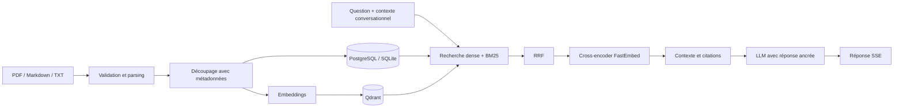

# SIHIA

SIHIA est une plateforme web de gestion hospitalière : dossiers patients, médecins, rendez-vous, file d'attente, analytique, prévisions et assistant documentaire RAG. Le dépôt contient une application React/TypeScript et une API FastAPI reliée à PostgreSQL ou SQLite, avec Qdrant pour la recherche vectorielle.

## Fonctionnalités

- Authentification JWT, rotation des refresh tokens, révocation et RBAC côté API et interface.
- Gestion des patients, historique médical, documents, médecins, disponibilités et rendez-vous avec détection de conflits.
- Dashboard, alertes, analytique, exports et prévision de fréquentation à 7/30 jours.
- Notifications et rappels email/SMS configurables.
- Interface responsive, thème clair/sombre, français/anglais/arabe et RTL.
- Assistant SIHIA avec streaming SSE, garde-fous médicaux, citations et refus lorsque les preuves manquent.
- Base de connaissances administrable : PDF, Markdown et texte, contrôle de doublons et réindexation.

## Architecture RAG



Le reranker par défaut est `Xenova/ms-marco-MiniLM-L-6-v2`, un petit cross-encoder FastEmbed exécuté sur CPU et chargé à la demande. Une indisponibilité du modèle déclenche automatiquement le reranker lexical local. La configuration `RAG_RERANK_ENABLED=false` désactive complètement cette étape ; `RAG_RERANKER=lightweight` évite le téléchargement du modèle.

La conception détaillée, les flux d'échec et les règles de sécurité se trouvent dans [docs/RAG_ARCHITECTURE.md](docs/RAG_ARCHITECTURE.md).

## Stack

| Couche | Technologies |
|---|---|
| Frontend | React 19, TypeScript, Vite, TanStack Router/Query, Tailwind CSS |
| Backend | FastAPI, Pydantic, SQLAlchemy, Alembic |
| Données | PostgreSQL 16 en conteneur, SQLite en développement léger |
| RAG | Qdrant, FastEmbed, BM25, Reciprocal Rank Fusion, OpenAI |
| Qualité | Pytest, Vitest, ESLint, Playwright, RAGAS en évaluation facultative |
| Déploiement local | Docker Compose, serveur statique Node pour le frontend construit |

## Démarrage avec Docker

Prérequis : Docker Desktop et une clé OpenAI pour la génération et les embeddings par défaut.

```bash
cp .env.example .env
# renseigner OPENAI_API_KEY et remplacer JWT_SECRET
docker compose up --build
docker compose exec backend python scripts/import_chatbot_knowledge.py
```

- Application : http://localhost:8080
- API / Swagger : http://localhost:8000/docs
- Qdrant : http://localhost:6333/dashboard
- pgAdmin : http://localhost:5050

Comptes de démonstration : `admin@sihia.health / admin123`, `dr.benali@sihia.health / demo1234`, `manager@sihia.health / manager123`, `staff@sihia.health / staff123`. Ils sont réservés au développement.

## Démarrage sans Docker

Prérequis : Python 3.12+, Node.js 22+ et npm 10+.

```bash
# API (PowerShell)
cd backend
python -m venv venv
.\venv\Scripts\pip install -r requirements.txt
.\venv\Scripts\alembic upgrade head
.\venv\Scripts\uvicorn app.main:app --reload --port 8000

# Interface, dans un second terminal
cd frontend
npm ci
npm run dev
```

L'API utilise alors SQLite par défaut. Pour la recherche RAG complète, lancez Qdrant et configurez `QDRANT_URL`; importez ensuite le corpus avec `python scripts/import_chatbot_knowledge.py`.

Les variables essentielles sont décrites dans [.env.example](.env.example) : base SQL, CORS, JWT, fournisseurs LLM/embeddings, Qdrant, taille des chunks, seuils et reranking. Aucun secret ne doit être placé dans une variable frontend `VITE_*`.

## Démonstration RAG

1. Connectez-vous avec le compte administrateur.
2. Ouvrez **Base de connaissances** et importez un PDF, un fichier Markdown ou texte.
3. Posez une question couverte par le document et vérifiez les citations sous la réponse.
4. Posez une question absente : l'assistant doit reconnaître l'insuffisance des preuves.

Les endpoints d'administration sont protégés par JWT/RBAC sous `/api/knowledge/documents`. Le chatbot utilise `/query-stream` et envoie les sources structurées avant les tokens de réponse.

## Tests et évaluation

```bash
cd backend
.\venv\Scripts\python -m pytest tests -q
.\venv\Scripts\python -m app.rag.evaluation

cd ../frontend
npm test
npm run lint
npm run build
npx playwright test
```

Dernière validation locale (11 août 2026) : 118 tests backend réussis et 1 ignoré, 65 tests frontend réussis, 17 scénarios Playwright réussis, lint sans erreur et build de production réussi.

Le benchmark local contient 30 questions françaises et anglaises : recherches mono/multi-source, suivis conversationnels et cas sans réponse. Pour évaluer de vraies réponses générées avec RAGAS (appels réseau facturables) :

```bash
cd backend
.\venv\Scripts\pip install -r requirements-eval.txt
.\venv\Scripts\python -m app.rag.evaluation --live --generated
# essai limité : ajouter --limit 5
```

Les rapports générés sont écrits dans `backend/reports/` et ne sont pas versionnés.

## Limites connues

- Pas d'OCR : les PDF scannés sans couche texte ne sont pas exploitables.
- Ingestion synchrone, adaptée à une démonstration ou un corpus modéré, pas à un traitement documentaire massif.
- Le modèle de reranking par défaut est surtout optimisé pour l'anglais ; le fallback lexical reste disponible pour le français.
- La génération locale par Ollama n'est pas implémentée : la génération et l'évaluation RAGAS utilisent un endpoint compatible OpenAI.
- Les métriques RAGAS nécessitent une clé fournisseur, ont un coût et ne font volontairement pas partie des tests unitaires.
- Les contenus médicaux doivent être validés humainement avant un usage réel ; l'assistant ne diagnostique ni ne prescrit.

## Captures

Les captures de référence peuvent être ajoutées sous `docs/screenshots/` : dashboard desktop/mobile, base de connaissances, citations du chatbot et gestion des rendez-vous.

## Documentation

- [Architecture RAG](docs/RAG_ARCHITECTURE.md)
- [Guide de production](Document/README_PRODUCTION.md)
- [Guide de déploiement](Document/README_DEPLOY.md)
- [Documentation SIHIA](Document/README.md)
