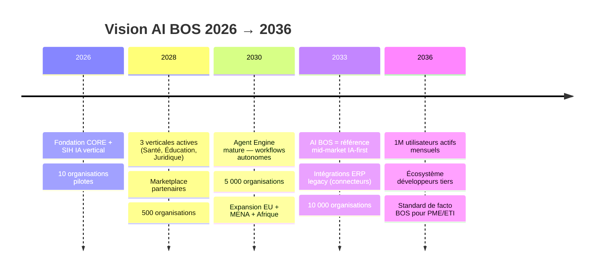
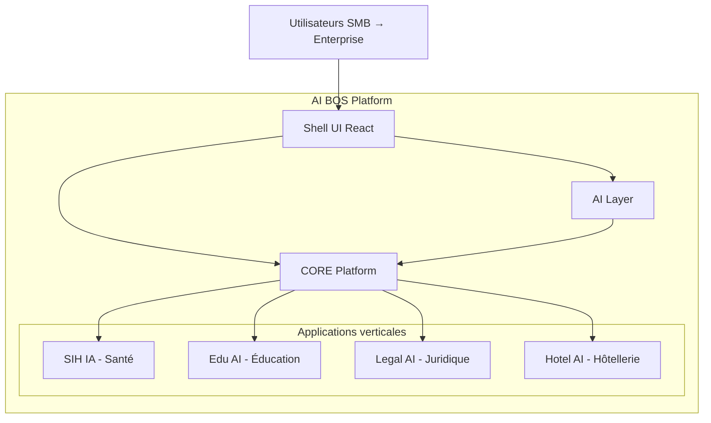
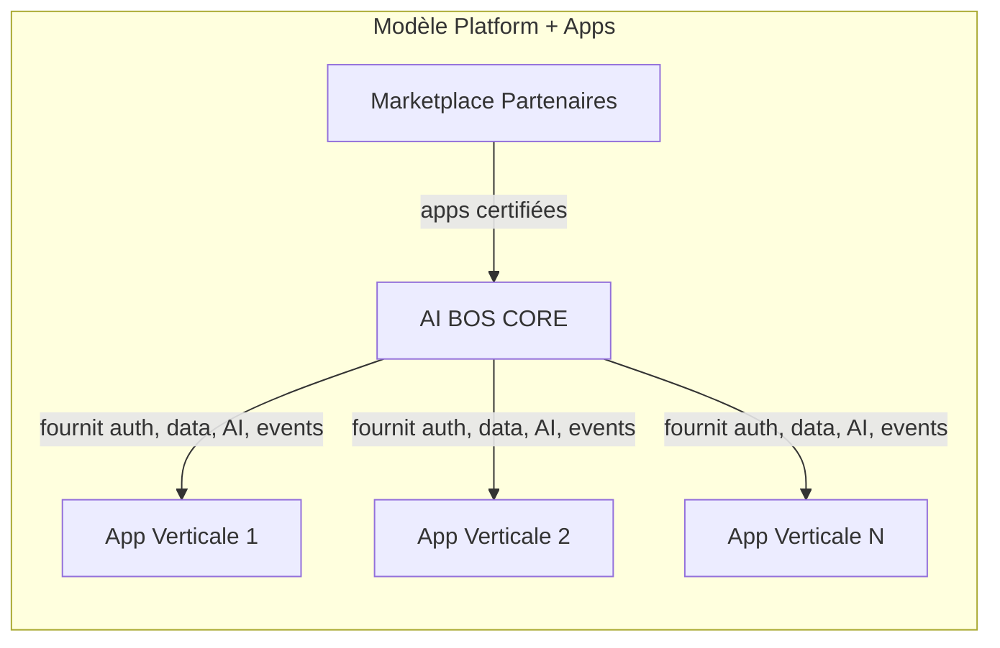
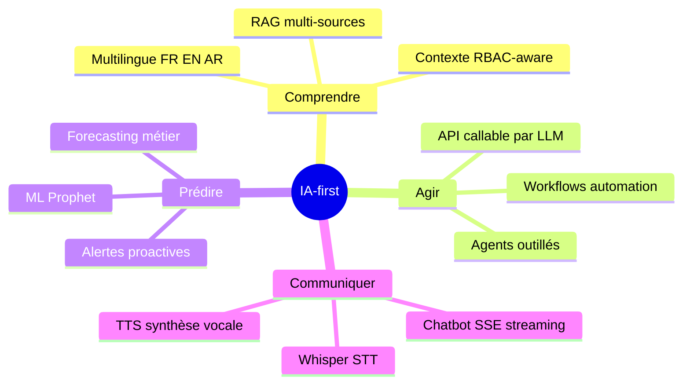
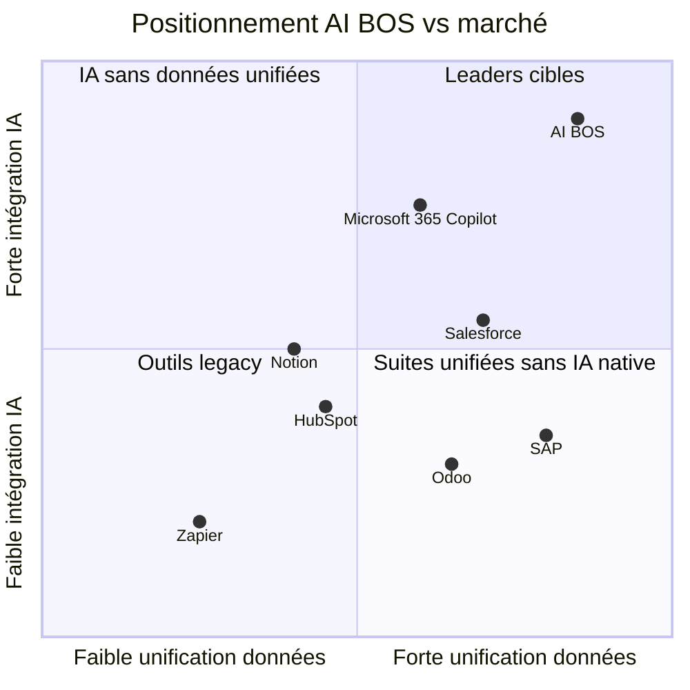
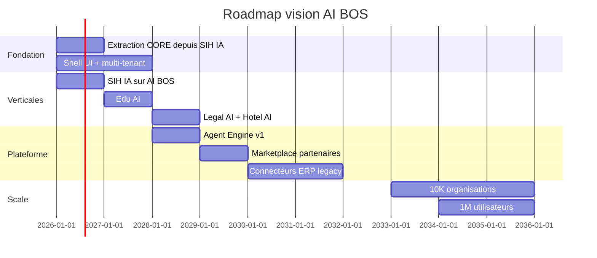

# README_00 — Vision stratégique AI BOS

---

## Métadonnées du document

| Champ | Valeur |
|-------|--------|
| **Document** | README_00_Vision.md |
| **Projet** | AI BOS — AI Business Operating System |
| **Version** | 0.1.0 |
| **Statut** | `DRAFT` → revue Architecture Review Board |
| **Niveau de maturité** | `CONCEPT` |
| **Audience** | Fondateurs, investisseurs, Product, Engineering, Sales |
| **Auteur** | AI BOS Platform Team |
| **Dernière mise à jour** | Juillet 2026 |
| **Documents liés** | [README_01_ProductStrategy](README_01_ProductStrategy.md) · [README_02_Architecture](README_02_Architecture.md) · [README_03_Frontend](README_03_Frontend.md) · [README_35_MigrationFromSIHIA](README_35_MigrationFromSIHIA.md) |
| **Référence héritage** | [SIH IA — État d'implémentation](../../sihia-platform/Document/README_ETAT_IMPLEMENTATION.md) |

---

## Table des matières

1. [Synthèse exécutive](#1-synthèse-exécutive)
2. [Énoncé du problème](#2-énoncé-du-problème)
3. [Mission et vision à 10 ans](#3-mission-et-vision-à-10-ans)
4. [Qu'est-ce qu'AI BOS ?](#4-quest-ce-quai-bos-)
5. [Ce qu'AI BOS n'est PAS](#5-ce-quai-bos-nest-pas)
6. [Modèle plateforme vs applications verticales](#6-modèle-plateforme-vs-applications-verticales)
7. [Philosophie IA-first](#7-philosophie-ia-first)
8. [Utilisateurs cibles](#8-utilisateurs-cibles)
9. [Paysage concurrentiel](#9-paysage-concurrentiel)
10. [Principes produit](#10-principes-produit)
11. [Métriques de succès](#11-métriques-de-succès)
12. [Réutilisation SIH IA comme preuve de concept](#12-réutilisation-sih-ia-comme-preuve-de-concept)
13. [Feuille de route visionnaire (horizon 2036)](#13-feuille-de-route-visionnaire-horizon-2036)
14. [Glossaire](#14-glossaire)
15. [Annexes et références croisées](#15-annexes-et-références-croisées)

---

## 1. Synthèse exécutive

**AI BOS** (AI Business Operating System) est le système d'exploitation intelligent des entreprises : une plateforme SaaS modulaire, multi-tenant, cloud-native et **IA-first**, conçue pour centraliser les données opérationnelles, automatiser les workflows et augmenter chaque décision par l'intelligence artificielle.

Contrairement aux ERP classiques — lourds, rigides, centrés sur la saisie comptable — AI BOS part du principe que **l'IA est une primitive du système**, au même titre que l'authentification ou la base de données. Chaque module métier, chaque écran, chaque API est conçu pour être **compris, interrogé et actionné** par des agents intelligents.

**SIH IA** (Système Intelligent Hospitalier), notre SaaS HealthTech existant, devient la **première application verticale** déployée sur AI BOS. Ce choix stratégique n'est pas anodin : il valide le socle technique (auth JWT, RBAC, audit, notifications, chatbot RAG, ML Prophet, pipeline Airflow) sur un domaine à forte complexité réglementaire et opérationnelle avant d'ouvrir les verticales Éducation, Juridique et Hôtellerie.

Notre ambition à 10 ans : devenir l'infrastructure de référence sur laquelle **10 000 organisations** et **1 million d'utilisateurs** exécutent leurs opérations quotidiennes, avec une IA qui connaît l'ensemble de leur contexte métier — sans lock-in propriétaire sur les données.

---

## 2. Énoncé du problème

### 2.1 Fragmentation logicielle

Les PME et ETI (10 à 5 000 employés) utilisent en moyenne **12 à 25 outils SaaS** non connectés : CRM, comptabilité, RH, gestion de projet, messagerie, BI, helpdesk, etc. Chaque outil possède son propre modèle de données, ses propres identités utilisateur, ses propres rapports. Résultat :

- **Silos de données** : impossible d'obtenir une vue unifiée du client, de l'employé ou de l'opération en temps réel.
- **Double saisie** : les équipes recopient manuellement entre systèmes, source d'erreurs et de frustration.
- **Décisions retardées** : les dirigeants attendent des exports CSV et des rapports mensuels au lieu d'agir sur des signaux en direct.
- **IA superficielle** : les « copilots » des éditeurs existants ne voient qu'un silo (ex. : Copilot dans Excel ne connaît pas le pipeline commercial).

### 2.2 Limites des ERP traditionnels

Les ERP (SAP, Oracle NetSuite, Odoo Enterprise) ont été conçus pour la **comptabilité et la conformité fiscale**, pas pour l'agilité opérationnelle ni l'intelligence décisionnelle en temps réel.

| Limitation ERP classique | Impact business |
|--------------------------|-----------------|
| Déploiement 6–18 mois | Time-to-value inacceptable pour startups et PME |
| Personnalisation coûteuse | Chaque évolution métier nécessite un intégrateur |
| UX datée | Adoption utilisateur faible, contournements Excel |
| IA en add-on tardif | Fonctionnalités IA déconnectées du contexte opérationnel |
| Vendor lock-in fort | Migration quasi impossible, négociation tarifaire défavorable |

### 2.3 Opportunité de marché

Le marché mondial des ERP/SaaS business atteint **~$80 Md** en 2026, avec une croissance de 12 % CAGR. Parallèlement, le marché des solutions IA enterprise dépasse **$25 Md**. La convergence de ces deux courbes crée une fenêtre unique pour un **nouveau paradigme** : le Business Operating System IA-first.

AI BOS se positionne dans cette intersection : **pas un ERP de plus**, mais l'OS sur lequel les applications métier intelligentes s'exécutent.

---

## 3. Mission et vision à 10 ans

### 3.1 Mission

> **Donner à chaque organisation — de la PME au grand compte — un système d'exploitation intelligent qui unifie ses données, automatise ses opérations et amplifie ses décisions par l'IA, sans sacrifier la souveraineté de ses données.**

### 3.2 Vision 2036 (horizon 10 ans)

À l'horizon 2036, AI BOS aspire à être :

1. **L'infrastructure par défaut** pour toute organisation de 10 à 5 000 employés qui souhaite moderniser ses opérations sans déployer 15 outils.
2. **Le contexte unifié** que les agents IA de l'entreprise consomment — remplaçant les intégrations Zapier fragiles par un Event Bus natif.
3. **Une plateforme ouverte** : API-first, export données complet, hébergement souverain (EU, Afrique) pour les secteurs réglementés.
4. **Un écosystème vertical** : SIH IA, Edu AI, Legal AI, Hotel AI et applications partenaires sur une marketplace commune.

### 3.3 Thèse d'investissement (résumé)

| Pilier | Argument |
|--------|----------|
| **Timing** | LLM matures + coûts inference en baisse + entreprises prêtes à payer pour l'IA opérationnelle |
| **Wedge** | SIH IA prouve le CORE sur un vertical à ARPU élevé et barrières réglementaires |
| **Moat** | Données unifiées + agents contextuels + switching cost croissant avec le temps |
| **Expansion** | CORE réutilisable → chaque nouveau vertical = fraction du coût initial |
| **Distribution** | Bottom-up (équipes) + top-down (DSI/CFO) + partenaires intégrateurs verticaux |

---

## 4. Qu'est-ce qu'AI BOS ?

### 4.1 Définition opérationnelle

AI BOS est une **plateforme multi-tenant** composée de :

1. **CORE Platform** — services transverses partagés par toutes les applications.
2. **Applications verticales** — modules métier spécialisés (SIH IA, Edu AI, etc.).
3. **AI Layer** — agents, RAG, speech, ML, automation workflows.
4. **Shell UI** — interface unifiée React avec copilot omniprésent.

### 4.2 Les cinq capacités fondamentales

| Capacité | Description | Équivalent marché |
|----------|-------------|-------------------|
| **Identity & Access** | Auth, RBAC, ABAC, audit | Okta + Splunk audit |
| **Unified Data** | Entités partagées, Event Bus, search | Segment CDP + Kafka |
| **Intelligence** | RAG, agents, ML, speech | ChatGPT Enterprise + DataRobot |
| **Operations** | Workflows, notifications, pipelines | Zapier + Airflow |
| **Experience** | Shell UI, i18n, design system, copilot | Notion + Copilot |

### 4.3 Positionnement en une phrase

> AI BOS est à l'entreprise ce que iOS est au smartphone : un OS qui fait tourner des apps, avec une IA native qui comprend tout le contexte de l'appareil.

---

## 5. Ce qu'AI BOS n'est PAS

Clarifier ce que nous ne construisons **pas** est aussi important que définir ce que nous construisons. Cela évite les attentes erronées des clients, investisseurs et équipes.

### 5.1 Pas un ERP classique

| ERP classique | AI BOS |
|---------------|--------|
| Centré grand livre / TVA | Centré opérations + décisions |
| Modules rigides (FI, CO, MM, SD) | Modules composables + marketplace |
| Personnalisation = consulting | Configuration no-code + agents |
| Batch nocturne | Temps réel + Event Bus |
| Reporting statique | Analytics + ML + BI conversationnelle |

Nous **intégrons** avec les ERP existants (connecteurs SAP, Odoo, QuickBooks) plutôt que de les remplacer d'emblée pour les fonctions comptables pures.

### 5.2 Pas un simple agrégateur de SaaS

Zapier connecte des outils ; AI BOS **remplace le besoin de les connecter** en offrant des modules natifs avec un modèle de données unifié. Les intégrations externes sont un complément, pas le cœur.

### 5.3 Pas un chatbot générique

Le chatbot AI BOS (hérité de SIH IA : SSE, RAG, guardrails) n'est pas une FAQ glorifiée. C'est un **agent contextuel** qui accède aux permissions RBAC de l'utilisateur, aux données métier et aux workflows — avec traçabilité audit JSONL.

### 5.4 Pas un data warehouse

Nous stockons et traitons les données opérationnelles. Les exports vers Snowflake/BigQuery sont prévus, mais AI BOS n'est pas principalement un outil d'analyse sur données externes.

### 5.5 Pas un remplacement immédiat de Salesforce pour les enterprises

Notre ICP initial est **SMB et mid-market** (10–500 employés). Les grands comptes (5 000+ employés) sont une cible horizon 2030+ avec des connecteurs et déploiements hybrides.

### 5.6 Pas une plateforme fermée

- API ouverte (REST + GraphQL prévu)
- Export complet des données (RGPD, portabilité)
- Pas de lock-in sur le modèle IA (abstraction LLM provider)

---

## 6. Modèle plateforme vs applications verticales

### 6.1 Analogie plateforme

### 6.2 Responsabilités CORE vs App

| Responsabilité | CORE Platform | Application verticale |
|----------------|---------------|---------------------|
| Authentification JWT | ✅ | Consomme |
| RBAC / permissions | ✅ Framework | ✅ Rôles métier |
| Audit JSONL | ✅ Infrastructure | ✅ Événements métier |
| Notifications SMTP/Twilio | ✅ Service | ✅ Templates métier |
| Chatbot / RAG / guardrails | ✅ Engine | ✅ Knowledge base |
| ML / Prophet | ✅ Infrastructure | ✅ Modèles métier |
| Pipeline Airflow | ✅ Orchestration | ✅ DAGs métier |
| Health / metrics | ✅ | Expose métriques app |
| i18n FR/EN/AR | ✅ Framework | ✅ Traductions métier |
| Entités métier (Patient, Cours, Dossier) | ❌ | ✅ |
| Workflows spécifiques | ❌ | ✅ |
| Conformité sectorielle (HIPAA, etc.) | ❌ Framework | ✅ Implémentation |

### 6.3 Stratégie d'expansion verticale

1. **Phase 1 (2026)** — SIH IA : santé/hôpitaux. Validation CORE complet.
2. **Phase 2 (2027)** — Edu AI : établissements scolaires/universités.
3. **Phase 3 (2028)** — Legal AI : cabinets et services juridiques.
4. **Phase 4 (2028)** — Hotel AI : chaînes hôtelières et résidences.
5. **Phase 5 (2029+)** — Retail AI, Factory AI, Government AI + marketplace.

Chaque vertical réutilise **60–80 % du CORE** et apporte **20–40 % de spécificité métier**. Voir [README_01_ProductStrategy](README_01_ProductStrategy.md) pour le détail GTM.

### 6.4 Isolation multi-tenant

Toutes les apps partagent le même CORE mais isolent les données par `organization_id`. Une clinique utilisant SIH IA et une école utilisant Edu AI sur le même cluster partagent l'infrastructure sans jamais voir les données de l'autre.

---

## 7. Philosophie IA-first

### 7.1 IA comme primitive, pas comme feature

Dans un ERP classique, l'IA arrive en v2.0 après 10 ans de dette technique. Dans AI BOS :

- **Chaque entité** est indexée pour le RAG (vector DB).
- **Chaque action utilisateur** peut être déclenchée par langage naturel via l'agent.
- **Chaque workflow** peut inclure une étape de décision IA (classification, extraction, résumé).
- **Chaque écran** expose un point d'entrée copilot (sidebar, command palette, widget flottant).

### 7.2 Les quatre piliers IA-first

### 7.3 Principes éthiques et guardrails

Hérités de SIH IA (`chatbot_guardrails.py`) :

- **Refus hors périmètre** : l'agent ne répond pas aux demandes hors contexte métier autorisé.
- **Pas de diagnostic médical** (SIH IA) / pas de conseil juridique contraignant (Legal AI).
- **Traçabilité** : chaque interaction IA loggée (correlation ID, user ID, sources RAG).
- **Humain dans la boucle** : actions critiques (suppression, paiement, envoi masse) requièrent confirmation.
- **Explicabilité** : métadonnées ML affichées (modèle, version, confiance, fraîcheur données).

### 7.4 Abstraction fournisseur LLM

AI BOS abstrait le fournisseur LLM (OpenAI, Anthropic, Mistral, modèles self-hosted) pour :

- Éviter le vendor lock-in inference.
- Permettre le routage par coût/latence/conformité (données EU).
- Faciliter le fine-tuning vertical sans réécrire l'application.

---

## 8. Utilisateurs cibles

### 8.1 Segmentation

| Segment | Taille | Caractéristiques | Priorité |
|---------|--------|------------------|----------|
| **Startup / SMB** | 10–50 | Agiles, peu d'IT, besoin all-in-one | P1 — acquisition rapide |
| **PME** | 50–250 | Croissance, premiers processus formalisés | P1 — sweet spot |
| **ETI / Mid-market** | 250–2 500 | DSI, conformité, intégrations legacy | P2 — ARPU élevé |
| **Enterprise** | 2 500–10 000+ | RFP, SSO, déploiement hybride | P3 — horizon 2030 |
| **Secteur public** | Variable | Souveraineté, marchés publics | P3 — verticale dédiée |

### 8.2 Personas transverses (tous verticaux)

| Persona | Rôle | Besoin principal | Module AI BOS |
|---------|------|------------------|---------------|
| **Amine — CEO PME** | Dirigeant | Vue 360°, décisions rapides, ROI visible | Dashboard + BI + Agent exécutif |
| **Sara — CFO** | Directrice financière | Trésorerie, prévisions, conformité | Finance + ML forecast + Audit |
| **Karim — Directeur commercial** | Sales | Pipeline, prévisions ventes, relances | CRM + Automation + Copilot ventes |
| **Nadia — DRH** | Ressources humaines | Onboarding, congés, conformité sociale | HR + Workflows + Chatbot RH |
| **Youssef — DSI** | IT | Sécurité, intégrations, observabilité | Admin + RBAC + Health/metrics |
| **Léa — Opérationnel** | Utilisatrice quotidienne | Simplicité, mobile, moins de clics | Shell UI + Copilot contextuel |

### 8.3 Premier vertical : décideurs santé (SIH IA)

| Persona santé | Besoin | Fonctionnalité SIH IA validée |
|-------------|--------|-------------------------------|
| Directeur établissement | Occupation lits, flux patients | Dashboard KPI + prédiction Prophet 7j/30j |
| Médecin | Planning, dossiers patients | Module médecins + patients + RDV |
| Secrétaire médicale | Prise RDV, rappels | RDV + notifications SMTP/Twilio |
| Admin IT | Sécurité, audit | RBAC + audit JSONL export |
| Patient (futur) | Prise RDV en ligne | Portail patient (roadmap) |

---

## 9. Paysage concurrentiel

### 9.1 Carte concurrentielle

### 9.2 Analyse comparative détaillée

| Concurrent | Forces | Faiblesses vs AI BOS | Notre différenciation |
|------------|--------|----------------------|----------------------|
| **Salesforce** | CRM dominant, écosystème | Cher, complexe, IA par silo (Einstein) | Unification native + prix mid-market |
| **Microsoft Dynamics + Copilot** | Intégration Office | Lourd, centré enterprise, dépendance M365 | Agilité, verticals spécialisés, souveraineté |
| **Odoo** | Open source, modulaire | UX datée, IA absente, ERP-centré | IA-first, UX moderne, Event Bus |
| **SAP S/4HANA** | Enterprise, conformité | Coût, délai, inadapté PME | Time-to-value, cloud-native |
| **Notion + intégrations** | UX, collaboration | Pas d'opérations métier, pas de RBAC enterprise | Opérations + sécurité + IA contextuelle |
| **Monday.com** | Workflows visuels | Pas de données unifiées, IA limitée | Data platform + agents |
| **ChatGPT Enterprise** | LLM puissant | Aucun contexte métier natif | RAG sur données opérationnelles réelles |

### 9.3 Avantages compétitifs durables (moat)

1. **Données unifiées** — plus le client utilise AI BOS, plus l'IA est pertinente (effet réseau données).
2. **CORE réutilisable** — coût marginal faible pour chaque nouveau vertical.
3. **Preuve terrain SIH IA** — crédibilité secteur réglementé (santé).
4. **Architecture modulaire** — extraction microservices sans réécriture (voir [README_02_Architecture](README_02_Architecture.md)).
5. **Écosystème partenaires** — intégrateurs verticaux certifiés sur marketplace.

---

## 10. Principes produit

### 10.1 Les dix principes fondateurs

| # | Principe | Implication concrète |
|---|----------|---------------------|
| 1 | **IA-first** | Chaque feature évalue d'abord « comment l'IA améliore ceci » |
| 2 | **Platform over product** | Construire le CORE avant la spécificité verticale |
| 3 | **API-first** | Toute UI a son équivalent API documenté OpenAPI |
| 4 | **Security by default** | RBAC sur chaque route, audit systématique, zero trust |
| 5 | **Progressive disclosure** | UX simple par défaut, puissance accessible à la demande |
| 6 | **Data sovereignty** | Export complet, hébergement régional, pas de revente données |
| 7 | **Observable everything** | Health, metrics, correlation ID, logs JSON structurés |
| 8 | **Ship small, learn fast** | Monolithe modulaire d'abord, microservices si nécessaire |
| 9 | **Inclusive by design** | i18n FR/EN/AR + RTL dès le CORE (hérité SIH IA) |
| 10 | **Human in the loop** | L'IA propose, l'humain dispose sur les actions critiques |

### 10.2 Principes UX (hérités Calm Care / SIH IA)

- **Calm Care Design System** — tokens oklch, shadcn/ui, accessibilité WCAG 2.1 AA.
- **Copilot omniprésent** — widget flottant (pattern `SihiaChatbot`) disponible sur chaque écran.
- **Mobile-responsive** — PWA progressive, pas d'app native en v1.
- **Temps de réponse** — interactions < 100 ms, streaming SSE pour l'IA.

### 10.3 Principes engineering

Voir [README_02_Architecture](README_02_Architecture.md) et [README_03_Frontend](README_03_Frontend.md) :

- Clean Architecture : `presentation / application / domain / infrastructure / core`
- Tests : pytest backend (68/68 SIH IA), Playwright E2E (8/8), couverture critique > 80 %
- CI/CD : GitHub Actions, Docker Compose dev, déploiement AWS cible

---

## 11. Métriques de succès

### 11.1 North Star Metric

> **Décisions assistées par IA par organisation et par semaine** (DAI/week)

Une « décision assistée » = interaction IA ayant conduit à une action concrète (création entité, envoi notification, validation workflow, export rapport).

Voir [README_01_ProductStrategy](README_01_ProductStrategy.md) pour le framework de priorisation RICE aligné sur cette métrique.

### 11.2 Métriques par horizon

| Horizon | Métrique | Cible |
|---------|----------|-------|
| **6 mois** | Organisations pilotes actives | 10 |
| **6 mois** | Modules CORE extraits de SIH IA | 8/12 |
| **12 mois** | MRR | $50K |
| **12 mois** | NPS | > 40 |
| **24 mois** | Organisations payantes | 200 |
| **24 mois** | Verticales actives | 2 (Santé + Éducation) |
| **36 mois** | ARR | $2M |
| **36 mois** | Churn mensuel | < 3 % |
| **10 ans** | Organisations | 10 000 |
| **10 ans** | Utilisateurs actifs mensuels | 1 000 000 |

### 11.3 Métriques techniques (SLO)

| SLO | Cible | Source SIH IA |
|-----|-------|---------------|
| Disponibilité API | 99.9 % | `/health`, `/health/details` |
| Latence P95 API | < 300 ms | `metrics.py` |
| Latence P95 chatbot premier token SSE | < 2 s | Streaming SSE |
| Taux erreur 5xx | < 0.1 % | Compteurs health |
| MAPE prédiction ML | ≤ 15 % | `GET /api/ml/metrics` |
| Temps déploiement | < 15 min | CI/CD pipeline |

### 11.4 Métriques produit qualitatives

- **Time-to-first-value** : < 1 jour (inscription → première action IA réussie)
- **Adoption copilot** : > 60 % des utilisateurs actifs hebdomadaires à M3
- **Taux self-service** : > 80 % des configurations sans support humain

---

## 12. Réutilisation SIH IA comme preuve de concept

SIH IA n'est pas un prototype jetable. C'est un **actif stratégique** qui dé-risque AI BOS.

### 12.1 État actuel SIH IA (juillet 2026)

| Indicateur | Valeur |
|------------|--------|
| Couverture MVP fonctionnelle | ~95 % |
| Couverture valeur métier réelle | ~70 % |
| Tests backend pytest | 68/68 ✅ |
| Tests E2E Playwright | 8/8 ✅ |
| Statut production sécurisée | 🔴 Non (pilote validé) |

### 12.2 Composants extractibles vers AI BOS CORE

| Composant SIH IA | Chemin source | Module AI BOS CORE | Maturité |
|------------------|---------------|-------------------|----------|
| Auth JWT + refresh rotation | `backend/app/presentation/auth_routes.py` | `core/identity` | ✅ Production-ready |
| RBAC + permissions JWT | `backend/app/application/rbac_service.py` | `core/authorization` | ✅ Production-ready |
| Audit JSONL | `logs/audit.jsonl`, export API | `core/audit` | ✅ Production-ready |
| Notifications SMTP/Twilio | `backend/app/application/reminder_service.py` | `core/notifications` | ✅ Configurable |
| Chatbot SSE + RAG + guardrails | `chatbot_routes.py`, `chatbot_service.py` | `core/ai/conversation` | ✅ Intégré |
| Whisper STT + TTS | Backend speech modules | `core/ai/speech` | 🟡 Partiel |
| Analytics KPIs | `analytics_routes.py` | `core/analytics` | ✅ Production-ready |
| ML Prophet / linéaire | `ml_service.py` | `core/ml` | ✅ MAPE ≤ 15 % |
| Pipeline Airflow | DAGs + `PipelineAdminPanel` | `core/data-pipeline` | ✅ Opérationnel |
| Health + metrics | `metrics.py`, `/health/details` | `core/observability` | ✅ Production-ready |
| i18n FR/EN/AR + RTL | `src/lib/i18n/` | `core/i18n` | ✅ Production-ready |
| Docker + CI | `docker-compose.yml`, GitHub Actions | `core/devops` | ✅ Opérationnel |

**Estimation : ~40 % du code SIH IA est directement extractible** vers le CORE. Voir [README_35_MigrationFromSIHIA](README_35_MigrationFromSIHIA.md).

### 12.3 Ce que SIH IA valide pour AI BOS

1. **Architecture en couches** fonctionne à l'échelle pilote.
2. **RBAC granulaire** avec guards frontend (`requireRoutePermission`) et backend (`require_permission`).
3. **Chatbot médical** avec guardrails est viable en production pilote.
4. **Pipeline Airflow** pour fraîcheur données ML est opérationnel.
5. **Multi-langue avec RTL** ne casse pas l'UX (leçon `I18nHydrator`).

### 12.4 Ce que SIH IA ne couvre pas encore

- Multi-tenant `organization_id` natif (prévu AI BOS)
- Event Bus inter-modules
- Marketplace applications
- Facturation / subscriptions
- Agent Engine multi-outils

---

## 13. Feuille de route visionnaire (horizon 2036)

### 13.1 Phases stratégiques

### 13.2 Jalons décisionnels (stage gates)

| Gate | Critère de passage | Décision |
|------|-------------------|----------|
| **G1 — CORE MVP** | 8 modules CORE extraits, 3 orgs pilotes | Lancer Edu AI |
| **G2 — Product-Market Fit** | NPS > 40, churn < 5 %, 50 orgs payantes | Levée Série A |
| **G3 — Platform** | Agent Engine + Event Bus en prod | Ouvrir marketplace |
| **G4 — Scale** | 99.9 % SLA, 1000 orgs | Expansion géographique |

---

## 14. Glossaire

| Terme | Définition |
|-------|------------|
| **AI BOS** | AI Business Operating System — plateforme parente |
| **CORE** | Services transverses partagés (auth, data, AI, observability) |
| **App verticale** | Application métier spécialisée (SIH IA, Edu AI, etc.) |
| **Shell UI** | Interface React unifiée hébergeant les micro-frontends |
| **Agent** | Entité IA autonome avec outils, mémoire et guardrails |
| **RAG** | Retrieval-Augmented Generation — enrichissement LLM par recherche documentaire |
| **Event Bus** | Bus d'événements découplant les modules (CQRS, sagas) |
| **DAI/week** | Decisions Assisted by AI per week — North Star Metric |
| **SIH IA** | Système Intelligent Hospitalier — première app verticale |

---

## 15. Annexes et références croisées

### 15.1 Documents AI BOS

| Document | Contenu |
|----------|---------|
| [README_01_ProductStrategy](README_01_ProductStrategy.md) | ICP, personas, pricing, GTM, RICE |
| [README_02_Architecture](README_02_Architecture.md) | C4, stack, ADR, AWS, scalabilité |
| [README_03_Frontend](README_03_Frontend.md) | Shell React 19, micro-frontends, design system |
| [README_05_Core](README_05_Core.md) | Spécification détaillée du CORE |
| [README_35_MigrationFromSIHIA](README_35_MigrationFromSIHIA.md) | Plan d'extraction technique |
| [README_40_ImplementationRoadmap](README_40_ImplementationRoadmap.md) | Roadmap exécutable |
| [INDEX](INDEX.md) | Index complet de la documentation |

### 15.2 Documents SIH IA (référence)

| Document | Lien |
|----------|------|
| État d'implémentation | [README_ETAT_IMPLEMENTATION.md](../../sihia-platform/Document/README_ETAT_IMPLEMENTATION.md) |
| Architecture SIH IA | [README_02_Architecture.md](../../sihia-platform/Document/README_02_Architecture.md) |
| Pipeline Airflow | [README_AIRFLOW_UTILISATION.md](../../sihia-platform/Document/README_AIRFLOW_UTILISATION.md) |

### 15.3 Historique des révisions

| Version | Date | Auteur | Changements |
|---------|------|--------|-------------|
| 0.1.0 | Juillet 2026 | Platform Team | Création initiale — vision et positionnement |

---

*© 2026 AI BOS Platform Team — Documentation propriétaire. Diffusion restreinte.*
