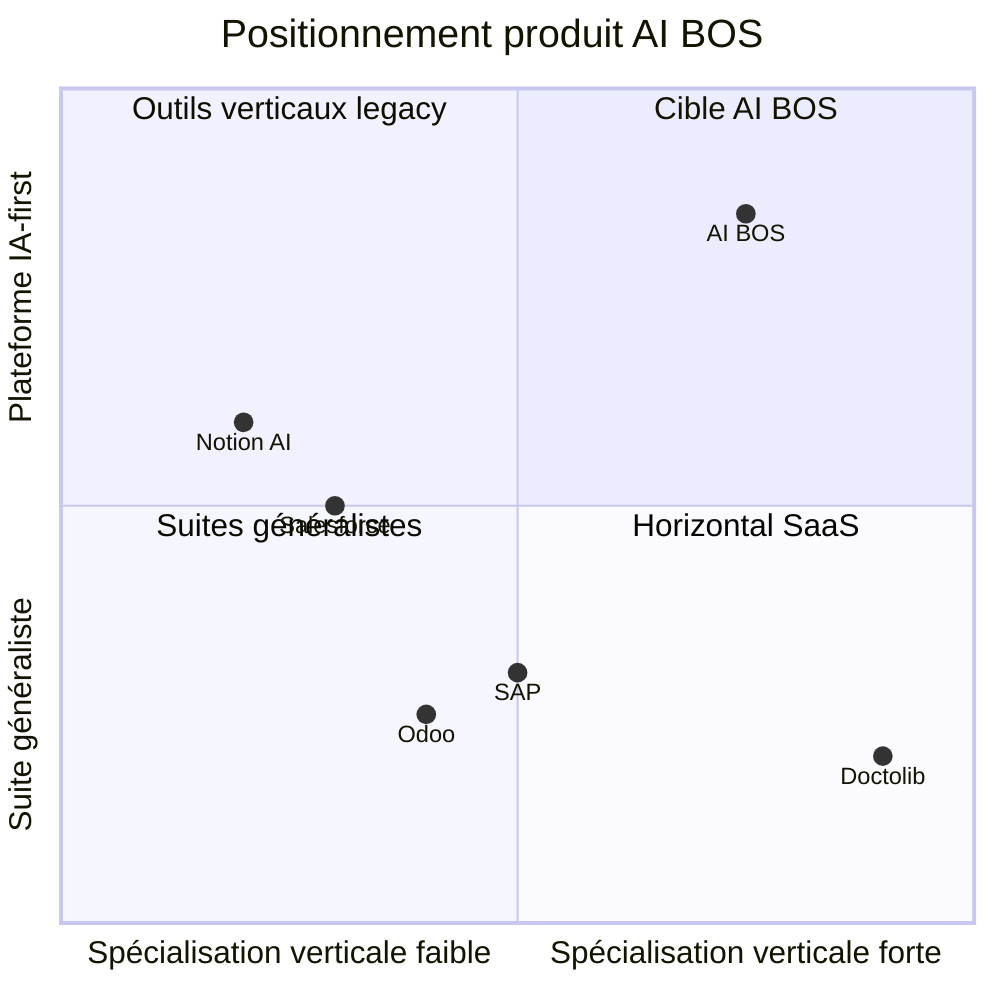
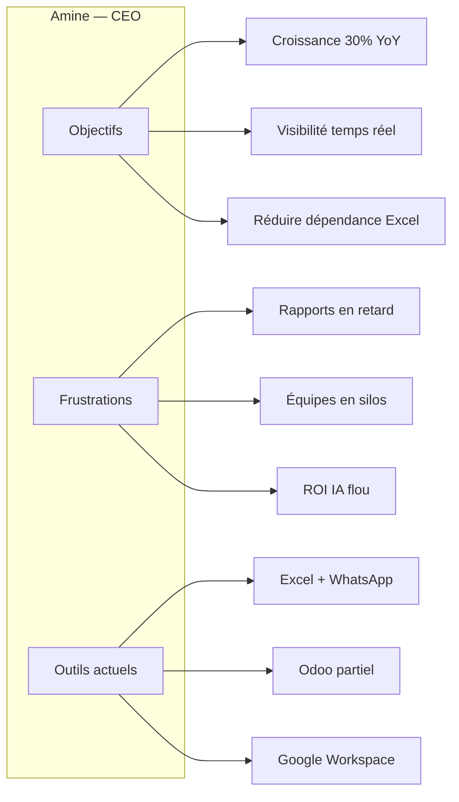
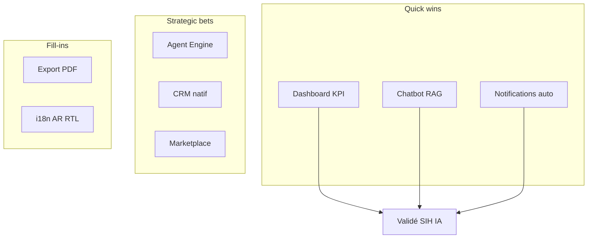
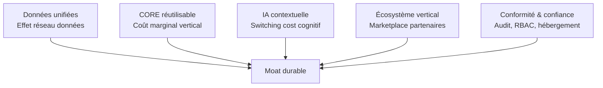
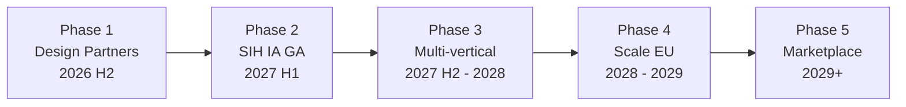
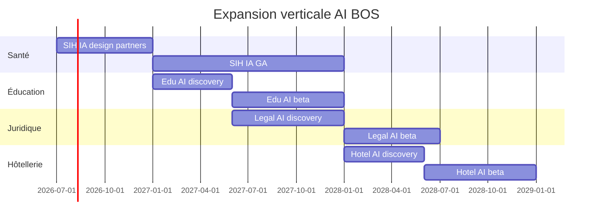
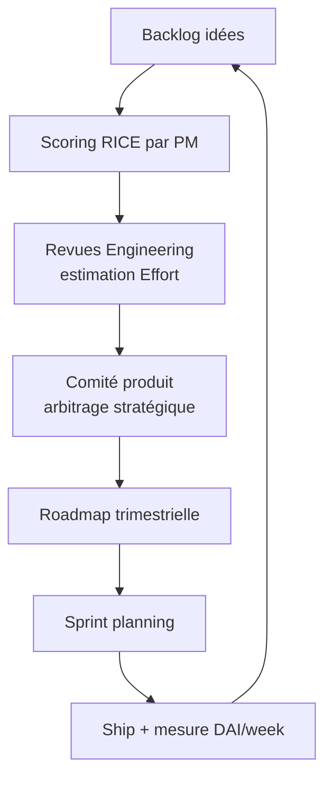

# README_01 — Stratégie produit AI BOS

---

## Métadonnées du document

| Champ | Valeur |
|-------|--------|
| **Document** | README_01_ProductStrategy.md |
| **Projet** | AI BOS — AI Business Operating System |
| **Version** | 0.1.0 |
| **Statut** | `DRAFT` |
| **Niveau de maturité** | `CONCEPT` |
| **Audience** | Product, Sales, Marketing, Founders, Customer Success |
| **Auteur** | AI BOS Product Team |
| **Dernière mise à jour** | Juillet 2026 |
| **Documents liés** | [README_00_Vision](README_00_Vision.md) · [README_02_Architecture](README_02_Architecture.md) · [README_19_Billing](README_19_Billing.md) · [README_20_Subscriptions](README_20_Subscriptions.md) · [README_36_FutureApplications](README_36_FutureApplications.md) |
| **Référence héritage** | [SIH IA — État d'implémentation](../../sihia-platform/Document/README_ETAT_IMPLEMENTATION.md) |

---

## Table des matières

1. [Synthèse exécutive](#1-synthèse-exécutive)
2. [Positionnement stratégique](#2-positionnement-stratégique)
3. [Ideal Customer Profile (ICP)](#3-ideal-customer-profile-icp)
4. [Personas détaillés](#4-personas-détaillés)
5. [Proposition de valeur par segment](#5-proposition-de-valeur-par-segment)
6. [Modèle de pricing (concept)](#6-modèle-de-pricing-concept)
7. [Avantages compétitifs et moat](#7-avantages-compétitifs-et-moat)
8. [Go-to-Market — phases](#8-go-to-market--phases)
9. [Stratégie d'expansion verticale](#9-stratégie-dexpansion-verticale)
10. [Framework de priorisation RICE](#10-framework-de-priorisation-rice)
11. [North Star Metric et KPIs produit](#11-north-star-metric-et-kpis-produit)
12. [Réutilisation SIH IA dans la stratégie produit](#12-réutilisation-sih-ia-dans-la-stratégie-produit)
13. [Risques produit et mitigations](#13-risques-produit-et-mitigations)
14. [Roadmap produit 36 mois (synthèse)](#14-roadmap-produit-36-mois-synthèse)
15. [Annexes et références croisées](#15-annexes-et-références-croisées)

---

## 1. Synthèse exécutive

La stratégie produit AI BOS repose sur trois convictions :

1. **Le wedge vertical** — Entrer par la santé (SIH IA) pour valider le CORE sur un marché à ARPU élevé, cycles de vente structurés et exigences de conformité élevées.
2. **La plateformisation progressive** — Extraire le socle technique de SIH IA vers AI BOS CORE, puis répliquer le pattern sur Éducation, Juridique et Hôtellerie avec 60–80 % de réutilisation.
3. **L'IA comme différenciateur d'usage** — La North Star Metric « Décisions assistées par IA par semaine » (DAI/week) aligne produit, engineering et go-to-market sur la valeur réelle perçue.

Notre ICP initial : **PME et ETI de 50 à 500 employés** dans les secteurs services (santé privée, éducation privée, cabinets professionnels, hôtellerie mid-scale), principalement en **France, Maghreb et Afrique francophone**, avec une expansion EU prévue à horizon 24 mois.

Le pricing suit un modèle **hybride sièges + usage IA** pour aligner revenus et consommation tout en restant prévisible pour le CFO.

---

## 2. Positionnement stratégique

### 2.1 Matrice de positionnement



### 2.2 Énoncé de positionnement

> **Pour les dirigeants de PME et ETI** qui en ont assez de jongler entre 15 outils SaaS déconnectés, **AI BOS** est le système d'exploitation intelligent de l'entreprise qui **unifie données, opérations et décisions** grâce à une plateforme modulaire et une IA native. **Contrairement aux ERP classiques**, AI BOS se déploie en jours, s'adapte à votre métier via des applications verticales, et rend chaque utilisateur plus efficace via un copilot contextuel.

### 2.3 Hiérarchie de messaging

| Niveau | Message | Audience |
|--------|---------|----------|
| **Vision** | L'OS intelligent des entreprises | Investisseurs, presse |
| **Plateforme** | Une plateforme, toutes vos opérations, une IA qui comprend tout | DSI, CTO |
| **Vertical** | SIH IA : l'hôpital intelligent, prêt en semaines | Directeurs établissements santé |
| **Feature** | Prédisez vos flux patients 7 jours à l'avance (Prophet) | Médecins, admins |
| **Tactique** | Rappels RDV automatiques email + SMS | Secrétaires médicales |

---

## 3. Ideal Customer Profile (ICP)

### 3.1 ICP primaire (années 1–2)

| Critère | Valeur cible |
|---------|--------------|
| **Taille** | 50–500 employés |
| **Revenus annuels** | €2M – €50M |
| **Secteurs** | Santé privée, éducation privée, services professionnels |
| **Géographie** | France, Maroc, Tunisie, Sénégal, Côte d'Ivoire |
| **Maturité digitale** | Moyenne — utilisent déjà 5+ SaaS, Excel encore présent |
| **Budget IT annuel** | €50K – €500K |
| **Décideur** | CEO / DG + DSI ou responsable IT |
| **Pain principal** | Données fragmentées, pas de vue temps réel, IA absente |
| **Signal d'achat** | Croissance rapide, nouvel établissement, audit conformité |

### 3.2 ICP secondaire (années 2–3)

| Critère | Valeur cible |
|---------|--------------|
| **Taille** | 500–2 500 employés (ETI) |
| **Secteurs** | Hôtellerie chaînes régionales, cabinets juridiques mid-size |
| **Géographie** | EU (Allemagne, Benelux), Golfe |
| **Pain principal** | Legacy ERP coûteux, intégrations fragiles |
| **Signal d'achat** | RFP digitalisation, remplacement ERP partiel |

### 3.3 Anti-ICP (ne pas cibler en v1)

| Profil | Raison d'exclusion |
|--------|-------------------|
| Startups < 10 employés | Budget insuffisant, besoin trop générique |
| Enterprise > 5 000 employés | Cycles RFP 12+ mois, SSO/SAP requis non prêts |
| Industrie lourde | Verticale Factory AI non disponible avant 2029 |
| Comptabilité pure | AI BOS n'est pas un ERP comptable |
| Clients exigeant on-prem only | Cloud-native uniquement en v1 |

### 3.4 Scoring ICP (qualification lead)

| Critère | Poids | Score 1–5 |
|---------|-------|-----------|
| Taille 50–500 employés | 25 % | |
| Secteur vertical disponible | 25 % | |
| Budget IT > €50K | 20 % | |
| Douleur données fragmentées confirmée | 15 % | |
| Sponsor C-level identifié | 15 % | |

**Seuil qualification** : score pondéré ≥ 3.5 → SQL (Sales Qualified Lead)

---

## 4. Personas détaillés

### 4.1 Amine Benjelloun — CEO / Fondateur PME



| Attribut | Détail |
|----------|--------|
| **Âge** | 38–52 ans |
| **Profil** | Fondateur ou DG de PME services, formation business |
| **Citation** | *« Je veux un tableau de bord qui me dit quoi faire ce matin, pas un rapport de la semaine dernière. »* |
| **Jobs-to-be-done** | Voir KPIs consolidés, anticiper problèmes, valider stratégie data-driven |
| **Modules AI BOS** | Executive Dashboard, BI conversationnel, Agent résumé hebdomadaire |
| **Critères d'achat** | Time-to-value < 30 jours, prix prévisible, pas de consulting obligatoire |
| **Canal** | LinkedIn, événements entrepreneurs, recommandation pairs |

**Scénario SIH IA** : Amine dirige une clinique privée de 120 lits. Il ouvre le dashboard SIH IA chaque matin : occupation, flux patients prédits 7j (Prophet), alertes critiques. Il interroge le copilot : *« Quels services sont saturés cette semaine ? »*

---

### 4.2 Sara El Amrani — CFO / Directrice Financière

| Attribut | Détail |
|----------|--------|
| **Âge** | 35–48 ans |
| **Profil** | DAF/CFO, formation finance/comptabilité, ex-Big Four |
| **Citation** | *« Je ne validerai aucun outil qui ne garantit pas la traçabilité et l'export des données. »* |
| **Jobs-to-be-done** | Prévisions trésorerie, contrôle budgets, conformité, reporting board |
| **Modules AI BOS** | Finance (futur), Analytics, ML forecast, Audit trail |
| **Critères d'achat** | Audit JSONL, export CSV/PDF/Excel, RBAC granulaire, RGPD |
| **Objections** | *« On a déjà Odoo pour la compta »* → Réponse : intégration, pas remplacement |

**Scénario SIH IA** : Sara exporte les analytics revenus/admissions en PDF via l'API. Elle vérifie les logs d'audit admin (`rbac.user.create`, exports) pour la conformité interne.

---

### 4.3 Karim Mansouri — Directeur Commercial

| Attribut | Détail |
|----------|--------|
| **Âge** | 32–45 ans |
| **Profil** | Head of Sales, orienté pipeline et performance équipe |
| **Citation** | *« Mes commerciaux passent plus de temps à saisir CRM qu'à vendre. »* |
| **Jobs-to-be-done** | Pipeline visuel, prévisions ventes, relances automatiques, coaching |
| **Modules AI BOS** | CRM (futur CORE), Automation workflows, Copilot ventes |
| **Critères d'achat** | Mobile-friendly, intégration email, IA qui résume les deals |
| **Canal** | Sales enablement, démos interactives |

**Scénario transversal** : Karim utilise le copilot pour *« Résume les opportunités > €50K en retard de suivi »* — l'agent interroge le CRM via API avec ses permissions RBAC.

---

### 4.4 Nadia Khaldi — Directrice des Ressources Humaines

| Attribut | Détail |
|----------|--------|
| **Âge** | 36–50 ans |
| **Profil** | DRH, expertise droit social et conduite du changement |
| **Citation** | *« L'onboarding d'un nouvel employé ne devrait pas prendre 3 semaines de paperasse. »* |
| **Jobs-to-be-done** | Gestion congés, onboarding, conformité sociale, eNPS |
| **Modules AI BOS** | HR (futur), Workflows, Notifications, Chatbot RH |
| **Critères d'achat** | Conformité légale locale, self-service employés, multilingue |
| **Sensibilité** | Données personnelles — RGPD strict |

**Lien SIH IA** : Pattern notifications rappels RDV (SMTP/Twilio) réutilisable pour rappels entretiens annuels, confirmations congés.

---

### 4.5 Youssef — DSI / Responsable IT

| Attribut | Détail |
|----------|--------|
| **Profil** | DSI PME/ETI, 5–15 ans expérience |
| **Citation** | *« Je veux une API propre, des logs structurés et un health check que je peux mettre dans mon monitoring. »* |
| **Jobs-to-be-done** | Sécurité, intégrations, observabilité, gestion utilisateurs |
| **Modules AI BOS** | Admin, RBAC, `/health/details`, metrics, audit export |
| **Critères d'achat** | SSO (roadmap), API OpenAPI, SLA 99.9 %, pas de shadow IT |

**Scénario SIH IA** : Youssef surveille `/health/details` (pipeline freshness, compteurs 401/403). Il exporte les audit logs JSONL pour l'équipe sécurité.

---

### 4.6 Léa — Utilisatrice opérationnelle

| Attribut | Détail |
|----------|--------|
| **Profil** | Secrétaire médicale, assistante, opérateur back-office |
| **Citation** | *« Si c'est plus compliqué qu'Excel, personne ne l'utilisera. »* |
| **Jobs-to-be-done** | Tâches quotidiennes rapides, moins de clics, aide contextuelle |
| **Modules AI BOS** | Shell UI, Copilot widget, modules métier (RDV, patients, etc.) |
| **Critères d'adoption** | Formation < 2h, UX intuitive, i18n FR/EN/AR |

**Scénario SIH IA** : Léa crée un RDV, le système détecte les conflits, envoie rappels email/SMS. Elle pose une question au chatbot H4H sur les procédures internes (RAG).

---

## 5. Proposition de valeur par segment

| Segment | Problème #1 | Solution AI BOS | Preuve SIH IA |
|---------|-------------|-----------------|---------------|
| **Santé privée** | Flux patients imprévisibles | Prédiction Prophet + dashboard KPI | `GET /api/ml/metrics` MAPE ≤ 15 % |
| **Éducation** | Suivi élèves fragmenté | Dossier unifié + analytics | Pattern patients → élèves |
| **Juridique** | Recherche jurisprudence lente | RAG + agent recherche | Pattern chatbot RAG |
| **Hôtellerie** | Taux occupation variable | Forecasting + automation | Pattern ML + notifications |

### 5.1 Matrice valeur / effort (MVP)



---

## 6. Modèle de pricing (concept)

> **Note** : Concept stratégique. Détails contractuels dans [README_19_Billing](README_19_Billing.md) et [README_20_Subscriptions](README_20_Subscriptions.md).

### 6.1 Philosophie pricing

1. **Transparence** — Pas de frais cachés, calculateur public sur le site.
2. **Alignement valeur** — Le siège donne l'accès ; l'usage IA reflète la valeur consommée.
3. **Accessibilité PME** — Entrée de gamme < €50/utilisateur/mois.
4. **Expansion naturelle** — Upsell vertical, modules, usage IA croissant.

### 6.2 Tiers conceptuels

| Tier | Cible | Prix indicatif | Inclus |
|------|-------|----------------|--------|
| **Starter** | 10–50 users, 1 vertical | €29/user/mois | CORE + 1 app verticale, 1K requêtes IA/mois |
| **Growth** | 50–250 users, multi-modules | €49/user/mois | CORE + 2 verticales, 10K requêtes IA, analytics avancés |
| **Business** | 250–1000 users | €79/user/mois | Toutes verticales, 50K requêtes IA, SLA 99.9 %, SSO |
| **Enterprise** | 1000+ users | Sur devis | Dedicated, hébergement régional, ABAC, support 24/7 |

### 6.3 Composantes usage (add-ons)

| Composante | Unité | Prix indicatif |
|------------|-------|----------------|
| Requêtes IA supplémentaires | 1 000 requêtes | €10 |
| Stockage documents (GED) | 100 Go | €20/mois |
| SMS notifications (Twilio pass-through + marge) | 100 SMS | €8 |
| Pipeline Airflow dédié | 1 DAG custom | €200/mois |
| Environnement staging | 1 env | €150/mois |

### 6.4 Pricing vertical SIH IA (wedge)

| Formule | Cible | Prix indicatif | Spécificités |
|---------|-------|----------------|--------------|
| **Clinique** | 20–80 lits | €39/user/mois | Patients, RDV, chatbot médical |
| **Hôpital privé** | 80–300 lits | €59/user/mois | + ML forecast, pipeline, multi-services |
| **Groupe santé** | 300+ lits | Sur devis | Multi-établissements, `organization_id` |

### 6.5 Comparatif marché

| Solution | Prix comparable 100 users | Limites |
|----------|---------------------------|---------|
| Salesforce | ~€15 000/mois | CRM only, IA en add-on |
| Odoo Enterprise | ~€3 000/mois | Pas d'IA native |
| SAP Business One | ~€8 000/mois + implémentation | Lourd, long |
| **AI BOS Growth** | ~€4 900/mois | Plateforme complète + IA |

---

## 7. Avantages compétitifs et moat

### 7.1 Les cinq couches de moat



### 7.2 Analyse détaillée

| Moat | Mécanisme | Renforcement dans le temps |
|------|-----------|---------------------------|
| **Données unifiées** | Plus de modules = plus de contexte IA | Modèles plus précis, agents plus utiles |
| **CORE réutilisable** | 60–80 % code partagé par vertical | Chaque vertical = marge croissante |
| **IA contextuelle** | RAG sur données opérationnelles réelles | Historique interactions = personnalisation |
| **Écosystème** | Intégrateurs certifiés, marketplace | Lock-in positif (extensions métier) |
| **Conformité** | Audit JSONL, RBAC, hébergement EU/MA | Barrière réglementaire secteurs sensibles |

### 7.3 Moat validé par SIH IA

| Capacité SIH IA | Avantage compétitif |
|-----------------|---------------------|
| Chatbot RAG + guardrails médicaux | Différenciation vs dashboards statiques |
| Prédiction Prophet 7j/30j | Valeur décisionnelle tangible |
| RBAC + audit complet | Confiance DSI/Compliance |
| i18n FR/EN/AR + RTL | Marché MENA/Afrique sous-servi |
| Pipeline Airflow intégré | Fraîcheur données ML vs batch manuel |

---

## 8. Go-to-Market — phases

### 8.1 Vue d'ensemble GTM



### 8.2 Phase 1 — Design Partners (2026 H2)

| Élément | Détail |
|---------|--------|
| **Objectif** | 10 organisations pilotes SIH IA sur AI BOS CORE |
| **Profil** | Cliniques privées 50–150 lits, France + Maroc |
| **Offre** | Gratuit 6 mois contre feedback hebdomadaire + case study |
| **Équipe** | 2 founders + 1 CS + 1 sales |
| **Canaux** | Réseau fondateurs, LinkedIn, salons santé (SANTEXPO) |
| **KPI** | 10 pilotes actifs, NPS > 30, 3 témoignages vidéo |

### 8.3 Phase 2 — SIH IA GA (2027 H1)

| Élément | Détail |
|---------|--------|
| **Objectif** | 50 clients payants SIH IA |
| **Pricing** | Tiers Clinique / Hôpital privé |
| **Canaux** | Inbound (content SEO santé), outbound ciblé, partenaires intégrateurs |
| **Contenu** | Blog cas d'usage, webinaires « Prédire les flux patients », démo interactive |
| **KPI** | MRR $25K, churn < 5 %, CAC payback < 12 mois |

### 8.4 Phase 3 — Multi-vertical (2027 H2 – 2028)

| Élément | Détail |
|---------|--------|
| **Objectif** | Lancer Edu AI + Legal AI, 150 clients cumulés |
| **Stratégie** | Répliquer playbooks SIH IA par vertical |
| **Partenaires** | 2 intégrateurs par vertical (certification AI BOS) |
| **KPI** | 30 % revenus hors santé, 2 verticales actives |

### 8.5 Phase 4 — Scale EU (2028 – 2029)

| Élément | Détail |
|---------|--------|
| **Objectif** | 500 clients, expansion Allemagne/Benelux |
| **Localisation** | i18n DE/NL, hébergement EU (Frankfurt) |
| **Compliance** | SOC 2 Type II, ISO 27001 en cours |
| **KPI** | ARR $2M, 25 % revenus EU |

### 8.6 Phase 5 — Marketplace (2029+)

| Élément | Détail |
|---------|--------|
| **Objectif** | Écosystème tiers, Hotel AI + Retail AI |
| **Modèle** | Revenue share 70/30 sur apps marketplace |
| **KPI** | 20 % revenus marketplace, 50 apps certifiées |

### 8.7 Funnel acquisition cible

| Étape | Taux conversion | Volume mensuel (Phase 2) |
|-------|-----------------|--------------------------|
| Visiteurs site | — | 5 000 |
| Lead (demo request) | 3 % | 150 |
| MQL (ICP score ≥ 3.5) | 40 % | 60 |
| SQL (budget confirmé) | 50 % | 30 |
| Opportunité | 60 % | 18 |
| Client | 35 % | 6 |

---

## 9. Stratégie d'expansion verticale

### 9.1 Séquence verticale



### 9.2 Critères de sélection vertical

| Critère | Poids | SIH IA | Edu AI | Legal AI | Hotel AI |
|---------|-------|--------|--------|----------|----------|
| ARPU potentiel | 25 % | ⭐⭐⭐⭐⭐ | ⭐⭐⭐⭐ | ⭐⭐⭐⭐⭐ | ⭐⭐⭐ |
| Réutilisation CORE | 25 % | 100 % (origine) | 75 % | 70 % | 70 % |
| Taille marché adressable | 20 % | ⭐⭐⭐⭐ | ⭐⭐⭐⭐⭐ | ⭐⭐⭐ | ⭐⭐⭐⭐ |
| Complexité réglementaire | 15 % | Élevée (validant) | Moyenne | Élevée | Faible |
| Accessibilité fondateurs | 15 % | ⭐⭐⭐⭐⭐ | ⭐⭐⭐⭐ | ⭐⭐⭐ | ⭐⭐⭐ |

### 9.3 Mapping entités par vertical

| Entité CORE | SIH IA | Edu AI | Legal AI | Hotel AI |
|-------------|--------|--------|----------|----------|
| Person | Patient | Élève | Client | Client |
| Professional | Médecin | Enseignant | Avocat | Réceptionniste |
| Appointment | RDV | Cours/Examen | Audience | Réservation |
| Document | Dossier médical | Bulletin | Dossier juridique | Contrat |
| Forecast | Flux patients | Effectifs | Charge cabinet | Taux occupation |

### 9.4 Playbook de lancement vertical

1. **Discovery** (6 semaines) — 15 interviews ICP, validation jobs-to-be-done
2. **Design** (4 semaines) — Mapping entités, wireframes, ADR architecture
3. **Build** (12 semaines) — Fork module SIH IA le plus proche, adapter 20–30 %
4. **Beta** (8 semaines) — 5 design partners, itération hebdomadaire
5. **GA** — Playbook GTM Phase 2 adapté au vertical

---

## 10. Framework de priorisation RICE

### 10.1 Formule RICE

```
Score RICE = (Reach × Impact × Confidence) / Effort
```

| Paramètre | Échelle | Définition AI BOS |
|-----------|---------|-------------------|
| **Reach** | # orgs/users touchés par trimestre | Estimation conservative |
| **Impact** | 0.25 / 0.5 / 1 / 2 / 3 | 0.25=minimal, 3=massive (sur DAI/week) |
| **Confidence** | 50% / 80% / 100% | Certitude estimation |
| **Effort** | Personne-mois | Engineering + design |

### 10.2 Exemples de scoring (backlog Q3 2026)

| Feature | Reach | Impact | Confidence | Effort | Score RICE |
|---------|-------|--------|------------|--------|------------|
| Extraction CORE auth depuis SIH IA | 500 | 3 | 100% | 2 | **750** |
| Multi-tenant `organization_id` | 500 | 3 | 80% | 4 | **300** |
| Agent Engine v0 | 200 | 2 | 50% | 8 | **25** |
| Edu AI module élèves | 100 | 2 | 80% | 6 | **27** |
| SSO SAML | 50 | 1 | 80% | 3 | **13** |
| Export audit JSONL UI | 300 | 1 | 100% | 0.5 | **600** |
| Chatbot copilot shell global | 500 | 2 | 80% | 3 | **267** |
| CRM module contacts | 200 | 2 | 50% | 10 | **20** |

### 10.3 Règles de priorisation

1. **CORE avant vertical** — Tant que le CORE n'est pas extrait, pas de nouveau vertical GA.
2. **Sécurité non négociable** — Items sécurité (RBAC, audit) bypass RICE, priorité P0.
3. **DAI/week alignment** — Impact mesuré sur la North Star quand possible.
4. **Dette technique cap** — 20 % capacité sprint réservée dette/refactoring.
5. **Design partner promise** — Engagements pilotes override RICE (avec flag).

### 10.4 Processus trimestriel



---

## 11. North Star Metric et KPIs produit

### 11.1 North Star : DAI/week

> **DAI/week** = Decisions Assisted by IA per organization per week

**Définition opérationnelle** : une décision assistée est comptabilisée lorsqu'une interaction IA (chatbot, agent, copilot, forecast ML actionnable) conduit à au moins une des actions suivantes dans les 10 minutes :

- Création ou modification d'une entité métier
- Envoi d'une notification (email, SMS, in-app)
- Export ou partage d'un rapport
- Validation d'un workflow (approbation, rejet)
- Navigation guidée vers une action corrective

### 11.2 Input metrics (leviers de la North Star)

| Input Metric | Cible M6 | Cible M12 |
|--------------|----------|-----------|
| Utilisateurs actifs hebdomadaires (WAU) | 200 | 1 000 |
| Taux adoption copilot (% WAU) | 40 % | 60 % |
| Requêtes IA / user / semaine | 5 | 12 |
| Taux conversion requête → action | 30 % | 45 % |
| Modules actifs par organisation | 2 | 4 |

### 11.3 Output metrics (résultats business)

| Output Metric | Cible M12 |
|---------------|-----------|
| MRR | $50K |
| Net Revenue Retention | > 110 % |
| Churn logo mensuel | < 3 % |
| NPS | > 40 |
| CAC Payback | < 12 mois |

### 11.4 Instrumentation technique

| Événement | Source | Stockage |
|-----------|--------|----------|
| `ai.query.started` | Chatbot SSE, copilot | Event Bus → analytics |
| `ai.query.completed` | Backend AI layer | PostgreSQL + ClickHouse (futur) |
| `ai.action.triggered` | Application layer | Audit JSONL + analytics |
| `ml.forecast.viewed` | Frontend analytics | TanStack Query mutation |
| `ml.forecast.acted` | User action post-view | Event Bus |

Héritage SIH IA : `metrics.py` (compteurs 401/403), logs JSON structurés, correlation ID.

---

## 12. Réutilisation SIH IA dans la stratégie produit

### 12.1 SIH IA comme wedge GTM

| Avantage wedge | Explication |
|----------------|-------------|
| **ARPU élevé** | Santé privée paie plus que horizontal SaaS générique |
| **Urgence opérationnelle** | Flux patients imprévisibles = besoin forecast tangible |
| **Barrière réglementaire** | Si on gagne la santé, Edu/Legal sont plus faciles à vendre |
| **Démo convaincante** | Dashboard + prédiction + chatbot = wow effect investisseur et client |

### 12.2 Features SIH IA → roadmap AI BOS CORE

| Feature SIH IA | Priorité extraction | Impact RICE | Vertical suivant bénéficiaire |
|----------------|---------------------|-------------|-------------------------------|
| Auth JWT + RBAC | P0 | 750 | Tous |
| Audit JSONL | P0 | 600 | Tous (Legal critique) |
| Chatbot RAG + guardrails | P0 | 267 | Legal AI (recherche) |
| Notifications SMTP/Twilio | P1 | 200 | Hotel AI (confirmations) |
| ML Prophet | P1 | 150 | Hotel AI (occupation) |
| Pipeline Airflow | P1 | 120 | Tous (fraîcheur data) |
| Analytics export PDF/Excel | P2 | 80 | Edu AI (bulletins) |
| i18n FR/EN/AR | P0 | 300 | MENA tous verticaux |

### 12.3 Messaging hérité SIH IA → AI BOS

| Message SIH IA | Message AI BOS généralisé |
|----------------|---------------------------|
| « Prédisez vos flux patients 7 jours à l'avance » | « Prédisez ce qui compte pour votre métier » |
| « Chatbot médical avec guardrails » | « Copilot métier qui connaît vos données » |
| « Rappels RDV automatiques » | « Automatisez vos communications clients » |

---

## 13. Risques produit et mitigations

| Risque | Probabilité | Impact | Mitigation |
|--------|-------------|--------|------------|
| Extraction CORE plus longue que prévu | Élevée | Élevé | Scope CORE minimal viable, pas de big bang |
| SIH IA pilotes ne convertissent pas | Moyenne | Élevé | Sélection design partners stricte, success manager dédié |
| Concurrence Microsoft Copilot | Élevée | Moyen | Verticalisation, souveraineté données, prix PME |
| Coûts inference IA imprévisibles | Moyenne | Moyen | Caching RAG, modèles petits, quotas par tier |
| RGPD / HIPAA non prêts | Moyenne | Élevé | Audit trail dès v1, DPO externe, hébergement EU |
| Adoption copilot faible | Moyenne | Élevé | Onboarding guidé, use cases pré-configurés par rôle |

---

## 14. Roadmap produit 36 mois (synthèse)

| Trimestre | Jalons produit | Verticaux |
|-----------|----------------|-----------|
| **2026 Q3** | CORE auth + RBAC + audit extraits | SIH IA pilotes |
| **2026 Q4** | Multi-tenant, Shell UI v1, chatbot CORE | SIH IA pilotes |
| **2027 Q1** | SIH IA GA, billing v1, analytics CORE | SIH IA |
| **2027 Q2** | Event Bus v1, Agent Engine v0 | SIH IA + Edu beta |
| **2027 Q3** | Edu AI GA, CRM contacts v1 | SIH IA + Edu |
| **2027 Q4** | Legal AI beta, SSO SAML | 3 verticaux |
| **2028 Q1** | Legal AI GA, Hotel AI beta | 4 verticaux |
| **2028 Q2** | Marketplace v0, ABAC | 4 verticaux |
| **2028 Q3-Q4** | Scale EU, SOC 2 | 4+ verticaux |

Détail technique : [README_40_ImplementationRoadmap](README_40_ImplementationRoadmap.md)  
Détail vision : [README_00_Vision](README_00_Vision.md)

---

## 15. Annexes et références croisées

### 15.1 Documents AI BOS

| Document | Lien |
|----------|------|
| Vision | [README_00_Vision](README_00_Vision.md) |
| Architecture | [README_02_Architecture](README_02_Architecture.md) |
| Frontend | [README_03_Frontend](README_03_Frontend.md) |
| Billing | [README_19_Billing](README_19_Billing.md) |
| Subscriptions | [README_20_Subscriptions](README_20_Subscriptions.md) |
| Future Applications | [README_36_FutureApplications](README_36_FutureApplications.md) |
| Roadmap 36 mois | [README_34_Roadmap](README_34_Roadmap.md) |
| Index | [INDEX](INDEX.md) |

### 15.2 Références SIH IA

| Document | Lien |
|----------|------|
| État d'implémentation | [README_ETAT_IMPLEMENTATION.md](../../sihia-platform/Document/README_ETAT_IMPLEMENTATION.md) |
| Business GTM SIH IA | [README_13_Business_GTM.md](../../sihia-platform/Document/README_13_Business_GTM.md) |

### 15.3 Historique des révisions

| Version | Date | Auteur | Changements |
|---------|------|--------|-------------|
| 0.1.0 | Juillet 2026 | Product Team | Création initiale — stratégie produit |

---

*© 2026 AI BOS Product Team — Documentation propriétaire.*
