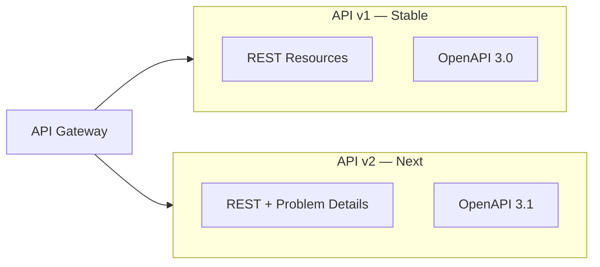
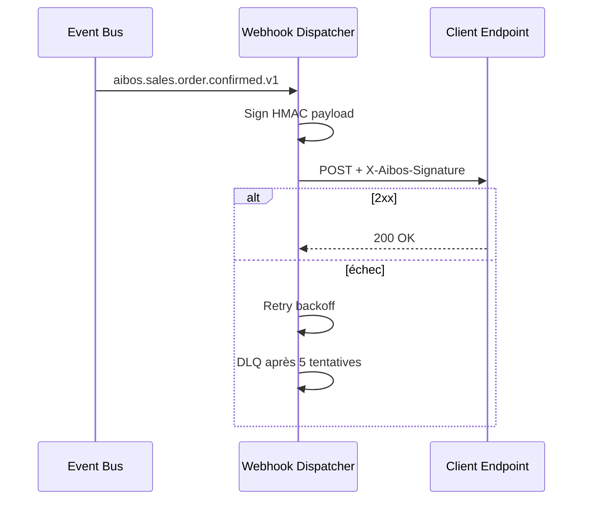
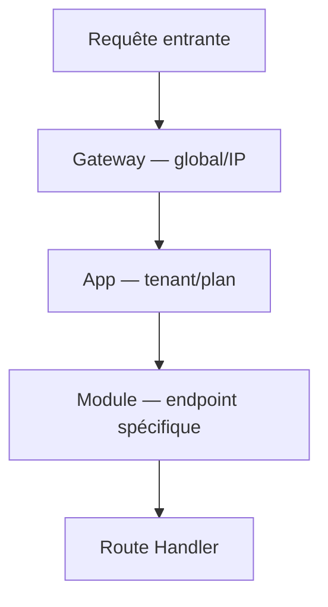

# README_13 — API Platform AI BOS

---

## Métadonnées du document

| Champ | Valeur |
|-------|--------|
| **Document** | README_13_API.md |
| **Projet** | AI BOS — AI Business Operating System |
| **Version** | 0.1.0 |
| **Statut** | `DRAFT` — revue API Review Board requise |
| **Niveau de maturité** | `DESIGN` |
| **Audience** | Backend Engineers, Integrators, Partner Developers |
| **Auteur** | AI BOS Platform API Team |
| **Dernière mise à jour** | Juillet 2026 |
| **Documents liés** | [README_04_Backend](README_04_Backend.md) · [README_12_EventDriven](README_12_EventDriven.md) · [README_15_Authentication](README_15_Authentication.md) · [README_16_RBAC](README_16_RBAC.md) |
| **Référence héritage** | [SIH IA API](../../sihia-platform/Document/README_ETAT_IMPLEMENTATION.md) · [SIH IA Chatbot Rate Limit](../../sihia-platform/backend/app/presentation/chatbot_rate_limit.py) |

---

## Table des matières

1. [Synthèse exécutive](#1-synthèse-exécutive)
2. [API Gateway](#2-api-gateway)
3. [REST API v1 et v2](#3-rest-api-v1-et-v2)
4. [GraphQL (optionnel)](#4-graphql-optionnel)
5. [OpenAPI et contrats](#5-openapi-et-contrats)
6. [Webhooks](#6-webhooks)
7. [SDK clients](#7-sdk-clients)
8. [Rate limiting](#8-rate-limiting)
9. [Portail développeur](#9-portail-développeur)
10. [Gestion des erreurs](#10-gestion-des-erreurs)
11. [Architecture Decision Records (ADR)](#11-architecture-decision-records-adr)
12. [Checklist de livraison](#12-checklist-de-livraison)

---

## 1. Synthèse exécutive

La plateforme API AI BOS expose toutes les capacités métier et CORE via une **API REST versionnée**, documentée par **OpenAPI 3.1**, protégée par **JWT/API keys**, et limitée par un **rate limiting** généralisé à partir du pattern SIH IA `ChatbotRateLimiter`. Un **portail développeur** centralise la documentation, les clés d'API, les webhooks et les guides d'intégration.

```mermaid
flowchart TB
    subgraph Clients
        WEB[Shell React]
        MOB[Mobile / Partenaires]
        SDK_PY[SDK Python]
        SDK_TS[SDK TypeScript]
    end

    subgraph Edge["Edge Layer"]
        CDN[CloudFront]
        WAF[AWS WAF]
        GW[API Gateway / ALB]
    end

    subgraph Platform["FastAPI Monolithe"]
        RL[Rate Limiter]
        AUTH[Auth Middleware]
        V1[/api/v1/*]
        V2[/api/v2/*]
        GQL[/graphql optional]
    end

    WEB & MOB & SDK_PY & SDK_TS --> CDN --> WAF --> GW
    GW --> RL --> AUTH --> V1 & V2 & GQL
```

---

## 2. API Gateway

### Responsabilités

| Couche | Responsabilité | Technologie |
|--------|----------------|-------------|
| Edge | TLS termination, DDoS, cache statique | CloudFront + WAF |
| Gateway | Routing, throttling global, API keys | AWS API Gateway ou ALB + FastAPI |
| Application | AuthZ, validation, logique métier | FastAPI (README_04) |

### Routing

```
https://api.aibos.io/api/v1/{module}/{resource}
https://api.aibos.io/api/v2/{module}/{resource}
https://api.aibos.io/webhooks/v1/{provider}
https://developers.aibos.io          → Portail
```

### Headers standards

| Header | Direction | Description |
|--------|-----------|-------------|
| `Authorization` | Request | `Bearer {jwt}` ou absent si API key |
| `X-Api-Key` | Request | Clé API développeur (M2M) |
| `X-Tenant-Id` | Request | Organisation (si non dans JWT) |
| `X-Correlation-ID` | Bidirectionnel | Traçabilité (hérité SIH IA) |
| `X-RateLimit-Limit` | Response | Plafond fenêtre |
| `X-RateLimit-Remaining` | Response | Requêtes restantes |
| `Retry-After` | Response | Secondes avant retry (429) |

---

## 3. REST API v1 et v2

### Stratégie de versionnement

| Version | Statut | Politique |
|---------|--------|-----------|
| **v1** | Stable | Support 24 mois après dépréciation annoncée |
| **v2** | Beta → Stable | Breaking changes autorisés pendant beta |

### Conventions REST

- **Ressources** au pluriel : `/api/v1/contacts`, `/api/v1/invoices`
- **Verbes HTTP** : GET (lecture), POST (création), PATCH (MAJ partielle), DELETE (suppression logique)
- **Pagination** : cursor-based `?cursor=xxx&limit=50` (v2) ; offset `?page=1&size=20` (v1 legacy)
- **Filtrage** : `?status=active&created_after=2026-01-01`
- **Tri** : `?sort=-created_at`

### Namespaces par module

| Préfixe | Module | Exemples |
|---------|--------|----------|
| `/api/v1/platform/` | CORE transverse | `organizations`, `users`, `billing` |
| `/api/v1/crm/` | CRM | `contacts`, `accounts`, `activities` |
| `/api/v1/sales/` | Sales | `leads`, `quotes`, `orders` |
| `/api/v1/finance/` | Finance | `invoices`, `payments`, `credit-notes` |
| `/api/v1/ai/` | IA transverse | `agents`, `rag`, `workflows` |
| `/api/v1/apps/sihia/` | App verticale | `patients`, `appointments` (héritage SIH IA) |

### Différences v1 → v2

| Aspect | v1 | v2 |
|--------|----|----|
| Pagination | Offset | Cursor |
| Erreurs | `{ detail: string }` | RFC 7807 Problem Details |
| IDs | String UUID | UUID v7 (ordonné) |
| Bulk ops | Non | `POST /bulk` supporté |
| Permissions | JWT claims | JWT + header `X-Policy-Context` (ABAC) |



---

## 4. GraphQL (optionnel)

GraphQL est **optionnel** et ciblé sur les cas d'usage frontend à requêtes composites (dashboard, mobile).

| Critère | REST | GraphQL |
|---------|------|---------|
| Intégrations M2M | ✅ Primaire | ❌ Non exposé publiquement |
| Shell UI dashboard | ✅ Suffisant | ✅ Phase 2 |
| Cache CDN | ✅ Excellent | ⚠️ Limité |
| Rate limiting | ✅ Simple | ⚠️ Complexité coût requête |

### Stack proposée

- **Strawberry GraphQL** (Python) ou **Graphene** — intégration FastAPI
- Endpoint : `POST /graphql` (interne + portail, pas partenaires MVP)
- Auth : même JWT que REST
- DataLoader pour N+1 queries

**Décision** : GraphQL en **phase 2** après stabilisation REST v1. Pas de double maintenance prématurée.

---

## 5. OpenAPI et contrats

### Génération

FastAPI génère automatiquement la spec OpenAPI. AI BOS enrichit :

- Descriptions multilingues (FR/EN)
- Exemples de requêtes/réponses
- Schémas d'erreur standardisés
- Tags par module et niveau d'accès

### Artefacts publiés

| Artefact | URL | Usage |
|----------|-----|-------|
| `openapi-v1.json` | `/api/v1/openapi.json` | SDK gen, Postman |
| `openapi-v1.yaml` | Portail dev | Documentation |
| Postman Collection | Portail dev | Tests manuels |
| Contract tests | CI | Régression breaking changes |

### Validation CI

```yaml
# .github/workflows/api-contract.yml (extrait)
- name: OpenAPI diff
  run: oasdiff breaking openapi-v1.baseline.json openapi-v1.json
```

### Alignement SIH IA

Les routes SIH IA existantes (`/api/patients`, `/api/auth/login`) sont **namespacées** sous `/api/v1/apps/sihia/` avec mapping de compatibilité temporaire.

---

## 6. Webhooks

### Modèle

Les clients enregistrent des endpoints HTTPS recevant les événements domaine (README_12).



### Enregistrement webhook

```http
POST /api/v1/platform/webhooks
Authorization: Bearer {jwt}
Content-Type: application/json

{
  "url": "https://client.example.com/hooks/aibos",
  "events": ["aibos.sales.order.confirmed.v1", "aibos.finance.invoice.issued.v1"],
  "secret": "whsec_auto_generated"
}
```

### Sécurité webhooks

| Mécanisme | Détail |
|-----------|--------|
| Signature | HMAC-SHA256 `X-Aibos-Signature: t={ts},v1={sig}` |
| Timestamp | Rejet si > 5 min d'écart |
| TLS | HTTPS obligatoire, certificat valide |
| Idempotence | Header `X-Aibos-Event-Id` |

---

## 7. SDK clients

### SDK officiels

| SDK | Langage | Package | Priorité |
|-----|---------|---------|----------|
| `aibos-python` | Python 3.11+ | PyPI | P0 |
| `aibos-typescript` | TypeScript 5+ | npm | P0 |
| `aibos-go` | Go 1.22+ | pkg.go.dev | P2 |

### Fonctionnalités SDK

- Auth automatique (JWT refresh, API key)
- Retry exponentiel sur 429/5xx
- Typage généré depuis OpenAPI (`openapi-generator`)
- Pagination cursor automatique (v2)

### Exemple Python

```python
from aibos import AibosClient

client = AibosClient(api_key="aibos_sk_live_...")
contacts = client.crm.contacts.list(status="active", limit=50)
for contact in contacts.auto_paginate():
    print(contact.email)
```

### Réutilisation SIH IA

Le client HTTP frontend (`src/lib/api/services.ts`) sert de **référence** pour le SDK TypeScript : intercepteurs refresh token, gestion 401/403, correlation ID.

---

## 8. Rate limiting

### Architecture à niveaux



### Implémentation application (héritage SIH IA)

Le `ChatbotRateLimiter` SIH IA (fenêtre glissante 60s, clé par utilisateur) est **généralisé** en `PlatformRateLimiter` :

```python
# Inspiré de sihia-platform/backend/app/presentation/chatbot_rate_limit.py
class PlatformRateLimiter:
    """Fenêtre glissante par clé composite {tenant_id}:{user_id}:{endpoint_group}."""

    def check(self, key: str) -> int | None:
        """Retourne Retry-After (secondes) si limite atteinte, sinon None."""
        ...
```

### Plafonds par plan (voir README_20)

| Plan | API req/min | AI tokens/min | Webhooks/min |
|------|-------------|---------------|--------------|
| Starter | 60 | 5 000 | 10 |
| Pro | 300 | 50 000 | 100 |
| Enterprise | Custom | Custom | Custom |

### Réponses 429

```json
{
  "type": "https://api.aibos.io/errors/rate-limit",
  "title": "Too Many Requests",
  "status": 429,
  "detail": "Limite de 60 requêtes/minute atteinte pour le plan Starter",
  "retry_after": 42
}
```

Headers : `Retry-After: 42`, `X-RateLimit-Limit: 60`, `X-RateLimit-Remaining: 0`

### Rate limit login (SIH IA)

Réutilisation directe du pattern SIH IA : **5 échecs / 5 min / IP+email** (`check_login_allowed`).

---

## 9. Portail développeur

### URL et sections

**https://developers.aibos.io**

| Section | Contenu |
|---------|---------|
| Quickstart | Première requête en 5 min |
| API Reference | OpenAPI interactif (Scalar/Redoc) |
| Guides | Auth, webhooks, pagination, erreurs |
| SDK | Installation, exemples |
| Changelog | Breaking changes, dépréciations |
| Status | Page statut + incidents |

### Gestion des clés API

```http
POST /api/v1/platform/api-keys
{
  "name": "Production ERP Integration",
  "scopes": ["crm:read", "sales:read", "sales:write"],
  "expires_at": "2027-01-01T00:00:00Z"
}
```

Réponse : clé affichée **une seule fois** (`aibos_sk_live_...`).

### Sandbox

- Environnement `https://api.sandbox.aibos.io`
- Données synthétiques, pas de facturation réelle
- Clés préfixées `aibos_sk_test_...`

---

## 10. Gestion des erreurs

### Format v2 (RFC 7807)

```json
{
  "type": "https://api.aibos.io/errors/forbidden",
  "title": "Forbidden",
  "status": 403,
  "detail": "Permission requise : invoices:read",
  "instance": "/api/v2/finance/invoices/inv_123",
  "correlation_id": "corr-uuid"
}
```

### Codes HTTP standard

| Code | Usage |
|------|-------|
| 400 | Validation Pydantic échouée |
| 401 | JWT invalide/expiré |
| 403 | Permission insuffisante (`require_permission` SIH IA) |
| 404 | Ressource inexistante ou hors tenant |
| 409 | Conflit (version optimiste) |
| 422 | Sémantique métier invalide |
| 429 | Rate limit |
| 500 | Erreur interne (jamais de stack trace) |

---

## 11. Architecture Decision Records (ADR)

### ADR-013-01 : REST-first, GraphQL phase 2

| Champ | Valeur |
|-------|--------|
| **Statut** | Accepté |
| **Décision** | REST v1/v2 comme contrat primaire ; GraphQL interne uniquement phase 2 |
| **Conséquences** | Intégrations partenaires simplifiées |

### ADR-013-02 : Cursor pagination en v2

| Champ | Valeur |
|-------|--------|
| **Statut** | Accepté |
| **Décision** | v2 adopte cursor ; v1 conserve offset pour compat SIH IA |
| **Conséquences** | Deux patterns coexistants temporairement |

### ADR-013-03 : Généralisation ChatbotRateLimiter

| Champ | Valeur |
|-------|--------|
| **Statut** | Accepté |
| **Décision** | Extraire `PlatformRateLimiter` depuis SIH IA ; Redis en prod multi-instance |
| **Conséquences** | MVP in-memory acceptable en dev mono-instance |

### ADR-013-04 : Webhooks signés HMAC

| Champ | Valeur |
|-------|--------|
| **Statut** | Accepté |
| **Décision** | Signature Stripe-style ; pas de JWT dans webhooks sortants |
| **Conséquences** | Vérification simple côté client |

---

## 12. Checklist de livraison

- [ ] Routes namespacées `/api/v1/{module}/`
- [ ] OpenAPI 3.1 publié et versionné en CI
- [ ] `PlatformRateLimiter` avec limites par plan
- [ ] Headers `X-RateLimit-*` et `Retry-After`
- [ ] Webhook dispatcher + signature HMAC
- [ ] SDK Python et TypeScript générés
- [ ] Portail développeur (sandbox + clés API)
- [ ] Mapping compat SIH IA `/api/v1/apps/sihia/`
- [ ] Contract tests breaking changes
- [ ] Documentation erreurs RFC 7807 (v2)

---

*Document maintenu par l'équipe API AI BOS. Prochaine revue : Q3 2026.*
