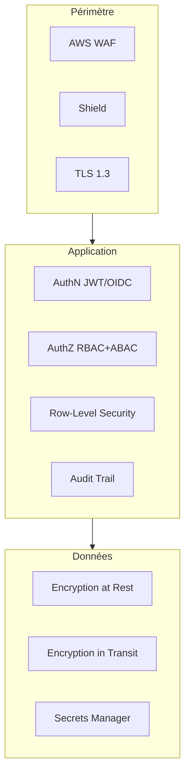
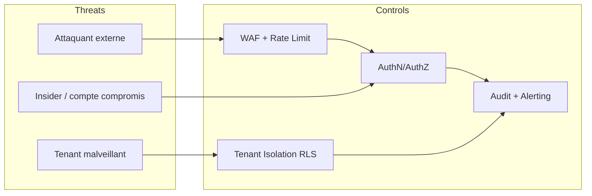
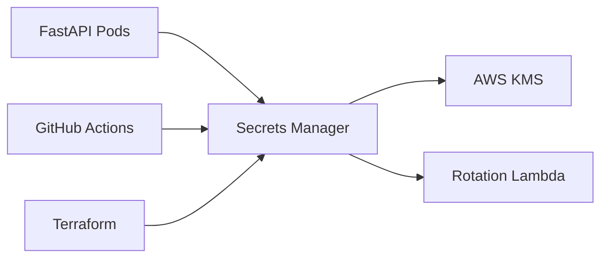
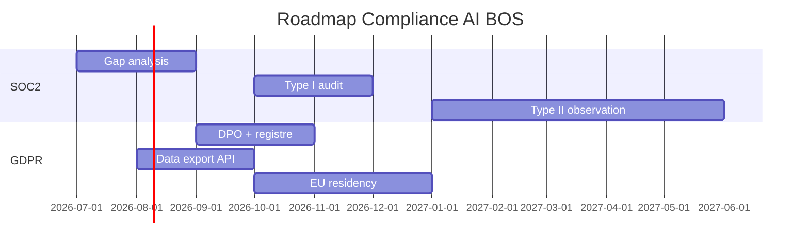

# README_14 — Posture de sécurité AI BOS

---

## Métadonnées du document

| Champ | Valeur |
|-------|--------|
| **Document** | README_14_Security.md |
| **Projet** | AI BOS — AI Business Operating System |
| **Version** | 0.1.0 |
| **Statut** | `DRAFT` — revue Security Review Board requise |
| **Niveau de maturité** | `DESIGN` |
| **Audience** | Security Engineers, Compliance, SRE, Engineering Leads |
| **Auteur** | AI BOS Security & Compliance Team |
| **Dernière mise à jour** | Juillet 2026 |
| **Documents liés** | [README_15_Authentication](README_15_Authentication.md) · [README_16_RBAC](README_16_RBAC.md) · [README_17_ABAC](README_17_ABAC.md) · [README_18_MultiTenant](README_18_MultiTenant.md) |
| **Référence héritage** | [SIH IA Security Checklist](../../sihia-platform/Document/SECURITY_CHECKLIST.md) · [SIH IA RBAC](../../sihia-platform/Document/README_06_Securite_RBAC.md) |

---

## Table des matières

1. [Synthèse exécutive](#1-synthèse-exécutive)
2. [Modèle de menaces STRIDE](#2-modèle-de-menaces-stride)
3. [OWASP Top 10 — couverture](#3-owasp-top-10--couverture)
4. [Chiffrement](#4-chiffrement)
5. [Gestion des secrets](#5-gestion-des-secrets)
6. [Sécurité réseau et infrastructure](#6-sécurité-réseau-et-infrastructure)
7. [Journalisation et audit](#7-journalisation-et-audit)
8. [Sécurité IA et données sensibles](#8-sécurité-ia-et-données-sensibles)
9. [Compliance SOC 2 / GDPR](#9-compliance-soc-2--gdpr)
10. [Extension checklist SIH IA](#10-extension-checklist-sih-ia)
11. [Architecture Decision Records (ADR)](#11-architecture-decision-records-adr)
12. [Plan de remédiation](#12-plan-de-remédiation)
13. [Checklist de livraison](#13-checklist-de-livraison)

---

## 1. Synthèse exécutive

AI BOS traite des données métier sensibles (CRM, finance, santé via SIH IA) pour des clients enterprise. La posture de sécurité repose sur :

- **Defense in depth** : WAF → Gateway → AuthN → AuthZ (RBAC+ABAC) → RLS tenant
- **Zero trust** : aucune confiance implicite réseau interne
- **Secure by default** : permissions minimales, chiffrement systématique
- **Héritage SIH IA** : JWT, `require_permission`, audit logs, rate limiting login déjà validés en pilote



---

## 2. Modèle de menaces STRIDE

### Acteurs et actifs

| Actif | Criticité | Données |
|-------|-----------|---------|
| Credentials utilisateurs | Critique | JWT, refresh tokens, MFA secrets |
| Données tenant | Critique | CRM, factures, dossiers patients (SIH IA) |
| Clés API / service accounts | Élevée | Intégrations M2M |
| Modèles IA / prompts | Élevée | IP, données d'entraînement |
| Logs et métriques | Moyenne | PII potentielle |

### Matrice STRIDE

| Menace | Description | Mitigation AI BOS |
|--------|-------------|-----------------|
| **S**poofing | Usurpation identité | JWT court + refresh rotatif, MFA, API keys hashées |
| **T**ampering | Altération données | Signatures webhooks, checksums S3, immutabilité audit |
| **R**epudiation | Déni d'action | Audit trail signé, `correlation_id`, horodatage UTC |
| **I**nformation disclosure | Fuite données | RLS tenant, chiffrement, masquage logs PII |
| **D**enial of service | Indisponibilité | Rate limiting, WAF, auto-scaling, circuit breakers |
| **E**levation of privilege | Escalade droits | RBAC strict, ABAC contextuel, revue permissions |



---

## 3. OWASP Top 10 — couverture

| # | Risque OWASP | Statut AI BOS | Contrôles |
|---|--------------|---------------|-----------|
| A01 | Broken Access Control | 🟡 En cours | `require_permission`, ABAC, RLS, PermissionGuard |
| A02 | Cryptographic Failures | 🟡 En cours | TLS 1.3, AES-256 at rest, PBKDF2 passwords |
| A03 | Injection | 🟢 Couvert | SQL paramétré, Pydantic validation |
| A04 | Insecure Design | 🟡 En cours | Threat modeling STRIDE, ADRs sécurité |
| A05 | Security Misconfiguration | 🟡 En cours | Hardening Terraform, CIS benchmarks |
| A06 | Vulnerable Components | 🟢 Couvert | pip-audit, npm audit en CI (SIH IA) |
| A07 | Auth Failures | 🟢 Couvert | JWT refresh rotatif, rate limit login |
| A08 | Data Integrity Failures | 🟡 En cours | Outbox, signatures webhooks |
| A09 | Logging Failures | 🟡 En cours | Audit JSONL → centralisation ELK |
| A10 | SSRF | 🟡 En cours | Allowlist URLs webhooks, sandbox agents |

---

## 4. Chiffrement

### En transit (Encryption in Transit)

| Flux | Protocole | Exigence |
|------|-----------|----------|
| Client → API | TLS 1.3 | Certificat ACM, HSTS (SIH IA prod) |
| API → PostgreSQL | TLS | `sslmode=require` |
| API → Redis | TLS | Encryption in-transit ElastiCache |
| API → S3 | HTTPS | SSE-KMS |
| API → LLM providers | HTTPS | Pas de données PII en clair dans prompts |

### Au repos (Encryption at Rest)

| Stockage | Méthode | Clé |
|----------|---------|-----|
| PostgreSQL RDS | AES-256 | AWS KMS CMK par environnement |
| S3 documents | SSE-KMS | CMK dédiée par tenant (Enterprise) |
| EBS volumes | AES-256 | KMS default |
| Backups | Chiffrés | Même CMK que source |
| Secrets | Secrets Manager | Envelope encryption KMS |

### Données applicatives sensibles

| Champ | Traitement |
|-------|------------|
| Mot de passe | PBKDF2-SHA256 390k iterations (SIH IA `hash_password`) |
| API keys | Hash SHA-256, préfixe visible uniquement |
| Refresh tokens | Session DB + JWT signé |
| PII santé (SIH IA) | Pseudonymisation exports analytics |

---

## 5. Gestion des secrets

### AWS Secrets Manager



### Inventaire des secrets

| Secret | Stockage | Rotation |
|--------|----------|----------|
| `JWT_SECRET` | Secrets Manager | 90 jours |
| `DATABASE_URL` | Secrets Manager | 90 jours |
| `STRIPE_SECRET_KEY` | Secrets Manager | Manuel (Stripe dashboard) |
| `OPENAI_API_KEY` | Secrets Manager | 90 jours |
| Clés API tenant | DB hashées | Révocables par admin |

### Règles

1. **Jamais** de secrets dans git (`.env.example` uniquement avec placeholders)
2. Injection via **variables d'environnement** au runtime (ECS/EKS)
3. Accès IAM **least privilege** par service
4. Audit CloudTrail sur accès Secrets Manager

### Gap SIH IA à combler

La checklist SIH IA indique : `[ ] Secrets injectés via vault / variables CI (pas dans git)` — **obligatoire** avant production AI BOS.

---

## 6. Sécurité réseau et infrastructure

### Segmentation

| Zone | Composants | Accès |
|------|------------|-------|
| Public | ALB, CloudFront | Internet |
| Private App | ECS tasks FastAPI | ALB uniquement |
| Private Data | RDS, Redis, MSK | App subnet uniquement |
| Management | Bastion, CI runners | VPN / SSO |

### Headers HTTP (héritage SIH IA)

| Header | Valeur |
|--------|--------|
| `Strict-Transport-Security` | `max-age=31536000; includeSubDomains` (prod) |
| `X-Content-Type-Options` | `nosniff` |
| `X-Frame-Options` | `DENY` |
| `Referrer-Policy` | `strict-origin-when-cross-origin` |
| `Content-Security-Policy` | Configuré par environnement |
| `X-Correlation-ID` | UUID propagé |

---

## 7. Journalisation et audit

### Niveaux de logs

| Type | Contenu | Rétention |
|------|---------|-----------|
| Access logs | Requêtes HTTP (sans body) | 90 jours |
| Security logs | 401, 403, rate limit, login failures | 1 an |
| Audit trail | Actions admin, RBAC, billing | 7 ans (finance) |
| Application logs | Erreurs, métriques | 30 jours |

### Format structuré (aligné SIH IA)

```json
{
  "timestamp": "2026-07-06T08:00:00Z",
  "level": "WARN",
  "logger": "aibos.security",
  "correlation_id": "corr-uuid",
  "tenant_id": "org_abc",
  "actor_id": "usr_xyz",
  "action": "rbac.user.delete",
  "resource": "usr_target",
  "ip": "203.0.113.1",
  "outcome": "denied",
  "reason": "missing_permission:users:delete"
}
```

### Actions auditées obligatoirement

- CRUD utilisateurs et rôles
- Changements plan / billing
- Export données (GDPR)
- Accès données santé (SIH IA)
- Rotation secrets et clés API
- Modifications webhooks

---

## 8. Sécurité IA et données sensibles

| Risque | Mitigation |
|--------|------------|
| Prompt injection | Guardrails (SIH IA `chatbot_guardrails.py`) |
| Fuite PII vers LLM | Redaction pré-envoi, allowlist champs |
| Hallucinations critiques | Disclaimers, escalade humaine |
| Modèle supply chain | Allowlist providers, pas de modèles non audités |

---

## 9. Compliance SOC 2 / GDPR

### Roadmap SOC 2 Type II

| Phase | Période | Livrables |
|-------|---------|-----------|
| Readiness | Q3 2026 | Policies, inventaire, gap analysis |
| Type I | Q4 2026 | Audit ponctuel contrôles |
| Type II | Q2 2027 | 6 mois d'evidence continue |

### Trust Service Criteria ciblés

- **Security** : accès, chiffrement, vulnérabilités
- **Availability** : SLA 99.9%, DR, monitoring
- **Confidentiality** : classification données, RLS
- **Privacy** : GDPR (voir ci-dessous)

### Roadmap GDPR

| Exigence | Implémentation AI BOS |
|----------|----------------------|
| Base légale | Consentement + contrat (B2B) |
| Droit d'accès | `GET /api/v1/platform/me/data-export` |
| Droit à l'effacement | Workflow anonymisation tenant |
| Portabilité | Export JSON/CSV standardisé |
| DPO | Désignation Q4 2026 |
| Registre traitements | Documentation par module |
| Sous-traitants | DPA Stripe, OpenAI, AWS |
| Data residency EU | Région `eu-west-1` (README_18) |



---

## 10. Extension checklist SIH IA

La [checklist SIH IA](../../sihia-platform/Document/SECURITY_CHECKLIST.md) est étendue pour AI BOS enterprise :

### A01 — Contrôle d'accès (extension)

- [x] JWT + `require_permission` (SIH IA)
- [x] `PermissionGuard` frontend (SIH IA)
- [ ] ABAC policies OPA (README_17)
- [ ] Row-Level Security PostgreSQL par `tenant_id`
- [ ] Revue trimestrielle permissions (SoD matrix)
- [ ] Séparation duties admin / billing

### A02 — Configuration (extension)

- [x] `JWT_SECRET` obligatoire prod (SIH IA)
- [ ] AWS Secrets Manager 100 % secrets
- [ ] Infrastructure as Code (Terraform) reviewed
- [ ] Hardening CIS AWS benchmark

### A04 — Cryptographie (extension)

- [x] Mots de passe hashés PBKDF2 (SIH IA)
- [x] Refresh tokens session DB (SIH IA)
- [ ] Rotation JWT planifiée (90j)
- [ ] CMK KMS par environnement
- [ ] Chiffrement colonnes PII sensibles

### A07 — Authentification (extension)

- [x] Login / refresh / logout (SIH IA)
- [x] Rate limit login 5/5min (SIH IA)
- [ ] MFA TOTP obligatoire admin
- [ ] OIDC/SAML SSO Enterprise (README_15)
- [ ] API keys M2M avec scopes

### A09 — Journalisation (extension)

- [x] Audit JSONL admin (SIH IA)
- [x] `correlation_id` (SIH IA)
- [ ] Export centralisé ELK/Datadog
- [ ] Alerting SIEM (tentatives brute force)
- [ ] Immutabilité logs audit (WORM S3)

### Spécifique AI BOS

- [ ] Pentest annuel par tiers
- [ ] Bug bounty program (phase 2)
- [ ] SBOM génération CI
- [ ] Classification données par module
- [ ] Plan réponse incident (IRP) documenté
- [ ] Exercice tabletop semestriel

---

## 11. Architecture Decision Records (ADR)

### ADR-014-01 : AWS Secrets Manager comme source unique

| Champ | Valeur |
|-------|--------|
| **Statut** | Accepté |
| **Décision** | Tous secrets runtime dans Secrets Manager ; `.env` local dev uniquement |
| **Conséquences** | Dépendance AWS ; rotation automatisée possible |

### ADR-014-02 : KMS CMK par environnement

| Champ | Valeur |
|-------|--------|
| **Statut** | Accepté |
| **Décision** | Clés KMS distinctes dev/staging/prod |
| **Conséquences** | Isolation blast radius ; coût KMS marginal |

### ADR-014-03 : Audit trail immuable pour actions finance

| Champ | Valeur |
|-------|--------|
| **Statut** | Accepté |
| **Décision** | Logs finance → S3 WORM 7 ans |
| **Conséquences** | Coût stockage ; conformité réglementaire |

### ADR-014-04 : Pentest avant GA Enterprise

| Champ | Valeur |
|-------|--------|
| **Statut** | Accepté |
| **Décision** | Pentest tiers obligatoire avant ventes Enterprise |
| **Conséquences** | Délai 4-6 semaines ; budget sécurité |

---

## 12. Plan de remédiation

| Priorité | Action | Échéance |
|----------|--------|----------|
| P0 | Migration secrets → Secrets Manager | S1 2026 |
| P0 | PostgreSQL + TLS + chiffrement at rest | S1 2026 |
| P1 | RLS multi-tenant | S2 2026 |
| P1 | Centralisation logs | S3 2026 |
| P1 | MFA admin obligatoire | S3 2026 |
| P2 | SOC 2 Type I | Q4 2026 |
| P2 | Pentest initial | Q4 2026 |

---

## 13. Checklist de livraison

- [ ] Threat model STRIDE documenté et revu
- [ ] OWASP Top 10 mapping à jour
- [ ] TLS 1.3 + HSTS production
- [ ] Secrets Manager intégré (zéro secret git)
- [ ] Audit trail actions sensibles
- [ ] Extension checklist SIH IA validée
- [ ] Plan GDPR data export/erase
- [ ] IRP documenté et testé
- [ ] Scan dépendances CI (pip-audit, npm audit)
- [ ] Headers sécurité HTTP (héritage SIH IA)

---

*Document maintenu par l'équipe Security AI BOS. Classification : INTERNE. Prochaine revue : Q3 2026.*
