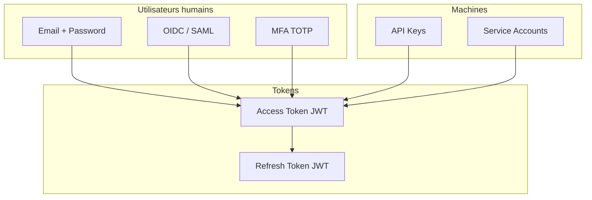
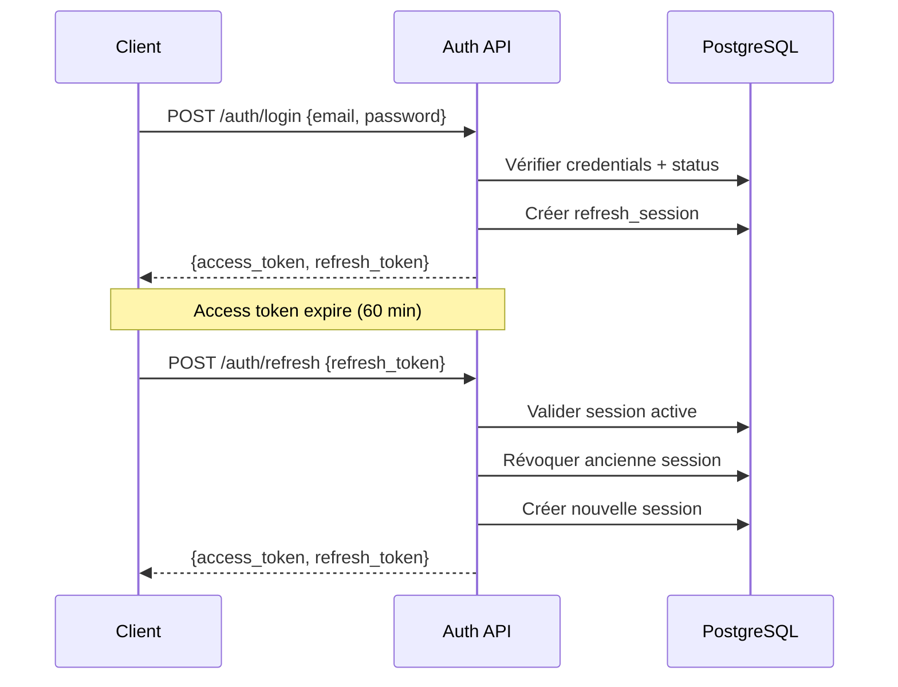
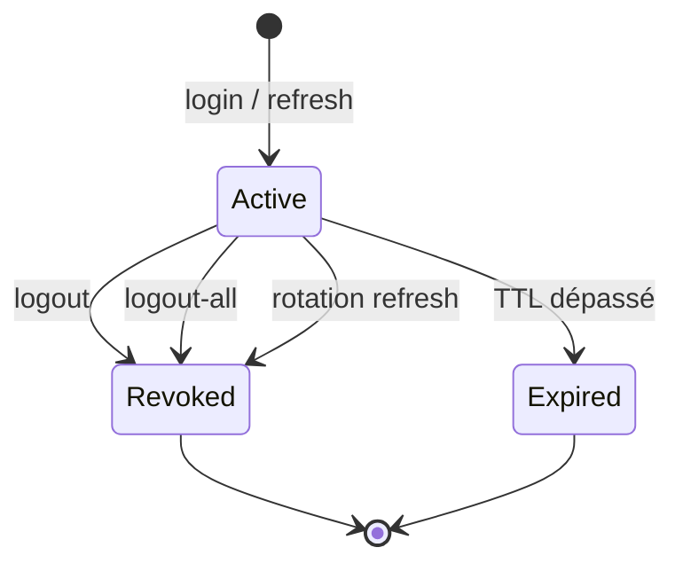
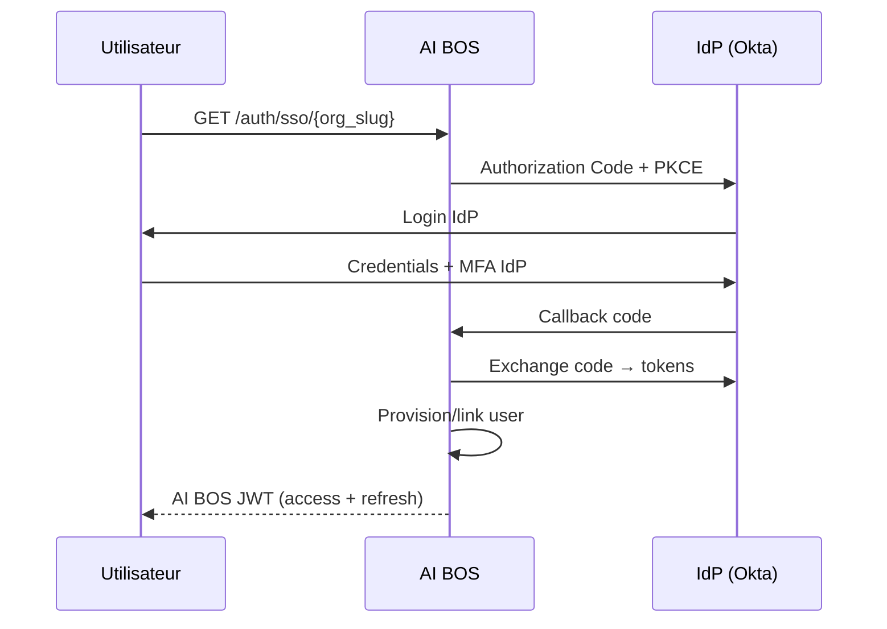

# README_15 — Authentification AI BOS

---

## Métadonnées du document

| Champ | Valeur |
|-------|--------|
| **Document** | README_15_Authentication.md |
| **Projet** | AI BOS — AI Business Operating System |
| **Version** | 0.1.0 |
| **Statut** | `DRAFT` |
| **Niveau de maturité** | `DESIGN` |
| **Audience** | Backend Engineers, Security, Frontend Engineers |
| **Auteur** | AI BOS Identity Team |
| **Dernière mise à jour** | Juillet 2026 |
| **Documents liés** | [README_14_Security](README_14_Security.md) · [README_16_RBAC](README_16_RBAC.md) · [README_18_MultiTenant](README_18_MultiTenant.md) |
| **Référence héritage** | [SIH IA AuthService](../../sihia-platform/backend/app/application/use_cases.py) · [SIH IA security.py](../../sihia-platform/backend/app/core/security.py) · [SIH IA auth store](../../sihia-platform/src/lib/auth/store.ts) |

---

## Table des matières

1. [Synthèse exécutive](#1-synthèse-exécutive)
2. [Modèle d'authentification](#2-modèle-dauthentification)
3. [JWT access + refresh (héritage SIH IA)](#3-jwt-access--refresh-héritage-sih-ia)
4. [Gestion des sessions](#4-gestion-des-sessions)
5. [OIDC et SAML SSO](#5-oidc-et-saml-sso)
6. [MFA](#6-mfa)
7. [Clés API](#7-clés-api)
8. [Comptes de service](#8-comptes-de-service)
9. [Rotation et révocation](#9-rotation-et-révocation)
10. [Intégration frontend](#10-intégration-frontend)
11. [Architecture Decision Records (ADR)](#11-architecture-decision-records-adr)
12. [Checklist de livraison](#12-checklist-de-livraison)

---

## 1. Synthèse exécutive

L'authentification AI BOS **réutilise et étend** le modèle JWT validé par SIH IA : tokens d'accès courts (60 min), refresh tokens rotatifs stockés en session DB, révocation par session, et limite de sessions concurrentes. Les extensions enterprise ajoutent **OIDC/SAML SSO**, **MFA**, **clés API** pour intégrations M2M, et **comptes de service** pour agents et workers.



---

## 2. Modèle d'authentification

### Principes

| Principe | Implémentation |
|----------|----------------|
| Stateless horizontal scaling | Access JWT signé HS256/RS256 |
| Révocation refresh | Session DB `refresh_sessions` |
| Least privilege | Permissions dans claims JWT |
| Multi-tenant | `tenant_id` + `org_slug` dans claims |
| Audit | Login/logout/logout-all journalisés |

### Flux principaux



---

## 3. JWT access + refresh (héritage SIH IA)

### Configuration (étendue depuis SIH IA)

| Paramètre | SIH IA | AI BOS |
|-----------|--------|--------|
| `access_token_exp_minutes` | 60 | 60 (configurable par plan) |
| `refresh_token_exp_days` | 7 | 7–30 selon politique org |
| `max_refresh_sessions_per_user` | 3 | 5 (Enterprise : configurable) |
| `jwt_algorithm` | HS256 | HS256 (MVP) → RS256 (scale) |
| `jwt_secret` | Env var | AWS Secrets Manager |

### Claims access token

```json
{
  "sub": "usr_abc123",
  "iat": 1751788800,
  "exp": 1751792400,
  "id": "usr_abc123",
  "email": "user@acme.com",
  "name": "Jane Doe",
  "role": "org_admin",
  "permissions": ["crm:read", "crm:write", "billing:read"],
  "tenant_id": "org_acme",
  "org_slug": "acme-corp",
  "auth_method": "password"
}
```

### Code source SIH IA réutilisé

| Composant | Fichier SIH IA | Migration AI BOS |
|-----------|----------------|------------------|
| `create_access_token` | `core/security.py` | `core/auth/tokens.py` |
| `create_refresh_token` | `core/security.py` | `core/auth/tokens.py` |
| `AuthService.login` | `application/use_cases.py` | `application/auth_service.py` |
| `AuthService.refresh` | `application/use_cases.py` | Rotation session identique |
| `hash_password` | `core/security.py` | PBKDF2 conservé |

### Endpoints auth

| Méthode | Route | Description |
|---------|-------|-------------|
| POST | `/api/v1/auth/login` | Email + password |
| POST | `/api/v1/auth/refresh` | Rotation refresh token |
| POST | `/api/v1/auth/logout` | Révoque session courante |
| POST | `/api/v1/auth/logout-all` | Révoque toutes sessions (auth requis) |
| GET | `/api/v1/auth/me` | Profil utilisateur courant |
| POST | `/api/v1/auth/password/reset` | Demande reset |
| POST | `/api/v1/auth/password/confirm` | Confirmation reset |

### Protection login (SIH IA)

Rate limit : **5 échecs / 5 min / IP+email** — réutilisation directe de `check_login_allowed` / `register_login_failure`.

---

## 4. Gestion des sessions

### Table `refresh_sessions`

| Colonne | Type | Description |
|---------|------|-------------|
| `id` | VARCHAR | `rs-{uuid}` (SIH IA pattern) |
| `user_id` | VARCHAR | FK users |
| `expires_at` | INTEGER | Unix timestamp |
| `revoked_at` | TIMESTAMPTZ | NULL si active |
| `user_agent` | TEXT | Navigateur/device |
| `ip_address` | INET | IP origine |
| `tenant_id` | VARCHAR | Isolation |

### Politiques session

- **Rotation** : chaque refresh invalide l'ancienne session (anti-replay)
- **Pruning** : max N sessions actives par utilisateur
- **Suspension compte** : `status=suspended` bloque login (SIH IA)
- **Liste sessions** : `GET /api/v1/auth/sessions` — révocation individuelle



---

## 5. OIDC et SAML SSO

### Cas d'usage Enterprise

Les clients Enterprise authentifient via leur IdP (Okta, Azure AD, Google Workspace).

| Protocole | Usage | Priorité |
|-----------|-------|----------|
| **OIDC** | SSO moderne, SaaS B2B | P0 Enterprise |
| **SAML 2.0** | Legacy enterprise | P1 Enterprise |

### Flux OIDC



### Configuration par tenant

```json
{
  "tenant_id": "org_acme",
  "sso": {
    "protocol": "oidc",
    "issuer": "https://acme.okta.com",
    "client_id": "aibos_client_id",
    "scopes": ["openid", "email", "profile"],
    "attribute_mapping": {
      "email": "email",
      "name": "name",
      "groups": "role_mapping"
    }
  }
}
```

### JIT Provisioning

À la première connexion SSO :
1. Créer utilisateur si email domaine autorisé
2. Assigner rôle par défaut (`org_member`)
3. Mapper groupes IdP → rôles AI BOS (README_16)

---

## 6. MFA

### Méthodes supportées

| Méthode | Plan | Priorité |
|---------|------|----------|
| TOTP (Google Authenticator) | Pro+ | P0 |
| WebAuthn / FIDO2 | Enterprise | P1 |
| SMS | Non recommandé | ❌ |

### Politique MFA

| Rôle | MFA |
|------|-----|
| `platform_admin` | Obligatoire |
| `org_admin` | Obligatoire (Enterprise) |
| `org_member` | Optionnel (recommandé Pro+) |
| Service accounts | Clés + IP allowlist |

### Flux enrollment TOTP

```http
POST /api/v1/auth/mfa/enroll
Authorization: Bearer {access_token}

→ { "secret": "BASE32...", "qr_uri": "otpauth://..." }

POST /api/v1/auth/mfa/verify
{ "code": "123456" }

→ { "recovery_codes": ["abc...", ...] }
```

---

## 7. Clés API

### Modèle

Les clés API authentifient les intégrations M2M sans flux utilisateur.

| Préfixe | Environnement |
|---------|---------------|
| `aibos_sk_live_` | Production |
| `aibos_sk_test_` | Sandbox |

### Stockage

- Clé complète affichée **une fois** à la création
- Hash SHA-256 stocké en DB
- Métadonnées : nom, scopes, `tenant_id`, `expires_at`, `last_used_at`

### Authentification

```http
GET /api/v1/crm/contacts
X-Api-Key: aibos_sk_live_xxxxxxxx
X-Tenant-Id: org_acme
```

Alternative : `Authorization: Bearer aibos_sk_live_...` (déconseillé — préférer header dédié).

### Scopes clés API

Scopes alignés sur permissions RBAC : `crm:read`, `sales:write`, `webhooks:manage`.

---

## 8. Comptes de service

### Usage

| Consommateur | Exemple |
|--------------|---------|
| Workers Celery | Traitement outbox, webhooks |
| Agents IA | Appels API internes |
| Intégrations ERP | Sync bidirectionnelle |

### Caractéristiques

- Pas de login UI — clé API ou JWT machine-to-machine
- Rôle dédié `service_account` avec permissions minimales
- Pas de refresh token — clés longue durée avec rotation planifiée
- Audit renforcé sur chaque action

```json
{
  "type": "service_account",
  "name": "outbox-relay-worker",
  "tenant_id": "org_acme",
  "permissions": ["platform:events:publish"],
  "ip_allowlist": ["10.0.0.0/8"]
}
```

---

## 9. Rotation et révocation

### Matrice de rotation

| Artefact | Fréquence | Mécanisme |
|----------|-----------|-----------|
| Access token | 60 min | Expiration naturelle |
| Refresh token | 7 jours | Rotation à chaque refresh |
| JWT signing key | 90 jours | Secrets Manager + kid header |
| API keys | 365 jours (recommandé) | Régénération admin |
| MFA recovery codes | À l'usage | Régénération post-login |

### Révocation d'urgence

| Scénario | Action |
|----------|--------|
| Compte compromis | `logout-all` + suspendre compte |
| Clé API compromise | Révoquer clé + audit accès |
| JWT key compromise | Rotation immédiate + invalidation globale |
| Employé parti | Désactiver SSO + révoquer sessions |

### JWT key rotation (RS256 phase 2)

```json
{
  "kid": "2026-q3",
  "alg": "RS256"
}
```

JWKS endpoint : `GET /.well-known/jwks.json` — support multi-clés pendant période de grâce.

---

## 10. Intégration frontend

### Store auth (héritage SIH IA)

Le store Zustand SIH IA (`src/lib/auth/store.ts`) est généralisé :

| Fonctionnalité | SIH IA | AI BOS |
|----------------|--------|--------|
| Persistance tokens | localStorage | localStorage + httpOnly cookie option |
| Auto-refresh | Intercepteur 401 | Identique + backoff |
| Hydration | `waitForAuthHydration` | Conservé |
| Multi-tenant | `facility` | `tenant_id` + `org_slug` |

### Intercepteur API

```typescript
// Pattern SIH IA — src/lib/api/services.ts
api.interceptors.response.use(
  (res) => res,
  async (err) => {
    if (err.response?.status === 401 && !err.config._retry) {
      err.config._retry = true;
      await refreshTokens();
      return api(err.config);
    }
    return Promise.reject(err);
  }
);
```

---

## 11. Architecture Decision Records (ADR)

### ADR-015-01 : Réutiliser JWT SIH IA comme base

| Champ | Valeur |
|-------|--------|
| **Statut** | Accepté |
| **Décision** | Porter `AuthService` et `security.py` vers AI BOS CORE |
| **Conséquences** | Time-to-market ; dette HS256 à migrer RS256 |

### ADR-015-02 : Refresh rotatif obligatoire

| Champ | Valeur |
|-------|--------|
| **Statut** | Accepté |
| **Décision** | Chaque refresh révoque session précédente |
| **Conséquences** | Détection vol refresh token ; multi-device géré par pruning |

### ADR-015-03 : SSO OIDC avant SAML

| Champ | Valeur |
|-------|--------|
| **Statut** | Accepté |
| **Décision** | OIDC P0 ; SAML P1 |
| **Conséquences** | Couverture 90 % IdP enterprise modernes |

### ADR-015-04 : API keys hashées, jamais stockées en clair

| Champ | Valeur |
|-------|--------|
| **Statut** | Accepté |
| **Décision** | SHA-256 + préfixe identifiable |
| **Conséquences** | Pas de récupération clé perdue — régénération uniquement |

---

## 12. Checklist de livraison

- [ ] `AuthService` porté depuis SIH IA avec tests
- [ ] Endpoints login/refresh/logout/logout-all
- [ ] Table `refresh_sessions` avec métadonnées device
- [ ] Rate limit login (5/5min)
- [ ] Claims JWT : `tenant_id`, `permissions`, `role`
- [ ] CRUD clés API avec hash
- [ ] MFA TOTP enrollment (Pro+)
- [ ] OIDC SSO par tenant (Enterprise)
- [ ] Frontend store auth + intercepteur refresh
- [ ] Rotation JWT documentée et automatisée

---

*Document maintenu par l'équipe Identity AI BOS. Prochaine revue : Q3 2026.*
