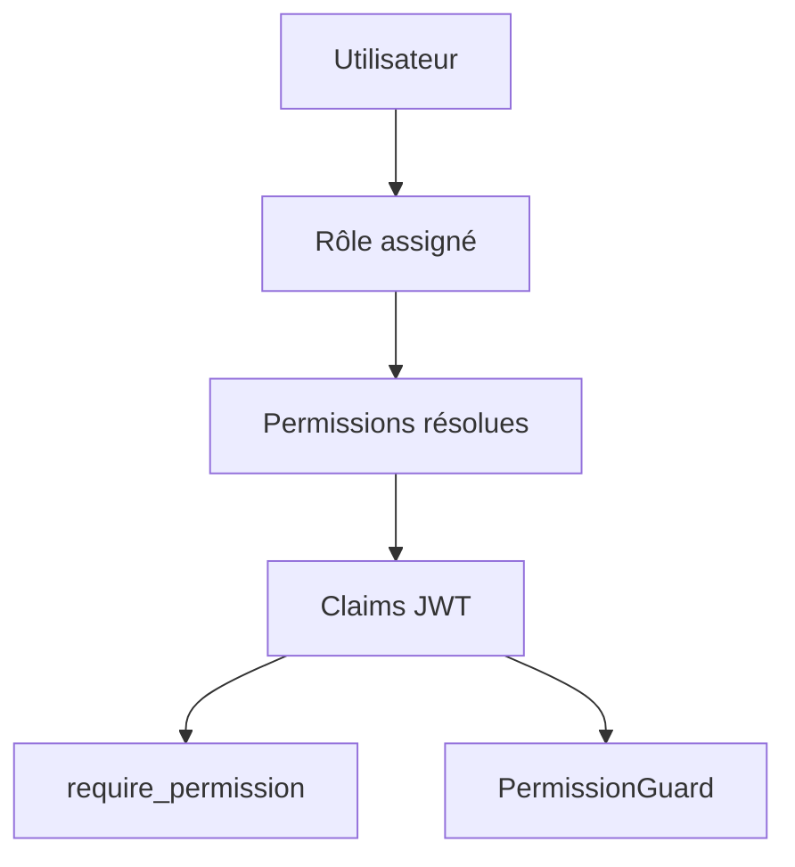
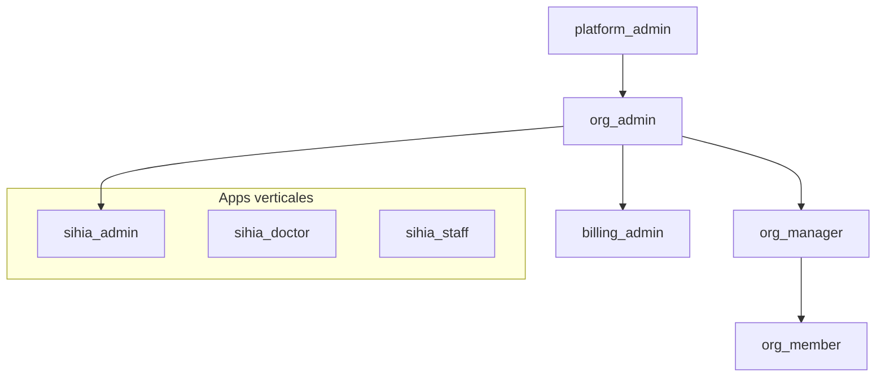
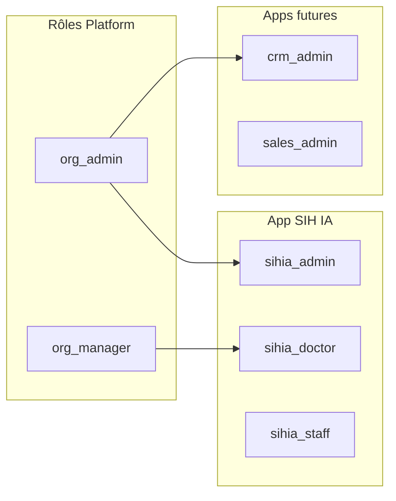

# README_16 — RBAC AI BOS

---

## Métadonnées du document

| Champ | Valeur |
|-------|--------|
| **Document** | README_16_RBAC.md |
| **Projet** | AI BOS — AI Business Operating System |
| **Version** | 0.1.0 |
| **Statut** | `DRAFT` |
| **Niveau de maturité** | `DESIGN` |
| **Audience** | Backend Engineers, Frontend Engineers, Security |
| **Auteur** | AI BOS Identity & Access Team |
| **Dernière mise à jour** | Juillet 2026 |
| **Documents liés** | [README_15_Authentication](README_15_Authentication.md) · [README_17_ABAC](README_17_ABAC.md) · [README_18_MultiTenant](README_18_MultiTenant.md) |
| **Référence héritage** | [SIH IA ROLE_PERMISSIONS](../../sihia-platform/backend/app/application/use_cases.py) · [SIH IA rbac.ts](../../sihia-platform/src/lib/auth/rbac.ts) · [SIH IA require_permission](../../sihia-platform/backend/app/presentation/deps.py) |

---

## Table des matières

1. [Synthèse exécutive](#1-synthèse-exécutive)
2. [Modèle RBAC](#2-modèle-rbac)
3. [Généralisation des rôles SIH IA](#3-généralisation-des-rôles-sih-ia)
4. [Matrice des permissions](#4-matrice-des-permissions)
5. [Permissions dans le JWT](#5-permissions-dans-le-jwt)
6. [Backend — require_permission](#6-backend--require_permission)
7. [Frontend — PermissionGuard](#7-frontend--permissionguard)
8. [Gestion des rôles](#8-gestion-des-rôles)
9. [Rôles par application verticale](#9-rôles-par-application-verticale)
10. [Architecture Decision Records (ADR)](#10-architecture-decision-records-adr)
11. [Checklist de livraison](#11-checklist-de-livraison)

---

## 1. Synthèse exécutive

AI BOS implémente un **RBAC (Role-Based Access Control)** à deux niveaux : rôles **plateforme** (transverses) et rôles **application** (verticales comme SIH IA). Le modèle hérite directement de SIH IA où quatre rôles (`admin`, `manager`, `doctor`, `staff`) et une matrice `ROLE_PERMISSIONS` alimentent les claims JWT, protègent les routes backend via `require_permission`, et conditionnent l'UI via `PermissionGuard`.



---

## 2. Modèle RBAC

### Concepts

| Concept | Description |
|---------|-------------|
| **Permission** | Action atomique `resource:action` (ex: `crm:contacts:read`) |
| **Rôle** | Ensemble nommé de permissions |
| **Utilisateur** | Un rôle principal par tenant (+ rôles app optionnels) |
| **Scope** | `platform` ou `app:{slug}` |

### Hiérarchie



### Principes

1. **Deny by default** — aucune permission sans rôle explicite
2. **Permissions dans JWT** — évite lookup DB par requête (cache invalidation via refresh)
3. **Double vérification** — backend autoritatif ; frontend UX uniquement
4. **Séparation duties** — `billing_admin` ≠ `org_admin` pour actions financières

---

## 3. Généralisation des rôles SIH IA

### Mapping SIH IA → AI BOS Platform

| Rôle SIH IA | Rôle AI BOS Platform | Rôle SIH IA App |
|-------------|----------------------|-----------------|
| `admin` | `org_admin` | `sihia_admin` |
| `manager` | `org_manager` | — |
| `doctor` | `org_member` | `sihia_doctor` |
| `staff` | `org_member` | `sihia_staff` |

### Rôles plateforme AI BOS

| Rôle | Description | Héritage SIH IA |
|------|-------------|-----------------|
| `platform_admin` | Opérations AI BOS (super-admin) | Extension de `admin` |
| `org_admin` | Admin organisation cliente | ≈ `admin` SIH IA |
| `org_manager` | Manager opérationnel cross-module | ≈ `manager` SIH IA |
| `org_member` | Utilisateur standard | Base commune |
| `billing_admin` | Facturation et abonnements | Nouveau |
| `developer` | Clés API, webhooks, sandbox | Nouveau |
| `viewer` | Lecture seule globale | Nouveau |

### Rôles application SIH IA (conservés)

Les rôles métier santé restent dans le namespace `sihia:*` :

| Rôle | Permissions clés |
|------|------------------|
| `sihia_admin` | Toutes permissions SIH IA |
| `sihia_doctor` | Patients read/update, appointments |
| `sihia_staff` | Patients read/create, appointments create |

---

## 4. Matrice des permissions

### Convention de nommage

```
{module}:{resource}:{action}
```

Actions standard : `read`, `create`, `update`, `delete`, `export`, `manage`

### Permissions plateforme (extrait)

| Permission | org_admin | org_manager | org_member | viewer |
|------------|-----------|-------------|------------|--------|
| `platform:users:read` | ✅ | ✅ | ❌ | ✅ |
| `platform:users:create` | ✅ | ❌ | ❌ | ❌ |
| `platform:users:update` | ✅ | ❌ | ❌ | ❌ |
| `platform:users:delete` | ✅ | ❌ | ❌ | ❌ |
| `platform:settings:read` | ✅ | ✅ | ✅ | ✅ |
| `platform:settings:update` | ✅ | ❌ | ❌ | ❌ |
| `platform:audit:read` | ✅ | ❌ | ❌ | ❌ |
| `platform:api_keys:manage` | ✅ | ❌ | ❌ | ❌ |
| `billing:subscriptions:read` | ✅ | ✅ | ❌ | ❌ |
| `billing:subscriptions:manage` | ✅ | ❌ | ❌ | ❌ |

### Permissions CRM (extrait)

| Permission | org_admin | org_manager | org_member |
|------------|-----------|-------------|------------|
| `crm:contacts:read` | ✅ | ✅ | ✅ |
| `crm:contacts:create` | ✅ | ✅ | ✅ |
| `crm:contacts:update` | ✅ | ✅ | ✅ |
| `crm:contacts:delete` | ✅ | ❌ | ❌ |
| `crm:accounts:manage` | ✅ | ✅ | ❌ |

### Permissions SIH IA (héritage direct)

Reprise intégrale de `ROLE_PERMISSIONS` SIH IA sous préfixe `sihia:` :

| SIH IA | AI BOS |
|--------|--------|
| `patients:read` | `sihia:patients:read` |
| `patients:create` | `sihia:patients:create` |
| `appointments:update` | `sihia:appointments:update` |
| `users:delete` | `sihia:users:delete` |

---

## 5. Permissions dans le JWT

### Résolution à l'émission token

```python
# Inspiré SIH IA AuthService.login
access_token = create_access_token(
    subject=user.id,
    claims={
        "id": user.id,
        "email": user.email,
        "role": user.role,
        "permissions": resolve_permissions(user),  # platform + apps
        "tenant_id": user.tenant_id,
    },
)
```

### Fonction `resolve_permissions`

```python
def resolve_permissions(user: User) -> list[str]:
    perms: set[str] = set()
    perms.update(PLATFORM_ROLE_PERMISSIONS.get(user.platform_role, []))
    for app_role in user.app_roles:
        perms.update(APP_ROLE_PERMISSIONS.get(app_role.app, {}).get(app_role.role, []))
    return sorted(perms)
```

### Invalidation

Les permissions changent au prochain refresh token (max 60 min de délai). Pour révocation immédiate : `logout-all` ou suspension compte.

---

## 6. Backend — require_permission

### Pattern SIH IA (réutilisation directe)

```python
# sihia-platform/backend/app/presentation/deps.py
def require_permission(permission: str) -> Callable[[dict], dict]:
    def _check(claims: dict = Depends(require_auth)) -> dict:
        perms: list[str] = claims.get("permissions", [])
        if permission not in perms:
            raise HTTPException(
                status_code=status.HTTP_403_FORBIDDEN,
                detail={"code": "FORBIDDEN", "message": f"Permission requise : {permission}"},
            )
        return claims
    return _check
```

### Usage AI BOS

```python
@router.get("/crm/contacts")
def list_contacts(
    _claims: dict = Depends(require_permission("crm:contacts:read")),
):
    ...

@router.delete("/crm/contacts/{id}")
def delete_contact(
    id: str,
    _claims: dict = Depends(require_permission("crm:contacts:delete")),
):
    ...
```

### Extensions AI BOS

| Extension | Description |
|-----------|-------------|
| `require_any_permission(*perms)` | OR logique |
| `require_all_permissions(*perms)` | AND logique |
| Tenant check | Vérifier `claims.tenant_id` == resource.tenant_id |
| Audit | Logger refus 403 avec `correlation_id` |

### Tests

Reprendre pattern `e2e/api-rbac.spec.ts` SIH IA pour chaque module.

---

## 7. Frontend — PermissionGuard

### Composant SIH IA

```tsx
// sihia-platform/src/components/shared/PermissionGuard.tsx
export function PermissionGuard({ permission, children, fallback = null }) {
  const allowed = usePermission(permission);
  return allowed ? <>{children}</> : <>{fallback}</>;
}
```

### Hook usePermission

```typescript
// sihia-platform/src/lib/auth/usePermission.ts
export function usePermission(permission: Permission): boolean {
  const permissions = useAuth((s) => s.user?.permissions);
  return canAccess(permissions, permission);
}
```

### Usage AI BOS

```tsx
<PermissionGuard permission="crm:contacts:delete">
  <Button onClick={handleDelete}>Supprimer</Button>
</PermissionGuard>
```

### Route guards

```typescript
// sihia-platform/src/lib/auth/routeGuard.ts
export const Route = createFileRoute("/_app/crm/contacts")({
  beforeLoad: requireRoutePermission("crm:contacts:read"),
  component: ContactsPage,
});
```

### ROUTE_PERMISSION_MAP AI BOS

| Route | Permission requise |
|-------|-------------------|
| `/settings/users` | `platform:users:read` |
| `/crm/contacts` | `crm:contacts:read` |
| `/billing` | `billing:subscriptions:read` |
| `/apps/sihia/patients` | `sihia:patients:read` |
| `/developer/api-keys` | `platform:api_keys:manage` |

---

## 8. Gestion des rôles

### API administration

| Méthode | Route | Permission |
|---------|-------|------------|
| GET | `/api/v1/platform/users` | `platform:users:read` |
| POST | `/api/v1/platform/users` | `platform:users:create` |
| PATCH | `/api/v1/platform/users/{id}` | `platform:users:update` |
| DELETE | `/api/v1/platform/users/{id}` | `platform:users:delete` |
| GET | `/api/v1/platform/roles` | `platform:users:read` |

### Règles métier

- Un `org_admin` ne peut pas créer de `platform_admin`
- Auto-suppression interdite
- Dernier `org_admin` d'un tenant non supprimable
- Changement rôle → audit log (`rbac.user.update`)
- Compte `suspended` : login bloqué (SIH IA)

### UI gestion rôles

Page `/settings/users` inspirée de `src/routes/_app/rbac.tsx` SIH IA avec :
- Liste utilisateurs tenant
- Assignation rôle plateforme + rôles app
- Statut active/suspended

---

## 9. Rôles par application verticale



Chaque application verticale enregistre sa matrice dans `APP_ROLE_PERMISSIONS` au boot du module (pattern plugin README_06).

---

## 10. Architecture Decision Records (ADR)

### ADR-016-01 : Permissions dans JWT (pas de lookup DB)

| Champ | Valeur |
|-------|--------|
| **Statut** | Accepté (héritage SIH IA) |
| **Décision** | Résoudre permissions à l'émission token |
| **Conséquences** | Latence nulle ; délai propagation max = TTL access token |

### ADR-016-02 : Convention module:resource:action

| Champ | Valeur |
|-------|--------|
| **Statut** | Accepté |
| **Décision** | Namespace hiérarchique à 3 niveaux |
| **Conséquences** | Migration SIH IA `patients:read` → `sihia:patients:read` |

### ADR-016-03 : require_permission comme seul gate backend

| Champ | Valeur |
|-------|--------|
| **Statut** | Accepté |
| **Décision** | Pas de vérification rôle directe dans handlers |
| **Conséquences** | Rôles = regroupements ; permissions = unité de contrôle |

### ADR-016-04 : ABAC en complément pour cas complexes

| Champ | Valeur |
|-------|--------|
| **Statut** | Accepté |
| **Décision** | RBAC par défaut ; ABAC pour ownership/territoire (README_17) |
| **Conséquences** | Hybrid model ; complexité maîtrisée |

---

## 11. Checklist de livraison

- [ ] `PLATFORM_ROLE_PERMISSIONS` et `APP_ROLE_PERMISSIONS` définis
- [ ] `resolve_permissions()` à l'émission JWT
- [ ] `require_permission` porté dans AI BOS CORE
- [ ] `PermissionGuard` et `usePermission` portés frontend
- [ ] `requireRoutePermission` pour toutes routes protégées
- [ ] API CRUD users avec audit
- [ ] Migration permissions SIH IA (`sihia:` prefix)
- [ ] Tests E2E RBAC par module
- [ ] Documentation matrice complète portail dev
- [ ] Séparation duties billing_admin documentée

---

*Document maintenu par l'équipe IAM AI BOS. Prochaine revue : Q3 2026.*
