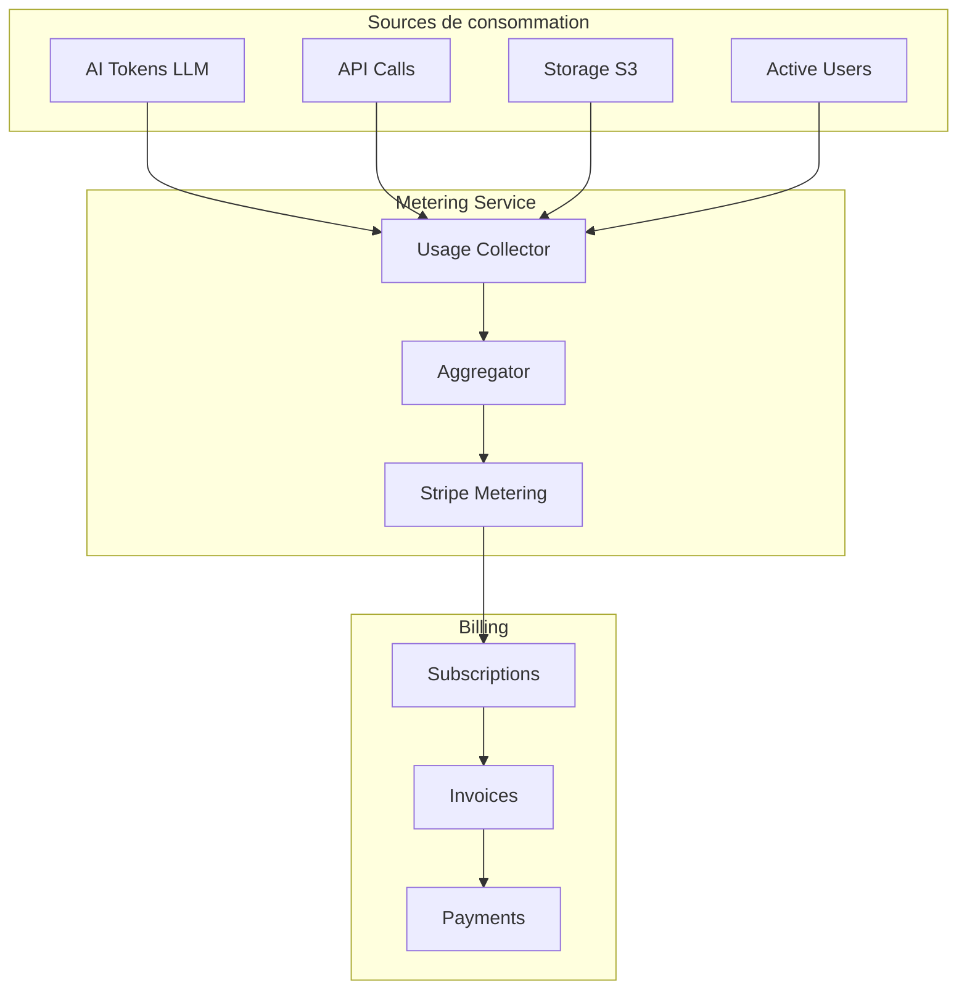
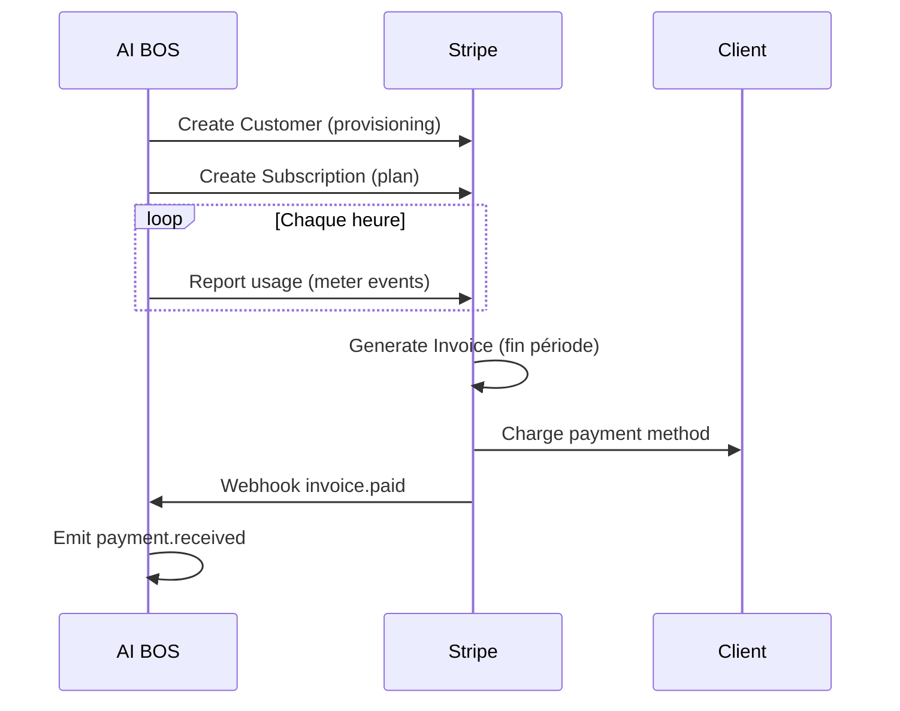
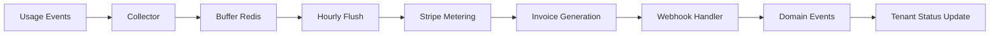

# README_19 — Facturation AI BOS

---

## Métadonnées du document

| Champ | Valeur |
|-------|--------|
| **Document** | README_19_Billing.md |
| **Projet** | AI BOS — AI Business Operating System |
| **Version** | 0.1.0 |
| **Statut** | `DRAFT` |
| **Niveau de maturité** | `DESIGN` |
| **Audience** | Backend Engineers, Finance, Product |
| **Auteur** | AI BOS Billing Team |
| **Dernière mise à jour** | Juillet 2026 |
| **Documents liés** | [README_20_Subscriptions](README_20_Subscriptions.md) · [README_18_MultiTenant](README_18_MultiTenant.md) · [README_12_EventDriven](README_12_EventDriven.md) · [README_13_API](README_13_API.md) |
| **Référence héritage** | [SIH IA analytics revenue](../../sihia-platform/backend/app/presentation/routes.py) · [SIH IA ChatbotRateLimiter metering pattern](../../sihia-platform/backend/app/presentation/chatbot_rate_limit.py) |

---

## Table des matières

1. [Synthèse exécutive](#1-synthèse-exécutive)
2. [Modèle de facturation](#2-modèle-de-facturation)
3. [Intégration Stripe](#3-intégration-stripe)
4. [Metering usage-based](#4-metering-usage-based)
5. [Facturation par siège](#5-facturation-par-siège)
6. [Pipeline de billing](#6-pipeline-de-billing)
7. [Factures et paiements](#7-factures-et-paiements)
8. [Événements domaine Finance](#8-événements-domaine-finance)
9. [Reporting et analytics](#9-reporting-et-analytics)
10. [Architecture Decision Records (ADR)](#10-architecture-decision-records-adr)
11. [Checklist de livraison](#11-checklist-de-livraison)

---

## 1. Synthèse exécutive

AI BOS combine **facturation par siège** (utilisateurs actifs) et **facturation à l'usage** (tokens IA, stockage, appels API). **Stripe** est le processeur de paiement unique pour abonnements, usage metering et factures. Le metering s'appuie sur les événements `platform.usage.recorded` (README_12) et le pattern de comptage SIH IA (`ChatbotRateLimiter` généralisé).



---

## 2. Modèle de facturation

### Composantes de revenu

| Composante | Type | Facturation |
|------------|------|-------------|
| **Plan de base** | Récurrent | Mensuel/annuel (sièges inclus) |
| **Sièges additionnels** | Récurrent | Par utilisateur actif au-delà du quota plan |
| **Tokens IA** | Usage | Par 1 000 tokens (input + output) |
| **Stockage** | Usage | Par GB/mois |
| **Appels API** | Usage | Par 1 000 requêtes au-delà du quota |
| **Add-ons** | Récurrent | Modules premium (SIH IA, agents avancés) |

### Formule mensuelle simplifiée

```
Total = Plan_base
      + (max(0, sièges_actifs - sièges_inclus) × prix_siège)
      + (tokens_IA / 1000 × prix_1k_tokens)
      + (stockage_GB × prix_GB)
      + (max(0, api_calls - quota_plan) / 1000 × prix_1k_api)
```

### Cycles de facturation

| Cycle | Réduction | Cible |
|-------|-----------|-------|
| Mensuel | — | Starter, Pro |
| Annuel | -20 % | Pro, Enterprise |
| Custom | Négocié | Enterprise |

---

## 3. Intégration Stripe

### Objets Stripe mappés

| AI BOS | Stripe | Description |
|--------|--------|-------------|
| Organization | Customer | `stripe_customer_id` |
| Subscription | Subscription | Plan + add-ons |
| Plan | Product + Price | Starter/Pro/Enterprise |
| Usage record | Usage Record / Meter Event | Tokens, API, storage |
| Invoice | Invoice | Facture mensuelle |
| Payment | PaymentIntent | Paiement carte/SEPA |



### Webhooks Stripe

| Event Stripe | Handler AI BOS |
|--------------|----------------|
| `customer.subscription.created` | Activer subscription |
| `customer.subscription.updated` | Sync plan/quotas |
| `customer.subscription.deleted` | Churn workflow |
| `invoice.paid` | `finance.payment.received` |
| `invoice.payment_failed` | Suspendre tenant |
| `customer.subscription.trial_will_end` | Notification J-3 |

### Sécurité webhooks

- Vérification signature `Stripe-Signature`
- Idempotence via `event.id` Stripe
- Endpoint : `POST /webhooks/v1/stripe`

---

## 4. Metering usage-based

### Dimensions de metering

| Dimension | Unité | Granularité | Source |
|-----------|-------|-------------|--------|
| `ai_tokens_input` | tokens | Par requête LLM | Agent/Chatbot service |
| `ai_tokens_output` | tokens | Par requête LLM | Agent/Chatbot service |
| `api_requests` | count | Par requête HTTP | API middleware |
| `storage_bytes` | bytes | Snapshot quotidien | S3 inventory |
| `webhook_deliveries` | count | Par delivery | Webhook dispatcher |
| `rag_queries` | count | Par requête | RAG service |

### Collecte (pattern SIH IA)

Le `ChatbotRateLimiter` SIH IA compte les requêtes par fenêtre glissante — le **Usage Collector** généralise ce pattern :

```python
@dataclass
class UsageEvent:
    tenant_id: str
    dimension: str
    quantity: int
    timestamp: datetime
    metadata: dict  # model, endpoint, user_id

class UsageCollector:
    async def record(self, event: UsageEvent) -> None:
        await self.buffer.append(event)
        await self.event_bus.publish("platform.usage.recorded", event)
        if self.buffer.size >= BATCH_SIZE:
            await self.flush_to_stripe()
```

### Agrégation

| Niveau | Fréquence | Destination |
|--------|-----------|-------------|
| Temps réel | Par event | Redis counters (dashboard) |
| Horaire | Batch | Stripe Meter Events |
| Quotidien | Snapshot | Table `usage_daily_aggregates` |
| Mensuel | Rollup | Facture + analytics |

### Table `usage_events` (append-only)

| Colonne | Type |
|---------|------|
| `id` | UUID |
| `tenant_id` | UUID |
| `dimension` | VARCHAR |
| `quantity` | BIGINT |
| `recorded_at` | TIMESTAMPTZ |
| `idempotency_key` | VARCHAR UK |
| `metadata` | JSONB |

---

## 5. Facturation par siège

### Définition siège actif

Un **siège** est facturé si l'utilisateur :
- A le statut `active`
- S'est connecté au moins une fois dans la période de facturation
- N'est pas un compte de service

### Comptage

```sql
SELECT COUNT(DISTINCT user_id)
FROM user_activity
WHERE tenant_id = :tenant_id
  AND last_login_at >= :billing_period_start
  AND status = 'active'
  AND is_service_account = false;
```

### Sièges inclus par plan

| Plan | Sièges inclus | Prix siège additionnel |
|------|---------------|------------------------|
| Starter | 5 | 15 €/mois |
| Pro | 25 | 12 €/mois |
| Enterprise | Custom | Négocié |

### Sync Stripe

```python
# Mise à jour quantité subscription item "seats"
stripe.SubscriptionItem.modify(
    item_id,
    quantity=max(0, active_seats - plan.included_seats),
)
```

---

## 6. Pipeline de billing



### Jobs planifiés

| Job | Cron | Action |
|-----|------|--------|
| `usage_flush` | `0 * * * *` | Push usage → Stripe |
| `seat_count` | `0 2 * * *` | Recalcul sièges actifs |
| `storage_snapshot` | `0 3 * * *` | Mesure stockage S3 |
| `invoice_reconcile` | `0 6 1 * *` | Réconciliation mensuelle |
| `dunning` | `0 9 * * *` | Relances paiement échoué |

### Dunning (impayés)

| Jour | Action |
|------|--------|
| J+0 | Email notification |
| J+3 | Bannière in-app |
| J+7 | `organization.status = suspended` |
| J+30 | `organization.status = churned` + purge planifiée |

---

## 7. Factures et paiements

### Module Finance interne

AI BOS maintient une copie locale des factures (pas uniquement Stripe) pour :
- Module Finance CRM/Sales
- Exports comptables
- Conformité archivage 7 ans

### Modèle Invoice

| Champ | Description |
|-------|-------------|
| `id` | `inv_{uuid}` |
| `tenant_id` | Organisation |
| `stripe_invoice_id` | Référence Stripe |
| `status` | `draft`, `open`, `paid`, `void`, `uncollectible` |
| `amount_due` | Montant centimes |
| `currency` | `eur` default |
| `period_start/end` | Période facturation |
| `line_items` | JSONB détail |
| `pdf_url` | Lien PDF Stripe/hosted |

### API Finance

| Méthode | Route | Permission |
|---------|-------|------------|
| GET | `/api/v1/finance/invoices` | `billing:invoices:read` |
| GET | `/api/v1/finance/invoices/{id}` | `billing:invoices:read` |
| GET | `/api/v1/finance/invoices/{id}/pdf` | `billing:invoices:read` |
| GET | `/api/v1/billing/usage` | `billing:usage:read` |
| GET | `/api/v1/billing/usage/current-period` | `billing:usage:read` |

---

## 8. Événements domaine Finance

Alignés README_12 :

| Event | Déclencheur | Consommateurs |
|-------|-------------|---------------|
| `aibos.finance.invoice.issued.v1` | Facture générée | Email, Webhooks |
| `aibos.finance.payment.received.v1` | Paiement confirmé | CRM, Analytics |
| `aibos.finance.payment.failed.v1` | Échec paiement | Dunning, Suspension |
| `aibos.platform.usage.recorded.v1` | Usage collecté | Metering aggregator |
| `aibos.finance.credit_note.issued.v1` | Avoir émis | Comptabilité |

---

## 9. Reporting et analytics

### Dashboard billing (admin tenant)

| Widget | Donnée |
|--------|--------|
| Coût période en cours | Estimation temps réel |
| Tokens IA consommés | Graphique 30j |
| API calls | vs quota plan |
| Sièges actifs | vs inclus |
| Prochaine facture | Estimation Stripe |

### Analytics plateforme (platform_admin)

- MRR / ARR
- Churn rate
- Usage moyen par plan
- Top tenants par consommation IA

Héritage : endpoint SIH IA `/api/analytics/revenue` inspire les projections MRR.

---

## 10. Architecture Decision Records (ADR)

### ADR-019-01 : Stripe comme processeur unique

| Champ | Valeur |
|-------|--------|
| **Statut** | Accepté |
| **Décision** | Stripe Billing + Metering ; pas de double processeur |
| **Conséquences** | Dépendance Stripe ; intégration rapide |

### ADR-019-02 : Usage events append-only

| Champ | Valeur |
|-------|--------|
| **Statut** | Accepté |
| **Décision** | Table `usage_events` immuable ; agrégats dérivés |
| **Conséquences** | Audit trail ; volume storage à monitorer |

### ADR-019-03 : Flush horaire vers Stripe

| Champ | Valeur |
|-------|--------|
| **Statut** | Accepté |
| **Décision** | Batch horaire (pas temps réel par event) |
| **Conséquences** | Latence dashboard vs facturation acceptable |

### ADR-019-04 : Siège = login période

| Champ | Valeur |
|-------|--------|
| **Statut** | Accepté |
| **Décision** | Siège facturé si login dans période |
| **Conséquences** | Fairness ; comptes dormants non facturés |

---

## 11. Checklist de livraison

- [ ] Intégration Stripe Customer + Subscription
- [ ] Webhooks Stripe vérifiés et idempotents
- [ ] Usage Collector (AI tokens, API, storage)
- [ ] Flush horaire Stripe Meter Events
- [ ] Comptage sièges actifs quotidien
- [ ] Module Finance invoices (sync Stripe)
- [ ] Dashboard usage tenant
- [ ] Workflow dunning impayés
- [ ] Événements domaine finance (README_12)
- [ ] Tests E2E billing sandbox Stripe

---

*Document maintenu par l'équipe Billing AI BOS. Prochaine revue : Q3 2026.*
