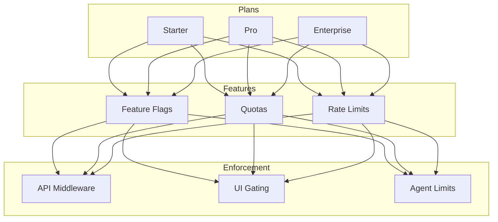
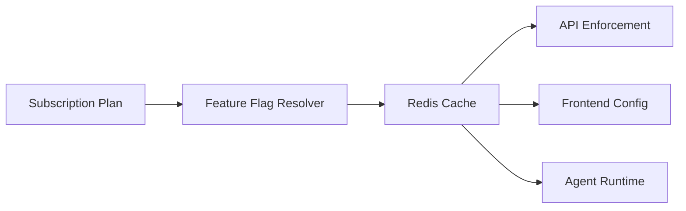
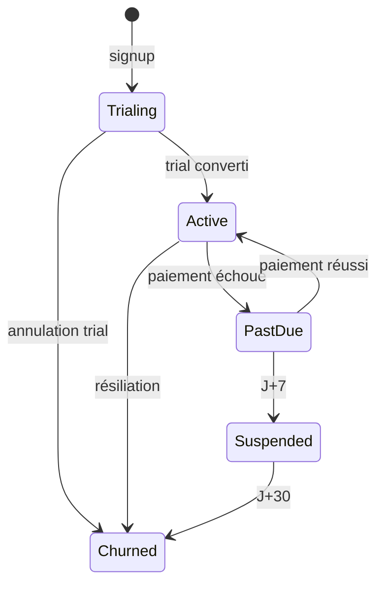
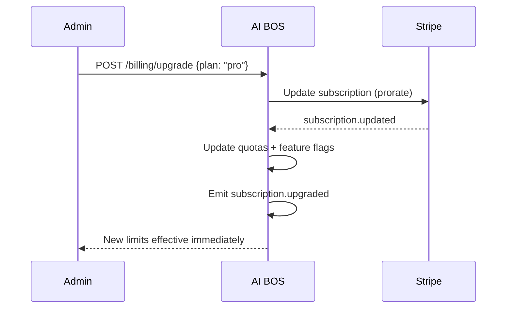
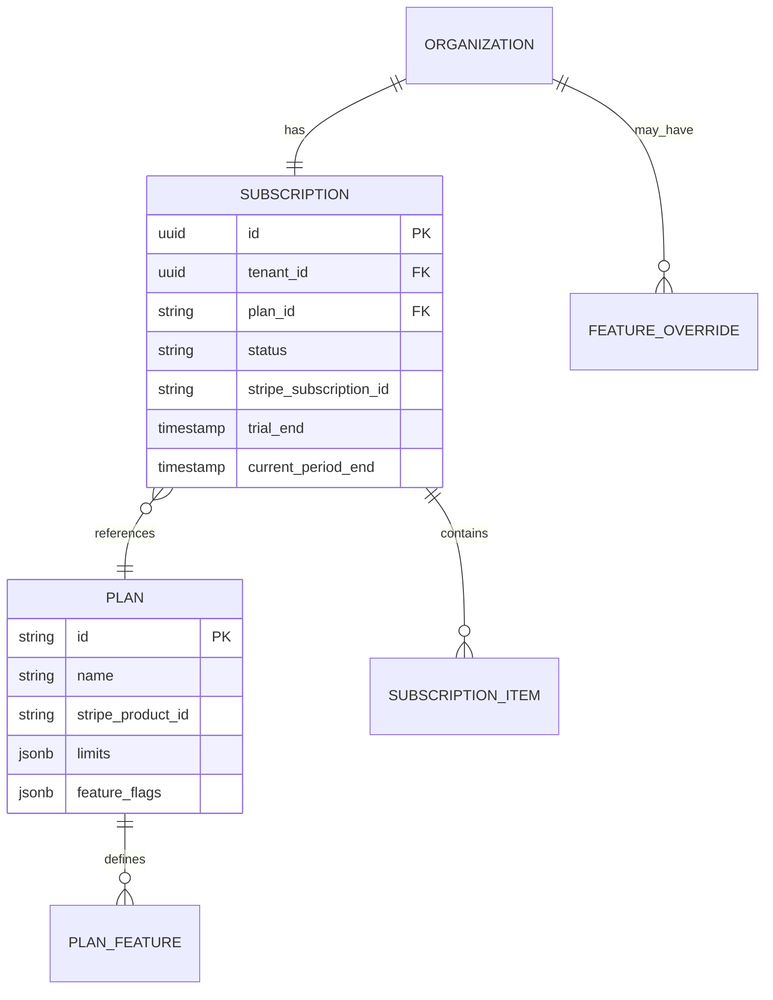

# README_20 — Abonnements AI BOS

---

## Métadonnées du document

| Champ | Valeur |
|-------|--------|
| **Document** | README_20_Subscriptions.md |
| **Projet** | AI BOS — AI Business Operating System |
| **Version** | 0.1.0 |
| **Statut** | `DRAFT` |
| **Niveau de maturité** | `DESIGN` |
| **Audience** | Product, Backend Engineers, Sales |
| **Auteur** | AI BOS Product & Billing Team |
| **Dernière mise à jour** | Juillet 2026 |
| **Documents liés** | [README_19_Billing](README_19_Billing.md) · [README_18_MultiTenant](README_18_MultiTenant.md) · [README_13_API](README_13_API.md) · [README_16_RBAC](README_16_RBAC.md) |
| **Référence héritage** | [SIH IA config settings](../../sihia-platform/backend/app/core/config.py) · [SIH IA rate limits](../../sihia-platform/backend/app/presentation/chatbot_rate_limit.py) |

---

## Table des matières

1. [Synthèse exécutive](#1-synthèse-exécutive)
2. [Catalogue des plans](#2-catalogue-des-plans)
3. [Feature flags par plan](#3-feature-flags-par-plan)
4. [Quotas et limites](#4-quotas-et-limites)
5. [Période d'essai](#5-période-dessai)
6. [Upgrade et downgrade](#6-upgrade-et-downgrade)
7. [Add-ons et modules](#7-add-ons-et-modules)
8. [Modèle de données](#8-modèle-de-données)
9. [Enforcement runtime](#9-enforcement-runtime)
10. [API Subscriptions](#10-api-subscriptions)
11. [Architecture Decision Records (ADR)](#11-architecture-decision-records-adr)
12. [Checklist de livraison](#12-checklist-de-livraison)

---

## 1. Synthèse exécutive

AI BOS propose trois plans — **Starter**, **Pro**, **Enterprise** — différenciés par quotas, fonctionnalités (feature flags) et niveau de support. Les abonnements sont gérés via **Stripe Subscriptions** avec synchronisation bidirectionnelle vers le modèle AI BOS. L'enforcement des quotas réutilise le pattern de rate limiting SIH IA (`chatbot_query_rate_limit` → limites plan globales).



---

## 2. Catalogue des plans

### Comparatif

| Critère | Starter | Pro | Enterprise |
|---------|---------|-----|------------|
| **Prix/mois** | 49 € | 199 € | Sur devis |
| **Prix/an** | 470 € (-20 %) | 1 910 € (-20 %) | Négocié |
| **Sièges inclus** | 5 | 25 | Custom |
| **Trial** | 14 jours | 14 jours | POC 30j |
| **Support** | Email | Email + chat | CSM dédié |
| **SLA** | 99.5 % | 99.9 % | 99.95 % |
| **Data residency** | EU | EU / US | EU / US / Custom |
| **SSO** | ❌ | OIDC | OIDC + SAML |
| **MFA obligatoire** | Optionnel | Recommandé | Configurable |
| **ABAC / OPA** | ❌ | ❌ | ✅ |
| **Schema isolation** | ❌ | ❌ | ✅ Option |

### Positionnement

| Plan | Cible | Cas d'usage |
|------|-------|-------------|
| **Starter** | TPE, startups | CRM basique, IA limitée, 1 module |
| **Pro** | PME | CRM + Sales + IA avancée, intégrations |
| **Enterprise** | ETI, grands comptes | Multi-modules, SSO, compliance, custom |

### Produits Stripe

| Product Stripe | Prices |
|----------------|--------|
| `aibos_starter` | `price_starter_monthly`, `price_starter_yearly` |
| `aibos_pro` | `price_pro_monthly`, `price_pro_yearly` |
| `aibos_enterprise` | Custom prices par contrat |

---

## 3. Feature flags par plan

### Architecture feature flags



### Matrice fonctionnalités

| Feature Key | Starter | Pro | Enterprise |
|-------------|---------|-----|------------|
| `module.crm` | ✅ | ✅ | ✅ |
| `module.sales` | ❌ | ✅ | ✅ |
| `module.finance` | ❌ | ✅ | ✅ |
| `app.sihia` | ❌ | Add-on | ✅ |
| `ai.agents` | Basic | Advanced | Custom |
| `ai.rag` | 1 collection | 10 collections | Illimité |
| `ai.workflows` | 3 workflows | 50 workflows | Illimité |
| `api.webhooks` | 3 endpoints | 20 endpoints | Illimité |
| `api.graphql` | ❌ | ❌ | ✅ |
| `analytics.advanced` | ❌ | ✅ | ✅ |
| `audit.export` | ❌ | ✅ | ✅ |
| `developer.sandbox` | ❌ | ✅ | ✅ |
| `rbac.custom_roles` | ❌ | ❌ | ✅ |
| `abac.policies` | ❌ | ❌ | ✅ |

### Résolution

```python
def is_feature_enabled(tenant_id: str, feature_key: str) -> bool:
    plan = get_active_plan(tenant_id)
    flags = PLAN_FEATURE_FLAGS[plan.id]
    overrides = get_tenant_overrides(tenant_id)  # Enterprise custom
    return overrides.get(feature_key, flags.get(feature_key, False))
```

### Événement changement

Publication `aibos.platform.feature_flag.changed.v1` → invalidation cache frontend.

---

## 4. Quotas et limites

### Quotas mensuels

| Ressource | Starter | Pro | Enterprise |
|-----------|---------|-----|------------|
| AI tokens | 100 000 | 2 000 000 | Custom |
| API requests | 100 000 | 1 000 000 | Custom |
| Stockage | 5 GB | 100 GB | Custom |
| RAG documents | 500 | 10 000 | Custom |
| Webhook deliveries | 5 000 | 50 000 | Custom |
| Workflows actifs | 3 | 50 | Custom |

### Rate limits (temps réel)

Héritage direct SIH IA `chatbot_query_rate_limit` (20 req/min) → limites par plan :

| Limite | Starter | Pro | Enterprise |
|--------|---------|-----|------------|
| API req/min | 60 | 300 | Custom |
| AI req/min | 10 | 60 | Custom |
| Login failures/5min | 5 | 5 | 5 |

```python
# config.py — pattern SIH IA étendu
class PlanLimits(BaseModel):
    api_requests_per_minute: int
    ai_requests_per_minute: int
    ai_tokens_monthly: int

PLAN_LIMITS = {
    "starter": PlanLimits(60, 10, 100_000),
    "pro": PlanLimits(300, 60, 2_000_000),
    "enterprise": PlanLimits(1000, 200, 10_000_000),  # defaults, overridable
}
```

### Comportement dépassement

| Type | Soft limit (80 %) | Hard limit (100 %) |
|------|-------------------|---------------------|
| Tokens IA | Email admin | Blocage requêtes IA |
| API calls | Bannière in-app | HTTP 429 |
| Stockage | Email admin | Upload bloqué |
| Sièges | — | Invitation bloquée |

---

## 5. Période d'essai

### Trial Starter/Pro

| Paramètre | Valeur |
|-----------|--------|
| Durée | 14 jours |
| Carte requise | Oui (Stripe trial) |
| Plan effectif | Équivalent Pro (showcase features) |
| Conversion | Auto-billing à J+14 si non annulé |



### Trial Enterprise

- POC 30 jours négocié commercialement
- Quotas Enterprise temporaires
- Pas de self-service — provisioning manuel `platform_admin`

### Notifications trial

| Jour | Canal | Message |
|------|-------|---------|
| J+0 | Email | Bienvenue trial |
| J+7 | Email + in-app | Mi-parcours |
| J+12 | Email + in-app | Fin trial J-2 |
| J+14 | Email | Conversion ou expiration |

---

## 6. Upgrade et downgrade

### Upgrade (immédiat)



| Règle | Détail |
|-------|--------|
| Prorata | Stripe `proration_behavior=create_prorations` |
| Quotas | Effectifs immédiatement |
| Features | Débloquées immédiatement |
| Sièges | Quota sièges augmente |

### Downgrade (fin de période)

| Règle | Détail |
|-------|--------|
| Timing | Effective à `current_period_end` |
| Données | Conservées ; features premium désactivées |
| Quotas | Réduits ; dépassement → read-only si nécessaire |
| Workflows excédentaires | Désactivés (pas supprimés) |

### Validation downgrade

```python
def can_downgrade(tenant_id: str, target_plan: str) -> list[str]:
    blockers = []
    usage = get_current_usage(tenant_id)
    limits = PLAN_LIMITS[target_plan]
    if usage.active_users > limits.included_seats:
        blockers.append(f"Réduire à {limits.included_seats} utilisateurs")
    if usage.storage_gb > limits.storage_gb:
        blockers.append(f"Réduire stockage à {limits.storage_gb} GB")
    return blockers
```

### Enterprise

Upgrade/downgrade uniquement via contrat commercial — pas de self-service.

---

## 7. Add-ons et modules

### Add-ons disponibles

| Add-on | Plans éligibles | Prix/mois |
|--------|-----------------|-----------|
| SIH IA (santé) | Pro, Enterprise | 99 € |
| Seats pack (+10) | Starter, Pro | 99 € |
| AI tokens pack (+500k) | Tous | 49 € |
| Storage pack (+50 GB) | Tous | 29 € |
| Premium support | Pro | 199 € |

### Stripe structure

```
Subscription
  ├── Item: base plan (Starter/Pro)
  ├── Item: seats overage (metered)
  ├── Item: addon_sihia (optional)
  └── Item: usage meters (AI, API, storage)
```

---

## 8. Modèle de données



### Statuts subscription

| Statut | Description |
|--------|-------------|
| `trialing` | Période d'essai |
| `active` | Payant actif |
| `past_due` | Paiement en retard |
| `paused` | Pause commerciale (Enterprise) |
| `canceled` | Résilié fin de période |
| `unpaid` | Abandon après dunning |

---

## 9. Enforcement runtime

### Middleware plan check

```python
async def plan_quota_middleware(request: Request, call_next):
    tenant_id = resolve_tenant_id(request)
    plan = await get_plan_limits(tenant_id)

    # Rate limit — héritage ChatbotRateLimiter SIH IA
    retry_after = rate_limiter.check(f"{tenant_id}:{endpoint_group}", plan.api_rpm)
    if retry_after:
        return JSONResponse(429, headers={"Retry-After": str(retry_after)})

    # Feature flag
    required_feature = route_features.get(request.url.path)
    if required_feature and not is_feature_enabled(tenant_id, required_feature):
        return JSONResponse(403, detail="Feature non disponible sur votre plan")

    return await call_next(request)
```

### Frontend gating

```typescript
// Endpoint /api/v1/platform/ui-config (pattern SIH IA chatbot ui-config)
interface UiConfig {
  plan: "starter" | "pro" | "enterprise";
  features: Record<string, boolean>;
  limits: PlanLimits;
  usage: CurrentUsage;
}

// Sidebar masque modules non disponibles
{features["module.sales"] && <NavItem to="/sales" />}
```

### Agent runtime

Les agents IA vérifient `ai_tokens_monthly` avant chaque appel LLM — refus gracieux avec message upgrade.

---

## 10. API Subscriptions

| Méthode | Route | Permission | Description |
|---------|-------|------------|-------------|
| GET | `/api/v1/billing/subscription` | `billing:subscriptions:read` | Subscription courante |
| POST | `/api/v1/billing/upgrade` | `billing:subscriptions:manage` | Upgrade plan |
| POST | `/api/v1/billing/downgrade` | `billing:subscriptions:manage` | Downgrade plan |
| POST | `/api/v1/billing/cancel` | `billing:subscriptions:manage` | Résiliation |
| GET | `/api/v1/billing/plans` | Public | Catalogue plans |
| GET | `/api/v1/platform/ui-config` | Auth | Features + limits + usage |
| POST | `/api/v1/billing/addons/{addon_id}` | `billing:subscriptions:manage` | Activer add-on |

### Réponse subscription

```json
{
  "plan": "pro",
  "status": "active",
  "trial_end": null,
  "current_period_end": "2026-08-06T00:00:00Z",
  "limits": {
    "ai_tokens_monthly": 2000000,
    "api_requests_monthly": 1000000,
    "storage_gb": 100,
    "seats_included": 25
  },
  "usage": {
    "ai_tokens": 450000,
    "api_requests": 120000,
    "storage_gb": 23.5,
    "active_seats": 18
  },
  "features": {
    "module.sales": true,
    "app.sihia": false
  }
}
```

---

## 11. Architecture Decision Records (ADR)

### ADR-020-01 : Trois plans self-service + Enterprise custom

| Champ | Valeur |
|-------|--------|
| **Statut** | Accepté |
| **Décision** | Starter/Pro self-service ; Enterprise sur devis |
| **Conséquences** | Pricing page simple ; sales assisté Enterprise |

### ADR-020-02 : Trial = showcase Pro

| Champ | Valeur |
|-------|--------|
| **Statut** | Accepté |
| **Décision** | Trial 14j avec features Pro pour maximiser conversion |
| **Conséquences** | Downgrade features si reste Starter |

### ADR-020-03 : Downgrade en fin de période uniquement

| Champ | Valeur |
|-------|--------|
| **Statut** | Accepté |
| **Décision** | Pas de rétrofacturation ; downgrade à `period_end` |
| **Conséquences** | UX équitable ; validation blockers avant downgrade |

### ADR-020-04 : Feature flags dans ui-config

| Champ | Valeur |
|-------|--------|
| **Statut** | Accepté |
| **Décision** | Endpoint unique `ui-config` (pattern SIH IA chatbot) |
| **Conséquences** | Frontend simple ; cache invalidation sur plan change |

---

## 12. Checklist de livraison

- [ ] Catalogue plans Starter/Pro/Enterprise en Stripe
- [ ] Table `plans` + `subscriptions` + feature flags
- [ ] Trial 14 jours avec conversion auto
- [ ] Upgrade immédiat avec prorata
- [ ] Downgrade fin de période avec validation blockers
- [ ] Enforcement quotas (API, AI, storage, seats)
- [ ] Rate limits par plan (héritage ChatbotRateLimiter)
- [ ] Endpoint `ui-config` pour frontend gating
- [ ] Notifications trial et dépassement quotas
- [ ] Add-on SIH IA configurable
- [ ] Tests E2E upgrade/downgrade sandbox

---

*Document maintenu par l'équipe Product & Billing AI BOS. Prochaine revue : Q3 2026.*
