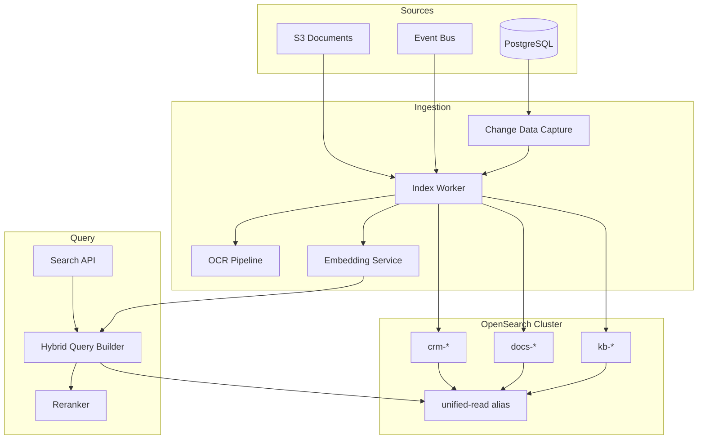

# AI BOS — Recherche unifiée (Elasticsearch / OpenSearch)

> **Version:** 0.1.0 | **Statut:** `DESIGN` | **Maturité:** `CONCEPT`  
> **Dernière mise à jour:** Juillet 2026  
> **Audience:** Backend Engineers, Search/AI Engineering, Data Platform  
> **Référence héritage:** [chatbot_service.py](../../sihia-platform/backend/app/application/chatbot_service.py) (retrieval mots-clés), [README_09_RAG](README_09_RAG.md)

---

## Table des matières

1. [Objectif](#1-objectif)
2. [Évolution SIH IA → AI BOS](#2-évolution-sih-ia--ai-bos)
3. [Architecture](#3-architecture)
4. [Domaines indexés](#4-domaines-indexés)
5. [Pipeline d'indexation](#5-pipeline-dindexation)
6. [Recherche hybride](#6-recherche-hybride)
7. [Schéma d'index](#7-schéma-dindex)
8. [API](#8-api)
9. [Sécurité multi-tenant](#9-sécurité-multi-tenant)
10. [Performance et scaling](#10-performance-et-scaling)
11. [Observabilité](#11-observabilité)
12. [ADRs](#12-adrs)
13. [Checklist de livraison](#13-checklist-de-livraison)

---

## 1. Objectif

Le module **Search** d'AI BOS offre une **barre de recherche unifiée** traversant CRM, documents, base de connaissances, workflows et entités métier. Il combine **full-text lexical** (BM25) et **recherche sémantique** (vecteurs) dans une architecture hybride, avec isolation tenant stricte.

### Principes directeurs

| Principe | Description |
|----------|-------------|
| **Unified index** | Un point d'entrée utilisateur, plusieurs index logiques |
| **Hybrid by default** | Lexical + sémantique fusionnés (RRF) |
| **Near real-time** | Latence indexation < 5 s (p95) |
| **Tenant isolation** | Filtre obligatoire `organization_id` |
| **Source of truth** | PostgreSQL reste autoritaire ; search = projection |

### Non-objectifs v1

- Recherche fédérée cross-organisation
- Indexation temps réel sub-seconde (CDC Debezium → phase 2)
- Support Solr / Algolia (OpenSearch standard interne)

---

## 2. Évolution SIH IA → AI BOS

| Aspect | SIH IA (actuel) | AI BOS (cible) |
|--------|-----------------|----------------|
| Patients / RDV | SQL `LIKE` ou listes complètes | Index `crm_*` full-text |
| Chatbot KB | `chatbot_knowledge.json` + score mots-clés | Index `kb_*` + pgvector |
| Documents | Non indexés globalement | Index `docs_*` OCR + metadata |
| UI | Pas de barre recherche globale | Command palette `Cmd+K` |
| Ranking | Score binaire mots-clés | BM25 + cosine + reranker |
| Facettes | Aucune | Type, date, auteur, tags |

Le chatbot SIH IA illustre un retrieval minimal :

```python
# Score par intersection topics/query — à remplacer par hybrid search
for entry in knowledge_base:
    score = len(set(query_words) & set(entry["topics"]))
```

AI BOS conserve ce pattern comme **fallback offline** si OpenSearch indisponible.

---

## 3. Architecture



### Composants CORE

| Module | Responsabilité |
|--------|----------------|
| `core/search/client` | Client OpenSearch async, connection pooling |
| `core/search/indexer` | Mapping, bulk index, reindex |
| `core/search/query` | Construction requêtes hybrides |
| `core/search/sync` | Workers Event Bus → index |
| `core/search/reranker` | Cross-encoder optionnel |
| `core/search/suggest` | Autocomplétion, did-you-mean |

---

## 4. Domaines indexés

### 4.1 CRM (`crm-{org_hash}`)

| Entité | Champs indexés | Facettes |
|--------|----------------|----------|
| Contacts | nom, email, téléphone, entreprise | type, statut, owner |
| Comptes | raison sociale, SIRET, secteur | industrie, taille |
| Opportunités | titre, montant, étape | pipeline, date_close |
| Activités | sujet, notes, type | date, assigné |

**SIH IA mapping :** `patients`, `doctors`, `appointments` → modèle CRM générique `contacts`, `providers`, `events`.

### 4.2 Documents (`docs-{org_hash}`)

- Métadonnées : titre, auteur, tags, mime, dates
- Contenu extrait : texte OCR/PDF
- Vecteur : embedding chunk (1536 dim, text-embedding-3-small)
- Liens : `entity_type`, `entity_id` (polymorphe)

### 4.3 Knowledge Base (`kb-{org_hash}`)

- Articles FAQ, procédures, snippets agent
- Héritage `chatbot_knowledge.json` : champs `topics`, `content_html`, `locale`
- Chunks RAG synchronisés (voir README_09_RAG)

### 4.4 Unified read alias

Alias `search-{organization_id}` pointant vers les trois index avec routing tenant.

---

## 5. Pipeline d'indexation

### Triggers

| Source | Mécanisme | Latence cible |
|--------|-----------|---------------|
| CRUD API | Event `entity.created/updated/deleted` | < 5 s |
| Upload document | Event `document.uploaded` → OCR → index | < 60 s |
| Reindex full | Admin API / maintenance window | Batch |
| Scheduled | Cron delta sync (sécurité) | 15 min |

### Worker indexation

```python
class IndexWorker:
  async def handle(self, event: DomainEvent) -> None:
      match event.type:
          case "contact.updated":
              doc = self.mapper.to_search_document(event.payload)
              await self.opensearch.index(
                  index=f"crm-{event.organization_id}",
                  id=event.entity_id,
                  body=doc,
                  refresh="wait_for",
              )
          case "document.processed":
              chunks = await self.chunker.split(event.payload["text"])
              vectors = await self.embedder.embed_batch(chunks)
              await self.bulk_index_chunks(vectors)
```

### OCR (documents scannés)

| Format | Extracteur | Fallback |
|--------|------------|----------|
| PDF natif | PyMuPDF / pdfplumber | — |
| PDF scanné | Tesseract + AWS Textract | Queue async |
| Images | Tesseract | — |
| DOCX | python-docx | — |

### Idempotence

- `content_hash` (SHA-256) évite réindexation inutile
- Version externe OpenSearch `_version` pour optimistic concurrency

---

## 6. Recherche hybride

### Stratégie RRF (Reciprocal Rank Fusion)

```
score_rrf(d) = Σ 1 / (k + rank_i(d))    où k = 60
```

1. **Requête lexicale** — `multi_match` BM25 sur champs textuels pondérés
2. **Requête sémantique** — kNN sur `embedding` (HNSW)
3. **Fusion RRF** — combinaison des deux listes top-K
4. **Rerank** (optionnel) — cross-encoder sur top 20
5. **Filtrage** — ACL, `organization_id`, facettes utilisateur

### Query builder

```json
{
  "query": {
    "hybrid": {
      "queries": [
        {
          "multi_match": {
            "query": "{{user_query}}",
            "fields": ["title^3", "content", "tags^2", "email"],
            "type": "best_fields",
            "fuzziness": "AUTO"
          }
        },
        {
          "knn": {
            "embedding": {
              "vector": "{{query_embedding}}",
              "k": 50
            }
          }
        }
      ]
    }
  },
  "post_filter": {
    "bool": {
      "filter": [
        { "term": { "organization_id": "{{org_id}}" } },
        { "terms": { "entity_type": ["contact", "document"] } }
      ]
    }
  },
  "highlight": {
    "fields": { "content": { "fragment_size": 150 } }
  }
}
```

### Pondération par domaine

| Domaine | Boost lexical | Boost sémantique |
|---------|---------------|------------------|
| CRM contacts | 1.5 | 1.0 |
| Documents | 1.0 | 1.3 |
| Knowledge | 1.2 | 1.5 |

### Autocomplétion

Index séparé `suggest-{org_id}` avec edge n-gram :

```json
{
  "title_suggest": {
    "type": "completion",
    "analyzer": "simple",
    "contexts": [{ "name": "entity_type", "type": "category" }]
  }
}
```

---

## 7. Schéma d'index

### Mapping document unifié

```json
{
  "mappings": {
    "properties": {
      "organization_id": { "type": "keyword" },
      "entity_type": { "type": "keyword" },
      "entity_id": { "type": "keyword" },
      "title": {
        "type": "text",
        "analyzer": "french",
        "fields": { "keyword": { "type": "keyword" } }
      },
      "content": { "type": "text", "analyzer": "french" },
      "tags": { "type": "keyword" },
      "metadata": { "type": "object", "enabled": false },
      "embedding": {
        "type": "knn_vector",
        "dimension": 1536,
        "method": {
          "name": "hnsw",
          "space_type": "cosinesimil",
          "engine": "nmslib"
        }
      },
      "acl": {
        "type": "keyword",
        "doc_values": true
      },
      "created_at": { "type": "date" },
      "updated_at": { "type": "date" },
      "content_hash": { "type": "keyword" }
    }
  },
  "settings": {
    "index": {
      "number_of_shards": 2,
      "number_of_replicas": 1,
      "knn": true
    },
    "analysis": {
      "analyzer": {
        "french": {
          "type": "custom",
          "tokenizer": "standard",
          "filter": ["lowercase", "french_elision", "french_stop", "french_stemmer"]
        }
      }
    }
  }
}
```

### Stratégie d'index par tenant

| Taille tenant | Stratégie |
|---------------|-----------|
| < 100 K docs | Index dédié par org |
| 100 K – 1 M | Index partagé + routing `organization_id` |
| > 1 M | Index dédié + shards multiples |

---

## 8. API

### Recherche globale

```
GET /api/v1/search?q=rendez-vous+cardio&types=contact,event,document&limit=20
Authorization: Bearer <token>
```

### Réponse

```json
{
  "query": "rendez-vous cardio",
  "took_ms": 42,
  "total": 156,
  "facets": {
    "entity_type": [
      { "key": "event", "count": 89 },
      { "key": "contact", "count": 45 }
    ]
  },
  "hits": [
    {
      "entityType": "event",
      "entityId": "appt-abc123",
      "title": "RDV — Dr. Benali (Cardiologie)",
      "snippet": "...motif <em>cardio</em>logie...",
      "score": 12.4,
      "url": "/crm/events/appt-abc123",
      "highlights": ["content"]
    }
  ]
}
```

### Endpoints

| Méthode | Route | Description |
|---------|-------|-------------|
| GET | `/api/v1/search` | Recherche hybride |
| GET | `/api/v1/search/suggest` | Autocomplétion |
| POST | `/api/v1/search/reindex` | Reindex admin |
| GET | `/api/v1/search/health` | Statut cluster |

### Paramètres avancés

| Param | Type | Défaut |
|-------|------|--------|
| `q` | string | requis |
| `types` | csv | tous |
| `semantic` | bool | `true` |
| `fuzzy` | bool | `true` |
| `from` | date | — |
| `to` | date | — |
| `sort` | enum | `relevance` |

---

## 9. Sécurité multi-tenant

### Filtrage obligatoire

Chaque requête injecte :

```python
filters = [
    {"term": {"organization_id": current_user.organization_id}},
    {"terms": {"acl": current_user.searchable_scopes}},
]
```

### RBAC search

| Permission | Accès |
|------------|-------|
| `search:crm` | Contacts, comptes, opportunités |
| `search:documents` | GED selon classification |
| `search:kb` | Articles internes |
| `search:admin` | Reindex, diagnostics |

### Données sensibles

- Champs PII (`email`, `phone`) : indexés mais snippet masqué si permission insuffisante
- Documents `confidential` : ACL au niveau chunk
- Audit : log de chaque recherche avec `correlation_id` (sans stocker `q` en clair si policy stricte)

---

## 10. Performance et scaling

### SLO

| Métrique | Cible p95 |
|----------|-----------|
| Latence recherche | < 200 ms |
| Latence suggest | < 50 ms |
| Disponibilité | 99.9 % |
| Index lag | < 30 s |

### Capacity planning

| Charge | Config recommandée |
|--------|-------------------|
| Dev | OpenSearch single node Docker |
| Staging | 3 nodes, 100 GB |
| Prod | 3+ data nodes, dedicated masters, 500 GB+ |

### Optimisations

- Cache requêtes fréquentes (Redis, TTL 60 s)
- Pré-calcul embeddings requêtes identiques
- Bulk indexing batch 500 docs
- Force merge hebdomadaire index `suggest`

---

## 11. Observabilité

### Métriques

```
search_requests_total{status, semantic_enabled}
search_latency_seconds_bucket
search_index_lag_seconds{index}
search_zero_results_total
opensearch_cluster_status
```

### Dashboards Grafana

- Top queries sans résultat (amélioration contenu)
- Distribution latence par type
- Taille index par tenant

---

## 12. ADRs

### ADR-022-001 : OpenSearch vs Elasticsearch

**Décision :** OpenSearch 2.x comme moteur standard (licence Apache 2.0).  
**Alternatives :** Elasticsearch 8 (licence SSPL), pgvector seul (insuffisant full-text à grande échelle).  
**Conséquences :** Compatibilité API ES 7.x ; équipe formée OpenSearch.

### ADR-022-002 : Hybrid search par défaut

**Décision :** Toute recherche utilisateur active lexical + sémantique sauf opt-out `semantic=false`.  
**Contexte :** Requêtes courtes et synonymes métier mal couverts par BM25 seul.  
**Conséquences :** Coût embedding par requête ; cache obligatoire.

### ADR-022-003 : PostgreSQL reste source de vérité

**Décision :** OpenSearch est une projection rebuildable ; jamais écriture inverse.  
**Contexte :** Cohérence transactionnelle CRM.  
**Conséquences :** Pipeline sync robuste + reindex playbook.

---

## 13. Checklist de livraison

- [ ] Cluster OpenSearch dev (Docker) + prod (Terraform)
- [ ] Mappings `crm`, `docs`, `kb` validés
- [ ] Index worker branché sur Event Bus
- [ ] API `/api/v1/search` avec hybrid RRF
- [ ] Command palette UI intégrée au shell
- [ ] OCR pipeline pour PDF
- [ ] Tests : relevance golden set (50 requêtes)
- [ ] Fallback dégradé si cluster down (SQL limité)
- [ ] Monitoring lag + alertes
- [ ] Documentation opérationnelle reindex

---

*Document maintenu par l'équipe CORE Platform — AI BOS.*
