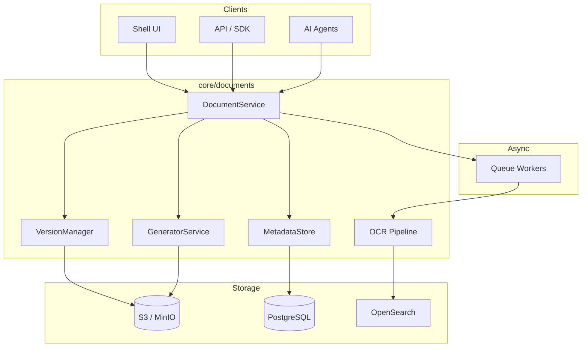
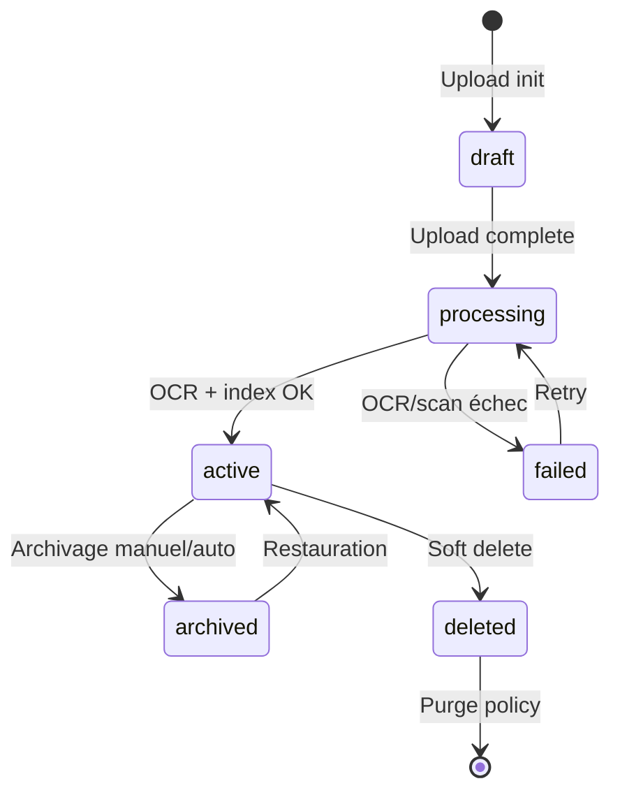

# AI BOS — Gestion documentaire (GED)

> **Version:** 0.1.0 | **Statut:** `DESIGN` | **Maturité:** `ALPHA`  
> **Dernière mise à jour:** Juillet 2026  
> **Audience:** Backend Engineers, Compliance, Product  
> **Référence héritage:** [routes.py export PDF/Excel](../../sihia-platform/backend/app/presentation/routes.py), [test_exports.py](../../sihia-platform/backend/tests/test_exports.py), [README_22_Search](README_22_Search.md)

---

## Table des matières

1. [Objectif](#1-objectif)
2. [Évolution SIH IA → AI BOS](#2-évolution-sih-ia--ai-bos)
3. [Architecture](#3-architecture)
4. [Stockage S3](#4-stockage-s3)
5. [Versioning](#5-versioning)
6. [OCR et extraction](#6-ocr-et-extraction)
7. [Génération PDF et exports](#7-génération-pdf-et-exports)
8. [Cycle de vie document](#8-cycle-de-vie-document)
9. [Modèle de données](#9-modèle-de-données)
10. [API](#10-api)
11. [E-signature (roadmap)](#11-e-signature-roadmap)
12. [Sécurité](#12-sécurité)
13. [ADRs](#13-adrs)
14. [Checklist de livraison](#14-checklist-de-livraison)

---

## 1. Objectif

Le module **Documents** d'AI BOS fournit une **GED enterprise** : stockage objet sécurisé, versioning immuable, extraction de texte (OCR), génération de rapports PDF/Excel, et préparation pour la **signature électronique**. Il généralise les exports analytiques SIH IA vers un service documentaire transversal.

### Capacités cibles

| Capacité | Priorité | Statut |
|----------|----------|--------|
| Upload / download sécurisé | P0 | Design |
| Versioning immuable | P0 | Design |
| Métadonnées + tags | P0 | Design |
| OCR PDF/images | P1 | Design |
| Génération PDF rapports | P1 | Héritage SIH IA |
| Export Excel | P1 | Héritage SIH IA |
| Lien entités CRM | P1 | Design |
| E-signature qualifiée | P2 | Roadmap |
| Workflow approbation | P2 | Roadmap |

---

## 2. Évolution SIH IA → AI BOS

| Aspect | SIH IA (actuel) | AI BOS (cible) |
|--------|-----------------|----------------|
| Stockage fichiers | Aucun (génération à la volée) | S3 + métadonnées PostgreSQL |
| Export PDF | `FPDF` inline dans routes | Service `DocumentGenerator` |
| Export Excel | `openpyxl` inline | Templates + scheduling |
| Audit | Export JSONL audit log | GED + audit trail unifié |
| Versioning | Non | Immuable S3 versioning |
| OCR | Non | Pipeline async Tesseract/Textract |
| Multi-tenant | Non | Préfixe S3 `org/{id}/` |

### Héritage exports SIH IA

```python
# GET /api/analytics/export/pdf — génération synchrone FPDF
pdf = FPDF()
pdf.add_page()
pdf.cell(0, 10, text="Rapport Analytique - SIH IA", ln=True)
# → Migrer vers core/documents/generators/pdf.py
```

Tests de référence :

```python
assert res.headers.get("content-type") == "application/pdf"
assert res.content.startswith(b"%PDF")
assert "spreadsheetml" in res.headers.get("content-type", "")
```

---

## 3. Architecture



### Composants

| Module | Responsabilité |
|--------|----------------|
| `core/documents/service` | CRUD, permissions, liens entités |
| `core/documents/storage` | Abstraction S3, presigned URLs |
| `core/documents/versions` | Immutabilité, diff metadata |
| `core/documents/ocr` | Extraction texte async |
| `core/documents/generators/pdf` | FPDF / WeasyPrint |
| `core/documents/generators/excel` | openpyxl / xlsxwriter |
| `core/documents/generators/docx` | python-docx (futur) |

---

## 4. Stockage S3

### Convention de clés

```
s3://{bucket}/organizations/{organization_id}/
  documents/{document_id}/
    v{version_number}/{filename}
  exports/{export_job_id}/{filename}
  temp/{upload_session_id}/{part}
```

### Configuration

| Variable | Description |
|----------|-------------|
| `S3_BUCKET` | Bucket principal |
| `S3_REGION` | `eu-west-3` (Paris) recommandé |
| `S3_ENDPOINT` | MinIO en dev (`http://minio:9000`) |
| `S3_PRESIGNED_TTL` | 3600 s (download) |
| `S3_MAX_UPLOAD_SIZE` | 100 MB (configurable par plan) |

### Upload multipart

```
1. POST /api/v1/documents/upload/init → uploadId, presigned URLs
2. Client PUT parts vers S3
3. POST /api/v1/documents/upload/complete → finalize + virus scan
4. Event document.uploaded → OCR worker
```

### Chiffrement

- **At rest :** SSE-S3 ou SSE-KMS (prod)
- **In transit :** HTTPS obligatoire
- **Clés KMS :** Une CMK par tenant (plan Enterprise)

### Rétention et lifecycle

| Classe | Transition | Durée |
|--------|------------|-------|
| Standard | — | Accès fréquent |
| Infrequent Access | 90 j sans accès | Archives |
| Glacier | 7 ans (légal) | Compliance |

---

## 5. Versioning

### Principes

- Chaque modification crée une **nouvelle version immuable**
- Version courante = pointeur `current_version_id`
- Suppression = soft delete (`deleted_at`) ; versions S3 conservées selon policy
- Comparaison metadata entre versions (pas diff binaire v1)

### Modèle

```sql
CREATE TABLE documents.versions (
    id UUID PRIMARY KEY DEFAULT gen_random_uuid(),
    document_id UUID NOT NULL REFERENCES documents.documents(id),
    version_number INTEGER NOT NULL,
    s3_key TEXT NOT NULL,
    content_hash TEXT NOT NULL,          -- SHA-256
    file_size_bytes BIGINT NOT NULL,
    mime_type TEXT NOT NULL,
    extracted_text TEXT,                 -- post-OCR
    ocr_status TEXT DEFAULT 'pending',   -- pending | processing | done | failed | skipped
    created_by UUID NOT NULL,
    created_at TIMESTAMPTZ NOT NULL DEFAULT now(),
    change_summary TEXT,
    UNIQUE (document_id, version_number)
);
```

### Opérations

| Action | Comportement |
|--------|--------------|
| Upload nouveau fichier | `version_number++` |
| Restauration vN | Nouvelle version copie de vN |
| Metadata edit | Pas de nouvelle version binaire |
| Remplacement | Nouvelle version + `change_summary` |

---

## 6. OCR et extraction

### Pipeline async

```
document.uploaded
  → virus_scan (ClamAV)
  → mime_detection
  → if scannable: ocr_job
  → extract_text
  → index OpenSearch (README_22)
  → event document.processed
```

### Stratégie par type MIME

| MIME | Extracteur | OCR |
|------|------------|-----|
| `application/pdf` | pdfplumber | Si pas de texte natif |
| `image/png`, `image/jpeg` | — | Tesseract / Textract |
| `application/vnd.openxmlformats-officedocument.wordprocessingml.document` | python-docx | Non |
| `text/plain`, `text/markdown` | Direct | Non |

### Qualité et langues

- Langues supportées : `fr`, `en`, `ar` (Tesseract traineddata)
- Score confiance OCR stocké en metadata
- Révision humaine optionnelle (UI side-by-side)

---

## 7. Génération PDF et exports

### Service générateur (migration SIH IA)

```python
class PdfReportGenerator:
    def generate_analytics_report(
        self,
        organization_id: UUID,
        period: str,
        data: AnalyticsSnapshot,
        locale: str = "fr",
    ) -> GeneratedDocument:
        ...
```

### Types de rapports

| Code template | Source données | Format |
|---------------|----------------|--------|
| `analytics.summary` | AnalyticsService KPIs | PDF + Excel |
| `crm.contacts.export` | CRM repository | Excel |
| `audit.trail` | Audit log | JSONL + PDF |
| `invoice` | Billing module | PDF |

### Excel (héritage SIH IA)

- Feuilles multiples : KPIs, revenus mensuels, extraits
- Styles header, auto-width colonnes
- Content-Type : `application/vnd.openxmlformats-officedocument.spreadsheetml.sheet`

### PDF

| Moteur | Usage |
|--------|-------|
| FPDF | Rapports simples tabulaires (SIH IA) |
| WeasyPrint | Rapports HTML/CSS riches (cible) |
| ReportLab | Graphiques vectoriels avancés |

### Jobs async exports volumineux

```
POST /api/v1/documents/exports
→ job_id
→ notification à completion (README_21)
→ GET /api/v1/documents/exports/{job_id}/download
```

---

## 8. Cycle de vie document



### Classification

| Niveau | Accès | Exemple |
|--------|-------|---------|
| `public` | Tous utilisateurs org | Procédures internes |
| `internal` | Employés authentifiés | Rapports opérationnels |
| `confidential` | Rôles spécifiques | Contrats, RH |
| `restricted` | ABAC explicite | Données santé (SIH IA) |

---

## 9. Modèle de données

```sql
CREATE TABLE documents.documents (
    id UUID PRIMARY KEY DEFAULT gen_random_uuid(),
    organization_id UUID NOT NULL,
    title TEXT NOT NULL,
    description TEXT,
    classification TEXT NOT NULL DEFAULT 'internal',
    current_version_id UUID,
    entity_type TEXT,                  -- contact | deal | appointment | null
    entity_id UUID,
    tags TEXT[] DEFAULT '{}',
    status TEXT NOT NULL DEFAULT 'draft',
    created_by UUID NOT NULL,
    created_at TIMESTAMPTZ NOT NULL DEFAULT now(),
    updated_at TIMESTAMPTZ NOT NULL DEFAULT now(),
    deleted_at TIMESTAMPTZ
);

CREATE TABLE documents.entity_links (
    document_id UUID NOT NULL,
    entity_type TEXT NOT NULL,
    entity_id UUID NOT NULL,
    link_type TEXT NOT NULL DEFAULT 'attachment',
    PRIMARY KEY (document_id, entity_type, entity_id)
);

CREATE TABLE documents.export_jobs (
    id UUID PRIMARY KEY DEFAULT gen_random_uuid(),
    organization_id UUID NOT NULL,
    template_code TEXT NOT NULL,
    parameters JSONB NOT NULL,
    status TEXT NOT NULL DEFAULT 'pending',
    output_s3_key TEXT,
    error TEXT,
    requested_by UUID NOT NULL,
    created_at TIMESTAMPTZ NOT NULL DEFAULT now(),
    completed_at TIMESTAMPTZ
);
```

---

## 10. API

### Upload

```
POST /api/v1/documents
Content-Type: multipart/form-data

file: <binary>
title: "Contrat client ACME"
classification: confidential
entityType: deal
entityId: uuid
tags: contrat,2026
```

### Download

```
GET /api/v1/documents/{id}/download
→ 302 Redirect presigned S3 URL (TTL 1h)
```

### Versions

```
GET  /api/v1/documents/{id}/versions
POST /api/v1/documents/{id}/versions/{version}/restore
```

### Exports (héritage analytics)

```
GET  /api/v1/documents/exports/analytics/pdf?period=6m
GET  /api/v1/documents/exports/analytics/excel?period=6m
POST /api/v1/documents/exports              # async gros volumes
```

### Permissions RBAC

| Permission | Action |
|------------|--------|
| `documents:read` | Consulter, télécharger |
| `documents:write` | Upload, metadata |
| `documents:delete` | Soft delete |
| `documents:export` | Générer rapports |
| `documents:admin` | Purge, reclassification |

---

## 11. E-signature (roadmap)

### Phase 2 — Signature simple

- Intégration **DocuSign** ou **Yousign** (API REST)
- Workflow : `document.pending_signature` → webhook `signed`
- Stockage certificat de signature comme version dédiée

### Phase 3 — Signature qualifiée eIDAS

- Partenaire QTSP (prestataire confiance qualifié)
- Horodatage qualifié
- Archivage probant (CINES, tierce partie)

### Modèle préparatoire

```sql
CREATE TABLE documents.signature_requests (
    id UUID PRIMARY KEY,
    document_id UUID NOT NULL,
    provider TEXT NOT NULL,            -- docusign | yousign
    external_envelope_id TEXT,
    status TEXT NOT NULL,              -- pending | signed | declined | expired
    signers JSONB NOT NULL,
    completed_at TIMESTAMPTZ
);
```

---

## 12. Sécurité

| Menace | Mitigation |
|--------|------------|
| Upload malware | ClamAV scan, types MIME whitelist |
| Accès non autorisé | RBAC + ABAC + presigned URLs courtes |
| Fuite cross-tenant | Préfixe S3 + validation `organization_id` |
| Données au repos | SSE-KMS, rotation clés |
| Audit | Chaque download/export loggé |

### Conformité

- RGPD : droit à l'effacement (purge versions selon policy)
- HIPAA-ready (SIH IA) : classification `restricted`, chiffrement renforcé
- Rétention légale configurable par type document

---

## 13. ADRs

### ADR-023-001 : S3 comme stockage primaire

**Décision :** Tous les binaires dans S3 ; PostgreSQL métadonnées uniquement.  
**Alternatives :** Stockage PostgreSQL BYTEA (limite taille), filesystem (non HA).  
**Conséquences :** Presigned URLs, coûts egress à monitorer.

### ADR-023-002 : Versioning immuable

**Décision :** Pas de overwrite S3 ; nouvelle clé par version.  
**Contexte :** Audit, e-signature, conformité.  
**Conséquences :** Coût stockage ; lifecycle policies requis.

### ADR-023-003 : FPDF conservé pour rapports simples

**Décision :** FPDF pour exports légers (compat SIH IA) ; WeasyPrint pour rapports riches.  
**Conséquences :** Deux pipelines à maintenir ; migration progressive.

---

## 14. Checklist de livraison

- [ ] Abstraction S3 (MinIO dev, AWS prod)
- [ ] Tables `documents`, `versions`, `entity_links`
- [ ] Upload multipart + virus scan
- [ ] OCR pipeline async
- [ ] Migration générateurs PDF/Excel depuis routes SIH IA
- [ ] Indexation OpenSearch post-OCR
- [ ] API presigned download
- [ ] Tests : `test_exports.py` portés
- [ ] UI GED dans shell (liste, preview, versions)
- [ ] Lifecycle S3 configuré Terraform
- [ ] Spécification e-signature phase 2 validée

---

*Document maintenu par l'équipe CORE Platform — AI BOS.*
