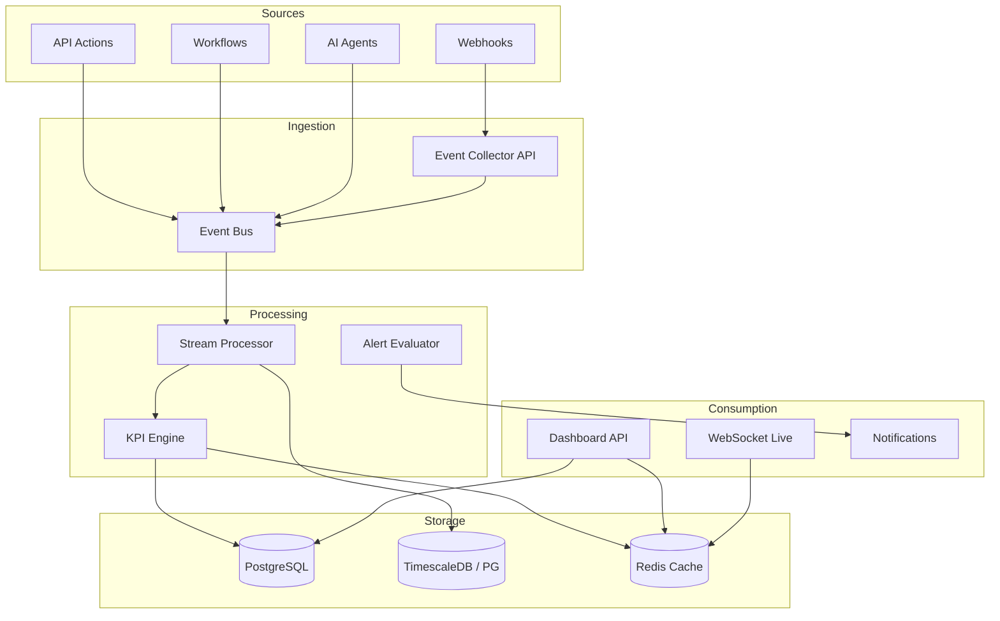

# AI BOS — Analytics temps réel

> **Version:** 0.1.0 | **Statut:** `DESIGN` | **Maturité:** `ALPHA`  
> **Dernière mise à jour:** Juillet 2026  
> **Audience:** Backend Engineers, Product Analytics, Data Engineering  
> **Référence héritage:** [analytics_service.py](../../sihia-platform/backend/app/application/analytics_service.py), [ml_service.py](../../sihia-platform/backend/app/application/ml_service.py)

---

## Table des matières

1. [Objectif](#1-objectif)
2. [Évolution SIH IA → AI BOS](#2-évolution-sih-ia--ai-bos)
3. [Architecture](#3-architecture)
4. [Event tracking](#4-event-tracking)
5. [Moteur KPI](#5-moteur-kpi)
6. [Agrégations temps réel](#6-agrégations-temps-réel)
7. [Alertes et seuils](#7-alertes-et-seuils)
8. [Dashboards](#8-dashboards)
9. [Modèle de données](#9-modèle-de-données)
10. [API](#10-api)
11. [Performance](#11-performance)
12. [ADRs](#12-adrs)
13. [Checklist de livraison](#13-checklist-de-livraison)

---

## 1. Objectif

Le module **Analytics** d'AI BOS fournit des **indicateurs opérationnels en temps quasi réel**, un **tracking d'événements** extensible et un **moteur KPI** configurable par tenant. Il généralise `AnalyticsService` SIH IA (agrégations SQL directes) vers une plateforme événementielle scalable.

### Distinction Analytics vs BI

| Analytics (ce module) | BI (README_25) |
|----------------------|----------------|
| KPIs opérationnels live | Rapports historiques |
| Latence secondes | Latence minutes/heures |
| Alertes seuils | Exploration ad-hoc |
| Event stream | Semantic layer, NL-to-SQL |
| Utilisateurs : ops, managers | Utilisateurs : analysts, direction |

---

## 2. Évolution SIH IA → AI BOS

| Aspect | SIH IA (`AnalyticsService`) | AI BOS (cible) |
|--------|----------------------------|----------------|
| Source données | SQL direct `connect()` | Event Bus + materialized views |
| KPIs | Hardcodés (occupation, patients) | Définitions YAML par tenant |
| Alertes | `_build_alerts()` seuils fixes | Règles configurables |
| Revenue | `AVG_REVENUE_PER_APPOINTMENT` constant | Formules dynamiques |
| Meta | `source: postgresql \| sqlite` | `source` + `freshness` + `correlation_id` |
| Forecast | `MlForecastService` consomme analytics | Module ML séparé (README_26) |

### KPIs SIH IA de référence

```python
# analytics_service.py — patterns à généraliser
return {
    "patientsToday": patients_today,
    "patientsTrend": trend,           # % vs semaine précédente
    "occupancy": occupancy,           # min(100, scheduled / DAILY_SLOT_CAPACITY)
    "appointments": len(appts),
    "criticalAlerts": critical_count,
    "activePatients": patient_total,
    "updatedAt": _utc_now().isoformat(),
    "source": "postgresql" | "sqlite",
}
```

---

## 3. Architecture



### Composants CORE

| Module | Responsabilité |
|--------|----------------|
| `core/analytics/collector` | Ingestion événements normalisés |
| `core/analytics/stream` | Agrégations fenêtres glissantes |
| `core/analytics/kpi` | Évaluation formules KPI |
| `core/analytics/alerts` | Seuils, suppression, escalade |
| `core/analytics/dashboard` | Composition widgets |
| `core/analytics/cache` | Redis snapshots KPI |

---

## 4. Event tracking

### Enveloppe événement standard

```json
{
  "eventId": "uuid",
  "eventType": "appointment.created",
  "organizationId": "uuid",
  "userId": "uuid",
  "entityType": "appointment",
  "entityId": "appt-abc",
  "timestamp": "2026-07-06T10:00:00Z",
  "properties": {
    "status": "scheduled",
    "department": "Cardiologie",
    "duration_minutes": 30
  },
  "context": {
    "correlationId": "req-xyz",
    "source": "api",
    "app": "sih-ia"
  }
}
```

### Taxonomie événements

| Catégorie | Exemples `eventType` |
|-----------|---------------------|
| CRM | `contact.created`, `deal.won` |
| Santé (SIH IA) | `appointment.created`, `patient.admitted` |
| Documents | `document.uploaded`, `export.completed` |
| IA | `agent.query`, `rag.retrieval` |
| Système | `user.login`, `api.error` |

### Collecte

| Méthode | Usage |
|---------|-------|
| Event Bus interne | Automatique sur mutations domaine |
| POST `/api/v1/analytics/events` | Tracking client UI |
| SDK JavaScript | Page views, clics (opt-in RGPD) |
| Batch import | Migration historique |

### Schéma stockage

```sql
CREATE TABLE analytics.events (
    id UUID PRIMARY KEY,
    organization_id UUID NOT NULL,
    event_type TEXT NOT NULL,
    user_id UUID,
    entity_type TEXT,
    entity_id TEXT,
    properties JSONB NOT NULL DEFAULT '{}',
    context JSONB NOT NULL DEFAULT '{}',
    occurred_at TIMESTAMPTZ NOT NULL,
    ingested_at TIMESTAMPTZ NOT NULL DEFAULT now()
) PARTITION BY RANGE (occurred_at);

CREATE INDEX idx_events_org_type_time
    ON analytics.events (organization_id, event_type, occurred_at DESC);
```

---

## 5. Moteur KPI

### Définition KPI (YAML)

```yaml
# kpi_definitions/occupancy_rate.yaml
code: occupancy_rate
name: Taux d'occupation
description: Rendez-vous du jour / capacité journalière
unit: percent
format: "0.0"
refresh_interval_seconds: 60
formula:
  type: ratio
  numerator:
    type: count
    filter:
      entity: appointment
      where:
        status: [scheduled, confirmed]
        date: today
  denominator:
    type: constant
    value: 48                    # configurable par tenant
  cap: 100
alerts:
  - level: warning
    condition: ">= 70"
  - level: critical
    condition: ">= 85"
```

### Types de formules

| Type | Description | Exemple SIH IA |
|------|-------------|----------------|
| `count` | Comptage filtré | `appointments` actifs |
| `ratio` | Numérateur / dénominateur | `occupancy` |
| `trend` | % variation période | `patientsTrend` |
| `sum` | Agrégation champ | Revenue mensuel |
| `avg` | Moyenne | Satisfaction |
| `percentile` | p50, p95 | Latence API |
| `custom_sql` | Requête validée | Cas avancés |

### Évaluation

```python
class KpiEngine:
    async def evaluate(self, org_id: UUID, kpi_code: str) -> KpiResult:
        definition = await self.registry.get(org_id, kpi_code)
        raw = await self.executor.run(definition.formula, org_id)
        value = self.post_process(raw, definition)
        alerts = self.alert_evaluator.check(definition.alerts, value)
        return KpiResult(value=value, alerts=alerts, computed_at=utc_now())
```

### Registry multi-tenant

- KPIs système (tous tenants) : `occupancy_rate`, `active_users`
- KPIs verticaux : `sihia.patients_today`, `crm.pipeline_value`
- Override tenant : surcharge `denominator`, seuils alertes

---

## 6. Agrégations temps réel

### Materialized views (PostgreSQL)

Reprise pattern SIH IA SQL direct, optimisé :

```sql
CREATE MATERIALIZED VIEW analytics.daily_appointment_counts AS
SELECT
    organization_id,
    date_trunc('day', scheduled_at AT TIME ZONE 'UTC') AS day,
    COUNT(*) FILTER (WHERE status != 'cancelled') AS active_count
FROM appointments
GROUP BY 1, 2;

-- Refresh concurrent via pg_cron toutes les minutes
```

### Fenêtres glissantes (Redis)

| Métrique | Fenêtre | Structure |
|----------|---------|-----------|
| API requests/min | 1 min | Sorted set |
| Events count | 5 min | HyperLogLog |
| Active sessions | 15 min | Set |

### Revenue mensuel (héritage)

```python
# monthly_revenue(period="6m") — généraliser
labels_fr = ["Jan", "Fev", "Mar", ...]
return [{"label": "...", "value": count * revenue_per_unit, "appointments": count}]
```

Paramètre `revenue_per_unit` devient configurable KPI plutôt que constante `275`.

---

## 7. Alertes et seuils

### Héritage SIH IA `_build_alerts`

```python
if occupancy >= 85:
    alerts.append({"level": "critical", "title": "Tension sur les lits", ...})
elif occupancy >= 70:
    alerts.append({"level": "warning", "title": "Occupation élevée", ...})
if pending > 20:
    alerts.append({"level": "warning", "title": "File de rendez-vous", ...})
```

### Modèle alerte AI BOS

```sql
CREATE TABLE analytics.alert_rules (
    id UUID PRIMARY KEY,
    organization_id UUID NOT NULL,
    kpi_code TEXT NOT NULL,
    level TEXT NOT NULL,               -- info | warning | critical
    condition TEXT NOT NULL,           -- ex: ">= 85"
    title_template TEXT NOT NULL,
    description_template TEXT,
    cooldown_minutes INTEGER DEFAULT 30,
    notify_channels TEXT[] DEFAULT '{in_app}',
    is_active BOOLEAN DEFAULT true
);

CREATE TABLE analytics.alert_instances (
    id UUID PRIMARY KEY,
    rule_id UUID NOT NULL,
    kpi_value NUMERIC NOT NULL,
    level TEXT NOT NULL,
    title TEXT NOT NULL,
    description TEXT,
    area TEXT,
    status TEXT DEFAULT 'open',        -- open | acknowledged | resolved
    created_at TIMESTAMPTZ NOT NULL DEFAULT now()
);
```

### Comportement

- **Cooldown** : pas de re-alerte identique avant N minutes
- **Escalade** : critical non acquittée → notification email admin
- **Intégration** : module Notifications (README_21)

---

## 8. Dashboards

### Widget types

| Type | Source | Refresh |
|------|--------|---------|
| `kpi_card` | KPI Engine | 60 s |
| `line_chart` | Time series | 5 min |
| `bar_chart` | Agrégation catégorielle | 5 min |
| `alert_feed` | Alert instances | Real-time WS |
| `table` | SQL query limitée | On demand |

### Dashboard par défaut SIH IA → AI BOS

| Widget | KPI / Endpoint |
|--------|----------------|
| Patients aujourd'hui | `patients_today` |
| Tendance semaine | `patients_trend` |
| Occupation | `occupancy_rate` |
| Revenus 6 mois | `monthly_revenue` |
| Admissions par dept | `admissions_by_dept` |
| Satisfaction | `satisfaction_score` |
| Alertes | `alerts` |

### Configuration

```sql
CREATE TABLE analytics.dashboards (
    id UUID PRIMARY KEY,
    organization_id UUID NOT NULL,
    name TEXT NOT NULL,
    layout JSONB NOT NULL,             -- react-grid-layout
    is_default BOOLEAN DEFAULT false,
    created_by UUID NOT NULL
);
```

---

## 9. Modèle de données

### Snapshots KPI (cache)

```sql
CREATE TABLE analytics.kpi_snapshots (
    organization_id UUID NOT NULL,
    kpi_code TEXT NOT NULL,
    value JSONB NOT NULL,
    computed_at TIMESTAMPTZ NOT NULL,
    source TEXT NOT NULL,
  PRIMARY KEY (organization_id, kpi_code)
);
```

### Time series

```sql
CREATE TABLE analytics.kpi_timeseries (
    organization_id UUID NOT NULL,
    kpi_code TEXT NOT NULL,
    bucket TIMESTAMPTZ NOT NULL,
    value NUMERIC NOT NULL,
    PRIMARY KEY (organization_id, kpi_code, bucket)
);
```

---

## 10. API

### KPIs

```
GET /api/v1/analytics/kpis
GET /api/v1/analytics/kpis/{code}
GET /api/v1/analytics/kpis/{code}/timeseries?period=7d&granularity=1h
```

### Alertes

```
GET  /api/v1/analytics/alerts?level=critical
POST /api/v1/analytics/alerts/{id}/acknowledge
```

### Événements

```
POST /api/v1/analytics/events          # tracking client
GET  /api/v1/analytics/events          # admin debug
```

### Dashboards

```
GET  /api/v1/analytics/dashboards
GET  /api/v1/analytics/dashboards/{id}
PUT  /api/v1/analytics/dashboards/{id}
```

### WebSocket live

```
WS /api/v1/analytics/live
→ subscribe: ["kpis:occupancy_rate", "alerts"]
```

### Permissions

| Permission | Accès |
|------------|-------|
| `analytics:read` | KPIs, dashboards |
| `analytics:export` | PDF/Excel (→ Documents) |
| `analytics:admin` | Règles alertes, définitions KPI |
| `analytics:track` | POST events (SDK) |

---

## 11. Performance

### SLO

| Endpoint | p95 latence |
|----------|-------------|
| GET `/kpis` (cached) | < 50 ms |
| GET `/kpis` (cold) | < 500 ms |
| POST `/events` | < 20 ms |
| WS push | < 2 s après event |

### Stratégies

- Cache Redis TTL 60 s pour snapshots KPI
- Materialized views refresh non-bloquant
- Partitionnement `events` par mois
- Sampling events haute fréquence (1 % en prod si volume extrême)

---

## 12. ADRs

### ADR-024-001 : KPI definitions as code + override DB

**Décision :** Définitions système en YAML Git ; overrides tenant en PostgreSQL.  
**Contexte :** Reviewabilité + flexibilité client.  
**Conséquences :** Pipeline déploiement définitions KPI.

### ADR-024-002 : Event Bus comme source primaire

**Décision :** Nouveaux KPIs préfèrent events ; SQL direct pour legacy/migration.  
**Contexte :** Scalabilité, découplage.  
**Conséquences :** Double écriture temporaire phase migration SIH IA.

### ADR-024-003 : TimescaleDB optionnel

**Décision :** PostgreSQL natif suffit v1 ; TimescaleDB si > 10M events/jour.  
**Conséquences :** Extension activable sans refonte API.

---

## 13. Checklist de livraison

- [ ] Event collector + schéma `analytics.events`
- [ ] KPI Engine avec 6 KPIs SIH IA portés
- [ ] Alert rules + instances + cooldown
- [ ] Cache Redis snapshots
- [ ] API `/kpis`, `/alerts`, `/dashboards`
- [ ] WebSocket live updates
- [ ] Dashboard UI default layout
- [ ] Intégration Notifications sur alertes critical
- [ ] Tests : `test_analytics_dynamic.py` portés
- [ ] Documentation définitions KPI YAML

---

*Document maintenu par l'équipe CORE Platform — AI BOS.*
