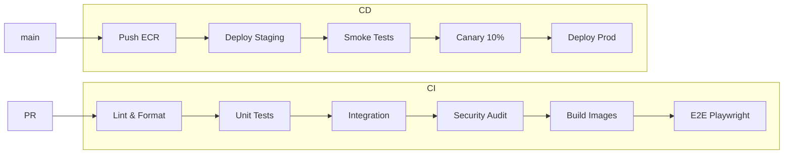

# AI BOS — DevOps (CI/CD, GitOps, IaC)

> **Version:** 0.1.0 | **Statut:** `DESIGN` | **Maturité:** `ALPHA`  
> **Dernière mise à jour:** Juillet 2026  
> **Audience:** SRE, Platform Engineers, Backend Leads  
> **Référence héritage:** [ci.yml](../../sihia-platform/.github/workflows/ci.yml), [docker-compose.yml](../../sihia-platform/docker-compose.yml)

---

## Table des matières

1. [Objectif](#1-objectif)
2. [Évolution SIH IA → AI BOS](#2-évolution-sih-ia--ai-bos)
3. [Pipeline CI/CD](#3-pipeline-cicd)
4. [GitHub Actions](#4-github-actions)
5. [GitOps](#5-gitops)
6. [Infrastructure as Code](#6-infrastructure-as-code)
7. [Environnements](#7-environnements)
8. [Gestion des secrets](#8-gestion-des-secrets)
9. [Artefacts et registry](#9-artefacts-et-registry)
10. [Quality gates](#10-quality-gates)
11. [Runbooks](#11-runbooks)
12. [ADRs](#12-adrs)
13. [Checklist de livraison](#13-checklist-de-livraison)

---

## 1. Objectif

La discipline **DevOps** d'AI BOS définit les pratiques de **livraison continue**, **déploiement automatisé** et **infrastructure déclarative** pour le monorepo CORE + apps verticales. Elle étend le pipeline CI SIH IA vers une plateforme multi-environnements enterprise.

### Principes

| Principe | Application |
|----------|-------------|
| Everything as Code | CI, infra, config, policies |
| Trunk-based development | `main` toujours déployable |
| Shift-left security | Audit deps en CI, SAST |
| Immutable infrastructure | Pas de SSH prod pour patch |
| Observable deployments | Métriques post-deploy automatiques |

---

## 2. Évolution SIH IA → AI BOS

| Aspect | SIH IA (`ci.yml`) | AI BOS (cible) |
|--------|-------------------|----------------|
| Jobs CI | security-audit, backend, frontend, e2e | + terraform, docker push, deploy |
| Backend test | `pytest tests/ -q` | 200+ tests, coverage gate |
| Frontend | lint, test:rbac, build | + Storybook, bundle size |
| E2E | Playwright chromium | Multi-browser, smoke prod |
| Deploy | Manuel | GitOps ArgoCD / GH Actions |
| IaC | docker-compose local | Terraform AWS |
| Environments | dev local | dev / staging / prod |

### Pipeline SIH IA actuel

```yaml
jobs:
  security-audit:    # pip-audit + npm audit
  backend:         # pytest Python 3.12
  frontend:        # lint + test:rbac + build
  e2e:             # Playwright (needs all above)
```

---

## 3. Pipeline CI/CD



### Déclencheurs

| Event | Pipeline |
|-------|----------|
| Pull request | CI complet (pas deploy) |
| Push `main` | CI + deploy staging auto |
| Tag `v*.*.*` | CI + deploy prod (approval) |
| `workflow_dispatch` | Deploy manuel environnement |

### Stratégie branches

```
main          ─── production-ready, protected
develop       ─── intégration (optionnel)
feature/*     ─── PR vers main
hotfix/*      ─── PR urgent + fast-track
```

---

## 4. GitHub Actions

### Structure workflows

```
.github/workflows/
  ci.yml                 # PR + push — héritage SIH IA étendu
  cd-staging.yml         # Deploy staging on main
  cd-production.yml      # Deploy prod on tag
  terraform-plan.yml     # PR infra changes
  terraform-apply.yml    # Merge infra
  security-scan.yml      # Weekly SAST + deps
  release.yml            # Changelog + GitHub Release
```

### CI étendu (base SIH IA)

```yaml
name: CI

on:
  push:
    branches: [main, develop]
  pull_request:
    branches: [main, develop]

jobs:
  security-audit:
    runs-on: ubuntu-latest
    steps:
      - uses: actions/checkout@v4
      - uses: actions/setup-node@v4
        with: { node-version: "22", cache: npm }
      - uses: actions/setup-python@v5
        with: { python-version: "3.12", cache: pip }
      - run: npm ci
      - run: pip install pip-audit
      - run: pip-audit -r backend/requirements.txt
      - run: npm audit --omit=dev --audit-level=moderate

  backend:
    runs-on: ubuntu-latest
    defaults:
      run: { working-directory: backend }
    steps:
      - uses: actions/checkout@v4
      - uses: actions/setup-python@v5
        with:
          python-version: "3.12"
          cache: pip
          cache-dependency-path: backend/requirements-ml.txt
      - run: pip install -r requirements-ml.txt
      - run: python -m pytest tests/ -q --cov=app --cov-fail-under=70
        env:
          JWT_SECRET: ci-test-secret-minimum-32-characters-long

  frontend:
    runs-on: ubuntu-latest
    steps:
      - uses: actions/checkout@v4
      - uses: actions/setup-node@v4
        with: { node-version: "22", cache: npm }
      - run: npm ci
      - run: npm run lint
      - run: npm run test:rbac
      - run: npm run build
        env:
          VITE_API_URL: http://127.0.0.1:8000
          VITE_USE_MOCKS: "false"

  e2e:
    runs-on: ubuntu-latest
    needs: [security-audit, backend, frontend]
    steps:
      - uses: actions/checkout@v4
      - run: npm ci
      - run: pip install -r backend/requirements.txt
      - run: npx playwright install --with-deps chromium
      - run: npx playwright test
        env:
          CI: "true"
          JWT_SECRET: ci-test-secret-minimum-32-characters-long
          PLAYWRIGHT_BASE_URL: http://localhost:8080
```

### Extensions AI BOS

```yaml
  docker:
    needs: [backend, frontend]
    steps:
      - run: docker build -t aibos-backend:${{ github.sha }} ./backend
      - run: docker build -t aibos-frontend:${{ github.sha }} .
      - run: docker compose -f docker-compose.ci.yml up -d
      - run: curl -f http://localhost:8000/health

  terraform-plan:
    if: contains(github.event.pull_request.changed_files, 'infra/')
    steps:
      - run: terraform plan -out=tfplan
```

---

## 5. GitOps

### Modèle

```
Git (source of truth)
  └── infra/k8s/overlays/
        ├── dev/
        ├── staging/
        └── production/
              ↓ sync
        ArgoCD / Flux
              ↓
        EKS Cluster
```

### Repository layout

```
infra/
  terraform/
    modules/
      vpc/
      ecs/
      rds/
      elasticache/
    environments/
      dev/
      staging/
      prod/
  k8s/                          # si EKS
    base/
    overlays/
  argocd/
    applications/
```

### Principe

- **Aucun `kubectl apply` manuel** en prod
- Tout changement infra = PR + review + terraform plan comment
- ArgoCD auto-sync staging ; prod = manual sync ou approval

### Rollback GitOps

```bash
git revert <commit>
# ou
argocd app rollback aibos-prod <revision>
```

---

## 6. Infrastructure as Code

### Terraform — modules principaux

| Module | Ressources |
|--------|------------|
| `vpc` | VPC, subnets, NAT, security groups |
| `ecs` | Cluster, services, task definitions |
| `rds` | PostgreSQL 16 Multi-AZ |
| `elasticache` | Redis cluster |
| `s3` | Buckets documents, artifacts ML |
| `cloudfront` | CDN frontend |
| `iam` | Roles task, CI OIDC |
| `secrets` | Secrets Manager references |

### Exemple environment prod

```hcl
# infra/terraform/environments/prod/main.tf
module "aibos" {
  source = "../../modules/stack"

  environment     = "production"
  domain          = "app.aibos.io"
  db_instance     = "db.r6g.large"
  db_multi_az     = true
  ecs_desired_count = 3
  enable_waf      = true
}
```

### State management

| Env | Backend S3 | Locking |
|-----|------------|---------|
| dev | `aibos-tfstate-dev` | DynamoDB |
| staging | `aibos-tfstate-staging` | DynamoDB |
| prod | `aibos-tfstate-prod` | DynamoDB |

### CI Terraform

- `terraform fmt -check`
- `terraform validate`
- `tflint`
- `checkov` (security policies)
- Plan commenté sur PR

---

## 7. Environnements

| Env | Purpose | Deploy trigger | URL |
|-----|---------|----------------|-----|
| **local** | Dev machine | manuel | localhost:8080 |
| **dev** | Intégration continue | push feature branches | dev.aibos.io |
| **staging** | Pre-prod, QA | push main | staging.aibos.io |
| **prod** | Production | tag semver + approval | app.aibos.io |

### Parité environnements

| Composant | local | dev | staging | prod |
|-----------|-------|-----|---------|------|
| PostgreSQL | Docker | RDS small | RDS medium | RDS Multi-AZ |
| Redis | Docker | ElastiCache small | medium | cluster |
| S3 | MinIO | S3 dev bucket | S3 staging | S3 prod |
| OpenSearch | Docker single | 1 node | 3 nodes | 3+ nodes |
| SMTP | MailHog | SES sandbox | SES | SES prod |

### Configuration par environnement

```bash
# .env.staging (non commité — template .env.example commité)
ENVIRONMENT=staging
DATABASE_URL=postgresql://...
JWT_SECRET=<secrets-manager>
CORS_ORIGINS=https://staging.aibos.io
```

---

## 8. Gestion des secrets

| Secret | Stockage | Rotation |
|--------|----------|----------|
| `JWT_SECRET` | Secrets Manager | 90 j |
| `DATABASE_URL` | Secrets Manager | avec RDS rotation |
| `SMTP_*`, `TWILIO_*` | Secrets Manager | 180 j |
| CI tokens | GitHub Secrets | 90 j |
| AWS deploy | OIDC (pas de keys longues) | — |

### GitHub OIDC → AWS

```yaml
permissions:
  id-token: write
  contents: read

- uses: aws-actions/configure-aws-credentials@v4
  with:
    role-to-assume: arn:aws:iam::123456789:role/github-actions-deploy
    aws-region: eu-west-3
```

---

## 9. Artefacts et registry

### Container images

```
{account}.dkr.ecr.eu-west-3.amazonaws.com/aibos/
  backend:{git-sha}
  backend:{semver}
  frontend:{git-sha}
  backend-ml:{git-sha}      # Prophet deps
  worker:{git-sha}
```

### Tagging strategy

- **`{git-sha}`** — immutable, traçabilité
- **`{semver}`** — releases
- **`latest`** — staging uniquement, jamais prod

### Retention

- Images : 30 j (dev), 90 j (prod)
- Terraform state : versioning S3
- CI logs : 90 j GitHub

---

## 10. Quality gates

### Merge requirements (branch protection `main`)

- [ ] CI green (all jobs)
- [ ] 1+ approval code review
- [ ] No high/critical security findings
- [ ] Coverage ≥ 70 % backend
- [ ] Terraform plan reviewed (si infra)

### Deploy gates prod

- [ ] Staging smoke passed 24 h
- [ ] Manual approval (2 reviewers pour infra)
- [ ] Changelog généré
- [ ] Rollback plan documenté

---

## 11. Runbooks

### Deploy production

```
1. Créer tag v1.2.3 sur main
2. Workflow cd-production déclenché
3. Build + push ECR
4. ArgoCD sync canary 10%
5. Monitor error rate 15 min
6. Promote 100% ou rollback
```

### Rollback urgence

```
1. argocd app rollback aibos-prod
2. ou re-deploy tag v1.2.2 précédent
3. Vérifier /health, métriques
4. Post-mortem sous 48 h
```

### Incident CI

| Symptôme | Action |
|----------|--------|
| pytest flaky | Quarantine test, ticket |
| E2E timeout | Augmenter timeout, vérifier services |
| pip-audit CVE | Patch dep ou waiver documenté |

---

## 12. ADRs

### ADR-027-001 : GitHub Actions comme CI standard

**Décision :** GitHub Actions (héritage SIH IA) ; pas de Jenkins.  
**Conséquences :** OIDC AWS ; minutes CI à monitorer.

### ADR-027-002 : Terraform seul pour IaC

**Décision :** Terraform ; pas de CloudFormation/CDK parallèle.  
**Conséquences :** Équipe formée HCL ; modules réutilisables.

### ADR-027-003 : ArgoCD pour GitOps K8s

**Décision :** Si EKS choisi (README_28) ; ECS utilise CodeDeploy.  
**Conséquences :** Deux paths CD documentés selon compute.

---

## 13. Checklist de livraison

- [ ] Workflows CI portés depuis SIH IA
- [ ] Coverage gate 70 %
- [ ] Docker build CI job
- [ ] ECR repositories Terraform
- [ ] cd-staging workflow fonctionnel
- [ ] Terraform modules vpc, rds, ecs
- [ ] Secrets Manager intégration
- [ ] OIDC GitHub → AWS
- [ ] Branch protection rules
- [ ] Runbooks deploy + rollback
- [ ] Monitoring post-deploy (README_31)

---

*Document maintenu par l'équipe Platform — AI BOS.*
