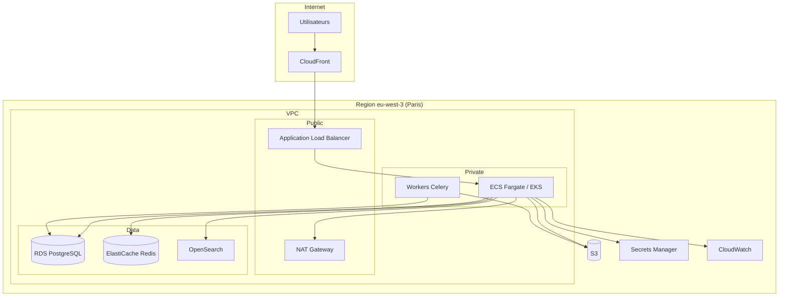

# AI BOS — Architecture Cloud AWS

> **Version:** 0.1.0 | **Statut:** `DESIGN` | **Maturité:** `CONCEPT`  
> **Dernière mise à jour:** Juillet 2026  
> **Audience:** Cloud Architects, SRE, Security, Platform Engineers  
> **Référence héritage:** [docker-compose.yml](../../sihia-platform/docker-compose.yml), [README_27_DevOps](README_27_DevOps.md)

---

## Table des matières

1. [Objectif](#1-objectif)
2. [Vue d'ensemble](#2-vue-densemble)
3. [Réseau VPC](#3-réseau-vpc)
4. [Compute ECS/EKS](#4-compute-ecseks)
5. [Données RDS](#5-données-rds)
6. [Cache ElastiCache](#6-cache-elasticache)
7. [Stockage S3](#7-stockage-s3)
8. [CDN CloudFront](#8-cdn-cloudfront)
9. [Services managés complémentaires](#9-services-managés-complémentaires)
10. [Multi-région et DR](#10-multi-région-et-dr)
11. [Sécurité](#11-sécurité)
12. [Coûts et sizing](#12-coûts-et-sizing)
13. [ADRs](#13-adrs)
14. [Checklist de livraison](#14-checklist-de-livraison)

---

## 1. Objectif

Ce document spécifie l'**architecture AWS cible** pour AI BOS en production : haute disponibilité, isolation réseau, scalabilité horizontale et préparation multi-région. Il traduit l'environnement local SIH IA (`docker-compose`) vers une topologie cloud enterprise.

### Principes architecturaux AWS

| Principe | Implémentation |
|----------|----------------|
| Well-Architected | 6 piliers AWS intégrés |
| Least privilege | IAM roles par service |
| Defense in depth | VPC privé, WAF, encryption |
| Pay for use | Auto-scaling, réservations phase 2 |
| Infrastructure as Code | Terraform (README_27) |

---

## 2. Vue d'ensemble



### Mapping docker-compose SIH IA → AWS

| Service local | Service AWS |
|---------------|-------------|
| `postgres:16-alpine` | RDS PostgreSQL 16 Multi-AZ |
| `backend` container | ECS Fargate service |
| `frontend` container | S3 + CloudFront (static) ou ECS |
| `redis` (futur) | ElastiCache Redis |
| `mailhog` | Amazon SES |
| `airflow` (profile) | MWAA ou ECS Airflow |
| Volumes `pg_data` | RDS storage gp3 |
| `minio` (dev) | S3 |

---

## 3. Réseau VPC

### Design CIDR

```
VPC: 10.0.0.0/16

Public subnets (ALB, NAT):
  10.0.1.0/24  eu-west-3a
  10.0.2.0/24  eu-west-3b
  10.0.3.0/24  eu-west-3c

Private app subnets (ECS):
  10.0.10.0/24 eu-west-3a
  10.0.11.0/24 eu-west-3b
  10.0.12.0/24 eu-west-3c

Private data subnets (RDS, Redis, OpenSearch):
  10.0.20.0/24 eu-west-3a
  10.0.21.0/24 eu-west-3b
  10.0.22.0/24 eu-west-3c
```

### Security Groups

| SG | Inbound | Outbound |
|----|---------|----------|
| `sg-alb` | 443 from 0.0.0.0/0 | ECS port 8000 |
| `sg-ecs` | 8000 from sg-alb | 5432 RDS, 6379 Redis, 443 HTTPS |
| `sg-rds` | 5432 from sg-ecs, sg-worker | — |
| `sg-redis` | 6379 from sg-ecs | — |
| `sg-opensearch` | 443 from sg-ecs | — |

### Connectivity

- **NAT Gateway** : sortie Internet subnets privés (HA : 1 par AZ prod)
- **VPC Endpoints** : S3, Secrets Manager, ECR (réduction coûts NAT)
- **PrivateLink** : optionnel accès SaaS (OpenAI API via proxy)

---

## 4. Compute ECS/EKS

### Recommandation phase 1 : ECS Fargate

| Critère | ECS Fargate | EKS |
|---------|-------------|-----|
| Complexité ops | Faible | Élevée |
| Time-to-market | Rapide | Plus lent |
| Coût petit scale | Compétitif | Control plane + nodes |
| Kubernetes ecosystem | Limité | Complet |
| **Choix AI BOS v1** | **✓ Recommandé** | Phase 2 si besoin K8s |

### Services ECS

| Service | Tasks | CPU/Memory | Auto-scaling |
|---------|-------|------------|--------------|
| `aibos-api` | 2-10 | 1 vCPU / 2 GB | CPU > 70 % |
| `aibos-worker` | 1-5 | 1 vCPU / 2 GB | Queue depth |
| `aibos-ml` | 1-2 | 2 vCPU / 4 GB | Predictions/min |
| `aibos-frontend` | 0 (S3) ou 2 | — | CloudFront |

### Task definition (API)

```json
{
  "family": "aibos-api",
  "cpu": "1024",
  "memory": "2048",
  "networkMode": "awsvpc",
  "requiresCompatibilities": ["FARGATE"],
  "containerDefinitions": [{
    "name": "backend",
    "image": "{ecr}/aibos/backend:latest",
    "portMappings": [{ "containerPort": 8000 }],
    "healthCheck": {
      "command": ["CMD-SHELL", "curl -f http://localhost:8000/health || exit 1"],
      "interval": 30,
      "timeout": 5,
      "retries": 3
    },
    "secrets": [
      { "name": "JWT_SECRET", "valueFrom": "arn:aws:secretsmanager:..." },
      { "name": "DATABASE_URL", "valueFrom": "arn:aws:secretsmanager:..." }
    ],
    "environment": [
      { "name": "ENVIRONMENT", "value": "production" }
    ],
    "logConfiguration": {
      "logDriver": "awslogs",
      "options": {
        "awslogs-group": "/ecs/aibos-api",
        "awslogs-region": "eu-west-3"
      }
    }
  }]
}
```

### EKS (phase 2)

- Cluster managé 1.29+
- Node groups : `general` (api), `ml` (GPU optionnel)
- ArgoCD GitOps (README_27)
- AWS Load Balancer Controller

---

## 5. Données RDS

### Configuration PostgreSQL 16

| Paramètre | Dev | Staging | Prod |
|-----------|-----|---------|------|
| Instance | db.t4g.medium | db.r6g.large | db.r6g.xlarge |
| Multi-AZ | Non | Oui | Oui |
| Storage | 20 GB gp3 | 100 GB gp3 | 500 GB gp3 |
| IOPS | 3000 | 6000 | 12000 |
| Backup retention | 7 j | 14 j | 35 j |
| Encryption | AES-256 | AES-256 | AES-256 KMS |

### Extensions requises

```sql
CREATE EXTENSION IF NOT EXISTS "uuid-ossp";
CREATE EXTENSION IF NOT EXISTS "pgcrypto";
CREATE EXTENSION IF NOT EXISTS "vector";      -- pgvector RAG
```

### Read replica

- **BI queries** → replica (README_25)
- Lag monitoring alerte > 30 s
- Promotion replica = procédure DR

### Paramètres tuning

```
max_connections = 200
shared_buffers = 25% RAM
work_mem = 64MB
effective_cache_size = 75% RAM
log_min_duration_statement = 1000   # slow query 1s
```

### Migration depuis SIH IA

- `alembic upgrade head` en pipeline CD
- Snapshot RDS avant migration majeure
- Rollback = restore snapshot (RTO documenté)

---

## 6. Cache ElastiCache

### Redis 7 cluster

| Usage | Pattern | TTL |
|-------|---------|-----|
| Sessions JWT blacklist | String | session lifetime |
| KPI cache | Hash | 60 s |
| Rate limiting | Sorted set | 1 min |
| Pub/Sub in-app notif | Channel | — |
| Celery broker | Lists | — |

### Configuration

| Env | Nodes | Type |
|-----|-------|------|
| dev | 1 | cache.t4g.micro |
| staging | 2 | cache.r6g.large |
| prod | 3 (cluster mode) | cache.r6g.large |

### Haute disponibilité

- Multi-AZ avec automatic failover
- Encryption in-transit (TLS) + at-rest
- Auth token via Secrets Manager

---

## 7. Stockage S3

### Buckets

| Bucket | Usage | Lifecycle |
|--------|-------|-----------|
| `aibos-documents-{env}` | GED (README_23) | IA 90j, Glacier 7 ans |
| `aibos-ml-artifacts-{env}` | Modèles ML | Versioning ON |
| `aibos-exports-{env}` | Rapports BI | Expire 30 j |
| `aibos-frontend-{env}` | Assets statiques | — |
| `aibos-tfstate-{env}` | Terraform state | Versioning ON |
| `aibos-logs-archive` | Logs long terme | Glacier |

### Policies

- Block public access : **ON** (sauf frontend via OAI CloudFront)
- SSE-KMS par défaut
- Cross-region replication : prod → `eu-central-1` (DR)

### Préfixe multi-tenant

```
s3://aibos-documents-prod/organizations/{org_id}/...
```

---

## 8. CDN CloudFront

### Distribution

| Behavior | Origin | Cache |
|----------|--------|-------|
| `/static/*` | S3 frontend | 1 an (hash in filename) |
| `/api/*` | ALB | No cache |
| `/assets/*` | S3 | 1 semaine |

### Sécurité

- TLS 1.2+ (ACM certificate `*.aibos.io`)
- AWS WAF : rate limiting, geo block optionnel
- Origin Access Control (OAC) pour S3
- Custom header ALB validation

### Headers

```
Strict-Transport-Security: max-age=31536000
X-Content-Type-Options: nosniff
Content-Security-Policy: default-src 'self'
```

---

## 9. Services managés complémentaires

| Service | Usage AI BOS |
|---------|--------------|
| **OpenSearch Service** | Search unifié (README_22) |
| **Amazon SES** | Email transactionnel |
| **Secrets Manager** | Credentials rotation |
| **CloudWatch** | Logs, métriques, alarmes |
| **X-Ray** | Tracing distribué |
| **MWAA** | Airflow pipelines (option) |
| **Textract** | OCR documents (README_23) |
| **Route 53** | DNS `app.aibos.io` |
| **ACM** | Certificats TLS |
| **KMS** | Chiffrement clés tenant Enterprise |

### OpenSearch sizing

| Env | Instance | Storage |
|-----|----------|---------|
| dev | t3.small.search × 1 | 20 GB |
| staging | r6g.large.search × 3 | 100 GB |
| prod | r6g.xlarge.search × 3 | 500 GB |

---

## 10. Multi-région et DR

### Stratégie phase 1 (single region)

- Region primaire : **eu-west-3** (Paris) — souveraineté EU
- Backups RDS cross-region → **eu-central-1** (Frankfurt)
- S3 CRR documents prod

### RTO / RPO cibles

| Scénario | RPO | RTO |
|----------|-----|-----|
| AZ failure | 0 (Multi-AZ) | < 5 min |
| Region failure | 1 h (backups) | 4 h (runbook) |
| Corruption data | 24 h (daily snapshot) | 8 h |

### Phase 2 — Active-passive

```
eu-west-3 (active)  ←→  eu-central-1 (warm standby)
  - RDS read replica promoted on failover
  - Route 53 health check failover
  - CloudFront origin failover group
```

### Phase 3 — Multi-région active (Enterprise)

- Tenants EU → Paris ; tenants MENA → `me-south-1` (Bahrain)
- Global Accelerator
- Cohérence : réplication async acceptable GED

---

## 11. Sécurité

### IAM

| Role | Trust | Permissions |
|------|-------|-------------|
| `ecs-task-role` | ecs-tasks | S3, Secrets, SES scoped |
| `ecs-execution-role` | ecs-tasks | ECR pull, logs |
| `github-actions` | OIDC | ECR push, ECS deploy |
| `terraform` | IAM user/role | Full infra (CI only) |

### Chiffrement

| Couche | Méthode |
|--------|---------|
| Transit | TLS 1.2+ partout |
| RDS | AES-256 KMS |
| S3 | SSE-KMS |
| Redis | TLS in-transit |
| Secrets | Secrets Manager |

### Compliance

- RGPD : données EU, DPA AWS
- Logs audit : CloudTrail enabled
- Config Rules : encryption checks

---

## 12. Coûts et sizing

### Estimation mensuelle prod (ordre de grandeur)

| Service | Coût estimé |
|---------|-------------|
| ECS Fargate (5 tasks) | $150-300 |
| RDS r6g.xlarge Multi-AZ | $400-600 |
| ElastiCache (3 nodes) | $200-350 |
| OpenSearch (3 nodes) | $400-700 |
| S3 + CloudFront | $50-200 |
| NAT Gateway | $100-150 |
| **Total** | **$1 300 - 2 300 / mois** |

### Optimisations

- Reserved Instances RDS/ElastiCache (1 an) : -30 %
- Fargate Spot workers : -50 % batch
- S3 Intelligent-Tiering documents
- VPC Endpoints (réduction NAT)

---

## 13. ADRs

### ADR-028-001 : eu-west-3 region primaire

**Décision :** Paris comme region primaire pour clients EU/Maghreb.  
**Alternatives :** eu-west-1 (Irlande), eu-central-1.  
**Conséquences :** Latence optimale Maroc/France ; services AWS vérifiés disponibles.

### ADR-028-002 : ECS Fargate avant EKS

**Décision :** ECS Fargate phase 1 ; réévaluation EKS à 50+ services.  
**Conséquences :** Simplicité ; migration path documentée.

### ADR-028-003 : CloudFront + S3 pour frontend

**Décision :** SPA React sur S3/CloudFront ; API via ALB.  
**Contexte :** Pattern Vite build SIH IA.  
**Conséquences :** Pas de SSR v1 ; SEO pages marketing séparées.

---

## 14. Checklist de livraison

- [ ] VPC Terraform module déployé dev
- [ ] RDS PostgreSQL 16 + extensions
- [ ] ECS cluster + service API
- [ ] ElastiCache Redis cluster
- [ ] S3 buckets + policies
- [ ] CloudFront distribution
- [ ] ALB + ACM certificate
- [ ] Secrets Manager secrets
- [ ] CloudWatch dashboards + alarmes
- [ ] OpenSearch domain staging
- [ ] Backup cross-region configuré
- [ ] Security groups review
- [ ] Cost alerts AWS Budgets

---

*Document maintenu par l'équipe Platform — AI BOS.*
