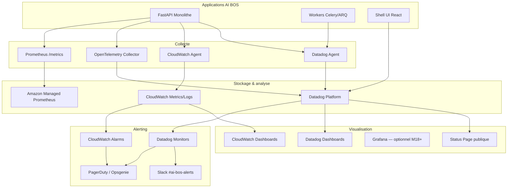
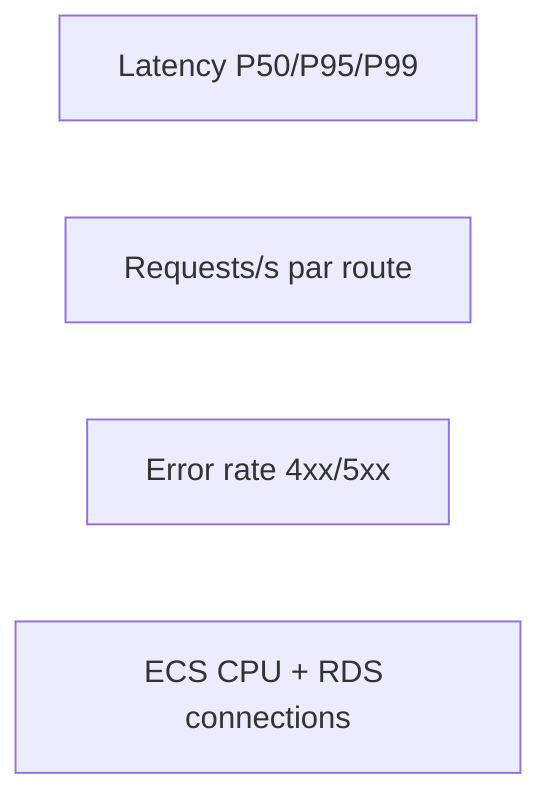

# README_31 — Monitoring & alerting AI BOS

---

## Métadonnées du document

| Champ | Valeur |
|-------|--------|
| **Document** | README_31_Monitoring.md |
| **Projet** | AI BOS — AI Business Operating System |
| **Version** | 0.1.0 |
| **Statut** | `REVIEW` — validation SRE requise |
| **Niveau de maturité** | `DESIGN` |
| **Audience** | SRE, DevOps, Engineering Leads, On-call |
| **Auteur** | AI BOS Platform Operations Team |
| **Dernière mise à jour** | Juillet 2026 |
| **Documents liés** | [README_32_Observability](README_32_Observability.md) · [README_33_Performance](README_33_Performance.md) · [README_28_Cloud](README_28_Cloud.md) · [README_29_Deployment](README_29_Deployment.md) |
| **Référence héritage** | [SIH IA DevOps](../../sihia-platform/Document/README_10_DevOps_Deploy.md) · [SIH IA État implémentation](../../sihia-platform/Document/README_ETAT_IMPLEMENTATION.md) |

---

## Table des matières

1. [Synthèse exécutive](#1-synthèse-exécutive)
2. [Objectifs et principes](#2-objectifs-et-principes)
3. [Architecture de monitoring](#3-architecture-de-monitoring)
4. [Stack CloudWatch (AWS natif)](#4-stack-cloudwatch-aws-natif)
5. [Stack Datadog (observabilité unifiée)](#5-stack-datadog-observabilité-unifiée)
6. [SLO, SLI et error budgets](#6-slo-sli-et-error-budgets)
7. [Dashboards opérationnels](#7-dashboards-opérationnels)
8. [Politique d'alerting](#8-politique-dalerting)
9. [Uptime et statut public](#9-uptime-et-statut-public)
10. [Runbooks et escalade](#10-runbooks-et-escalade)
11. [Environnements et rollout](#11-environnements-et-rollout)
12. [Checklist de mise en production](#12-checklist-de-mise-en-production)
13. [ADRs](#13-adrs)
14. [Annexes](#14-annexes)

---

## 1. Synthèse exécutive

Le monitoring AI BOS vise une **visibilité bout-en-bout** sur la plateforme CORE et les applications verticales (SIH IA en premier wedge), avec des **SLO mesurables**, des **alertes actionnables** et un **statut public** fiable.

Stratégie dual-stack :

| Phase | Outil principal | Périmètre |
|-------|-----------------|-----------|
| **M0–M6** (pilote → staging) | **CloudWatch** + métriques Prometheus internes | Infra AWS, ECS/RDS, ALB, logs |
| **M6–M12** (production GA) | **Datadog** comme console unifiée | Métriques, logs, traces, synthetics, RUM |
| **M12+** (scale 10K orgs) | Datadog + CloudWatch backup | Multi-région, DR, compliance |

Héritage SIH IA : les compteurs `metrics.py` et l'endpoint `/health/details` constituent la **fondation pilote** avant exposition Prometheus complète (voir [README_32_Observability](README_32_Observability.md)).

**Cible uptime plateforme : 99.9 %** (≈ 43 min downtime/mois autorisé).

---

## 2. Objectifs et principes

### 2.1 Objectifs

| Objectif | Indicateur | Cible |
|----------|------------|-------|
| Détecter les incidents avant les clients | MTTD (Mean Time To Detect) | < 5 min |
| Réduire le bruit d'alerte | Ratio alertes actionnables | > 80 % |
| Mesurer la fiabilité produit | SLO availability API | 99.9 % |
| Visibilité par tenant critique | Dashboard par `organization_id` (top 50) | M12 |
| Traçabilité incidents | Post-mortem documenté | 100 % SEV-1/2 |

### 2.2 Principes SRE

1. **Monitor what matters** — SLI alignés sur l'expérience utilisateur, pas uniquement CPU/RAM.
2. **Alert on symptoms, not causes** — latence P95 et taux d'erreur avant saturation disque.
3. **Every alert has a runbook** — pas d'alerte sans lien Confluence/Notion.
4. **Error budget drives releases** — budget épuisé → gel features, focus fiabilité.
5. **Correlation ID partout** — chaque alerte inclut `correlation_id` pour investigation (hérité SIH IA).

---

## 3. Architecture de monitoring



### 3.1 Flux de données

| Source | Type | Destination | Rétention |
|--------|------|-------------|-----------|
| FastAPI `/metrics` | Prometheus exposition | AMP → Datadog | 15 mois |
| Logs JSON stdout | Logs structurés | CloudWatch Logs → Datadog | 90 j (prod), 30 j (staging) |
| Traces OTEL | Spans HTTP + DB + IA | Datadog APM | 15 j |
| ALB access logs | Requêtes entrantes | S3 + Datadog | 1 an |
| RDS Enhanced Monitoring | DB perf | CloudWatch | 30 j |
| Synthetic checks | HTTP probes | Datadog Synthetics | N/A |
| RUM frontend | Web vitals, erreurs JS | Datadog RUM | 30 j |

---

## 4. Stack CloudWatch (AWS natif)

### 4.1 Périmètre CloudWatch phase 1

CloudWatch reste la **source de vérité infra** même après adoption Datadog.

| Ressource AWS | Métriques clés | Alarme seuil (staging) |
|---------------|----------------|------------------------|
| **ALB** | `TargetResponseTime`, `HTTPCode_Target_5XX_Count`, `HealthyHostCount` | P95 > 2s pendant 5 min |
| **ECS Fargate** | `CPUUtilization`, `MemoryUtilization`, `RunningTaskCount` | CPU > 80 % pendant 10 min |
| **RDS PostgreSQL** | `CPUUtilization`, `FreeStorageSpace`, `DatabaseConnections`, `ReadLatency` | Connexions > 80 % max |
| **ElastiCache Redis** | `CPUUtilization`, `CurrConnections`, `Evictions` | Evictions > 0 sustained |
| **S3** | `4xxErrors`, `5xxErrors` | 5xx > 10/min |
| **CloudFront** | `4xxErrorRate`, `5xxErrorRate`, `OriginLatency` | 5xx > 1 % |

### 4.2 Log groups CloudWatch

```
/aws/ecs/ai-bos-api-prod          # stdout JSON FastAPI
/aws/ecs/ai-bos-workers-prod      # workers background
/aws/rds/ai-bos-postgres-prod     # slow query log (optionnel)
/aws/lambda/ai-bos-edge-prod      # fonctions edge (futur)
```

**Format attendu** : une ligne JSON par événement (réutilisation `logging_config.py` SIH IA, namespace `ai-bos`).

### 4.3 CloudWatch Alarms — template

| Alarme | Métrique | Seuil prod | Période | Actions |
|--------|----------|------------|---------|---------|
| `ai-bos-api-5xx-high` | ALB 5xx count | > 50 / 5 min | 300 s | PagerDuty SEV-2 |
| `ai-bos-api-latency-p95` | TargetResponseTime P95 | > 1 s | 300 s | Slack warning |
| `ai-bos-rds-connections` | DatabaseConnections | > 80 % | 600 s | PagerDuty SEV-2 |
| `ai-bos-ecs-task-count` | RunningTaskCount | < desired - 1 | 120 s | PagerDuty SEV-1 |
| `ai-bos-redis-evictions` | Evictions | > 0 | 300 s | Slack warning |

### 4.4 Dashboard CloudWatch « AI BOS — Infra »

Panneaux minimum :

1. ALB — requêtes/s, latence P50/P95/P99, codes HTTP
2. ECS — tâches running vs desired, CPU/Memory par service
3. RDS — connexions, IOPS, storage libre, replica lag
4. Redis — hit rate, mémoire, évictions
5. Coût estimé (metric math Billing — lecture seule)

---

## 5. Stack Datadog (observabilité unifiée)

### 5.1 Rationale adoption Datadog (M6)

| Besoin | CloudWatch seul | Datadog |
|--------|-----------------|---------|
| Corrélation logs ↔ traces ↔ métriques | Manuel | Natif (`correlation_id`) |
| APM distributed tracing | Limité X-Ray | OpenTelemetry first-class |
| Synthetics multi-région | Basique | 20+ locations |
| RUM frontend | Non | Intégré |
| Dashboards SLO | CloudWatch SLO (basique) | SLO tracking + error budget |
| Alerting composite | Complexe | Monitors + composite |

### 5.2 Intégrations Datadog requises

| Intégration | Configuration |
|-------------|---------------|
| **AWS** | Compte lié, tags `env`, `service`, `version` |
| **PostgreSQL** | Agent sidecar, `dbm` activé M12 |
| **Redis** | ElastiCache integration |
| **FastAPI** | `ddtrace` + OTEL exporter |
| **Logs** | Pipeline JSON, parsing champs `event`, `organization_id` |
| **Synthetics** | Probes `/health`, login flow, chatbot SSE |
| **RUM** | Shell UI + apps verticales |

### 5.3 Tags obligatoires (convention)

```
env:production|staging|dev
service:ai-bos-api|ai-bos-worker|ai-bos-shell|sihia-app
version:0.1.0                    # semver release
region:eu-west-3
organization_id:<uuid>             # si applicable (logs/traces)
correlation_id:<uuid>              # propagation header
```

### 5.4 Pipelines logs Datadog

Étape 1 — **JSON parsing** sur champ `message` ou ligne brute.

Étape 2 — **Remappers** :

| Champ source | Facette Datadog |
|--------------|-----------------|
| `event` | `@event` |
| `correlation_id` | `@correlation_id` |
| `organization_id` | `@organization_id` |
| `user_id` | `@usr.id` |
| `duration_ms` | `@duration` |

Étape 3 — **Exclusion filters** (réduction coût) :

- Health checks ALB (`/health`) — sampling 1 %
- Logs DEBUG hors staging — drop

---

## 6. SLO, SLI et error budgets

### 6.1 Définition des SLI

| SLI | Mesure | Source |
|-----|--------|--------|
| **API Availability** | `(total - 5xx) / total` sur routes `/api/*` | ALB + Prometheus |
| **API Latency** | % requêtes < 200 ms (P95 global < 200 ms) | Prometheus histogram |
| **Auth Success Rate** | `(login 200) / (login attempts)` | Logs `event=auth.login` |
| **Chatbot First Token** | % streams avec premier token < 3 s | Traces span `ai.stream` |
| **Background Job Success** | jobs completed / jobs enqueued | Worker metrics |

### 6.2 SLO cibles par phase

| SLO | Pilote (M0–6) | GA (M6–12) | Scale (M12–36) |
|-----|---------------|------------|----------------|
| API Availability | 99.5 % | 99.9 % | 99.95 % |
| API P95 latency | < 500 ms | < 300 ms | < 200 ms |
| Chatbot first token P95 | < 5 s | < 3 s | < 2 s |
| Pipeline freshness | < 48 h | < 24 h | < 6 h |

### 6.3 Error budget

```
Error Budget (30 j) = (1 - SLO) × fenêtre
Exemple 99.9 % → 43.2 min downtime autorisé / mois
```

| Budget restant | Action produit |
|----------------|----------------|
| > 50 % | Releases normales |
| 25–50 % | Réduire déploiements risqués |
| < 25 % | Gel features, focus fiabilité |
| 0 % | Incident review obligatoire, pas de deploy sauf hotfix |

### 6.4 Datadog SLO monitors

| SLO ID | Nom | SLI | Target | Fenêtre |
|--------|-----|-----|--------|---------|
| SLO-001 | API Availability | ALB success rate | 99.9 % | 30 j rolling |
| SLO-002 | API Latency P95 | histogram quantile 0.95 | < 300 ms | 7 j rolling |
| SLO-003 | Auth Availability | login success | 99.5 % | 30 j |
| SLO-004 | Chatbot Responsiveness | first token | 95 % < 3 s | 7 j |

---

## 7. Dashboards opérationnels

### 7.1 Catalogue dashboards Datadog

| Dashboard | Audience | Contenu |
|-----------|----------|---------|
| **AI BOS — Executive** | Leadership | SLO status, DAU, requêtes IA, error budget |
| **AI BOS — API Golden Signals** | SRE | Latency, traffic, errors, saturation |
| **AI BOS — CORE Modules** | Backend | Par module `platform.*` : identity, ai, ml |
| **SIH IA — Healthcare** | Product santé | RDV, patients, rappels, chatbot médical |
| **AI BOS — Database** | DBA/SRE | RDS, slow queries, connections, locks |
| **AI BOS — AI Stack** | ML/AI team | Tokens, latence LLM, RAG hit rate, guardrails |
| **AI BOS — Multi-tenant** | CS Enterprise | Top orgs par volume, erreurs par tenant |
| **AI BOS — Deployments** | Release manager | Versions, canary, rollback events |

### 7.2 Golden Signals — panneaux API



Panneaux détaillés :

1. **Latency** — heatmap par `route`, comparaison release N vs N-1
2. **Traffic** — req/s global, pic par heure (timezone org)
3. **Errors** — top 10 routes 5xx, breakdown par `error.code`
4. **Saturation** — pool connexions DB, queue Redis, workers actifs

### 7.3 Dashboard `/health/details` (bridge pilote → prod)

En attendant Prometheus GA, l'endpoint hérité SIH IA expose :

```json
{
  "status": "ok",
  "version": "0.1.0",
  "components": {
    "database": { "status": "ok", "latency_ms": 2.1 },
    "pipeline": { "freshness": "ok", "alerts": [] },
    "ml_engine": { "status": "ok" }
  }
}
```

**Synthetic monitor Datadog** : `GET /health/details` toutes les 60 s depuis 3 régions ; alerte si `status != ok` ou `database.status == error`.

---

## 8. Politique d'alerting

### 8.1 Niveaux de sévérité

| Niveau | Définition | Canal | SLA réponse |
|--------|------------|-------|-------------|
| **SEV-1** | Plateforme down, perte données, sécurité | PagerDuty 24/7 | 15 min |
| **SEV-2** | Dégradation majeure, SLO breach imminent | PagerDuty heures ouvrées | 30 min |
| **SEV-3** | Impact limité, workaround disponible | Slack #ai-bos-alerts | 4 h |
| **SEV-4** | Cosmétique, dette technique | Jira ticket | Sprint suivant |

### 8.2 Règles anti-bruit

| Règle | Description |
|-------|-------------|
| **R1** | Minimum 5 min de sustained breach avant page |
| **R2** | Grouping par `service` + `env` — max 1 page / 30 min |
| **R3** | Maintenance window → suppression automatique alertes infra |
| **R4** | Canary deploy : seuils +20 % pendant 30 min post-deploy |
| **R5** | Toute alerte SEV-1/2 a un runbook URL dans le message |

### 8.3 Monitors Datadog — catalogue initial

| Monitor | Query (concept) | Sévérité |
|---------|-----------------|----------|
| API 5xx rate | `sum:http.requests{status:5xx}.as_rate() > 0.01` | SEV-2 |
| API P95 latency | `p95:trace.fastapi.request{*} > 0.5` | SEV-3 |
| RDS CPU | `avg:aws.rds.cpuutilization{*} > 85` | SEV-2 |
| ECS task unhealthy | `avg:ecs.fargate.running_tasks < desired` | SEV-1 |
| Redis memory | `avg:aws.elasticache.database_memory_usage_percentage > 90` | SEV-2 |
| SLO burn rate | multi-window burn rate alert | SEV-1/2 |
| Chatbot errors | `sum:ai.queries{status:error}.as_rate() > 0.05` | SEV-2 |
| Pipeline stale | `max:pipeline.freshness_hours > 48` | SEV-3 |
| Auth brute force | `sum:auth.failures{reason:rate_limit}.as_rate() > 10` | SEV-2 |
| Disk space RDS | `min:aws.rds.free_storage_space < 10GB` | SEV-2 |

### 8.4 Escalade PagerDuty

```
L1: On-call engineer (rotation hebdo)
  ↓ 15 min sans ACK
L2: Engineering Lead
  ↓ 30 min sans résolution
L3: CTO / Incident Commander
```

---

## 9. Uptime et statut public

### 9.1 Architecture status page

| Composant | Fournisseur | URL cible |
|-----------|-------------|-----------|
| Status page publique | Datadog Status Page ou Instatus | `status.ai-bos.com` |
| Page statut interne | Datadog dashboard embed | Confluence |

### 9.2 Composants affichés publiquement

| Composant | Sonde | Impact utilisateur |
|-----------|-------|-------------------|
| **API Platform** | Synthetic `/health` | Toute l'application |
| **Authentication** | Synthetic login | Connexion impossible |
| **SIH IA App** | Synthetic dashboard | App santé indisponible |
| **AI Assistant** | Synthetic chatbot ping | Chatbot offline |
| **Notifications** | Queue depth interne | Rappels email/SMS retardés |
| **Admin Console** | Synthetic RBAC page | Admin ops bloquées |

### 9.3 Politique de communication incident

| Phase | Action | Délai max |
|-------|--------|-----------|
| Détection | Monitor déclenché | — |
| Triage | Classification SEV | 10 min |
| Communication initiale | Status page + email clients Enterprise | 20 min (SEV-1) |
| Updates | Toutes les 30 min jusqu'à résolution | — |
| Post-mortem | Document blameless, actions | 5 j ouvrés |

### 9.4 Calcul uptime contractuel

```
Uptime mensuel = (total_minutes - downtime_minutes) / total_minutes × 100

Downtime = période où synthetic checks échouent sur 2+ régions
         ET error rate API > 5 % sustained 5 min
```

Exclusions : maintenance annoncée 72 h à l'avance, force majeure, dépendances client.

---

## 10. Runbooks et escalade

### 10.1 Runbooks obligatoires (M6)

| ID | Titre | Déclencheur |
|----|-------|-------------|
| RB-001 | API 5xx spike | Monitor API errors |
| RB-002 | RDS connection exhaustion | RDS connections alarm |
| RB-003 | ECS task crash loop | Task count alarm |
| RB-004 | Redis evictions / OOM | Redis memory alarm |
| RB-005 | Chatbot LLM timeout | AI latency monitor |
| RB-006 | Pipeline DAG failure | Pipeline stale monitor |
| RB-007 | Auth rate limit storm | Brute force monitor |
| RB-008 | Deploy rollback | Manual / failed canary |

### 10.2 Structure runbook type

```markdown
# RB-00X — Titre

## Symptômes
## Impact
## Diagnostic (5 min)
  1. Vérifier dashboard X
  2. Chercher correlation_id dans logs
  3. Vérifier dernier deploy
## Mitigation
## Résolution
## Post-incident
```

### 10.3 Outils investigation

| Outil | Usage |
|-------|-------|
| Datadog Log Explorer | Filtrer `@correlation_id`, `@organization_id` |
| Datadog APM | Trace waterfall requête lente |
| `/health/details` | État composants temps réel |
| AWS Console | ECS events, RDS Performance Insights |
| `kubectl logs` / ECS exec | Debug container (staging uniquement) |

---

## 11. Environnements et rollout

### 11.1 Matrice monitoring par environnement

| Env | CloudWatch | Datadog | Synthetics | PagerDuty |
|-----|------------|---------|------------|-----------|
| **dev** | Local only | Optionnel | Non | Non |
| **staging** | Complet | Complet | 3 checks | Slack only |
| **prod** | Complet + alarms | Complet | 10+ checks | PagerDuty 24/7 |

### 11.2 Plan de rollout monitoring

| Semaine | Livrable |
|---------|----------|
| S1–S2 | CloudWatch log groups + ALB/RDS alarms staging |
| S3–S4 | Prometheus `/metrics` + AMP workspace |
| S5–S6 | Datadog agent ECS, logs JSON pipeline |
| S7–S8 | APM OTEL, dashboards Golden Signals |
| S9–S10 | SLO monitors + error budget |
| S11–S12 | Synthetics + status page + PagerDuty prod |

---

## 12. Checklist de mise en production

### 12.1 Pré-requis GO monitoring

- [ ] Logs JSON avec `correlation_id` sur 100 % requêtes API
- [ ] `/health` et `/health/details` opérationnels
- [ ] Métriques Prometheus exposées sur `/metrics` (auth interne)
- [ ] CloudWatch alarms staging validées (fire drill)
- [ ] Datadog monitors avec runbooks liés
- [ ] SLO-001 (availability) configuré et baseline 7 j
- [ ] PagerDuty rotation configurée et testée
- [ ] Status page composants définis
- [ ] Post-mortem template publié
- [ ] Dashboard Executive partagé leadership

### 12.2 Fire drill trimestriel

1. Simuler panne RDS (failover test)
2. Vérifier MTTD < 5 min
3. Vérifier page PagerDuty reçue
4. Exercice rollback deploy
5. Mettre à jour runbooks si écart

---

## 13. ADRs

| ID | Titre | Statut |
|----|-------|--------|
| ADR-MON-001 | CloudWatch infra + Datadog app observability | `APPROVED` |
| ADR-MON-002 | SLO 99.9 % API comme contrat interne M6 | `APPROVED` |
| ADR-MON-003 | PagerDuty pour SEV-1/2 prod uniquement | `APPROVED` |
| ADR-MON-004 | `/health/details` conservé comme readiness probe | `APPROVED` |
| ADR-MON-005 | Error budget gate sur releases prod | `REVIEW` |

---

## 14. Annexes

### 14.1 Références

- [README_32_Observability](README_32_Observability.md) — logs, traces, métriques
- [README_33_Performance](README_33_Performance.md) — cibles latence, load tests
- [AWS Well-Architected — Reliability](https://docs.aws.amazon.com/wellarchitected/latest/reliability-pillar/welcome.html)
- [Google SRE Workbook — Alerting](https://sre.google/workbook/alerting-on-slos/)

### 14.2 Héritage SIH IA

| Composant SIH IA | Évolution AI BOS |
|------------------|------------------|
| `core/metrics.py` | Compteurs → Prometheus counters |
| `/health/details` | Readiness + synthetic monitor |
| `logging_config.py` | Pipeline Datadog JSON |
| GitHub Actions CI | Intégration Datadog CI Visibility M12 |

### 14.3 Glossaire

| Terme | Définition |
|-------|------------|
| **SLI** | Service Level Indicator — mesure brute |
| **SLO** | Service Level Objective — cible sur un SLI |
| **SLA** | Service Level Agreement — engagement contractuel client |
| **MTTD** | Mean Time To Detect |
| **MTTR** | Mean Time To Repair |

---

*Document maintenu par l'équipe Platform Operations. Prochaine revue : M6 post-mise en prod staging.*
