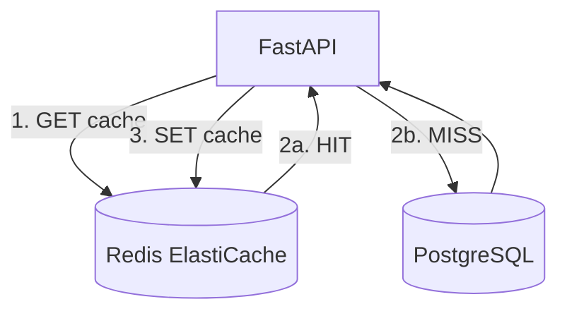
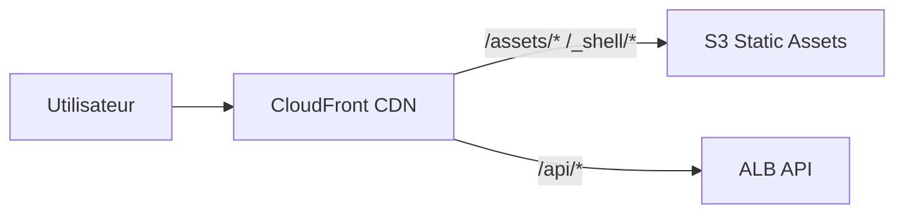
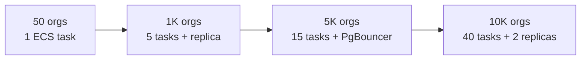

# README_33 — Performance & capacity planning AI BOS

---

## Métadonnées du document

| Champ | Valeur |
|-------|--------|
| **Document** | README_33_Performance.md |
| **Projet** | AI BOS — AI Business Operating System |
| **Version** | 0.1.0 |
| **Statut** | `REVIEW` |
| **Niveau de maturité** | `DESIGN` |
| **Audience** | SRE, Backend Engineers, Architects, Product |
| **Auteur** | AI BOS Platform Performance Team |
| **Dernière mise à jour** | Juillet 2026 |
| **Documents liés** | [README_31_Monitoring](README_31_Monitoring.md) · [README_32_Observability](README_32_Observability.md) · [README_02_Architecture](README_02_Architecture.md) |

---

## Table des matières

1. [Synthèse exécutive](#1-synthèse-exécutive)
2. [Objectifs de performance](#2-objectifs-de-performance)
3. [Budget de latence](#3-budget-de-latence)
4. [Stratégie de cache Redis](#4-stratégie-de-cache-redis)
5. [CDN et assets statiques](#5-cdn-et-assets-statiques)
6. [Optimisations base de données](#6-optimisations-base-de-données)
7. [Performance couche IA](#7-performance-couche-ia)
8. [Load testing](#8-load-testing)
9. [Capacity planning 10K organisations](#9-capacity-planning-10k-organisations)
10. [Performance budgets CI](#10-performance-budgets-ci)
11. [Runbook dégradation performance](#11-runbook-dégradation-performance)
12. [ADRs](#12-adrs)

---

## 1. Synthèse exécutive

AI BOS doit offrir une expérience **sub-seconde** sur les opérations CRUD métier tout en supportant des workloads IA plus lents de manière **asynchrone et streamée**.

**Cible north-star API** : **P95 < 200 ms** sur les endpoints CRUD `/api/v1/*` (hors IA et exports) à l'horizon scale (10 000 organisations).

| Dimension | Pilote (M6) | GA (M12) | Scale (M36) |
|-----------|-------------|----------|-------------|
| Organisations | 50 | 1 000 | 10 000 |
| Utilisateurs actifs | 500 | 50 000 | 1 000 000 |
| Requêtes API/s (pic) | 100 | 2 000 | 10 000 |
| P95 API CRUD | < 500 ms | < 300 ms | **< 200 ms** |
| P95 chatbot 1er token | < 5 s | < 3 s | < 2 s |

---

## 2. Objectifs de performance

### 2.1 SLO par catégorie d'endpoint

| Catégorie | Exemples | P50 | P95 | P99 |
|-----------|----------|-----|-----|-----|
| **Auth** | login, refresh | 80 ms | 150 ms | 300 ms |
| **CRUD simple** | GET patient, list RDV | 30 ms | **200 ms** | 400 ms |
| **CRUD complexe** | PATCH avec validation | 50 ms | 250 ms | 500 ms |
| **Agrégations** | dashboard KPIs | 100 ms | 400 ms | 800 ms |
| **Exports** | PDF, Excel | async | job < 30 s | — |
| **IA streaming** | chatbot SSE | — | 1er token 3 s | — |
| **ML inference** | forecast 7j | 200 ms | 1 s | 2 s |
| **Health** | `/health` | 5 ms | 20 ms | 50 ms |

### 2.2 Web Vitals frontend (Shell UI)

| Métrique | Cible | Outil |
|----------|-------|-------|
| LCP (Largest Contentful Paint) | < 2.5 s | Datadog RUM |
| INP (Interaction to Next Paint) | < 200 ms | Datadog RUM |
| CLS (Cumulative Layout Shift) | < 0.1 | Datadog RUM |
| TTFB | < 600 ms | RUM + ALB |
| Bundle initial Shell | < 250 KB gzip | CI budget |

### 2.3 Principes

1. **Mesurer avant d'optimiser** — baseline k6 chaque release.
2. **Cache par défaut** — Redis pour lectures chaudes, invalidation explicite.
3. **Pagination obligatoire** — max 100 items par page API.
4. **N+1 interdit** — eager loading SQLAlchemy, DataLoader pattern si GraphQL.
5. **IA hors chemin critique sync** — streaming ou job async.

---

## 3. Budget de latence

### 3.1 Décomposition requête CRUD (cible P95 = 200 ms)

```mermaid
gantt
    title Budget latence P95 — GET /api/v1/patients/{id}
    dateFormat X
    axisFormat %L ms

    section Réseau
    ALB + TLS           :0, 15
    section Application
    Middleware stack    :15, 25
    Auth + RBAC         :25, 35
    Cache Redis lookup  :35, 40
    section Data
    PostgreSQL query    :40, 90
    Serialization       :90, 110
    section Réseau
    Response            :110, 130
```



| Composant | Budget P95 |
|-----------|------------|
| ALB + réseau | 15 ms |
| Middleware (logging, correlation) | 10 ms |
| Auth JWT verify + RBAC | 10 ms |
| Cache Redis (hit) | 5 ms |
| PostgreSQL (indexed query) | 50 ms |
| Serialization Pydantic | 20 ms |
| Marge | 90 ms |
| **Total** | **200 ms** |

### 3.2 Alertes budget

| Condition | Action |
|-----------|--------|
| P95 > 200 ms sustained 15 min | Alert SEV-3 |
| P95 > 500 ms sustained 5 min | Alert SEV-2 |
| P99 > 2 s | Investigation obligatoire |

---

## 4. Stratégie de cache Redis

### 4.1 Architecture cache



### 4.2 Patterns de cache

| Pattern | Usage | TTL | Invalidation |
|---------|-------|-----|--------------|
| **Cache-aside** | Entités par ID (patient, user) | 5 min | On write (PATCH/DELETE) |
| **Cache stampede protection** | Dashboard KPIs | 60 s | Lock + single flight |
| **Session store** | Refresh tokens, chatbot sessions | 24 h | TTL naturel |
| **Rate limiting** | Login, chatbot | 15 min | TTL naturel |
| **Feature flags** | Par org | 30 s | Pub/sub invalidation |

### 4.3 Conventions clés Redis

```
ai-bos:{env}:org:{org_id}:patient:{patient_id}     # Cache-aside entity
ai-bos:{env}:org:{org_id}:dashboard:kpi:{period}   # KPIs agrégés
ai-bos:{env}:ratelimit:login:{ip}                  # Rate limit
ai-bos:{env}:session:refresh:{token_hash}          # Session
ai-bos:{env}:ff:{org_id}:{flag_name}               # Feature flag
```

### 4.4 Cibles hit rate

| Cache | Hit rate cible | Impact si miss |
|-------|----------------|----------------|
| Entity by ID | > 80 % | +50 ms DB |
| Dashboard KPIs | > 90 % | +200 ms agrégation |
| RBAC permissions | > 95 % | +20 ms |
| i18n catalogues | > 99 % | Négligeable |

### 4.5 Configuration ElastiCache

| Phase | Node type | Nodes | Memory |
|-------|-----------|-------|--------|
| Pilote | cache.t4g.micro | 1 | 0.5 GB |
| GA | cache.r7g.large | 2 (cluster) | 13 GB × 2 |
| 10K orgs | cache.r7g.xlarge | 3 shards | 26 GB × 3 |

**Politique éviction** : `allkeys-lru` avec alerte si evictions > 0 sustained.

### 4.6 Héritage SIH IA

| Composant SIH IA | Migration AI BOS |
|------------------|------------------|
| `chatbot_session_store.py` | `platform/cache/sessions.py` |
| `rate_limit.py` | `platform/rate-limiting/redis.py` |
| — | Cache-aside généralisé (nouveau) |

---

## 5. CDN et assets statiques

### 5.1 Architecture CDN



### 5.2 Assets servis via CDN

| Path | Source | Cache-Control |
|------|--------|---------------|
| `/_shell/*.js` | S3 build Shell UI | `max-age=31536000, immutable` |
| `/_apps/sihia/*.js` | S3 micro-frontend | `max-age=31536000, immutable` |
| `/assets/fonts/*` | S3 | `max-age=31536000` |
| `/chatbot/widget.js` | S3 (embed) | `max-age=3600` |
| `/logos/*` | S3 tenant branding | `max-age=86400` |
| `/api/*` | ALB (no CDN cache) | `no-store` |

### 5.3 API cache (GET idempotents uniquement)

| Endpoint | CDN cache | TTL |
|----------|-----------|-----|
| `GET /api/v1/i18n/{locale}` | ✅ | 1 h |
| `GET /api/v1/health` | ✅ | 10 s |
| `GET /api/v1/patients` | ❌ | — |
| Toute mutation | ❌ | — |

### 5.4 Compression

| Couche | Algorithme |
|--------|------------|
| CloudFront | Brotli + gzip |
| ALB | gzip responses > 1 KB |
| API JSON | `orjson` serialization |

---

## 6. Optimisations base de données

### 6.1 PostgreSQL configuration cible

| Paramètre | Pilote | Scale 10K orgs |
|-----------|--------|----------------|
| Instance | db.r6g.large | db.r6g.4xlarge + 2 read replicas |
| `max_connections` | 200 | 500 (avec PgBouncer) |
| `shared_buffers` | 25 % RAM | 25 % RAM |
| Connection pooling | SQLAlchemy pool 20 | PgBouncer transaction mode |

### 6.2 Index obligatoires

```sql
-- Multi-tenant : TOUTE table métier
CREATE INDEX idx_{table}_org_id ON {table}(organization_id);

-- Requêtes fréquentes SIH IA
CREATE INDEX idx_appointments_org_date ON sihia_appointments(organization_id, scheduled_at);
CREATE INDEX idx_patients_org_name ON sihia_patients(organization_id, last_name);
```

### 6.3 Query performance rules

| Règle | Seuil |
|-------|-------|
| Slow query log | > 200 ms |
| EXPLAIN ANALYZE obligatoire | Nouvelles requêtes > 50 ms en staging |
| Pagination | `LIMIT` max 100 |
| Count queries | Approximate count ou cache |
| Full table scan | Interdit en prod (alert Datadog DBM) |

### 6.4 Read replicas

| Phase | Usage replicas |
|-------|----------------|
| M12 | Analytics, exports, BI |
| M24 | Dashboard KPIs lecture |
| M36 | 80 % lectures routées replica |

---

## 7. Performance couche IA

### 7.1 Latence par étape chatbot

| Étape | Budget P95 |
|-------|------------|
| Auth + rate limit | 20 ms |
| RAG retrieval (pgvector) | 100 ms |
| Context assembly | 30 ms |
| LLM first token (streaming) | 2 s |
| LLM total response | 10 s max |

### 7.2 Optimisations RAG

| Technique | Gain estimé |
|-----------|-------------|
| Embedding cache Redis | -80 ms retrieval |
| HNSW index pgvector | -50 ms vs IVFFlat |
| Chunk pre-filtering par org | -30 ms |
| Streaming SSE (perçu) | UX immédiate |

### 7.3 ML forecasting (héritage SIH IA)

| Aspect | Cible |
|--------|-------|
| Inference Prophet 7j | P95 < 1 s |
| Batch nightly (Airflow) | < 30 min pour 10K orgs |
| MAPE | ≤ 15 % (métier SIH IA) |

---

## 8. Load testing

### 8.1 Outil et infrastructure

| Outil | Usage |
|-------|-------|
| **k6** | Scénarios API principaux |
| **Grafana k6 Cloud** | Runs distribués (optionnel M12) |
| **k6 browser** | Scénarios frontend critiques |

### 8.2 Scénarios de test

| ID | Scénario | VUs | Durée | Critère succès |
|----|----------|-----|-------|----------------|
| LT-001 | Smoke | 10 | 5 min | 0 % erreur |
| LT-002 | Login burst | 100 | 10 min | P95 < 300 ms |
| LT-003 | CRUD patients | 200 | 15 min | P95 < **200 ms** |
| LT-004 | Dashboard KPIs | 500 | 15 min | P95 < 400 ms |
| LT-005 | Mixed realistic | 1000 | 30 min | P95 < 300 ms, erreur < 0.1 % |
| LT-006 | Chatbot SSE | 50 streams | 10 min | 1er token P95 < 3 s |
| LT-007 | Soak test | 200 | 4 h | Pas de memory leak |
| LT-008 | Spike | 0→2000 en 1 min | 20 min | Recovery < 5 min |

### 8.3 Script k6 exemple (CRUD patients)

```javascript
import http from 'k6/http';
import { check, sleep } from 'k6';

export const options = {
  stages: [
    { duration: '2m', target: 100 },
    { duration: '10m', target: 200 },
    { duration: '2m', target: 0 },
  ],
  thresholds: {
    http_req_duration: ['p(95)<200'],
    http_req_failed: ['rate<0.001'],
  },
};

const BASE = __ENV.API_URL || 'https://staging.api.ai-bos.com';
const TOKEN = __ENV.API_TOKEN;

export default function () {
  const headers = {
    Authorization: `Bearer ${TOKEN}`,
    'X-Correlation-ID': `k6-${__VU}-${__ITER}`,
  };
  const list = http.get(`${BASE}/api/v1/patients?page=1&limit=20`, { headers });
  check(list, { 'list 200': (r) => r.status === 200 });
  sleep(1);
}
```

### 8.4 Cadence exécution

| Trigger | Scénarios |
|---------|-----------|
| Chaque PR (staging) | LT-001 smoke |
| Release candidate | LT-002, LT-003, LT-005 |
| Mensuel | LT-007 soak |
| Pré-scale event | LT-008 spike |
| M36 validation | Suite complète |

### 8.5 Environnement dédié

- Cluster staging isolé `perf-staging` (pas de données prod)
- Dataset synthétique : 10K patients, 50K RDV, 100 orgs
- Génération : script `scripts/seed_perf_data.py`

---

## 9. Capacity planning 10K organisations

### 9.1 Hypothèses de charge

| Paramètre | Valeur | Calcul |
|-----------|--------|--------|
| Organisations | 10 000 | Cible M36 |
| Users actifs / org (moyenne) | 20 | 200 000 MAU |
| DAU / MAU ratio | 30 % | 60 000 DAU |
| Requêtes API / user / jour | 50 | 3M req/jour |
| Pic / moyenne ratio | 5× | **10 000 req/s** pic |
| Requêtes IA / org / jour | 20 | 200K req IA/jour |
| Stockage / org | 5 GB | 50 TB total |
| Embeddings / org | 50K chunks | 500M chunks |

### 9.2 Dimensionnement compute

| Composant | Quantité | Instance | Justification |
|-----------|----------|----------|---------------|
| API ECS tasks | 20–40 (auto-scale) | 2 vCPU, 4 GB | 500 req/s par task |
| Worker ECS tasks | 10 | 2 vCPU, 4 GB | Jobs async |
| AI worker tasks | 5 | 4 vCPU, 8 GB + GPU opt | Inference |
| RDS PostgreSQL | 1 primary + 2 replicas | r6g.4xlarge | 50 TB, 10K conn PgBouncer |
| Redis cluster | 3 shards | r7g.xlarge | 78 GB total |
| ALB | 1 | — | 10K req/s |

### 9.3 Projection coûts AWS (ordre de grandeur)

| Service | Coût mensuel estimé |
|---------|---------------------|
| ECS Fargate | $8 000 – $15 000 |
| RDS | $12 000 – $20 000 |
| ElastiCache | $3 000 – $5 000 |
| S3 + CloudFront | $2 000 – $4 000 |
| OpenAI API | $10 000 – $50 000 (variable) |
| Datadog | $3 000 – $8 000 |
| **Total infra** | **$38 000 – $102 000/mois** |

### 9.4 Plan de scale par palier



| Palier | Orgs | Action trigger |
|--------|------|----------------|
| P1 → P2 | 200 orgs OU P95 > 300 ms | +ECS tasks, read replica |
| P2 → P3 | 2K orgs OU connexions DB > 60 % | PgBouncer, Redis cluster |
| P3 → P4 | 5K orgs OU 5K req/s | Shard Redis, 2e replica, CDN API cache |

### 9.5 Tests de validation capacity

Avant chaque palier :

1. Load test LT-005 à 150 % charge cible palier
2. Vérifier P95 < SLO pendant 30 min
3. Vérifier error budget non consommé > 50 %
4. Documenter dimensionnement dans ce README

---

## 10. Performance budgets CI

### 10.1 Gates CI

| Gate | Seuil | Blocage PR |
|------|-------|------------|
| k6 smoke LT-001 | P95 < 500 ms | ✅ |
| Bundle Shell size | < 250 KB gzip | ✅ warning, ❌ si > 300 KB |
| Lighthouse CI (Shell) | Performance > 80 | 🟡 warning |
| SQL slow queries (staging) | 0 nouvelles > 200 ms | ✅ |
| Memory leak soak (weekly) | < 10 % growth 4h | ✅ |

### 10.2 Regression detection

Comparer métriques k6 release N vs N-1 :

- P95 regression > 20 % → investigation obligatoire
- Error rate increase > 0.05 % → blocage deploy

---

## 11. Runbook dégradation performance

### 11.1 Arbre de décision

```
P95 > 500 ms ?
├── Oui → Vérifier ALB 5xx et ECS CPU
│   ├── CPU > 80 % → Scale out ECS (+2 tasks)
│   ├── DB connections > 80 % → Vérifier PgBouncer, slow queries
│   └── Redis evictions → Augmenter memory ou TTL review
└── Non → Vérifier déploiement récent
    └── Rollback si regression > 30 % post-deploy
```

### 11.2 Actions rapides

| Symptôme | Action | ETA effet |
|----------|--------|-----------|
| API lent, CPU bas | Slow query — kill long runners | 1 min |
| Cache miss storm | Warm cache script | 5 min |
| DB connections max | Scale PgBouncer pool | 2 min |
| LLM timeout | Fallback model + circuit breaker | Immédiat |
| Spike traffic | ECS auto-scale + rate limit | 3 min |

---

## 12. ADRs

| ID | Titre | Statut |
|----|-------|--------|
| ADR-PERF-001 | P95 < 200 ms CRUD à scale M36 | `APPROVED` |
| ADR-PERF-002 | Redis cache-aside pattern standard | `APPROVED` |
| ADR-PERF-003 | CloudFront pour assets, pas API mutations | `APPROVED` |
| ADR-PERF-004 | k6 comme outil load test officiel | `APPROVED` |
| ADR-PERF-005 | PgBouncer obligatoire > 500 connexions | `REVIEW` |

---

*Document vivant — mise à jour après chaque load test majeur et changement de palier capacity.*
