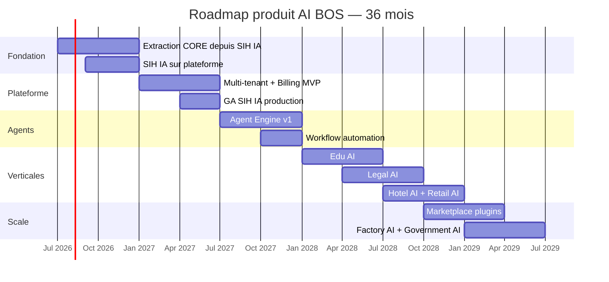
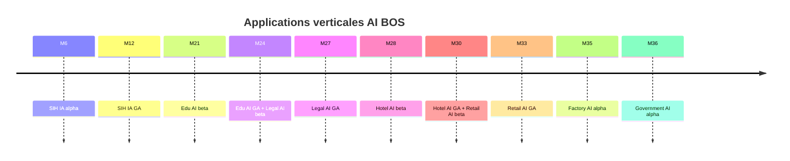
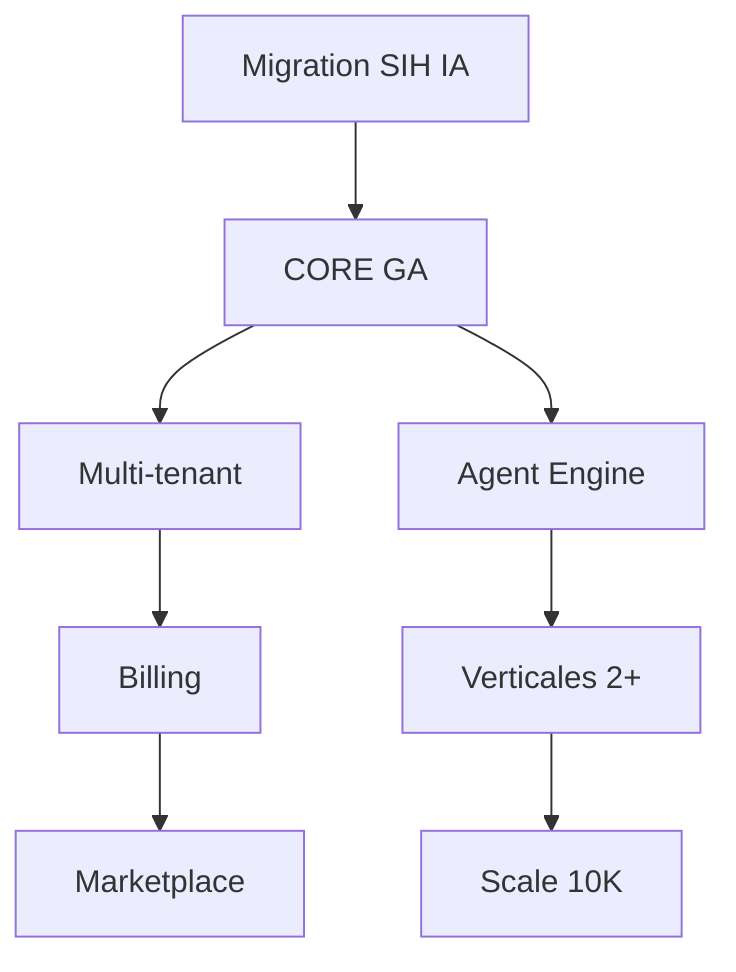

# README_34 — Roadmap produit AI BOS (36 mois)

---

## Métadonnées du document

| Champ | Valeur |
|-------|--------|
| **Document** | README_34_Roadmap.md |
| **Projet** | AI BOS — AI Business Operating System |
| **Version** | 0.1.0 |
| **Statut** | `REVIEW` — validation Product Board requise |
| **Niveau de maturité** | `CONCEPT` → `DESIGN` |
| **Audience** | Product, Engineering, Sales, Founders, Investors |
| **Auteur** | AI BOS Product Team |
| **Dernière mise à jour** | Juillet 2026 |
| **Documents liés** | [README_01_ProductStrategy](README_01_ProductStrategy.md) · [README_40_ImplementationRoadmap](README_40_ImplementationRoadmap.md) · [README_36_FutureApplications](README_36_FutureApplications.md) · [README_35_MigrationFromSIHIA](README_35_MigrationFromSIHIA.md) |

---

## Table des matières

1. [Synthèse exécutive](#1-synthèse-exécutive)
2. [Principes de roadmap](#2-principes-de-roadmap)
3. [Vue d'ensemble M1–M36](#3-vue-densemble-m1m36)
4. [Phase 1 — Fondation (M1–M6)](#4-phase-1--fondation-m1m6)
5. [Phase 2 — Plateforme MVP (M7–M12)](#5-phase-2--plateforme-mvp-m7m12)
6. [Phase 3 — Agents & automation (M13–M18)](#6-phase-3--agents--automation-m13m18)
7. [Phase 4 — Expansion verticale (M19–M24)](#7-phase-4--expansion-verticale-m19m24)
8. [Phase 5 — Scale & marketplace (M25–M30)](#8-phase-5--scale--marketplace-m25m30)
9. [Phase 6 — Enterprise & international (M31–M36)](#9-phase-6--enterprise--international-m31m36)
10. [Timeline applications verticales](#10-timeline-applications-verticales)
11. [Jalons et critères GO/NO-GO](#11-jalons-et-critères-gono-go)
12. [Dépendances et risques](#12-dépendances-et-risques)
13. [Métriques de succès par phase](#13-métriques-de-succès-par-phase)

---

## 1. Synthèse exécutive

La roadmap produit AI BOS sur **36 mois** suit une logique **wedge → platform → ecosystem** :

1. **M1–M6** : Extraire le CORE depuis SIH IA, livrer SIH IA comme première app verticale sur la nouvelle plateforme.
2. **M7–M12** : MVP plateforme multi-tenant, billing, marketplace interne, GA SIH IA.
3. **M13–M18** : Agent Engine, workflows automation, copilot transversal.
4. **M19–M24** : Lancer Edu AI et Legal AI, renforcer le CORE.
5. **M25–M30** : Scale 5K orgs, marketplace plugins tiers, apps Hotel + Retail.
6. **M31–M36** : Enterprise (SSO, ABAC), international EU, Factory + Government AI.

**North Star Metric** : Décisions assistées par IA par semaine (DAI/week) par organisation active.

---

## 2. Principes de roadmap

| Principe | Application |
|----------|-------------|
| **Vertical wedge first** | SIH IA valide le CORE sur un marché exigeant |
| **Platform before proliferation** | Pas de 3e app verticale avant billing + multi-tenant GA |
| **CORE avant features** | 60 % capacité engineering sur plateforme jusqu'à M12 |
| **Evidence-based pivot** | Revue trimestrielle avec KPIs ; kill features sous seuil |
| **Réutilisation > réinvention** | Chaque app verticale réutilise ≥ 70 % du CORE |

---

## 3. Vue d'ensemble M1–M36

### 3.1 Matrice phases

| Phase | Mois | Thème | Apps actives | Orgs cible |
|-------|------|-------|--------------|------------|
| 1 | M1–M6 | Fondation | SIH IA (migration) | 10 pilotes |
| 2 | M7–M12 | Plateforme MVP | SIH IA GA | 100 |
| 3 | M13–M18 | Agents | SIH IA + beta agents | 500 |
| 4 | M19–M24 | Expansion verticale | + Edu, Legal | 1 500 |
| 5 | M25–M30 | Scale & marketplace | + Hotel, Retail | 5 000 |
| 6 | M31–M36 | Enterprise global | + Factory, Gov | 10 000 |

---

## 4. Phase 1 — Fondation (M1–M6)

**Objectif** : Monorepo AI BOS opérationnel, CORE extrait, SIH IA fonctionnelle sur nouvelle architecture.

### 4.1 Livrables M1–M3

| Mois | Livrable produit | Livrable technique |
|------|------------------|-------------------|
| **M1** | Vision validée ARB | Monorepo scaffold, CI verte |
| **M2** | — | CORE identity + auth extraits |
| **M3** | Démo interne login + RBAC | CORE audit, notifications, observabilité |

### 4.2 Livrables M4–M6

| Mois | Livrable produit | Livrable technique |
|------|------------------|-------------------|
| **M4** | SIH IA alpha sur AI BOS | App `sihia` : patients, RDV |
| **M5** | Chatbot médical migré | CORE AI conversation + RAG |
| **M6** | Pilote 5 cliniques | Staging multi-tenant, monitoring Datadog |

### 4.3 Milestone M6 : « CORE Extracted »

| Critère | Seuil |
|---------|-------|
| Tests parité SIH IA | 100 % tests migrés passent |
| Zéro régression fonctionnelle | Checklist ETAT_IMPLEMENTATION |
| Multi-tenant | 2 orgs isolées en staging |
| Observabilité | Logs JSON + `/health/details` |
| Documentation | README_35 migration complète |

---

## 5. Phase 2 — Plateforme MVP (M7–M12)

**Objectif** : AI BOS devient une **vraie plateforme SaaS** facturable et multi-tenant.

### 5.1 Thèmes M7–M9

| Thème | Features |
|-------|----------|
| **Multi-tenant GA** | Organizations, invitations, isolation RLS |
| **Billing** | Plans Starter/Pro/Enterprise, Stripe |
| **Subscriptions** | Quotas IA, sièges, feature flags |
| **Shell UI** | Navigation multi-app, branding org |
| **Admin plateforme** | Super-admin, org management |

### 5.2 Thèmes M10–M12

| Thème | Features |
|-------|----------|
| **Marketplace interne** | App Registry, activation par org |
| **SDK** | API client TypeScript généré |
| **SIH IA GA** | Production sécurisée, SLA 99.5 % |
| **Onboarding** | Wizard première org, import données |
| **Mobile-ready** | API optimisée, PWA Shell |

### 5.3 Milestone M12 : « Platform GA »

| Critère | Seuil |
|---------|-------|
| Organisations payantes | ≥ 50 |
| MRR | ≥ 25 K€ |
| SLO API | 99.5 % |
| Apps marketplace | ≥ 2 (SIH IA + admin) |
| NPS pilotes | ≥ 40 |

---

## 6. Phase 3 — Agents & automation (M13–M18)

**Objectif** : Différenciation IA — l'OS devient **proactif**, pas seulement réactif.

### 6.1 Agent Engine (M13–M15)

| Feature | Description | Priorité |
|---------|-------------|----------|
| Agent personas | Configurables par org et par app | P0 |
| Tool calling | Agents appellent APIs CORE et app | P0 |
| Memory long-term | Contexte persistant par user/org | P1 |
| Agent orchestration | Multi-agent workflows simples | P1 |
| Guardrails platform | Héritage chatbot SIH IA, généralisé | P0 |

### 6.2 Workflow automation (M16–M18)

| Feature | Description | Priorité |
|---------|-------------|----------|
| Visual workflow builder | n8n-like, intégré Shell | P0 |
| Triggers | Event Bus, cron, webhook | P0 |
| Actions | Notifications, API calls, IA | P0 |
| Templates SIH IA | Rappels RDV, alertes KPI | P1 |
| Approval flows | Human-in-the-loop | P2 |

### 6.3 Milestone M18 : « Intelligent OS »

| Critère | Seuil |
|---------|-------|
| DAI/week (médiane org) | ≥ 20 |
| Workflows actifs | ≥ 500 |
| Agents déployés | ≥ 3 personas production |
| Réduction tâches manuelles (SIH IA) | -30 % temps admin |

---

## 7. Phase 4 — Expansion verticale (M19–M24)

**Objectif** : Prouver la **réplicabilité** du modèle plateforme + app verticale.

### 7.1 Edu AI (M19–M21)

| Module | Description |
|--------|-------------|
| Students & classes | Gestion élèves, classes, années |
| Grades & assessments | Notes, bulletins |
| Edu copilot | Assistant pédagogique RAG |
| Parent portal | Notifications, RDV parents-profs |
| Analytics | Performance classe, décrochage |

**Réutilisation CORE** : identity, RBAC, notifications, AI, analytics, billing.

### 7.2 Legal AI (M22–M24)

| Module | Description |
|--------|-------------|
| Cases & matters | Dossiers juridiques |
| Document management | GED + OCR contrats |
| Legal research RAG | Jurisprudence, codes |
| Deadlines & calendar | Échéances, alertes |
| Time tracking & billing | Heures, facturation client |

### 7.3 Milestone M24 : « Multi-vertical proven »

| Critère | Seuil |
|---------|-------|
| Apps verticales GA | 3 (SIH IA, Edu, Legal) |
| Réutilisation CORE mesurée | ≥ 75 % code par nouvelle app |
| Organisations totales | ≥ 1 500 |
| Time-to-market app #4 | < 4 mois |

---

## 8. Phase 5 — Scale & marketplace (M25–M30)

**Objectif** : Écosystème ouvert et scale infrastructure 5K orgs.

### 8.1 Thèmes principaux

| Thème | M25–M27 | M28–M30 |
|-------|---------|---------|
| **Hotel AI** | Réservations, housekeeping, guest AI | GA |
| **Retail AI** | Inventory, POS integration, clienteling | GA |
| **Plugin SDK** | API publique plugins tiers | Marketplace beta |
| **Scale infra** | 5K orgs, P95 < 300 ms | P95 < 200 ms |
| **Advanced analytics** | BI embedded, data warehouse | Self-serve reports |

### 8.2 Marketplace (M28–M30)

| Capability | Description |
|------------|-------------|
| Plugin submission | Review process, sandbox |
| Revenue share | 70/30 développeur/plateforme |
| Certification | Security review, badge |
| Discovery | Marketplace dans Shell UI |

### 8.3 Milestone M30 : « Ecosystem beta »

| Critère | Seuil |
|---------|-------|
| Organisations | ≥ 5 000 |
| Apps verticales | 5 |
| Plugins tiers | ≥ 5 certifiés |
| ARR | ≥ 2 M€ |

---

## 9. Phase 6 — Enterprise & international (M31–M36)

**Objectif** : Enterprise-ready, conformité EU, 10K orgs.

### 9.1 Enterprise features (M31–M33)

| Feature | Description |
|---------|-------------|
| SSO SAML/OIDC | Okta, Azure AD |
| ABAC | Politiques attributs fines |
| Data residency EU | Région eu-west-3 default |
| HIPAA / HDS pathway | SIH IA certification |
| Dedicated instances | Option Enterprise |
| 99.9 % SLA contractuel | Status page, crédits |

### 9.2 Nouvelles verticales (M34–M36)

| App | Focus | Modules clés |
|-----|-------|--------------|
| **Factory AI** | Industrie 4.0 | Maintenance prédictive, OEE, qualité |
| **Government AI** | Secteur public | Dossiers citoyens, workflows administratifs |

### 9.3 International (M34–M36)

| Marché | Actions |
|--------|---------|
| France | Consolidation, partenariats éditeurs |
| EU | RGPD renforcé, DPA, localisation |
| Maghreb / Afrique | Pricing adapté, offline-first partiel |
| US (exploration) | HIPAA, entité commerciale |

### 9.4 Milestone M36 : « Scale platform »

| Critère | Seuil |
|---------|-------|
| Organisations | 10 000 |
| MAU | 200 000 |
| Apps verticales GA | 7 |
| ARR | ≥ 5 M€ |
| SLO | 99.9 % |
| NPS | ≥ 50 |

---

## 10. Timeline applications verticales

### 10.1 Détail par application

| Application | Alpha | Beta | GA | Marché cible |
|-------------|-------|------|-----|--------------|
| **SIH IA** | M4 | M6 | M12 | Cliniques privées, cabinets |
| **Edu AI** | M19 | M20 | M21 | Écoles privées, universités |
| **Legal AI** | M22 | M23 | M24 | Cabinets avocats, notaires |
| **Hotel AI** | M25 | M27 | M28 | Hôtels 50–500 chambres |
| **Retail AI** | M28 | M29 | M33 | Retail mid-market |
| **Factory AI** | M34 | M35 | M36+ | PME industrielles |
| **Government AI** | M35 | M36 | M36+ | Collectivités, agences |

### 10.2 Critères lancement nouvelle verticale

| # | Critère | Obligatoire |
|---|---------|-------------|
| 1 | CORE modules requis en GA | ✅ |
| 2 | Product brief validé | ✅ |
| 3 | 3 design partners signés | ✅ |
| 4 | Équipe dédiée ≥ 2 engineers | ✅ |
| 5 | Modèle permissions `{slug}.*` défini | ✅ |
| 6 | Plan migration données (si existant) | 🟡 |

---

## 11. Jalons et critères GO/NO-GO

### 11.1 Jalons majeurs

| ID | Jalon | Date | Owner |
|----|-------|------|-------|
| J1 | Monorepo + CI verte | M1 | Eng Lead |
| J2 | CORE Extracted | M6 | Architect |
| J3 | Premier client payant | M8 | Product |
| J4 | Platform GA | M12 | Product |
| J5 | Agent Engine v1 | M15 | AI Lead |
| J6 | 2e verticale GA (Edu) | M21 | Product |
| J7 | Marketplace beta | M28 | Platform |
| J8 | 5K orgs | M30 | CEO |
| J9 | 10K orgs + 99.9 % SLA | M36 | CTO |

### 11.2 Revue trimestrielle (QBR)

Chaque trimestre, le Product Board évalue :

1. KPIs vs cibles phase en cours
2. Error budget consommé
3. Feedback design partners
4. Ajustement priorités roadmap suivante
5. Décision GO/KILL/PARK nouvelles initiatives

### 11.3 Critères NO-GO (exemples)

| Situation | Décision |
|-----------|----------|
| M6 : tests migration < 95 % pass | Reporter GA, prolonger Phase 1 |
| M12 : < 20 orgs payantes | Reporter verticale Edu, focus SIH IA |
| M18 : DAI/week < 5 | Reporter marketplace, renforcer IA |
| M24 : Legal AI 0 design partner | PARK Legal, accélérer Hotel |

---

## 12. Dépendances et risques

### 12.1 Dépendances critiques

### 12.2 Registre des risques

| Risque | Impact | Probabilité | Mitigation |
|--------|--------|-------------|------------|
| Migration SIH IA retarde M6 | High | Medium | Plan zero-downtime README_35 |
| Coûts LLM explosent | High | Medium | Quotas, modèles locaux, caching |
| Concurrence Doctolib/ERP | Medium | High | Wedge IA différenciant |
| Recrutement senior engineers | High | Medium | Remote EU, equity |
| Conformité santé (HDS) | High | Low | Roadmap certification M30+ |
| Scope creep verticales | Medium | High | Framework RICE, kill criteria |

---

## 13. Métriques de succès par phase

| Phase | North Star | KPI secondaires |
|-------|------------|-----------------|
| M1–M6 | Migration sans régression | Tests pass, 5 pilotes |
| M7–M12 | Orgs payantes | MRR, churn, SLO |
| M13–M18 | DAI/week | Workflows actifs, agent adoption |
| M19–M24 | Apps GA livrées | Réutilisation CORE %, TTM app |
| M25–M30 | ARR growth | 5K orgs, plugins actifs |
| M31–M36 | Enterprise logos | 10K orgs, NPS, SLA compliance |

### 13.1 Dashboard roadmap (Notion/Jira)

| Colonne | Contenu |
|---------|---------|
| Initiative | Nom feature/epic |
| Phase | M1–M36 |
| Statut | Not started / In progress / Done / Killed |
| RICE score | Reach × Impact × Confidence / Effort |
| Dépendances | Liens bloquants |
| Owner | DRI |

---

## Annexes

### A. Glossaire

| Terme | Définition |
|-------|------------|
| **DAI/week** | Décisions assistées par IA par semaine |
| **TTM** | Time-to-market |
| **Wedge** | Marché d'entrée initial (SIH IA = santé) |
| **GA** | General Availability — production |

### B. Documents liés

- [README_40_ImplementationRoadmap](README_40_ImplementationRoadmap.md) — exécution technique semaine par semaine
- [README_36_FutureApplications](README_36_FutureApplications.md) — spécifications verticales
- [README_35_MigrationFromSIHIA](README_35_MigrationFromSIHIA.md) — plan migration Phase 1

---

*Roadmap soumise à revue trimestrielle. Dernière validation board : à planifier M1.*
