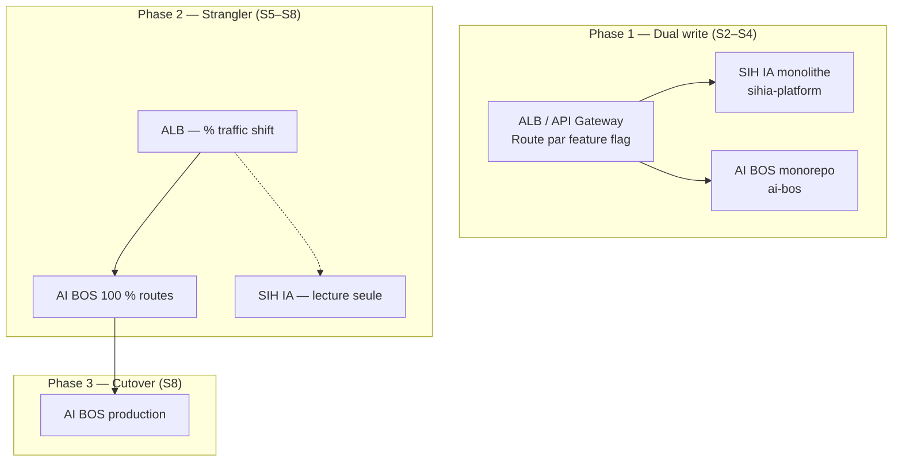
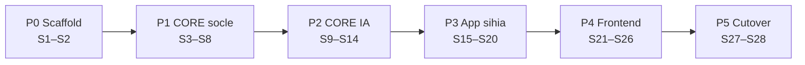
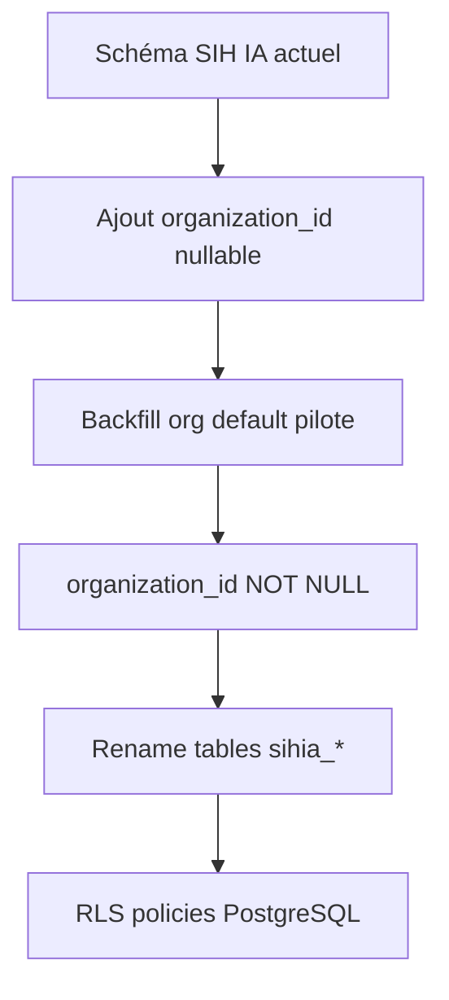

# README_35 — Migration SIH IA → AI BOS

---

## Métadonnées du document

| Champ | Valeur |
|-------|--------|
| **Document** | README_35_MigrationFromSIHIA.md |
| **Projet** | AI BOS — AI Business Operating System |
| **Version** | 0.1.0 |
| **Statut** | `CRITICAL` — document de référence migration |
| **Niveau de maturité** | `DESIGN` |
| **Audience** | Engineering, Architecture, SRE, Product |
| **Auteur** | AI BOS Migration Task Force |
| **Dernière mise à jour** | Juillet 2026 |
| **Documents liés** | [README_06_ModularArchitecture](README_06_ModularArchitecture.md) · [README_40_ImplementationRoadmap](README_40_ImplementationRoadmap.md) · [README_39_ProjectStructure](README_39_ProjectStructure.md) |
| **Source** | [`sihia-platform`](../../sihia-platform/) — 68 tests pytest, 8 tests E2E, ~95 % MVP |

---

## Table des matières

1. [Synthèse exécutive](#1-synthèse-exécutive)
2. [Objectifs et contraintes](#2-objectifs-et-contraintes)
3. [Stratégie zero downtime](#3-stratégie-zero-downtime)
4. [Phases d'extraction](#4-phases-dextraction)
5. [CORE vs sihia-app — règles de décision](#5-core-vs-sihia-app--règles-de-décision)
6. [Mapping fichier par fichier — Backend](#6-mapping-fichier-par-fichier--backend)
7. [Mapping fichier par fichier — Frontend](#7-mapping-fichier-par-fichier--frontend)
8. [Mapping infrastructure & DevOps](#8-mapping-infrastructure--devops)
9. [Mapping tests](#9-mapping-tests)
10. [Migration base de données](#10-migration-base-de-données)
11. [Plan de tests migration](#11-plan-de-tests-migration)
12. [Rollback et contingence](#12-rollback-et-contingence)
13. [Checklist GO migration](#13-checklist-go-migration)
14. [ADRs](#14-adrs)

---

## 1. Synthèse exécutive

Ce document définit le **plan de migration complet** du dépôt `sihia-platform` vers le monorepo `ai-bos`, en séparant :

- **`packages/core-*` / `platform/*`** — capacités transverses réutilisables
- **`apps/sihia-app`** — logique métier santé spécifique

**Principes directeurs** :

1. **Strangler Fig Pattern** — migration incrémentale, pas de big-bang
2. **Tests comme filet de sécurité** — 68 pytest + 8 Playwright doivent passer à chaque phase
3. **Zero downtime** — utilisateurs pilotes sans interruption service
4. **Parité fonctionnelle** — checklist `README_ETAT_IMPLEMENTATION.md` à 100 % avant GA

**Effort estimé** : ~30 semaines-personne, parallélisable en **8 semaines calendrier** (4 engineers).

---

## 2. Objectifs et contraintes

### 2.1 Objectifs

| # | Objectif | Mesure de succès |
|---|----------|------------------|
| O1 | Extraire CORE réutilisable | ≥ 30 modules platform opérationnels |
| O2 | SIH IA = app verticale pure | Zéro import `apps.sihia` depuis `platform` |
| O3 | Multi-tenant natif | `organization_id` sur toutes tables métier |
| O4 | Zero downtime migration | 0 minute interruption pilotes |
| O5 | Parité tests | 100 % tests migrés passent |

### 2.2 Contraintes

| Contrainte | Implication |
|------------|-------------|
| Équipe réduite (4–6 engineers) | Phases séquentielles, pas de rewrite |
| Données pilotes PostgreSQL existantes | Migration schéma additive only |
| Chatbot en production démo | Migration SSE sans coupure |
| Windows dev environment | Scripts cross-platform (npm, python) |

### 2.3 Ce qui NE migre PAS tel quel

| Élément | Raison | Alternative |
|---------|--------|-------------|
| SQLite `app.db` dev | Remplacé par Postgres default | Docker Compose local |
| Single-tenant implicite | Multi-tenant requis | `organization_id` partout |
| Routes monolithiques `routes.py` | Modularisation | Routes par module/app |
| `npm run dev:all` paths Windows | Monorepo pnpm | `turbo dev` cross-platform |

---

## 3. Stratégie zero downtime

### 3.1 Architecture transition



### 3.2 Techniques zero downtime

| Technique | Application |
|-----------|-------------|
| **Blue/Green deploy** | Nouveau cluster AI BOS en parallèle |
| **Feature flags** | Routage progressif par route (`/api/v1/patients` → AI BOS) |
| **Database expand-contract** | Ajout colonnes `organization_id` sans DROP |
| **Dual-write temporaire** | Écritures vers ancien + nouveau schéma (max 2 semaines) |
| **Read replica sync** | Lecture ancien système pendant validation nouveau |
| **Canary 5 % → 25 % → 100 %** | Traffic shift sur 72 h |

### 3.3 Fenêtres de migration

| Opération | Downtime autorisé | Fenêtre |
|-----------|-------------------|---------|
| Ajout colonnes DB | 0 | Anytime (migration online) |
| Renommage tables | 0 | Expand-contract sur 2 sprints |
| Cutover DNS | < 30 s | Dimanche 03h00–04h00 UTC |
| Décommission ancien | 0 | Après 30 j read-only |

### 3.4 Plan de communication

| Audience | Timing | Message |
|----------|--------|---------|
| Pilotes cliniques | J-14 | Migration planifiée, aucune interruption |
| Équipe interne | J-7 | Freeze features, focus migration |
| Pilotes | J-Day | Migration complétée, même URLs |
| Support | J+1 | Runbook nouveaux logs/traces |

---

## 4. Phases d'extraction

### 4.1 Vue d'ensemble



### 4.2 Détail des phases

| Phase | Semaines | Livrable | Critère sortie |
|-------|----------|----------|----------------|
| **P0 — Scaffold** | S1–S2 | Monorepo ai-bos, CI, import-linter | `pytest` + `vitest` vides passent |
| **P1 — CORE socle** | S3–S8 | identity, auth, rbac, audit, observability | 25 tests CORE passent |
| **P2 — CORE IA & data** | S9–S14 | conversation, ml, pipeline, notifications | Chatbot sur AI BOS staging |
| **P3 — App sihia** | S15–S20 | patients, RDV, médecins, analytics santé | 68 tests dont app passent |
| **P4 — Frontend** | S21–S26 | Shell UI + micro-frontend sihia | 8 E2E Playwright passent |
| **P5 — Cutover** | S27–S28 | Production zero downtime | Pilotes validés |

### 4.3 Ordre d'extraction (dépendances)

```
1. core/config, core/logging, core/metrics     (aucune dépendance)
2. platform/observability                     (health, correlation)
3. platform/identity                          (auth JWT)
4. platform/authorization                     (RBAC)
5. platform/audit                             (JSONL)
6. platform/notifications                     (SMTP, Twilio)
7. platform/ai/conversation                   (chatbot)
8. platform/ml                                (Prophet)
9. platform/data-pipeline                     (Airflow)
10. apps/sihia/*                              (métier santé)
11. frontend/shell + apps/sihia               (UI)
```

---

## 5. CORE vs sihia-app — règles de décision

### 5.1 Arbre de décision

```
Le composant est-il utilisé par ≥ 2 apps verticales (ou sera-t-il) ?
├── OUI → CORE (platform/*)
└── NON → Est-ce de l'infrastructure transverse (auth, logs, IA générique) ?
    ├── OUI → CORE
    └── NON → apps/sihia/*
```

### 5.2 Matrice de classification

| Composant | Destination | Justification |
|-----------|-------------|---------------|
| Login JWT, refresh | `platform/identity` | Toutes apps |
| RBAC permissions | `platform/authorization` | Toutes apps |
| Audit JSONL | `platform/audit` | Compliance transverse |
| Chatbot SSE + RAG engine | `platform/ai/conversation` | Réutilisé Edu, Legal |
| Guardrails génériques | `platform/ai/conversation` | Framework extensible |
| Guardrails médicaux | `apps/sihia/ai` | Spécifique santé |
| Knowledge base médicale | `apps/sihia/data` | Données verticales |
| Patients, RDV, médecins | `apps/sihia` | Métier santé |
| ML forecast RDV | `platform/ml` + config app | Engine générique, modèle app |
| Dashboard KPIs santé | `apps/sihia` | Widgets métier |
| Export PDF/Excel engine | `platform/analytics` | Réutilisable |
| Pipeline Airflow | `platform/data-pipeline` | Transverse |
| i18n FR/EN/AR | `packages/i18n` | Transverse |
| Design system shadcn | `packages/ui` | Transverse |

---

## 6. Mapping fichier par fichier — Backend

### 6.1 `backend/app/core/`

| Fichier SIH IA | Destination AI BOS | Type | Notes |
|----------------|-------------------|------|-------|
| `core/__init__.py` | `backend/app/core/__init__.py` | Copie | Inchangé |
| `core/config.py` | `platform/config/settings.py` | Refactor | Ajout `multi_tenant`, apps registry |
| `core/security.py` | `platform/identity/security.py` | Copie | JWT, password hashing |
| `core/logging_config.py` | `platform/observability/logging.py` | Copie+ | Namespace `ai-bos`, champ `level` |
| `core/metrics.py` | `platform/observability/metrics.py` | Refactor | Wrapper Prometheus |
| — | `platform/observability/middleware.py` | Nouveau | Extrait de `main.py` |

### 6.2 `backend/app/domain/`

| Fichier SIH IA | Destination AI BOS | Type | Notes |
|----------------|-------------------|------|-------|
| `domain/models.py` | **Split** | Refactor | CORE entities → `platform/*/domain/` ; santé → `apps/sihia/domain/` |
| `domain/ports.py` | **Split** | Refactor | Interfaces par module |

**Détail split `models.py`** :

| Entité SIH IA | Destination |
|---------------|-------------|
| `User`, `Role`, `Permission` | `platform/identity/domain/` |
| `Patient`, `Doctor`, `Appointment`, `MedicalVisit` | `apps/sihia/domain/` |
| `AuditLog` | `platform/audit/domain/` |
| `PipelineRun` | `platform/data-pipeline/domain/` |

### 6.3 `backend/app/application/`

| Fichier SIH IA | Destination AI BOS | Type | Notes |
|----------------|-------------------|------|-------|
| `application/use_cases.py` | **Split** | Refactor | Voir détail §6.3.1 |
| `application/schemas.py` | **Split** | Refactor | Pydantic par module |
| `application/rbac_service.py` | `platform/authorization/rbac_service.py` | Copie | + `organization_id` |
| `application/health_service.py` | `platform/observability/health.py` | Refactor | Health registry |
| `application/analytics_service.py` | `platform/analytics/` + `apps/sihia/analytics/` | Split | Engine CORE, KPIs santé app |
| `application/chatbot_service.py` | `platform/ai/conversation/service.py` | Refactor | RAG générique |
| `application/chatbot_guardrails.py` | `platform/ai/conversation/guardrails.py` + `apps/sihia/ai/medical_guardrails.py` | Split | Base + règles médicales |
| `application/ml_service.py` | `platform/ml/service.py` | Copie | + interface modèle par app |
| `application/ml_engine.py` | `platform/ml/engine.py` | Copie | Prophet wrapper |
| `application/pipeline_service.py` | `platform/data-pipeline/service.py` | Copie | |
| `application/reminder_service.py` | `apps/sihia/reminders/` + `platform/notifications/` | Split | Orchestration app, envoi CORE |

#### 6.3.1 Split `use_cases.py`

| Service SIH IA | Destination AI BOS |
|----------------|-------------------|
| `AuthService` | `platform/identity/auth_service.py` |
| `PatientsService` | `apps/sihia/application/patient_service.py` |
| `DoctorsService` | `apps/sihia/application/doctor_service.py` |
| `AppointmentsService` | `apps/sihia/application/appointment_service.py` |
| `MedicalHistoryService` | `apps/sihia/application/medical_history_service.py` |
| `UsersAdminService` | `platform/authorization/admin_service.py` |
| `ExportService` | `platform/analytics/export_service.py` |

### 6.4 `backend/app/infrastructure/`

| Fichier SIH IA | Destination AI BOS | Type | Notes |
|----------------|-------------------|------|-------|
| `infrastructure/database.py` | `platform/database/connection.py` | Copie | SQLAlchemy unified |
| `infrastructure/repositories.py` | **Split** | Refactor | Par module |
| `infrastructure/sqlite_repositories.py` | `platform/database/sqlite/` (dev only) | Copie | Deprecated M12 |
| `infrastructure/seed.py` | `apps/sihia/infrastructure/seed.py` | Déplacer | Données santé |
| `infrastructure/audit_log.py` | `platform/audit/writer.py` | Copie | JSONL |
| `infrastructure/notification_channels.py` | `platform/notifications/channels.py` | Copie | SMTP, Twilio |
| `infrastructure/chatbot_session_store.py` | `platform/ai/conversation/session_store.py` | Copie | Redis |
| `infrastructure/chatbot_audit.py` | `platform/ai/conversation/audit.py` | Copie | |
| `infrastructure/pipeline_repository.py` | `platform/data-pipeline/repository.py` | Copie | |
| `infrastructure/reminder_repository.py` | `apps/sihia/infrastructure/reminder_repository.py` | Déplacer | |

### 6.5 `backend/app/presentation/`

| Fichier SIH IA | Destination AI BOS | Type | Notes |
|----------------|-------------------|------|-------|
| `presentation/routes.py` | **Split** | Refactor | Voir §6.5.1 |
| `presentation/deps.py` | `platform/identity/deps.py` + par module | Split | `get_current_user`, permissions |
| `presentation/audit.py` | `platform/audit/routes.py` | Copie | |
| `presentation/rate_limit.py` | `platform/rate-limiting/limiter.py` | Copie | |
| `presentation/chatbot_routes.py` | `platform/ai/conversation/routes.py` | Refactor | + app context |
| `presentation/chatbot_auth.py` | `platform/ai/conversation/auth.py` | Copie | Widget auth |
| `presentation/chatbot_rate_limit.py` | `platform/ai/conversation/rate_limit.py` | Copie | |
| `main.py` | `backend/app/main.py` | Refactor | App factory, module registry |

#### 6.5.1 Split `routes.py`

| Route group SIH IA | Destination |
|--------------------|-------------|
| `/api/auth/*` | `platform/identity/routes.py` |
| `/api/admin/users`, `/api/admin/roles` | `platform/authorization/routes.py` |
| `/api/patients/*` | `apps/sihia/presentation/patient_routes.py` |
| `/api/doctors/*` | `apps/sihia/presentation/doctor_routes.py` |
| `/api/appointments/*` | `apps/sihia/presentation/appointment_routes.py` |
| `/api/analytics/*` | `platform/analytics/routes.py` + app overlays |
| `/api/ml/*` | `platform/ml/routes.py` |
| `/api/pipeline/*` | `platform/data-pipeline/routes.py` |
| `/health`, `/health/details` | `platform/observability/routes.py` |

### 6.6 `backend/` racine

| Fichier SIH IA | Destination AI BOS | Type |
|----------------|-------------------|------|
| `alembic/` | `backend/alembic/` | Refactor — namespaces platform/ + sihia/ |
| `alembic/versions/001_initial_schema.py` | Split → `platform/001` + `sihia/001` | Refactor |
| `alembic/versions/002_appointment_reminders.py` | `sihia/002` | Déplacer |
| `alembic/versions/003_pipeline.py` | `platform/data-pipeline/001` | Déplacer |
| `scripts/pilot_setup.py` | `scripts/dev/pilot_setup.py` | Copie |
| `scripts/run_pipeline.py` | `scripts/ops/run_pipeline.py` | Copie |
| `scripts/migrate_sqlite_to_postgres.py` | `scripts/migration/sqlite_to_pg.py` | Archive |
| `data/chatbot_knowledge.json` | `apps/sihia/data/knowledge.json` | Déplacer |
| `requirements.txt` | `backend/requirements.txt` | Merge |
| `requirements-ml.txt` | `backend/requirements-ml.txt` | Copie |
| `static/logos/sihia-bot.svg` | `apps/sihia/assets/` | Déplacer |

### 6.7 `airflow/`

| Fichier SIH IA | Destination AI BOS | Type |
|----------------|-------------------|------|
| `airflow/dags/dag_sihia_daily.py` | `apps/sihia/airflow/dag_daily.py` | Déplacer |
| `airflow/dags/dag_ml_features.py` | `platform/data-pipeline/airflow/dag_ml_features.py` | Déplacer |

---

## 7. Mapping fichier par fichier — Frontend

### 7.1 `src/lib/` — Bibliothèques transverses

| Fichier SIH IA | Destination AI BOS | Type |
|----------------|-------------------|------|
| `lib/api/baseUrl.ts` | `packages/api-client/baseUrl.ts` | Copie |
| `lib/api/httpErrors.ts` | `packages/api-client/httpErrors.ts` | Copie |
| `lib/api/services.ts` | **Split** | CORE + sihia services |
| `lib/api/types.ts` | **Split** | Types par package |
| `lib/api/mockData.ts` | `apps/sihia/mocks/` | Déplacer |
| `lib/api/mockPolicy.ts` | `packages/api-client/mockPolicy.ts` | Copie |
| `lib/auth/store.ts` | `packages/auth/store.ts` | Copie |
| `lib/auth/rbac.ts` | `packages/auth/rbac.ts` | Copie |
| `lib/auth/routeGuard.ts` | `packages/auth/routeGuard.ts` | Copie |
| `lib/auth/usePermission.ts` | `packages/auth/usePermission.ts` | Copie |
| `lib/i18n/*` | `packages/i18n/*` | Copie |
| `lib/ml/format.ts` | `packages/ml-ui/format.ts` | Copie |
| `lib/utils.ts` | `packages/ui/lib/utils.ts` | Copie |

### 7.2 `src/components/` — Composants

| Chemin SIH IA | Destination AI BOS | Type |
|---------------|-------------------|------|
| `components/ui/*` | `packages/ui/components/*` | Copie — design system |
| `components/layout/*` | `frontend/shell/layout/*` | Refactor — shell |
| `components/shared/*` | **Split** | Transverse → `packages/ui` ; ML santé → `apps/sihia` |
| `components/I18nHydrator.tsx` | `packages/i18n/I18nHydrator.tsx` | Copie |
| `components/chatbot/*` | **Split** | Widget CORE → `packages/chatbot` ; branding → `apps/sihia` |

**Détail chatbot** :

| Composant | Destination |
|-----------|-------------|
| `ChatWidget`, `Composer`, `MessageBubble` | `packages/chatbot/components/` |
| `SihiaChatbot.tsx` | `apps/sihia/components/SihiaChatbot.tsx` |
| `tenantBranding.ts` | `apps/sihia/lib/branding.ts` |
| `chatbot_knowledge` refs | `apps/sihia/data/` |

### 7.3 `src/routes/` — Pages

| Route SIH IA | Destination AI BOS |
|--------------|-------------------|
| `routes/login.tsx` | `frontend/shell/routes/login.tsx` |
| `routes/403.tsx` | `frontend/shell/routes/403.tsx` |
| `routes/_app.tsx` | `frontend/shell/routes/_app.tsx` |
| `routes/_app/dashboard.tsx` | `apps/sihia/routes/dashboard.tsx` |
| `routes/_app/patients/*` | `apps/sihia/routes/patients/` |
| `routes/_app/doctors.tsx` | `apps/sihia/routes/doctors.tsx` |
| `routes/_app/appointments.tsx` | `apps/sihia/routes/appointments.tsx` |
| `routes/_app/analytics.tsx` | `apps/sihia/routes/analytics.tsx` |
| `routes/_app/prediction.tsx` | `apps/sihia/routes/prediction.tsx` |
| `routes/_app/rbac.tsx` | `frontend/shell/routes/admin/rbac.tsx` |
| `routes/_app/settings.tsx` | `frontend/shell/routes/settings.tsx` |

### 7.4 Racine frontend

| Fichier SIH IA | Destination AI BOS |
|----------------|-------------------|
| `router.tsx` | `frontend/shell/router.tsx` |
| `routeTree.gen.ts` | Généré par TanStack Router |
| `vite.config.ts` | `frontend/shell/vite.config.ts` + per-app configs |
| `package.json` | `frontend/package.json` (workspace root) |
| `components.json` | `packages/ui/components.json` |
| `public/chatbot/*` | `apps/sihia/public/chatbot/` |
| `styles.css` | `packages/ui/styles/globals.css` |

---

## 8. Mapping infrastructure & DevOps

| Fichier SIH IA | Destination AI BOS | Notes |
|----------------|-------------------|-------|
| `docker-compose.yml` | `infra/docker-compose.yml` | Profiles: postgres, redis, mailhog, airflow |
| `docker/pgadmin/servers.json` | `infra/docker/pgadmin/` | Dev only |
| `.github/workflows/ci.yml` | `.github/workflows/ci-backend.yml` + `ci-frontend.yml` | Split |
| `.env.example` | `.env.example` + per-service | |
| `backend/.env.example` | `backend/.env.example` | |
| `wrangler.jsonc` | `apps/sihia/deploy/wrangler.jsonc` | Si chatbot edge |
| `.dockerignore` | Racine monorepo | |
| `playwright.config.ts` | `frontend/playwright.config.ts` | |

---

## 9. Mapping tests

### 9.1 Tests backend (`backend/tests/`)

| Test SIH IA | Destination AI BOS | Module cible |
|-------------|-------------------|--------------|
| `test_auth_security.py` | `tests/platform/identity/test_auth.py` | identity |
| `test_auth_rate_limit.py` | `tests/platform/identity/test_rate_limit.py` | identity |
| `test_rbac_routes.py` | `tests/platform/authorization/test_rbac.py` | authorization |
| `test_rbac_users_crud.py` | `tests/platform/authorization/test_users_crud.py` | authorization |
| `test_admin_audit_logs.py` | `tests/platform/audit/test_audit.py` | audit |
| `test_audit_export.py` | `tests/platform/audit/test_export.py` | audit |
| `test_health_details.py` | `tests/platform/observability/test_health.py` | observability |
| `test_chatbot.py` | `tests/platform/ai/test_chatbot.py` | ai.conversation |
| `test_notification_channels.py` | `tests/platform/notifications/test_channels.py` | notifications |
| `test_reminders.py` | `tests/apps/sihia/test_reminders.py` | sihia |
| `test_patients_update.py` | `tests/apps/sihia/test_patients.py` | sihia |
| `test_doctors_update.py` | `tests/apps/sihia/test_doctors.py` | sihia |
| `test_appointment_overlap.py` | `tests/apps/sihia/test_appointments.py` | sihia |
| `test_analytics_dynamic.py` | `tests/platform/analytics/` + `tests/apps/sihia/` | split |
| `test_exports.py` | `tests/platform/analytics/test_exports.py` | analytics |
| `test_ml_engine.py` | `tests/platform/ml/test_engine.py` | ml |
| `test_ml_forecast.py` | `tests/apps/sihia/test_ml_forecast.py` | sihia |
| `test_ml_metrics.py` | `tests/platform/ml/test_metrics.py` | ml |
| `test_pipeline.py` | `tests/platform/data-pipeline/test_pipeline.py` | data-pipeline |
| `conftest.py` | `tests/conftest.py` + par module | Fixtures partagées |

### 9.2 Tests frontend (`tests/`)

| Test SIH IA | Destination AI BOS |
|-------------|-------------------|
| `tests/rbac-permissions.test.ts` | `frontend/tests/rbac-permissions.test.ts` |
| `tests/http-errors.test.ts` | `packages/api-client/tests/http-errors.test.ts` |
| `tests/i18n-hydration.test.ts` | `packages/i18n/tests/hydration.test.ts` |
| `tests/hello-world.test.ts` | Supprimé (smoke CI) |
| E2E Playwright | `frontend/e2e/` — parcours SIH IA complets |

---

## 10. Migration base de données

### 10.1 Stratégie schéma



### 10.2 Migrations Alembic

| Migration | Action | Downtime |
|-----------|--------|----------|
| `platform/001_identity` | Tables users, roles, orgs | 0 |
| `platform/002_audit` | Table audit_events | 0 |
| `sihia/001_patients` | Rename + organization_id | 0 |
| `sihia/002_appointments` | Idem | 0 |
| `platform/003_rls` | Row Level Security | 0 (lock bref) |

### 10.3 Script migration données

```bash
# Exécution staging puis prod
python scripts/migration/sihia_to_aibos.py \
  --source $SIHIA_DATABASE_URL \
  --target $AIBOS_DATABASE_URL \
  --default-org-id $PILOT_ORG_UUID \
  --dry-run

# Validation
python scripts/migration/validate_migration.py --compare-counts
```

### 10.4 Validation post-migration

| Table | Vérification |
|-------|--------------|
| `sihia_patients` | `COUNT(*)` source = target |
| `sihia_appointments` | Intégrité FK patients |
| `core_users` | Emails uniques par org |
| `audit_events` | Pas de perte lignes |

---

## 11. Plan de tests migration

### 11.1 Pyramide de tests migration

| Niveau | Couverture | Fréquence |
|--------|------------|-----------|
| **Unit** | Chaque module extrait isolé | Chaque PR |
| **Integration** | API par module + app | Chaque PR |
| **Parité** | SIH IA vs AI BOS même input/output | Hebdomadaire S3+ |
| **E2E** | Playwright parcours complets | Release candidate |
| **Load** | k6 smoke post-migration | Cutover J-1 |
| **Chaos** | DB failover, Redis down | Staging S7 |

### 11.2 Suite parité (critique)

```python
# tests/migration/test_parity.py
@pytest.mark.parametrize("endpoint,payload", PARITY_CASES)
def test_api_parity(sihia_client, aibos_client, endpoint, payload):
    old = sihia_client.request(endpoint, **payload)
    new = aibos_client.request(endpoint, **payload)
    assert old.status_code == new.status_code
    assert normalize(old.json()) == normalize(new.json())
```

**PARITY_CASES** : 50+ scénarios couvrant auth, CRUD patients, RDV, chatbot, analytics.

### 11.3 Critères GO cutover

| # | Critère | Seuil |
|---|---------|-------|
| 1 | Tests pytest AI BOS | 68/68 pass |
| 2 | Tests E2E Playwright | 8/8 pass |
| 3 | Suite parité | 100 % match |
| 4 | Load test smoke | P95 < 500 ms, 0 % erreur |
| 5 | Health `/health/details` | status ok all components |
| 6 | Pilotes UAT | 3/3 sign-off |
| 7 | Rollback testé | < 15 min restore |

---

## 12. Rollback et contingence

### 12.1 Triggers rollback

| Condition | Action |
|-----------|--------|
| Error rate > 5 % post-cutover 15 min | Rollback immédiat |
| Data corruption détectée | Rollback + restore DB snapshot |
| P95 > 2 s sustained 30 min | Rollback ou scale out |
| Pilote bloquant signale régression | Evaluation rollback < 2 h |

### 12.2 Procédure rollback

```
1. ALB traffic → 100 % ancien cluster (feature flag)
2. Vérifier health ancien système
3. Si dual-write actif : sync delta données (script)
4. Communiquer pilotes
5. Post-mortem dans 48 h
```

### 12.3 RPO / RTO migration

| Métrique | Cible |
|----------|-------|
| RPO (perte données max) | 0 (dual-write) |
| RTO (retour service) | < 15 min |

---

## 13. Checklist GO migration

### 13.1 Pré-migration (J-7)

- [ ] Tous tests AI BOS verts sur staging
- [ ] Suite parité 100 % sur staging
- [ ] Backup DB prod + test restore
- [ ] Rollback drill réussi
- [ ] Feature flags configurés ALB
- [ ] Runbooks à jour
- [ ] Communication pilotes envoyée

### 13.2 Jour J

- [ ] Dual-write activé
- [ ] Canary 5 % → monitoring 30 min
- [ ] Canary 25 % → monitoring 1 h
- [ ] 100 % traffic AI BOS
- [ ] Ancien système read-only
- [ ] Validation pilotes
- [ ] `/health/details` ok

### 13.3 Post-migration (J+30)

- [ ] Ancien dépôt archivé (read-only)
- [ ] DNS définitifs
- [ ] Dual-write désactivé
- [ ] Documentation à jour
- [ ] Post-mortem publié

---

## 14. ADRs

| ID | Titre | Statut |
|----|-------|--------|
| ADR-MIG-001 | Strangler Fig, pas de big-bang | `APPROVED` |
| ADR-MIG-002 | Tests parité obligatoires avant cutover | `APPROVED` |
| ADR-MIG-003 | organization_id sur toutes tables métier | `APPROVED` |
| ADR-MIG-004 | sihia-platform archivé J+30, pas supprimé | `APPROVED` |
| ADR-MIG-005 | Chatbot knowledge reste dans apps/sihia | `APPROVED` |

---

*Document CRITICAL — toute déviation de ce plan requiert approbation Architecture Review Board.*
