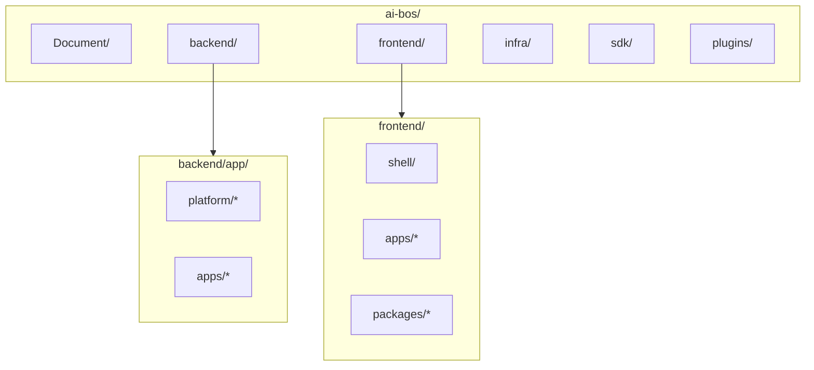

# README_39 — Structure du projet AI BOS

---

## Métadonnées du document

| Champ | Valeur |
|-------|--------|
| **Document** | README_39_ProjectStructure.md |
| **Projet** | AI BOS — AI Business Operating System |
| **Version** | 0.1.0 |
| **Statut** | `REVIEW` — référence normative arborescence |
| **Audience** | Tous les développeurs, Architects, DevOps |
| **Auteur** | AI BOS Platform Architecture Team |
| **Dernière mise à jour** | Juillet 2026 |
| **Documents liés** | [README_06_ModularArchitecture](README_06_ModularArchitecture.md) · [README_37_DeveloperGuide](README_37_DeveloperGuide.md) · [README_35_MigrationFromSIHIA](README_35_MigrationFromSIHIA.md) |

---

## Table des matières

1. [Vue d'ensemble](#1-vue-densemble)
2. [Arborescence complète](#2-arborescence-complète)
3. [Backend & frontend — conventions](#3-backend--frontend--conventions)
4. [Packages partagés](#4-packages-partagés)
5. [Services & workers](#5-services--workers)
6. [Infrastructure](#6-infrastructure)
7. [SDK, plugins & documentation](#7-sdk-plugins--documentation)
8. [Conventions chemins](#8-conventions-chemins)

---

## 1. Vue d'ensemble

AI BOS est un **monorepo** organisé en workspaces avec séparation stricte :



| Zone | Rôle | Technologie |
|------|------|-------------|
| `backend/` | API, CORE, apps métier | Python, FastAPI |
| `frontend/shell/` | Application hôte UI | React, Vite |
| `frontend/apps/` | Micro-frontends verticaux | React |
| `frontend/packages/` | Libs partagées npm | TypeScript |
| `infra/` | Docker, Terraform, K8s | IaC |
| `services/` | Workers, consumers async | Python |
| `sdk/` | Clients Python/TS | OpenAPI generated |
| `plugins/` | Extensions tierces | Python/TS |

---

## 2. Arborescence complète

```
ai-bos/
│
├── README.md                              # Point d'entrée repo
├── LICENSE
├── .env.example                           # Variables globales
├── .editorconfig
├── .gitignore
├── .pre-commit-config.yaml
├── pyproject.toml                         # Ruff, mypy, import-linter
├── package.json                           # Scripts racine orchestration
├── pnpm-workspace.yaml                    # Workspaces frontend
├── turbo.json                             # Pipeline build frontend
│
├── Document/                              # 📚 Documentation entreprise
│   ├── INDEX.md
│   ├── README_00_Vision.md
│   ├── README_01_ProductStrategy.md
│   ├── README_02_Architecture.md
│   ├── README_03_Frontend.md
│   ├── README_04_Backend.md
│   ├── README_05_Core.md
│   ├── README_06_ModularArchitecture.md
│   ├── README_07_Database.md
│   ├── README_08_AIArchitecture.md
│   ├── README_09_RAG.md
│   ├── README_10_Agents.md
│   ├── README_11_Workflows.md
│   ├── README_31_Monitoring.md
│   ├── README_32_Observability.md
│   ├── README_33_Performance.md
│   ├── README_34_Roadmap.md
│   ├── README_35_MigrationFromSIHIA.md
│   ├── README_36_FutureApplications.md
│   ├── README_37_DeveloperGuide.md
│   ├── README_38_CodingStandards.md
│   ├── README_39_ProjectStructure.md      # ← ce document
│   ├── README_40_ImplementationRoadmap.md
│   └── adr/                               # Architecture Decision Records
│       ├── ADR-001-monolithe-modulaire.md
│       └── ...
│
├── backend/                               # 🐍 Backend FastAPI
│   ├── Dockerfile
│   ├── .env.example
│   ├── requirements.txt
│   ├── requirements-dev.txt
│   ├── requirements-ml.txt
│   │
│   ├── alembic/
│   │   ├── alembic.ini
│   │   ├── env.py
│   │   └── versions/
│   │       ├── platform/                  # Migrations CORE
│   │       │   ├── 001_identity_schema.py
│   │       │   ├── 002_audit_events.py
│   │       │   ├── 003_organizations.py
│   │       │   └── 004_rls_policies.py
│   │       ├── sihia/                       # Migrations app santé
│   │       │   ├── 001_patients.py
│   │       │   ├── 002_appointments.py
│   │       │   └── 003_medical_history.py
│   │       └── eduai/                       # Futur
│   │           └── 001_students.py
│   │
│   ├── app/
│   │   ├── __init__.py
│   │   ├── main.py                          # App factory, lifespan, middleware
│   │   │
│   │   ├── core/                            # Config transverse bas niveau
│   │   │   ├── __init__.py
│   │   │   └── exceptions.py                # Base exceptions HTTP
│   │   │
│   │   ├── platform/                        # ⭐ CORE MODULES
│   │   │   ├── __init__.py
│   │   │   │
│   │   │   ├── config/
│   │   │   │   ├── settings.py              # ← sihia core/config.py
│   │   │   │   └── feature_flags.py
│   │   │   │
│   │   │   ├── observability/
│   │   │   │   ├── logging.py               # ← logging_config.py
│   │   │   │   ├── metrics.py               # ← metrics.py + Prometheus
│   │   │   │   ├── health.py                # ← health_service.py
│   │   │   │   ├── middleware.py            # Correlation ID, request log
│   │   │   │   └── routes.py                # /health, /health/details, /metrics
│   │   │   │
│   │   │   ├── identity/
│   │   │   │   ├── domain/
│   │   │   │   │   ├── user.py
│   │   │   │   │   └── token.py
│   │   │   │   ├── application/
│   │   │   │   │   └── auth_service.py
│   │   │   │   ├── infrastructure/
│   │   │   │   │   └── postgres_user_repo.py
│   │   │   │   ├── presentation/
│   │   │   │   │   ├── routes.py
│   │   │   │   │   ├── schemas.py
│   │   │   │   │   └── deps.py
│   │   │   │   └── security.py              # ← core/security.py
│   │   │   │
│   │   │   ├── authorization/
│   │   │   │   ├── domain/
│   │   │   │   │   ├── role.py
│   │   │   │   │   └── permission.py
│   │   │   │   ├── application/
│   │   │   │   │   ├── rbac_service.py      # ← rbac_service.py
│   │   │   │   │   └── admin_service.py
│   │   │   │   ├── infrastructure/
│   │   │   │   ├── presentation/
│   │   │   │   │   └── routes.py
│   │   │   │   └── decorators.py            # require_permission
│   │   │   │
│   │   │   ├── audit/
│   │   │   │   ├── domain/
│   │   │   │   ├── application/
│   │   │   │   ├── infrastructure/
│   │   │   │   │   └── jsonl_writer.py      # ← audit_log.py
│   │   │   │   └── presentation/
│   │   │   │
│   │   │   ├── notifications/
│   │   │   │   ├── channels.py              # ← notification_channels.py
│   │   │   │   ├── email.py
│   │   │   │   ├── sms.py
│   │   │   │   └── templates/
│   │   │   │
│   │   │   ├── rate_limiting/
│   │   │   │   └── limiter.py               # ← rate_limit.py
│   │   │   │
│   │   │   ├── organizations/
│   │   │   │   ├── domain/
│   │   │   │   ├── application/
│   │   │   │   └── presentation/
│   │   │   │
│   │   │   ├── ai/
│   │   │   │   ├── conversation/
│   │   │   │   │   ├── service.py             # ← chatbot_service.py
│   │   │   │   │   ├── guardrails.py        # ← chatbot_guardrails.py
│   │   │   │   │   ├── session_store.py
│   │   │   │   │   ├── routes.py            # ← chatbot_routes.py
│   │   │   │   │   └── auth.py
│   │   │   │   ├── rag/
│   │   │   │   ├── embeddings/
│   │   │   │   └── speech/
│   │   │   │
│   │   │   ├── ml/
│   │   │   │   ├── engine.py                # ← ml_engine.py
│   │   │   │   ├── service.py               # ← ml_service.py
│   │   │   │   └── routes.py
│   │   │   │
│   │   │   ├── analytics/
│   │   │   │   ├── service.py               # ← analytics_service.py
│   │   │   │   ├── export_service.py
│   │   │   │   └── routes.py
│   │   │   │
│   │   │   ├── data_pipeline/
│   │   │   │   ├── service.py               # ← pipeline_service.py
│   │   │   │   ├── repository.py
│   │   │   │   └── routes.py
│   │   │   │
│   │   │   ├── documents/                   # DESIGN — GED
│   │   │   ├── search/                      # DESIGN
│   │   │   ├── workflow/                    # DESIGN — M18
│   │   │   ├── billing/                     # DESIGN — M8
│   │   │   ├── event_bus/                   # DESIGN
│   │   │   └── cache/                       # Redis abstractions
│   │   │
│   │   ├── apps/                            # 📱 VERTICAL APPLICATIONS
│   │   │   ├── __init__.py
│   │   │   ├── registry.py                  # App Registry
│   │   │   ├── base.py                      # AppDefinition ABC
│   │   │   │
│   │   │   ├── sihia/                       # 🏥 SIH IA — Santé
│   │   │   │   ├── __init__.py              # SihiaApp(AppDefinition)
│   │   │   │   ├── manifest.yaml
│   │   │   │   ├── README.md
│   │   │   │   ├── domain/
│   │   │   │   │   ├── patient.py
│   │   │   │   │   ├── doctor.py
│   │   │   │   │   ├── appointment.py
│   │   │   │   │   ├── medical_visit.py
│   │   │   │   │   └── ports.py
│   │   │   │   ├── application/
│   │   │   │   │   ├── patient_service.py
│   │   │   │   │   ├── doctor_service.py
│   │   │   │   │   ├── appointment_service.py
│   │   │   │   │   ├── medical_history_service.py
│   │   │   │   │   └── reminder_hooks.py
│   │   │   │   ├── infrastructure/
│   │   │   │   │   ├── postgres_patient_repo.py
│   │   │   │   │   ├── postgres_doctor_repo.py
│   │   │   │   │   ├── postgres_appointment_repo.py
│   │   │   │   │   ├── reminder_repository.py
│   │   │   │   │   └── seed.py
│   │   │   │   ├── presentation/
│   │   │   │   │   ├── patient_routes.py
│   │   │   │   │   ├── doctor_routes.py
│   │   │   │   │   ├── appointment_routes.py
│   │   │   │   │   ├── schemas.py
│   │   │   │   │   └── deps.py
│   │   │   │   ├── ai/
│   │   │   │   │   └── medical_guardrails.py
│   │   │   │   ├── data/
│   │   │   │   │   └── knowledge.json         # ← chatbot_knowledge.json
│   │   │   │   ├── airflow/
│   │   │   │   │   └── dag_daily.py
│   │   │   │   └── assets/
│   │   │   │       └── logos/
│   │   │   │
│   │   │   ├── eduai/                       # 🎓 Edu AI — DESIGN
│   │   │   │   ├── manifest.yaml
│   │   │   │   └── ...
│   │   │   │
│   │   │   ├── legalai/                     # ⚖️ Legal AI — DESIGN
│   │   │   ├── hotelai/                     # 🏨 Hotel AI — DESIGN
│   │   │   ├── retailai/                    # 🛒 Retail AI — DESIGN
│   │   │   ├── factoryai/                   # 🏭 Factory AI — DESIGN
│   │   │   └── govai/                       # 🏛️ Government AI — DESIGN
│   │   │
│   │   └── workers/                         # Background job handlers
│   │       ├── __init__.py
│   │       ├── celery_app.py
│   │       ├── reminder_worker.py
│   │       └── pipeline_worker.py
│   │
│   ├── scripts/
│   │   ├── dev/
│   │   │   ├── seed.py
│   │   │   └── pilot_setup.py
│   │   ├── migration/
│   │   │   ├── sihia_to_aibos.py
│   │   │   └── validate_migration.py
│   │   └── ops/
│   │       └── run_pipeline.py
│   │
│   └── tests/
│       ├── conftest.py
│       ├── migration/
│       │   └── test_parity.py
│       ├── platform/
│       │   ├── identity/
│       │   ├── authorization/
│       │   ├── audit/
│       │   ├── observability/
│       │   ├── ai/
│       │   ├── ml/
│       │   ├── analytics/
│       │   ├── notifications/
│       │   └── data_pipeline/
│       └── apps/
│           └── sihia/
│
├── frontend/                              # ⚛️ Frontend monorepo
│   ├── package.json                       # Workspace root
│   ├── pnpm-workspace.yaml
│   ├── turbo.json
│   ├── tsconfig.base.json
│   ├── eslint.config.js
│   ├── playwright.config.ts
│   │
│   ├── shell/                             # 🖥️ Platform Shell (apps/platform-shell)
│   │   ├── package.json                   # @ai-bos/shell
│   │   ├── vite.config.ts
│   │   ├── index.html
│   │   ├── src/
│   │   │   ├── main.tsx
│   │   │   ├── router.tsx
│   │   │   ├── routeTree.gen.ts
│   │   │   ├── routes/
│   │   │   │   ├── __root.tsx
│   │   │   │   ├── login.tsx
│   │   │   │   ├── 403.tsx
│   │   │   │   ├── _app.tsx
│   │   │   │   ├── _app/index.tsx         # App launcher
│   │   │   │   ├── _app/settings.tsx
│   │   │   │   └── _app/admin/
│   │   │   │       └── rbac.tsx
│   │   │   ├── layout/
│   │   │   │   ├── AppLayout.tsx          # ← components/layout/
│   │   │   │   ├── Sidebar.tsx
│   │   │   │   └── Topbar.tsx
│   │   │   └── lib/
│   │   │       └── appLoader.ts           # Charge micro-frontends
│   │   └── public/
│   │
│   ├── apps/
│   │   ├── sihia/                         # 🏥 SIH IA micro-frontend
│   │   │   ├── package.json               # @ai-bos/sihia
│   │   │   ├── vite.config.ts
│   │   │   ├── src/
│   │   │   │   ├── routes/
│   │   │   │   │   ├── dashboard.tsx
│   │   │   │   │   ├── patients/
│   │   │   │   │   │   ├── index.tsx
│   │   │   │   │   │   └── $patientId.tsx
│   │   │   │   │   ├── doctors.tsx
│   │   │   │   │   ├── appointments.tsx
│   │   │   │   │   ├── analytics.tsx
│   │   │   │   │   └── prediction.tsx
│   │   │   │   ├── components/
│   │   │   │   │   ├── SihiaChatbot.tsx
│   │   │   │   │   ├── MlForecastMeta.tsx
│   │   │   │   │   └── PipelineAdminPanel.tsx
│   │   │   │   └── lib/
│   │   │   │       └── branding.ts
│   │   │   └── public/
│   │   │       └── chatbot/                 # Widget embed
│   │   │
│   │   ├── eduai/                         # @ai-bos/eduai — DESIGN
│   │   ├── legalai/                       # @ai-bos/legalai — DESIGN
│   │   └── ...
│   │
│   ├── packages/
│   │   ├── ui/                            # @ai-bos/ui — Design System
│   │   │   ├── package.json
│   │   │   ├── components.json            # shadcn config
│   │   │   ├── components/
│   │   │   │   ├── button.tsx
│   │   │   │   ├── card.tsx
│   │   │   │   ├── dialog.tsx
│   │   │   │   └── ...                    # ← components/ui/*
│   │   │   ├── lib/
│   │   │   │   └── utils.ts
│   │   │   └── styles/
│   │   │       └── globals.css
│   │   │
│   │   ├── api-client/                    # @ai-bos/api-client
│   │   │   ├── package.json
│   │   │   ├── src/
│   │   │   │   ├── baseUrl.ts
│   │   │   │   ├── httpErrors.ts
│   │   │   │   ├── client.ts
│   │   │   │   ├── services/
│   │   │   │   │   ├── auth.ts
│   │   │   │   │   ├── patients.ts
│   │   │   │   │   └── ...
│   │   │   │   └── types/
│   │   │   └── tests/
│   │   │
│   │   ├── auth/                          # @ai-bos/auth
│   │   │   ├── store.ts
│   │   │   ├── rbac.ts
│   │   │   ├── routeGuard.ts
│   │   │   └── usePermission.ts
│   │   │
│   │   ├── i18n/                          # @ai-bos/i18n
│   │   │   ├── store.ts
│   │   │   ├── dictionaries.ts
│   │   │   ├── resolveT.ts
│   │   │   └── I18nHydrator.tsx
│   │   │
│   │   ├── chatbot/                       # @ai-bos/chatbot — Widget CORE
│   │   │   ├── components/
│   │   │   │   ├── ChatWidget.tsx
│   │   │   │   ├── Composer.tsx
│   │   │   │   └── MessageBubble.tsx
│   │   │   └── lib/
│   │   │
│   │   └── ml-ui/                         # @ai-bos/ml-ui
│   │       └── format.ts
│   │
│   ├── e2e/                               # Playwright E2E
│   │   ├── auth.spec.ts
│   │   ├── rbac.spec.ts
│   │   ├── patients.spec.ts
│   │   └── chatbot.spec.ts
│   │
│   └── tests/                             # Vitest unitaires transverses
│       └── rbac-permissions.test.ts
│
├── services/                              # 🔧 Services déployables séparés (futur)
│   ├── ai-inference/                      # GPU workers — extraction M24+
│   │   ├── Dockerfile
│   │   └── app/
│   ├── event-consumer/
│   │   └── app/
│   └── document-processor/                # OCR async
│       └── app/
│
├── sdk/                                   # 📦 SDK clients
│   ├── python/
│   │   ├── pyproject.toml
│   │   └── ai_bos_sdk/
│   └── typescript/
│       ├── package.json
│       └── src/                           # Généré depuis OpenAPI
│
├── plugins/                               # 🔌 Plugins tiers
│   ├── examples/
│   │   └── hello-plugin/
│   └── README.md
│
├── infra/                                 # 🏗️ Infrastructure
│   ├── docker-compose.yml                 # Dev : postgres, redis, mailhog, airflow
│   ├── docker-compose.observability.yml   # Prometheus, Jaeger (dev)
│   ├── docker/
│   │   └── pgadmin/
│   │       └── servers.json
│   ├── terraform/
│   │   ├── modules/
│   │   │   ├── vpc/
│   │   │   ├── ecs/
│   │   │   ├── rds/
│   │   │   ├── elasticache/
│   │   │   └── cloudfront/
│   │   ├── environments/
│   │   │   ├── dev/
│   │   │   ├── staging/
│   │   │   └── prod/
│   │   └── main.tf
│   └── k8s/                               # Manifests Kubernetes (M12+)
│       ├── base/
│       └── overlays/
│           ├── staging/
│           └── prod/
│
└── .github/
    └── workflows/
        ├── ci-backend.yml
        ├── ci-frontend.yml
        ├── ci-e2e.yml
        ├── import-linter.yml
        ├── deploy-staging.yml
        └── deploy-prod.yml
```

---

## 3. Backend & frontend — conventions

Chaque module `platform/*` et `apps/*` suit les couches Clean Architecture : `domain/` → `application/` → `infrastructure/` → `presentation/`.

| Mécanisme | Emplacement | Rôle |
|-----------|-------------|------|
| App factory | `backend/app/main.py` | Logging, middleware, routers CORE + AppRegistry |
| App Registry | `backend/app/apps/registry.py` | Enregistrement dynamique `apps/{slug}` |
| pnpm workspaces | `frontend/pnpm-workspace.yaml` | `shell`, `apps/*`, `packages/*` |
| Micro-frontend loader | `frontend/shell/lib/appLoader.ts` | Import dynamique `@ai-bos/{app}` |

---

## 4. Packages partagés

| Package | npm name | Responsabilité |
|---------|----------|----------------|
| `packages/ui` | `@ai-bos/ui` | Design system shadcn |
| `packages/api-client` | `@ai-bos/api-client` | Client HTTP typé |
| `packages/auth` | `@ai-bos/auth` | Store JWT, RBAC, guards |
| `packages/i18n` | `@ai-bos/i18n` | FR/EN/AR, RTL |
| `packages/chatbot` | `@ai-bos/chatbot` | Widget conversationnel |
| `packages/ml-ui` | `@ai-bos/ml-ui` | Composants métriques ML |

---

## 5. Services & workers

| Service | Déploiement | Phase |
|---------|-------------|-------|
| `backend/app` | ECS monolithe | M1 |
| `workers/` | Même image, command différente | M6 |
| `services/ai-inference` | ECS GPU dédié | M24 |
| `services/event-consumer` | ECS / Lambda | M18 |
| `services/document-processor` | ECS | M22 |

---

## 6. Infrastructure

| Fichier | Environnement |
|---------|---------------|
| `infra/docker-compose.yml` | Dev local |
| `infra/terraform/environments/staging` | Staging AWS |
| `infra/terraform/environments/prod` | Production AWS |
| `infra/k8s/` | Migration K8s M12+ |

### 6.1 Profiles Docker Compose

```bash
docker compose --profile postgres up -d
docker compose --profile mailhog up -d
docker compose --profile airflow up -d
docker compose --profile observability up -d
```

---

## 7. SDK, plugins & documentation

| Zone | Génération / contenu |
|------|----------------------|
| `sdk/typescript/` | Généré depuis `/openapi.json` via `pnpm --filter @ai-bos/sdk-ts generate` |
| `sdk/python/` | `datamodel-codegen` depuis OpenAPI |
| `plugins/{author}/{name}/` | `manifest.yaml` + backend/frontend optionnels |
| `Document/adr/` | Architecture Decision Records |
| `apps/*/README.md` | Doc par application verticale |

---

## 8. Conventions chemins

### 8.1 URLs production

| Ressource | Pattern |
|-----------|---------|
| API | `https://api.ai-bos.com/api/v1/` |
| Shell UI | `https://app.ai-bos.com/` |
| SIH IA app | `https://app.ai-bos.com/apps/sihia/` |
| Assets CDN | `https://cdn.ai-bos.com/` |
| Status | `https://status.ai-bos.com/` |

### 8.2 Correspondance SIH IA → AI BOS

| SIH IA (ancien) | AI BOS (nouveau) |
|-----------------|------------------|
| `backend/app/` | `backend/app/platform/` + `apps/sihia/` |
| `src/` | `frontend/shell/` + `apps/sihia/` + `packages/` |
| `docker-compose.yml` | `infra/docker-compose.yml` |
| `Document/` | `Document/` (enrichi) |
| `airflow/` | `apps/sihia/airflow/` + `platform/data_pipeline/` |

---

*Arborescence normative — toute nouvelle top-level directory requiert ADR.*
