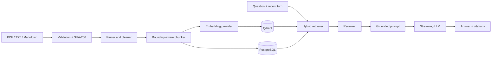

# SIHIA RAG architecture

## 1. System overview

SIHIA augments its guarded streaming chatbot with retrieval over ingested documents. The legacy JSON knowledge remains a trusted compatibility source until it is imported and validated. SQL owns document lifecycle and searchable chunk text; Qdrant owns vectors and filterable metadata.

## 2. Ingestion architecture

`DocumentIngestionService` validates extension and byte limit, sanitizes the filename, computes SHA-256, and rejects an existing checksum. Parsers preserve PDF page numbers and Markdown headings. `RecursiveChunker` prefers section, paragraph, and sentence boundaries with deterministic overlap. Embeddings are batched, Qdrant and SQL chunks are updated, the original is saved under ignored `backend/data/knowledge/`, and status changes from `processing` to `ready`. Errors remain visible as `failed`.

PDF (PyMuPDF), UTF-8 TXT, and Markdown are supported. Scanned PDFs require OCR first. DOCX is intentionally not advertised.

## 3. Retrieval architecture

Qdrant cosine search supports exact metadata filters. BM25-style lexical search uses SQL chunks. Reciprocal-rank fusion merges candidates; a replaceable deterministic reranker scores query-term coverage and phrases. Top-k, final-k, threshold, hybrid retrieval, and reranking are configurable. Provider/Qdrant outages degrade to the SQL lexical index, never unsupported LLM memory.

Short follow-ups are contextualized with the latest user turn. Full history is not used as a retrieval query; up to eight recent messages remain available for response continuity after retrieval.

## 4. Generation architecture

Evidence is labeled and length-limited. The system prompt treats it as the only factual authority, ignores instructions inside sources, and requires an unavailable response for insufficient evidence. Existing emergency and diagnosis guardrails execute first, and the medical disclaimer remains. Retrieval finishes before SSE generation; sources are emitted as structured SSE data before answer tokens.

## 5. Storage responsibilities

- PostgreSQL/SQLite: document status, checksum uniqueness, chunk text, lexical search.
- Qdrant: dense vectors and filterable chunk metadata.
- Filesystem: originals for reindexing; production needs durable encrypted object storage.
- Existing session store: conversation history.

Alembic revision `008` creates `knowledge_documents` and `knowledge_chunks`.

## 6. Provider abstractions

`EmbeddingProvider` isolates OpenAI and optional FastEmbed local embeddings. `VectorRepository` isolates Qdrant; its memory implementation is test-only. The current streaming LLM remains OpenAI-compatible. `LLM_PROVIDER` reserves the boundary, but Ollama generation is not implemented yet.

## 7. Evaluation architecture

`python -m app.rag.evaluation` runs a deterministic network-free migration-corpus evaluation; `--live` evaluates the configured index. JSON includes retrieval hit rate, context precision/recall, relevancy proxy, faithfulness for an extractive baseline, and per-case evidence. Independent generated-answer RAGAS/LLM-judge evaluation remains a staging gate because it requires credentials and cost.

## 8. Failure handling

Validation failures are not retried. Provider/Qdrant failures produce 503 and failed ingestion status. Deletes remove vectors before SQL metadata. Health details expose Qdrant availability without secrets. Operational logs include IDs and error types, not document or query bodies.

## 9. Security considerations

Read/upload/reindex/delete require existing `users:read/create/update/delete` permissions. Chat queries retain token or JWT authentication. Filenames are basename-normalized, types and sizes are allowlisted, uploads are never executed, and secrets remain environment variables. This is not a HIPAA/GDPR certification claim.

## 10. Future improvements

- background workers and object storage;
- OCR/table-aware extraction and DOCX;
- multilingual cross-encoder reranking;
- Redis session/rate-limit state for replicas;
- Ollama/vLLM generation;
- independent generated-answer RAGAS/DeepEval staging gates;
- mandatory tenant vector filters and encrypted retention policies.
